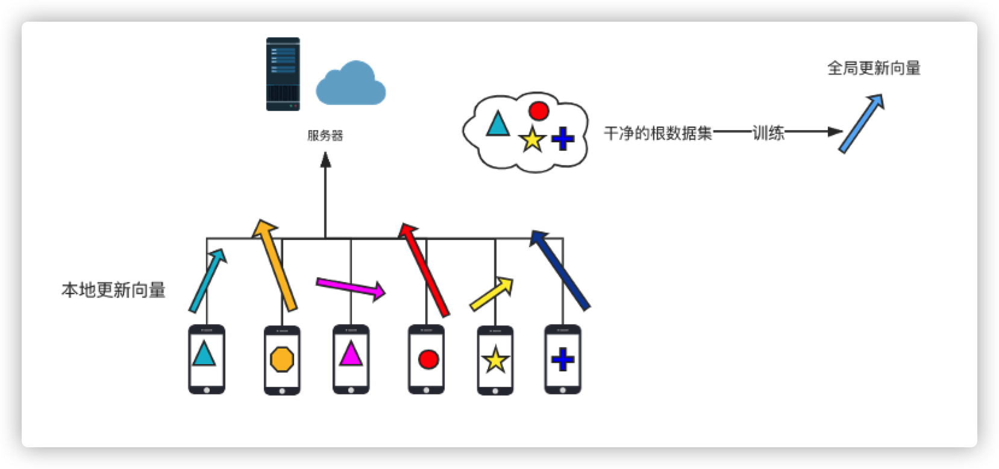
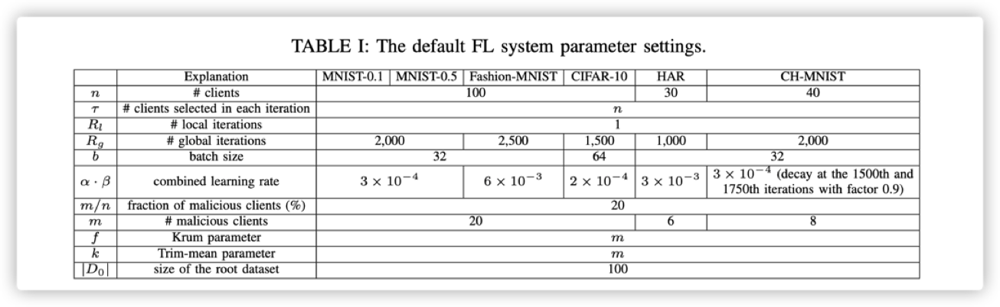

## FLTrust:Byzantine-robustFederated Learning via Trust Bootstrapping 

FLTrust: 基于信任引导的拜占庭健壮联邦学习 

[Xiaoyu Cao](https://arxiv.org/search/cs?searchtype=author&query=Cao%2C+X), [Minghong Fang](https://arxiv.org/search/cs?searchtype=author&query=Fang%2C+M), [Jia Liu](https://arxiv.org/search/cs?searchtype=author&query=Liu%2C+J), [Neil Zhenqiang Gong](https://arxiv.org/search/cs?searchtype=author&query=Gong%2C+N+Z)

### 1.联邦学习简介

最近几年才有的概念，最早2017年被提出来，有一个非常成功的应用就是谷歌用它做 keyboard suggestion，当你打字的时候，手机会猜你想要打什么内容，在你打内容之前，会给你一些建议，猜中了的话你就可以直接选择，不需要输入了。

传统的机器学习模型需要把自己的数据上传到中心服务器，服务器有了所有用户的数据后，再训练一个预测模型来预测每个用户的行为。

假设如果有很多家医院都有各自病人的信息，每家医院不愿意分享他们的数据，但是另一方面想要训练一个深度学习模型，我们首先的条件就是要有许多的数据，才能训练一个比较好的模型，这个模型才有比较好的

效果。但是数据隐私的问题，我们没法把数据收集在一起，训练一个大的模型。联邦学习就是解决这个问题。

联邦学习遇到的困难:

* 数据分布不均

* 设备延迟

* 吞吐量低

* 间歇性训练

解决方法:

其中谷歌提出了一种聚合许多本地更新的算法-avg

（Federated Averaging Algorithm）联合平均算法: 少 10-100 倍的通信来训练深度网络

但是现在数据隐私是一个非常重要的话题，很多用户不希望上传自己的数据，想要保护自己的隐私，使用联邦学习的一些算法就可以使用户不上传自己的数据,只上传一些 summary statistics就可以保护自己的隐私，与此同时，通过这些summary statistics 就可以训练一个比较好的模型，然后来做预测，可以比较准确的预测这个用户接下来的行为，然后做一些精准的推送。

随机梯度下降的做法: 10000

最普通的做法: 比如我要训练一个模型，一般就是最小化一个损失函数，最简单的方法就是用随机梯度下降，比如我有10000个数据，然后存在10个不同的本地站点，先有一个 初始值，然后算这10000个数据在这个初始值上的梯度，然后再进行下降，那这10000个数据的梯度就等于这10个本地节点的梯度的和，只需要在迭代的每一步告诉每个本地站点，算一个自己的梯度，我不需要站点的数据，我只需要站点计算出的梯度，然后中心服务器接收到了10个站点的梯度之后，把他们合成起来，算出全局的梯度。再更新参数，把新的参数传给本地站点，本地站点再算梯度，循环下去。

### 2.现有的防御方法

#### **2.1 分布式机器学习中的拜占庭问题:**

分布式学习的安全性越来越重要，其中最重要的就是拜占庭威胁模型。在拜占庭威胁模型中，计算节点可以任意恶意地行事。

重点探讨的是分布式学习框架中针对随机梯度下降（SGD）算法的拜占庭问题。

一些恶意的节点向服务器发送拜占庭梯度，而不是计算得到的真实梯度。

#### 2.2 无防御的聚合规则

Federated Averaging Algorithm：

FedAvg（联合平均算法）最基本的模型平均算法， 计算局部模型更新的平均值，根据局部训练数据集的大小加权，作为全局模型更新。

#### 2.3 有防御的聚合规则

具有拜占庭功能的FL方法旨在解决恶意客户端。其中的目标是当有限数量的客户端是恶意的时，学习一个准确的全局模型。他们的关键思想是利用健壮的拜占庭聚合规则，该规则从本质上比较客户的局部模型更新，并在使用它们更新全局模型之前删除统计异常值。

Byzantine-robust Aggregation Rules :

* Krum：在每轮迭代中选择n个局部模型更新中的一个作为基于平方距离分数的全局模型更新。Krum 在 m 个局部模型中选择一个与其他模型相似的模型作为全局模型

* Trimmed Mean (修正均值): 单独考虑每个模型参数的坐标级聚合规则；使用修正均值进行聚合。具体地，对于第 j 个参数，服务器对 m 个计算节点的第 j 个参数进行排序。删除其中最大和最小的 β 个参数，计算其余 m-2β 个参数的平均值作为模型的第 j 个参数

* Median（中位数）: Median是另一个坐标级聚合规则，Median将每个参数的中值作为全局模型更新中对应的参数值

* FLtrust : 基于信任引导的联邦学习 (本论文提的方法)

### 3. FL trust

传统的联邦学习过程:

1. 服务器发送全局模型给本地客户端
2. 客户端训练这个全局模型，发送训练的结果给服务器
3. 服务器聚合本地客户端更新的模型，去更新全局模型，循环往复

#### 3.1 介绍FL-trust

在论文中，作者提出了FLTrust来为联邦学习提供信任。

服务器本身为学习任务收集一个干净的小型训练数据集（根数据集），然后根据它维护服务器模型以引导信任。

在每次迭代中，服务器为客户端的每个本地模型分配一个信任分数，如果本地模型更新的方向偏离服务器模型更新的方向，则具有较低的信任分数。把模型更新看做一个**向量**，它的特征是它的方向和大小。服务器将本地模型更新的大小**标准化**，限制具有较大规模的恶意局部模型更新的影响，使它们与向量空间中的服务器模型更新位于向量空间的相同超球体中。最后，服务器计算按信任分数加权的标准化局部模型更新的平均值，用于更新全局模型。

#### 3.2 如何计算信任值

服务器首先为本地模型更新分配一个信任评分(TS)，如果本地模型更新的方向与服务器模型更新的方向更相似，信任评分就会更大。形式上，我们使用局部模型更新和服务器模型更新之间的余弦相似度来度量它们方向的相似度。

**余弦相似度:**

但是，单独的余弦相似度是不够的，因为局部模型更新的余弦相似度得分为负，仍然会对聚合的全局模型更新产生负面影响。因此，我们进一步使用流行的ReLU操作剪辑余弦相似度得分。relu剪辑的余弦相似度是我们的信任分数。

**信任分数:**

然后，FLTrust将每个本地模型更新规范化，将其扩展为与服务器模型更新相同的级别。	

**归一化:**

#### 3.3 聚合规则

​	本地各个客户端的信任值已经可以计算出了，现在就是如何将他们聚合。

​	聚合本地模型更新

​	计算归一化局部模型更新的平均值，以它们的信任分数加权，作为全局模型更新。

整个过程:

### 4.实验验证

数据集

作者使用来自不同领域的多个数据集进行评估，包括5个图像分类数据集和一个人类活动识别数据集。

FL系统设置:默认情况下，我们假设每个数据集共有n = 100个客户端，除了HAR和CH-MNIST。

对于HAR，数据收集自30个用户，每个用户都被视为一个客户端。因此，HAR总共有30个客户。

对于CH-MNIST，总共只有4000个训练示例，因此我们假设有40个客户，每个客户平均有100个训练示例。

除非另有说明，否则我们假定每个数据集有20%的客户端是恶意的。

#### 4.1 攻击手段:

* Label flipping (LF) attack :  标签翻转攻击
* Krum attack : Krum攻击是一种针对Krum聚合规则进行优化的非目标本地模型中毒攻击。 
* Trim attack : 修剪攻击是一种针对修剪均值和中值聚合规则优化的非目标局部模型中毒攻击。 
* Scaling attack : 伸缩攻击是一种有针对性的局部模型中毒攻击。具体来说，每个恶意客户端复制其本地训练示例的p个部分，向它们嵌入触发器，将它们的标签更改为攻击者选择的目标标签，并使用它们来扩大其本地训练数据。然后，在FL的每次迭代中，每个恶意客户端基于增强的本地训练数据计算其本地模型更新，并在将其发送到服务器之前将其缩放。
* Adaptive attack :在FL的每次迭代中，攻击者通过在恶意客户端上精心制作局部模型更新，力求在没有攻击的情况下，沿着全局模型更新的相反方向改变全局模型更新最多。

#### 4.2 比较验证

不同攻击下FLTrust的测试错误率和不同偏差概率抽样根数据时Scaling攻击的攻击成功率。

案例二:

作者还评估了案例二中偏差概率的影响。表V显示了FLTrust在不同攻击下的测试错误率和Scaling的攻击成功率
当偏差概率变化时进行攻击。每个表的第二列对应Case II减少到Case i的偏差概率。我们将偏差概率增加到1.0，以模拟根数据分布与整体训练数据分布之间的较大差异。我们观察到，当偏差概率不太大时，FLTrust是准确和鲁棒的。例如，对于MNIST-0.5，当偏差概率不大于0.4时，FLTrust在攻击下的测试错误率最多为0.08，而当偏差概率为0.1时，测试错误率为0.05。我们的结果表明，当根数据分布与整体训练数据分布没有太大的偏离时，FLTrust可以很好地工作。

其中，当根数据集有100个训练实例时，受攻击时FLTrust的测试错误率与未受攻击时FedAvg的测试错误率相似，而Scaling攻击的攻击成功率接近于0。当根数据集的大小超过100时，FLTrust的测试错误率和攻击成功率进一步下降。

图6:

恶意客户端数量的影响:图6显示了恶意客户端比例从0增加到95%时，不同的FL方法在不同攻击下的测试错误率和对MNIST-0.5进行Scaling攻击的攻击成功率。

当恶意客户端比例超过50%时，Trim-mean不能应用，因为Trim-mean删除的本地模型更新数量是恶意客户端数量的两倍。因此，对于Trim-mean，我们只在恶意客户端小于50%时显示结果。

我们观察到，在现有的攻击和我们的自适应攻击下，FLTrust可以容忍高达90%的恶意客户端。其中，在这些攻击下，当恶意客户端高达90%时，FLTrust在没有攻击的情况下仍能达到类似FedAvg的测试错误率，而当恶意客户端高达95%时，伸缩攻击对FLTrust的攻击成功率仍接近于0。现有的Byzantinerobust FL方法可以容忍更少的恶意客户端。例如krum攻击下,学到的测试错误率的全局模型krum增加到0.90时,只有10%的客户都是恶意的，而其他的方法在恶意客户端在40%左右就已经高达0.8以上。

#### 4.3 FLtrust 变体

FLTrust有三个关键特征:

* 一个根数据集

* 使用ReLU剪辑余弦相似度评分

* 以及对每个局部模型更新进行归一化

根据每个特性的使用方式，作者考虑以下5种FLTrust变体:

* FLTrust-Server: 在这个变体中，服务器只使用根数据集来训练全局模型。因此，在培训过程中，客户端和服务器之间没有通信。我们使用这个变体来说明服务器不能单独使用它的根数据集来获得一个好的模型。换句话说，即使有些客户端是恶意的，与客户端通信仍然改进了全局模型。
* FLTrust-withServer: 在这个变体中，服务器计算客户端本地模型更新的加权平均值，以及信任评分为1的服务器模型更新。
* FLTrust-NoReLU: 计算局部模型更新的信任分数时，不使用ReLU剪辑它们的余弦相似度分数。
* FLTrust-NoNorm: 在这种变体中，服务器不会规范化本地模型更新，使其具有与服务器模型更新相同的规模。
* FLTrust-ParNorm:在这种变体中，服务器应用部分规范化，即，只规范化本地模型更新的大小大于服务器模型更新的大小，使其具有与服务器模型更新相同的大小。

我们的结果显示，FLTrust的表现优于5个变体。FLTrust优于FLTrust- server和FLTrust- withserver，因为根数据集很小。FLTrust优于FLTrust- norelu、FLTrust- nonnorm和FLTrust- parnorm的事实表明了我们的ReLU操作和规范化的必要性。

### 5.结论

我们的结果表明，即使大部分客户端对所有数据集都是恶意的，FLTrust对自适应攻击仍然是鲁棒的。特别是对于MNIST-0.1 (MNIST-0.5, FashionMNIST, CIFAR-10, HAR，或CH-MNIST)， FLTrust在超过60%(超过40%，高达60%，高达60%，高达40%，或超过40%)恶意客户端的自适应攻击下，在没有攻击的情况下仍然可以达到类似FedAvg的测试错误率。

**FLTrust只需要一个小的根数据集，所以服务提供商可以自己收集一个干净的根数据集，而花费很少，例如，要求它的员工生成一个干净的根数据集并手动标记。**

FLTrust利用联邦学习的这种独特特征来引导信任，即服务器收集一个根数据集，并使用它来指导本地模型更新的聚合。

