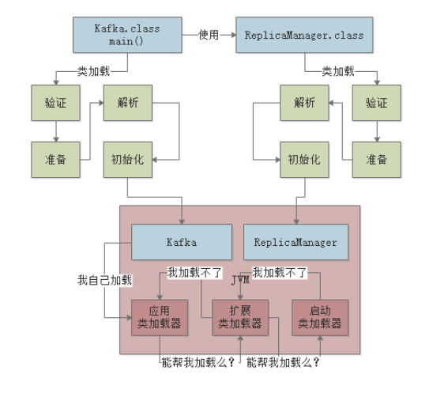

## JVM


### 1.前言

#### 1. 1 java代码如何运行?


.java              .class              01100101  

 java代码    -》  java 字节码 -》机器码

​                打包                 JVM 

#### 1.2 类加载到使用过程 （.class 字节码文件加载到 JVM内存中）


> **加载    验证   准备  解析  初始化 使用 卸载**

  实用角度简单解析

* 验证  .class 文件内容是否符合JVM规范
* 准备   类变量(static 修饰的变量)分配内存空间 赋默认的初始值
* 解析   (很复杂,符号引用替换为实际引用)
* 初始化 （核心阶段） 执行类的初始化代码块（static代码块）


**什么时候初始化一个类?**

1. new 实例化对象时，触发类的加载到初始化的全过程
2. 包含main方法的主类，必须立马初始化好
3. 初始化类时，他的父类没有初始化，就必须先初始化他的父类


#### 1.3  什么情况会加载一个类?

1. 类有main方法作为程序主入口

2. 代码执行用到某个类的时候

   


#### 1.4  类加载器和双亲委派机制


**1.启动类加载器**

BootStrap ClassLoader  加载java目录下的核心类 （java安装目录下的"lib"目录）java最核心的类库，支撑java系统运行

一旦jvm启动，首先就会依托启动类加载器。


**2.扩展类加载器**

Extension ClassLoader  java安装目录下有 "lib/ext"目录，就是用它来加载，支撑系统运行。


**3.应用程序类加载器**

Application ClassLoader 复制加载 "ClassPath" 环境变量所指定的路径的类 （大致理解为加载自己写好的Java代码）


**4.自定义类加载器**

根据自己的需求加载




​		

**双亲委派流程:**

​	当一个Hello.class这样的文件要被加载时。不考虑我们自定义类加载器，首先会在AppClassLoader中检查是否加载过，如果有那就无需再加载了。如果没有，那么会拿到父加载器，然后调用父加载器的loadClass方法。父类中同理也会先检查自己是否已经加载过，如果没有再往上。注意这个类似递归的过程，直到到达Bootstrap classLoader之前，都是在检查是否加载过，并不会选择自己去加载。直到BootstrapClassLoader，已经没有父加载器了，这时候开始考虑自己是否能加载了，如果自己无法加载，会下沉到子加载器去加载，一直到最底层，如果没有任何加载器能加载，就会抛出ClassNotFoundException。

**双亲委派模式优势**

**避免重复加载 + 避免核心类篡改**
	采用双亲委派模式的是好处是Java类随着它的类加载器一起具备了一种带有优先级的层次关系，通过这种层级关可以避免类的重复加载，当父亲已经加载了该类时，就没有必要子ClassLoader再加载一次。其次是考虑到安全因素，java核心api中定义类型不会被随意替换，假设通过网络传递一个名为java.lang.Integer的类，通过双亲委托模式传递到启动类加载器，而启动类加载器在核心JavaAPI发现这个名字的类，发现该类已被加载，并不会重新加载网络传递的过来的java.lang.Integer，而直接返回已加载过的Integer.class，这样便可以防止核心API库被随意篡改。


>**为什么必须要一级一级类加载器的往上找，直接从顶层类加载器开始找不就行了吗？**

​	其实关于这个问题，不用过于纠结，每一层类加载器对某个类的加载，上推给父类加载器，到顶层类加载器，如果发现自己加载不到，再下推回子类加载器来加载，这样可以保证绝对不会重复加载某个类。至于为什么不直接从顶层类加载器开始找，那是因为类加载器本身就是做的**父子关系模型**

​	你想一下Java代码实现，他最底下的子类加载器，只能通过自己引用的父类加载器去找。如果直接找顶层类加载器，不合适的，那么顶层类加载器不就必须硬编码规定了吗？

​	这就是一个代码设计思想，保证代码的可扩展性。


ps: 为了防止源代码泄露，可以用工具对字节码加密。在类加载时，用**自定义的类加载器**来解密文件。

​    

#### 1.5 JVM 内存区域

```java
public class A {
    public static void main(String[] args) {
        B b = new B();
        b.load();
    }
}
```

```java
public class B {

      public void load(){
          boolean ifLoad = false;
      }
}
```


内存区域流程:

​	结合上图, JVM启动，加载 A类到内存中，然后有一个main线程执行main方法，main线程关联一个**程序计数器**，记录执行到哪一行。其次，在main线程关联的**java虚拟机栈**里压入main方法的**栈桢**。main方法中需要创建B类的实例对象，这时把B类加载到内存中，创建B的对象实例分配在java**堆内存**中，并且在main()方法的栈桢中的局部变量表引入b变量，引用到B对象在堆内存中的地址。接着执行b.load 方法，创建栈桢，创建局部变量。执行完之后，把对应的方法出栈。


#### 1.6 垃圾回收

我们在java堆内存里创建的对象，都是占用内存资源的，而且内存资源有限。

如上面 b.load() 方法执行完之后，java堆内存的 B 对象实例没有变量引用它了，这时这可能就是一种浪费。


解决方法:  Jvm垃圾回收机制

本身是一个后台自动运行的线程，只要启动一个JVM进程，就会自带这么一个垃圾回收的后台线程。

这个线程会不断检查JVM堆内存中的各个实例对象。

如果某个实例的对象没有任何一个方法的局部变量,类的静态变量，包括常量等地方在指向他。那么垃圾回收线程就会把这个没人指向的 "B"实例对象回收，从内存里清除。 这些不被指向的对象实例就是Jvm的"垃圾"。


> **思考问题: 我们创建的对象，到底在java堆内存中占用多少内存？**


一个对象对内存的占用分两块

* 对象自己本身的一些信息
* 对象的实例变量作为数据占用的空间


在64位的linux操作系统上，对象头会占用 16 字节，如果实例对象内部有个int类型的实例变量，会占用4个字节，如果是long类型的实例变量会占用8个字节。如果是map，list就更多了。

jvm有许多优化的地方，如 补齐机制，指针压缩机制。较复杂，暂时不学。


>**既然堆内存的对象会被回收，那么方法区（永久代）的类会被垃圾回收吗？什么时候回收?为什么？**

   会,但是要满足下面的三个条件

* 首先，该类的所有实例对象都已经从 java 堆内存里被回收
* 其次，加载这个类的 ClassLoader 已经被收回
* 最后，对该类的 Class 对象没有任何引用   （Class 对象无法通过任何途径访问（包括反射）
  


#### 1.7 tomcat 相关问题


tomcat本身是java程序，那么tomcat的实现程序的class是由应用类加载器加载的，用户自己的java程序war包，放入tomcat的程序的classpath中这样用户的程序和tomcat的程序都是由应用类加载器加载了，也就是处于一个jvm中了


前言结束下面的学习会更细节。


#### 1.8 内存分代模型

​      根据对象生命相对的长短，JVM对对象进行了分代，年轻代、老年代、永久代。

  JVM将**Java堆内存**划分为了两个区域，一个是年轻代，一个是老年代。

* 年轻代，创建和使用完之后立马就要回收的对象存放的区域

* 老年代，创建之后需要一直长期存在的对象存放的区域。
* 永久代其实就是之前说的方法区，保存类相关信息


永久代类的回收满足下面三个条件就可以回收该类了

- 首先该类的所有实例对象都已经从Java堆内存里被回收；
- 其次加载这个类的ClassLoader已经被回收；
- 最后对该类的Class对象没有任何引用。


结合代码和图例进行理解

```java
public class A {
    private static C c = new C();
    public static void main(String[] args) throws InterruptedException {
        loadB();
        while(true){
           loadC();
           Thread.sleep(1000);
        }
    }

    public static void loadB(){
        B b =new B();
        b.loadFromDisk();

    }
    public static void loadC(){
        c.loadFromRemote();
    }
}
```


大部分正常对象都是优先在新生代分配内存的，类静态变量c 引用的C对象实例是会长期存活在内存里的，但是一开始也

是分配在新生代里。

**那么什么情况下会触发新生代的回收?**

假设 loadB（）方法执行完毕，这个方法的栈桢出栈，导致没有变量引用B实例对象。


会立即触发垃圾回收吗？

不会，垃圾回收需要触发条件的，假设现在创建了许多的对象。导致java堆内囤积了大量的对象，这个时候新生代预先分配的内存空间满了，他又需要在新生代分配一个新对象。这时候就触发了一次新生代的垃圾回收 "Minor GC" 也叫"Young GC"

这时候就会把大量没人引用的对象包括B回收掉。


但是 “C对象”，会一直存活在新生代里，因为它一直被 A类的静态变量引用，不会被回收。

这时JVM规定，对象每垃圾回收一次，年龄就+1，所以当上图的 C对象在新生代成功躲过10多次垃圾回收，成为“老年人”就会被认为是会长期存活在内存里的对象，被转移到 java堆内存的老年代。


（后续）对象分配还有许多复杂机制:

*  新生代垃圾回收后，存活对象太多导致大量对象进入老年代
* 特别大的超大对象直接不经过新生代就进入老年代
* 动态对象年龄判断机制
* 空间担保机制


#### 1.9 Jvm核心参数

一般来说，对于线上部署系统启动的时候，有多种方式设置Jvm参数。

Idea中设置 Debug JVM Arguments

java -jar 命令启动时直接在后面跟上jvm参数

部署到Tomcat时可以在Tomcat的catalina.sh中设置Tomcat的Jvm参数，使用Springboot也可以在启动时指定Jvm参数。


1. -Xms:  java堆内存大小         
2. -Xmx:  java堆内存最大大小
3. -Xmn:  java堆内存中新生代大小，扣除新生代剩下的就是老年代内存大小
4. -XX:PermSize         永久代大小             （jdk1.8后）-xx:MetaspaceSize
5. -XX:MaxPermSize   永久代最大大小         (jdk1.8后) -xx:MetaspaceSize
6. -Xss: 每个线程的栈内存大小


### 2.百万流量订单系统预估


​	现在一秒可能处理不了1000个订单了，因为压力骤增，系统性能下降，可能偶尔会出现某个请求处理完毕需要几秒甚至几十秒的时间，这时频繁触发gc回收机制，而一些请求处理的特别慢，就会进入老年代，老年代也越来越多，也会频繁触发老年代的垃圾回收，老年代的垃圾回收非常慢，极大影响系统性能。


永久代大小: 一般 几百MB够用。

栈内存大小: 一般默认 512KB~1Mb


### 3. 垃圾回收


> **被哪些变量引用的对象是不能回收的？**


可达性分析算法: 每个对象都分析一下有谁在引用它，然后一层一层往上判断，看是否有一个**GC Roots**

方法的局部变量，类的静态变量都可以看做是一种 GC roots。

总结:      对象被**方法的局部变量**,**类的静态变量**给引用，就不会回收。


> **java中对象不同的引用类型**

   参考链接:http://www.cnblogs.com/dolphin0520/p/3784171.html

* **强引用**   

  ​	如果内存不足，JVM会抛出OOM错误也不会回收object指向的对象。

  ​            （ B b = new B() ）  b 对 B 就是强引用 

  

* **软引用**  **(内存不足回收)**

   软引用是用来描述一些有用但并不是必需的对象，只有在内存不足的时候JVM才会回收该对象。因此，这一点可以很好地用来解决OOM的问题，并且这个特性很适合用来实现缓存：比如网页缓存、图片缓存等

    SoftReference<String> sr = new SoftReference<String>( new String( "hello" )); 

​                      sr 对 String对象的引用就是软引用


* **弱引用**  **（都会被回收）**

  ​	弱引用也是用来描述非必需对象的，当JVM进行垃圾回收时，无论内存是否充足，都会回收被弱引用关联的对象。

  WeakReference<String> sr = newWeakReference<String>(newString("hello"));

* **虚引用** （PhantomReference） 

  ​	基本不用。

  ​	它并不影响对象的生命周期，如果一个对象与虚引用关联，则跟没有引用与之关联一样，在任何时候都可能被垃圾回收器回收。

  ​	要注意的是，虚引用必须和引用队列关联使用，当垃圾回收器准备回收一个对象时，如果发现它还有虚引用，就会把这个虚引用加入到与之 关联的引用队列中。程序可以通过判断引用队列中是否已经加入了虚引用，来了解被引用的对象是否将要被垃圾回收。如果程序发现某个虚引用已经被加入到引用队列，那么就可以在所引用的对象的内存被回收之前采取必要的行动。


> **如何利用软引用和弱引用解决OOM问题?**

​		假如有一个应用需要读取大量的本地图片，如果每次读取图片都从硬盘读取，则会严重影响性能，但是如果全部加载到内存当中，又有可能造成内存溢出，此时使用软引用可以解决这个问题。

　　设计思路是：用一个HashMap来保存图片的路径 和 相应图片对象关联的软引用之间的映射关系，在内存不足时，JVM会自动回收这些缓存图片对象所占用的空间，从而有效地避免了OOM的问题。在Android开发中对于大量图片下载会经常用到。


> **finalize()方法的作用**


没有Gc roots 引用的对象可以回收，有 GC Roots 的对象不能回收，如果有 Gc roots 引用，但是如果是软引用或者弱引用也有可能被回收掉。

**假设没有Gc roots引用的对象是一定立马被回收吗？**

finalize（）方法可以拯救。

加入某个对象要被垃圾回收了，但是这个对象重写了Object类中的 finalize()方法并且这个方法中把自己给某个Gc roots变量。


重新让instance这个 gc roots 变量引用了自己。就不用被垃圾回收了。


#### 3.1 新生代的垃圾回收算法

  

##### 3.1.1**复制算法**:   **Eden区和Survivor区**


一个 Eden区，两个survivor区，eden区占80%内存空间，每一块survivor区占 10%。

平时使用一块eden和一块survivor区所以内存使用率为 90%。

​	刚开始对象都分配在eden区，如果eden区快满了就触发垃圾回收，把eden区中的存活对象转移到一块空着的survivor区，eden区清空，然后再次分配新对象到eden区，再触发垃圾回收，就把eden区存活的和survivor区存活的转移到另一块空着的survivor。


**这么设计的原因**: 每次垃圾回收可能存活下来的对象就1%,如果eden+一块survivor满了900MB，一次垃圾回收下来有10MB存活，就把10MB转移到另一块survivor区。始终保持一块survivor区是空着的。这样可以控制内存碎片，而且内存的使用率都很高。


**遗留问题**:

* 万一存活下来的对象超过10%内存空间，在另外一块survivor区放不下怎么办？
* 万一突然分配超级大的对象，大到新生代找不到连续的空间来存放，怎么办？
* 到底一个存活对象要在新生代来回倒腾多少次才会去老年代？


**解答**

比如 static B b = new B(); 

静态变量b会一直引用B对象，这类对象不会被回收掉，每在新生代里躲过一次gc被转移到一块Survivor区时，年龄就长一岁。

默认的设置是达到15岁时转移到老年代。

也可以通过jvm参数（年龄阈值）"-XX:MaxTenuringThreshold"设置


##### 3.1.2**动态对象年龄判断**

有另一个规则可以让对象早点进入老年代：**动态对象年龄判断**

触发时机：发生Minor Gc 后，将存活的对象移动到空闲的 Survivor区时触发


图里一岁和二岁的对象加起来>=survivor区的一半50MB ，那么survivor2区里年龄大于等于2岁的对象要提前进入老年代。


##### 3.1.3**大对象直接进入老年代**

有一个jvm参数  "-XX：PretenureSizeThreshold "可以把他的值设为字节数。比如 1048576字节，就是1MB 

如果你创建了一个大于这个大小的对象，比如一个超级大的数组，就直接把这个大对象放到老年代里。不会经过新生代。

之所以这么做，就是要避免新生代出现大对象，然后屡次躲过GC,还要把他在两个Survivor区域里来回复制多次之后才进入老年代。


##### 3.1.4 **空间分配担保机制**

survivor区内存比较小，所以尽可能保证在一次Minor gc后，如果survivor区放不下，老年代要放得下，所以在Minor gc前要先计算老年代的可用空间够不够，能不能兜底。

**抛几个问题：**

**1.什么是空间分配担保？**

　　　　在发生**Minor GC**之前，虚拟机会检查**老年代最大可用的连续空间**是否**大于新生代所有对象的总空间**，

　　　　如果大于，则此次**Minor GC是安全的**

　　　　如果小于，则虚拟机会查看**HandlePromotionFailure**设置值是否允许担保失败。如果HandlePromotionFailure=true，那么会继续检查老年代最大可用连续空间是否大于**历次晋升到老年代的对象的平均大小**，如果大于，则尝试进行一次Minor GC，但这次Minor GC依然是有风险的；如果小于或者HandlePromotionFailure=false，则改为进行一次Full GC。

**2.为什么要进行空间担保？**

　　　　是因为新生代采用**复制收集算法**，假如大量对象在Minor GC后仍然存活（最极端情况为内存回收后新生代中所有对象均存活），而Survivor空间是比较小的，这时就需要老年代进行分配担保，把Survivor无法容纳的对象放到老年代。**老年代要进行空间分配担保，前提是老年代得有足够空间来容纳这些对象**，但一共有多少对象在内存回收后存活下来是不可预知的，**因此只好取之前每次垃圾回收后晋升到老年代的对象大小的平均值作为参考**。使用这个平均值与老年代剩余空间进行比较，来决定是否进行Full GC来让老年代腾出更多空间。


**问题：Minor Gc后的对象太多无法放入Survivor区怎么办?**

假如在发生gc的时候，eden区里有150MB对象存活，而Survivor区只有100MB，无法全部放入，这时就必须把这些**对象全部直接转移到老年代**里。


**问题: 接着上面的问题，如果这时老年代的可用内存小于新生代全部对象大小，万一Minor gc后新生代的对象都存活下来，然后需要全部转移到老年代，但是老年代空间不够，怎么办？**

理论上有这个可能。

这时如果设置了 "-XX:-HandlePromotionFailure"的参数，就会尝试判断，看老年代内存大小是否大于之前每一次Minor gc后进入老年代的对象的平均大小。

比如说，之前Minor gc 平均10M左右的对象进入老年代，此时老年代可用内存大于10MB,那么大概率老年代空间是足够的。

如果上面那个判断失败，或者是根本没设置这个参数，那就直接触发"Full GC"，对老年代进行垃圾回收，腾出些空间，再Minor gc。


如果判断成功了，那么大概率老年代内存是够的，就冒风险尝试Minor gc。这时有以下几种可能。

* Minor Gc 后，剩余的存活对象大小，小于Survivor区，那就直接进入Survivor区。
* MInor Gc 后，剩余的存活对象大小，大于Survivor区，小于老年代可用内存，那就直接去老年代。
* Minor Gc后，大于Survivor，老年代，很不幸，就会发生"Handle Promotion Failure"的情况 ，触发"Full GC"。


**Full gc** 就是对老年代进行垃圾回收，同时也一般会对新生代进行垃圾回收。

如果 Full gc后老年代还是没有足够的空间存放剩余的存活对象，那么就会导致**"OOM"** out of memory 内存溢出。


**所以Minor gc 触发要先对老年代空间做检查看看老年代空间够不够。**检查失败的时候触发"Full Gc"给老年代腾空间，或者Minor gc 后剩余对象太多放入老年代内存都不敢，也要触发"Full Gc"。


总结：触发老年代垃圾回收（Full gc) 的时机

* Minor gc 前，检查一下发现之前的   Avg（进入老年代对象的大小）> 现在老年代可用空间，提前触发Full gc。
* Minor gc 后，发现剩余对象 > 老年代可用空间，触发Full gc。


一张图总结一下


根据上图回答问题

1. 什么时候会触发Minor gc?

2. 触发Minor gc 之前会如何检查老年代的大小，涉及哪几个步骤和条件？

3. 什么时候在Minor Gc 之前就会提前触发一次 Full gc?

   1. .......

   2. .......

   3. .......

   4. 老年代已用内存空间超过 "-XX: CMSInitiatingOccupancyFaction" 参数指定的比例，自动触发Full gc

      

4. Minor gc 过后可能对应那几种情况?


Minor gc 存活对象总大小 = M.memory      Survivor区可用空间 = S.memory  老年代可用连续空间 = O.memory

* M.memory < S.memory                        M.memory 迁移至 Survivor区后触发（大龄对象判定，动态年龄判定）视情况移入老年代，如果老年代可用连续空间不够，先 Full gc 再 Minor Gc 还不够，报OOM。
* S.memory < M.memory < O.memory     存活对象直接迁移至老年代中
* O.memory < M.memory                        先Full gc 再Minor gc ，老年代空间还是不够，报OOM。


5.哪些情况下Minor gc 的对象会进入老年代?


**Stop the World** 问题

JVM最让人无奈的痛点: 在垃圾回收时，jvm发送 “stop the world” 让java后台程序停止运行以免产生新对象，专心垃圾回收。

#### 3.2 年轻代垃圾回收器


**ParNew (多线程)**

-XX:+UseParNewGC  指定使用parnew

默认情况下 ParNew线程数量和cpu的核数一样

可以通过 -XX:ParallelGCThreads 设置线程数量


**Serial (单线程)**


> 什么时候用parnew ？什么时候用 Serial ?

启动系统的时候可以区分客户端模式和服务器端模式。

系统如果部署在服务器上，就应该用服务器模式，如果你的系统是运行在比如Windows上的客户端程序，就应该是客户端模式。

部署在服务器上的话，应该使用Parnew，因为多线程并行垃圾回收，充分利用多核CPU资源。提升性能

是客户端程序的话，很多都是单核cpu，此时如果还要用 ParNew来回收的话，就会导致一个cpu运行多个线程，反而加重了性能开销，因为单cpu运行多线程会导致频繁的上下文切换。

#### 3.3**老年代垃圾回收的算法**


标记清理算法: 先把老年代中存活的对象打标记，然后把标记的存活对象挪到一边，然后再清空非存活对象的那一边。

先通过追踪 GC Roots 的方法，看看各个对象是否被Gc Roots给引用了，如果是的话，就是存活对象，否则就是垃圾对象。将垃圾对象标记出来，然后一次性回收掉。

#### 3.4 老年代垃圾回收器


CMS 采用标记清理算法

CMS 采取 **垃圾回收线程和系统工作线程尽量同时执行的模式来处理**

如何实现？

* 初始标记

  这个阶段，系统的工作线程全部停止，进入"stop the world",标记出所有的Gc roots对象。虽然要 stw,但是影响不大，因为速度非常快。

* 并发标记 （Gc roots 深度追踪）

  系统线程可以随意创建各种新对象，继续运行，这个阶段可能会创建新的存活对象，也可能部分存活对象失去引用。在这个过程中，垃圾回收线程会尽可能的对已有的对象进行 GC Roots追踪。

  简而言之，会对老年代所有对象进行GC Roots 追踪，是最耗时的。被方法区静态变量引用的类其中的实例变量引用的类这一阶段会被标记存活。

* 重新标记

  因为第二阶段结束，会多出许多之前没标记的存活对象和垃圾对象，所以再次进入"stop the world",然后重新标记在第二阶段新创建的一些对象和失去引用变成垃圾的对象。这个阶段速度很快。

* 并发清理

  系统恢复运行，然后清理之前标记的垃圾对象。很耗时，但是是和程序并发运行，所以不影响系统的运行。


​	简单来说，为了避免长时间的"Stop the World" ,CMS采用了4个阶段来垃圾回收，其中初始标记和重新标记，耗时短，虽然会导致stw，但是影响不大，然后并发标记和并发清理，两个耗时最长，但是可以跟系统的工作线程并发运行，所以对系统影响不大。

这就是CMS的基本工作原理。


**CMS 的弊端：**

* **消耗cpu资源**
* **Concurrent Mode Failure (并发模式失败)**

​        并发清理的时候，系统一直在运行，可能会随着系统的运行让一些对象进入老年代，变成垃圾对象。这种垃圾对象----浮动垃圾。需要等到下一次 Full Gc清理他们。所以为了保证在CMS垃圾回收期间还有一定的空间让一些对象进入老年代，一般会预留一些空间。

​		  "-XX：CMSInitiatingOccupancyFaction" 参数设置老年代占用多少比例时触发CMS垃圾回收。

​			jdk1.6 默认是 92%

如果在这期间，进入老年代的对象大于可用内存空间，那么会触发 Concurrent Mode Failure，并发垃圾回收失败。这时会自动用"Serial Old" 垃圾回收器替代CMS。就是直接把系统"Stop the World" 重新进行长时间的Gc Roots追踪，标记出全部垃圾对象，不允许新的对象。然后一次性回收，再恢复系统。

* **内存碎片**

老年代CMS 采用标记清理算法，标记垃圾，回收，会产生大量的内存碎片。太多的内存碎片会导致频繁的Gc。

​			"-XX：+UseCMSCompactAtFullCollection" 参数默认打开。

​			表示在 Full Gc后要再次进行"Stop the world" 停止工作线程，再进行碎片整理，把存活的对象挪到一边，空出大片连续的内存空间。

​			"-XX：CMSFullGCsBeforeCompaction" 

​			执行多少次 Full Gc 之后再执行内存碎片整理工作。默认是 0，每次都需要。

> 为什么老年代的 Full GC 比新生代的 Minor GC 慢很多倍？一般在10倍以上？

**ParNew的Minor GC**

​	新生代执行速度快，因为直接从 Gc Roots 出发，追踪哪些对象是存活的就行，新生代存活的对象是很少的。然后直接放入Survivor,就一次性回收eden区和之前的Survivor区。


**CMS的Full GC**

* ​	在并发标记阶段，需要去深度追踪所有的存活对象，老年代存活对象很多。
* ​    并发清理阶段，也不是一次性回收一大片内存，而是找到零零散散在各个地方的垃圾对象。
* ​    最后还要执行内存碎片整理，把存活对象移一起，空出连续空间，这个过程还得 "Stop the world"

*  并发清理期间，剩余空间不足存放新进的对象时，还会触发"Concureent Mode Failure"，更加麻烦，还要使用"Serial Old"单线程的垃圾回收器，"Stop the world"后再重新来一遍回收过程。更加耗时。

### 4.日处理上亿数据的系统(分配内存区域大小)

优化原则：

在给定的内存大小合理的前提下，合理设置 eden、survivor、老年代的内存比例，尽可能让存活的对象放入到survivor区（下次Minor Gc就回收，不进入老年代），延长两次 Full gc之间的时间。


**要结合自己系统的运行，根据系统的内存占用情况，GC后的对象存活情况，合理分配 Eden、Survivor、老年代的内存大小，合理设置一些参数。**


​	一分钟之后，新生区快满了，新生代对象总共大概1.2G,而老年代可用内存为1.5G，即便一次Minor gc后，全部对象都存活，老年代也能放得下，直接执行 Minor Gc。

​	假设100个计算任务都结束，还有20个计算任务总共200M数据还在计算中，200MB的对象是存活的，1Gb的对象是回收掉的。

​	但是因为 Survivor区只有100Mb的大小，这些数据无法放入Survivor区，所以只能进入老年代中了，这样子大概7分钟过后，1.4G对象进入老年代，老年代剩余空间不到100MB了。

​	第8分钟运行结束，新生代满了，老年代也不够，直接触发 Full Gc 。

​     平均7、8分钟一次Full Gc。性能很差。

**性能优化**：2GB给新生代 1GB给老年代 Survivor 大概200MB 刚好能放下Minor gc 后的对象了。


今日分享： 线上机器CPU负载过高如何去排查？如何优化JVM参数？

（1）第一可以通过 top -Hp PID , jstack PID等查看占用CPU资源过高的线程是哪些？可能会看到是GC线程。
或者是其他线程，如果是GC线程，那么jstat查看JVM垃圾回收器工作的情况。如果是其他业务线程，可能需要跟踪栈信息，追踪到代码中进行分析。（可能是一直循环处理业务，数据量大，处理耗时。）
-- 业务线程导致CPU高的场景，没有关注过，不知道我的理解对不对。
（2）查看JVM垃圾回收情况相关的信息
YoungGC频率，YoungGC耗时，每次GC过后Eden+S0区的垃圾回收情况；进入老年代的大小
FullGC频率，YoungGC耗时，每次GC过后老年代的垃圾回收情况；
我的总结：
（1）如果是YoungGC，FullGC频繁，但是每次FullGC回收之后，垃圾回收率很高，可能就是高并发引起的；要关注下是不是年轻代内存分配不合理，是否需要加大JVM堆内存。升级机器等。根据YoungGC每次进入老年代的大小，重新预估一下，新生代需要分配多大的内存比较合适，来解决这个高并发引起的FullGC问题。
（2）如果FullGC之后，回收的内存时多时少，或者说很少，甚至可能出现连续的1-3次，回收之后，老年代剩余空间是在增长的，这个时候就要排除是否有发生内存泄漏的嫌疑。或者说高并发引起的问题导致对象无法被回收。这时候一般需要dump下内存快照，使用MAT工具分析内存快照，可以短时间连续dump两次，对比两次内存快照，查看哪些对象不断在增长。这些对象是不是大对象，因为并发问题无法被及时回收，JVM处在OOM边缘。然后根据派排查结果，优化代码问题。
优化JVM参数：
（1）优化新生代和老年代的占比。尽量保证每次YoungGC之后。可以打印对内存信息，计算一下一般存活对象是多大。假设是100M。那么可以将S0设置成 S0 * 50% = 100M。 S0大概需要200M。这样就可以把Eden和老年代大小预估出来了，一般业务系统。老年代分配1至2G就可以了。
（2）需要开启CMS垃圾回收器的对内存碎片进行整理。一般每次FullGC都整理一遍最好。
（3）-XX:CMSInitiatingOccupancyFraction=92。老年代占用92%以上发生FullGC。一般这个值我觉得偏大了，如果是高并发系统，会有较大可能出现Concurrent Mode Failure。所以我对CMS设置的时候，会把老年代预留空间大小预估到S0区大小这样。一般设置80%。对于这点不知道是否合理？
（4）还会设置一些额外的参数：-XX:-OmitStackTraceInFastThrow
还有打印GC日志，发生OOM的时候dump内存快照参数。
（5）还有一点，如果没有发生什么特殊的问题，不会对其他的参数进行优化。能简单设置就采用简单的设置。


下次分享 ：你说你精通jvm调优，能够说下G1工作原理以及整体流程吗？