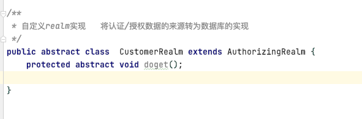
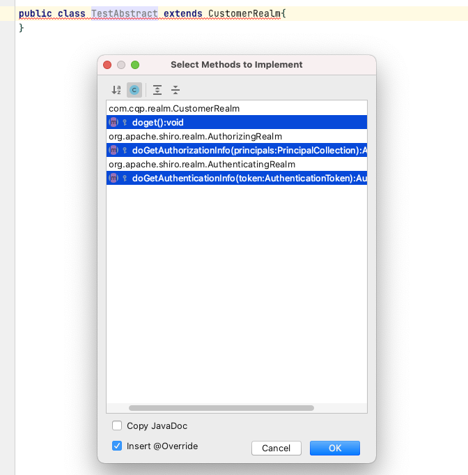
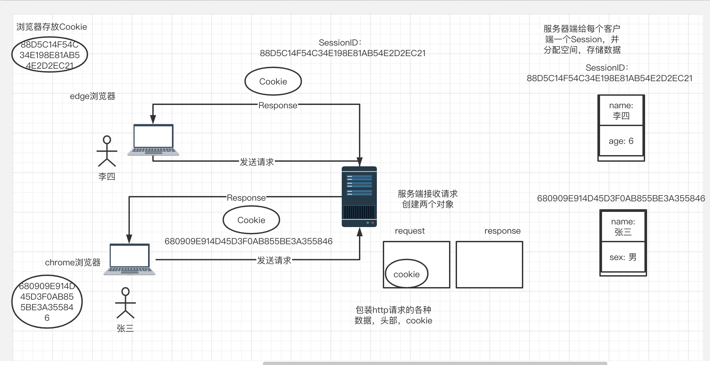

## Java知识点理解

### 1.泛型


百度百科: 泛型是[程序设计语言](https://baike.baidu.com/item/程序设计语言/2317999)的一种特性。允许程序员在强类型程序设计语言中编写代码时定义一些可变部分，那些部分在使用前必须作出指明。各种程序设计语言和其[编译器](https://baike.baidu.com/item/编译器/8853067)、运行环境对泛型的支持均不一样。将类型参数化以达到代码复用提高软件开发工作效率的一种数据类型。[泛型类](https://baike.baidu.com/item/泛型类/9038353)是引用类型，是堆对象，主要是引入了类型参数这个概念。


泛型: 当要调用方法或者创建对象时才明确类型。让程序员能够提前告知编译器想使用特定类型的意图，并且编译器确保这样是可以的。

```java
List list1 = new LinkedList();
list1.add(1);
Integer i = (Integer) list1.iterator().next();   // 必须声明list里拿出的是 Integer类型

List<Integer> list2 = new LinkedList();
list2.add(1);
Integer j = list2.iterator().next();            // 由于创建list时已经声明放 integer 所以拿出时就不需要转换
```

好处: 编译的时候检查类型安全，消除了强制类型转换。**泛型只存在于编译期。**


<数据类型>这里面只能是引用类型不能是基本类型。

```text
Object<Integer>  //true
Object<int> //false
```

**为什么泛型里面数据类型不能是基本类型呢？**

因为虚拟机在编译时会把带泛型的转换成Object类型，而基本类型不属于Object类型，所以泛型里面数据类型不能是基本类型。


**泛型有三种实用方式**

泛型类：`public class Test<T>}{}` T表示未知类型

泛型接口：`public interface Test<T>{}` 和定义类一样

泛型方法：`public <T> void Test(T name){}`


1.测试泛型类   (泛型类在java中有着很重要的地位，其中我们用的最多的就是ArrayList,HashMap,HashSet.)

```java
package com.cqp.testGeneric;

public class Test<T> {
    T name;
    public Test(T name){
        this.name = name;
    }
    public T getName(){
        return name;
    }
    public void setName(T name){
        this.name = name;
    }

    public static void main(String[] args) {
        Test test1 = new Test("hello");
        Test test2 = new Test(2);
        Test<Integer> test3 = new Test<>(418);
        Test test4 = new Test(new user("cqp"));
        System.out.println(test1.getName());
        System.out.println(test2.getName());
        System.out.println(test3.getName());
        user userr =(user) test4.getName();
        System.out.println(userr.getName());
    }
}
```


2.测试泛型接口  （常见的泛型接口就是，List,Map,Set.）

 

```java
package com.cqp.testGeneric;

public interface TestInterface <T> {
    T getName(T name);
}
class Test1<T> implements  TestInterface<T>{
    @Override
    public T getName(T name) {
        return name;
    }
}
class Test2 implements TestInterface<String>{
    @Override
    public String getName(String name) {
        return name;
    }
}
```


3.泛型方法

```java
public <T> void getName(T name){} 
public <T,K> void getNameAndValue(T name, K value){}
public <T,K,V> void getNameAndValueAndV(T name, K value, V v){}//总的来说就是参数需要多少泛型，返回值前面就得定义几个泛型要不然编译期会出错
```


泛型通配符

**为什么要用通配符呢？**

java里面类和类之间是有继承关系 的，比如Cat  extends Animals,那么Cat就是Animal的子类，但是集合是没有继承这个概念的，比如`List<Cat> catList`和`List<Animals> animalList`你不能说 animalList是catList的父类，所以很难看出来这两个类之间的联系，**但是我们现在只想让list里面只加入Animals的子类怎么办呢？**

1. 一种是Animals有多少个子类就定义多少个list，这种方法虽然也可以实现但是Animals如果有一百个，一千个，一万个子类呢你这种方法是不是就太耗时了呢。
2. 第二种就是用通配符来实现。比如：`List animals` 这个时候animals就只能添加Animals的子类了，一个list搞定。


1.无边界的通配符:?

举个例子，能接收所有未知类型的泛型

```java
public class TestWildCard {
  //无论传入什么List都会被接收
    public static List getList(List<?> list){
        //list.add("a");用List声明的List 不能使用add方法，因为你不知道的类型是什么，但是list.add(null)就可以，因为null是所有类型都有的。  
      return list;
    }
    public static void main(String[] args) {
        List<Integer> listInteger = new ArrayList<>();
        listInteger.add(1);
        listInteger.add(2);
        List<String> listString = new ArrayList<>();
        listString.add("a");
        listString.add("b");
        getList(listInteger);
        getList(listString);
    }
}
```

2.上边界通配符号：可以接收E以及E的子类型的泛型，这里面的E不止是类哦，也可以是接口，看个例子。

```java
package com.cqp.testGeneric;

import java.util.ArrayList;
import java.util.List;

//测试上边界通配
public class TestUpWildCard {
     public static List getList(List<? extends Number> list){
         return list;
     }

    public static void main(String[] args) {
        List<Integer> listInteger = new ArrayList<>();
        listInteger.add(1);
        getList(listInteger);
        
        List<String> listString = new ArrayList<>();
        listString.add("a");
        //getList(listString);  报错 因为String不是Number的子类
    }
}
```


3.下边界通配符号

 就是传入的类型必须得是E以及E的父类

```java
package com.cqp.testGeneric;

import java.util.ArrayList;
import java.util.List;
// 测试泛型下边界通配符号
class Animals{}
class Cat extends Animals{}
class Dog extends Animals{}
public class TestDowbWildCard {
    public static List  getList(List<? super Cat>list){
        return list;
    }

    public static void main(String[] args) {
        List<Animals> animals = new ArrayList<>();
        getList(animals);
        List<Cat> cats = new ArrayList<>();
        getList(cats);
        List<Dog> dogs = new ArrayList<>();
        //getList(dogs);//编译出错，因为Dog不是Cat的父类
    }
}
```


参考链接：https://zhuanlan.zhihu.com/p/98850829


### 2.abstarct








普通类继承父类必须实现父类的抽象方法。

抽象类继承父类不需要实现父类的抽象方法。

为什么要用 abstract ？

可以规范方法，相当于给定一个接口，比如shiro框架中，在AuthorizingRealm中定义好要被调用的 dogetAuthentocationInfo 方法并声明为抽象，供上下层调用，

这样后续程序扩展的时候继承 AuthorizingRealm 去实现 doGetAuthentocationInfo 


### 3.cookie session

​      Session 是单体应用 无法微服务

