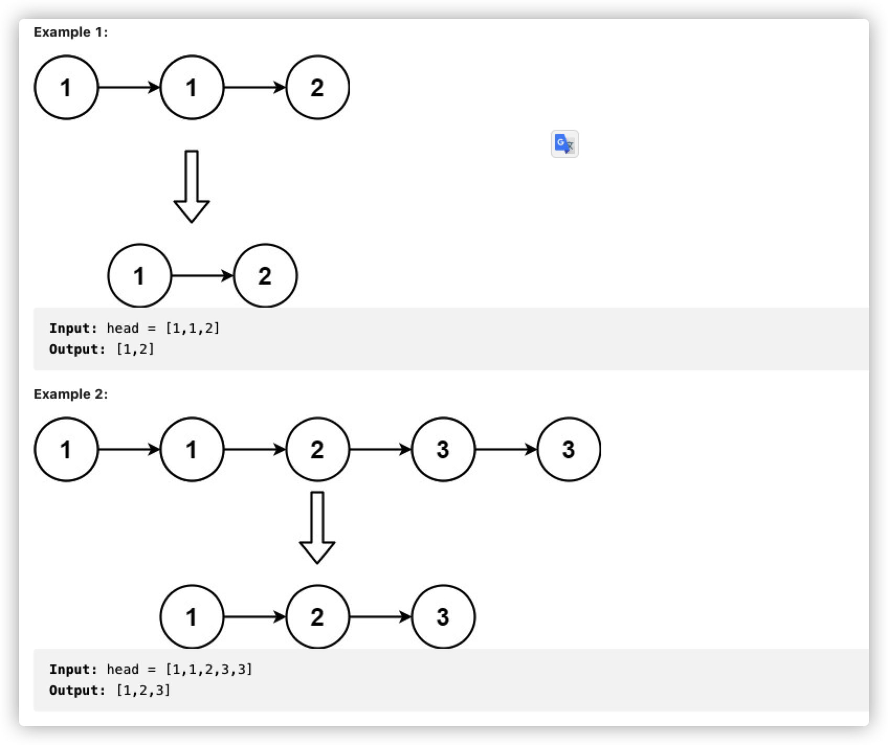
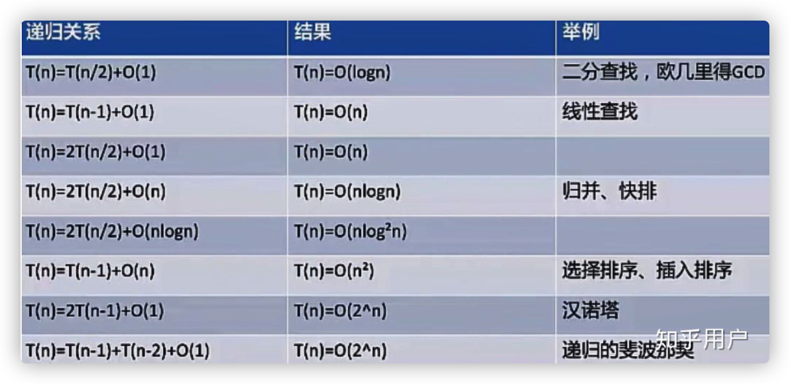
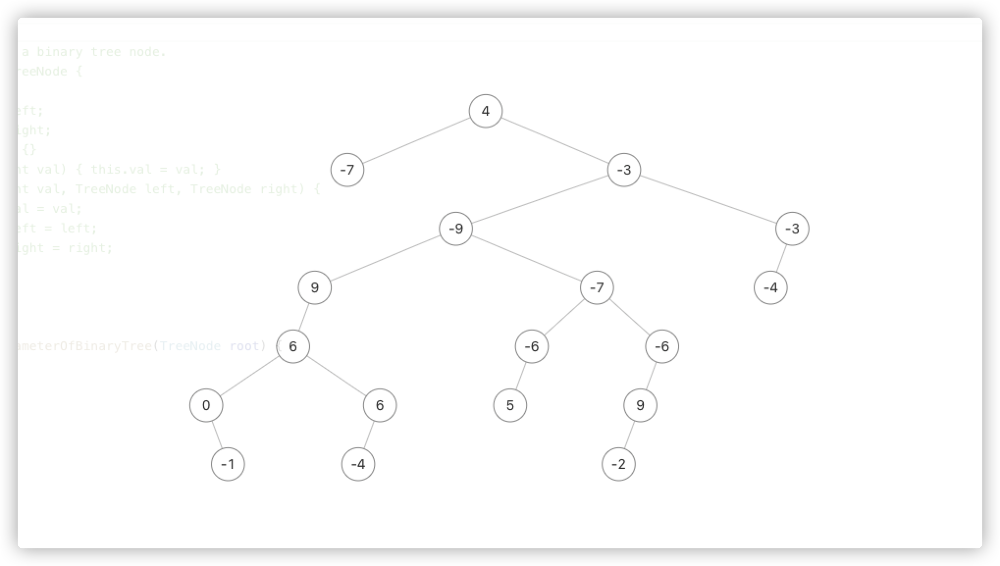
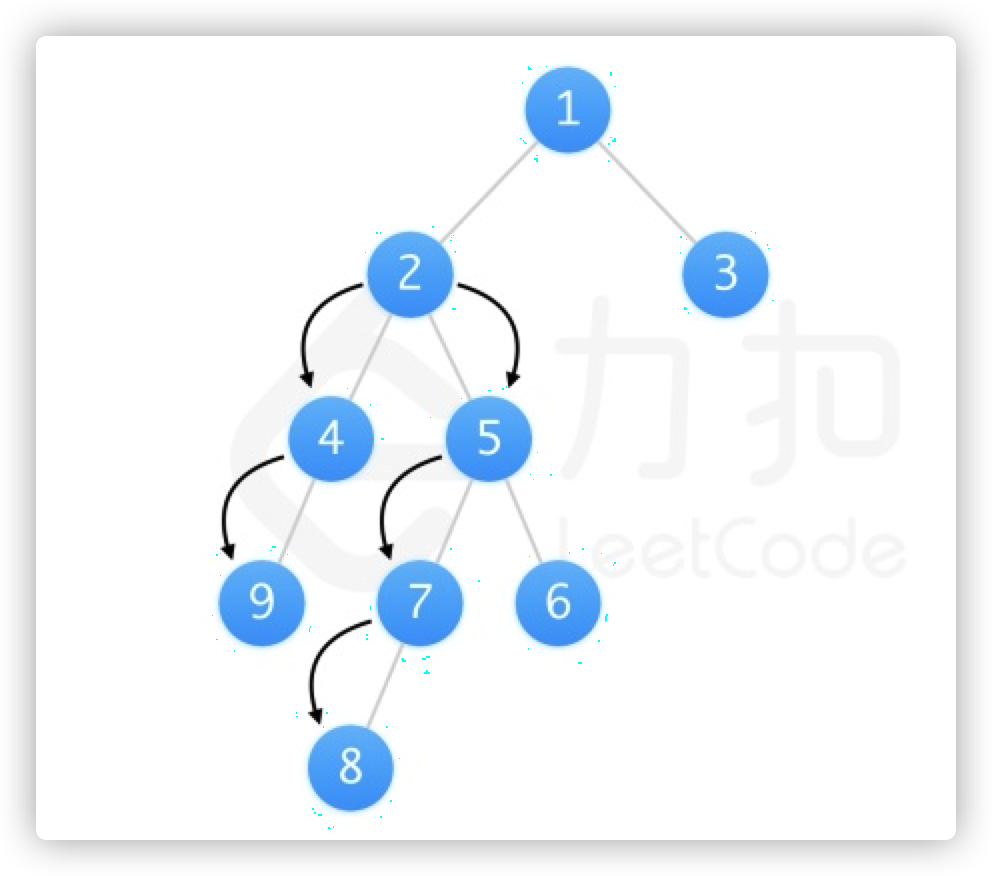
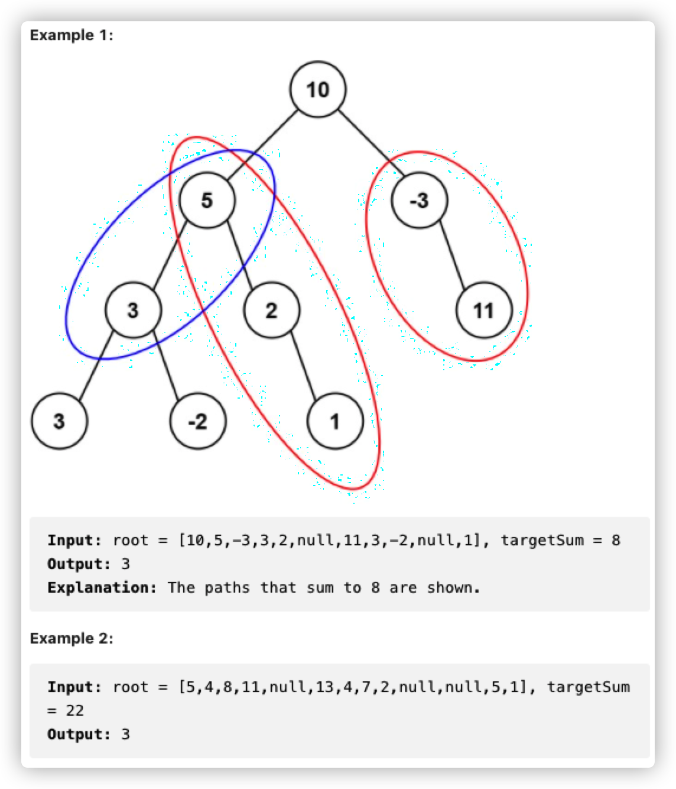
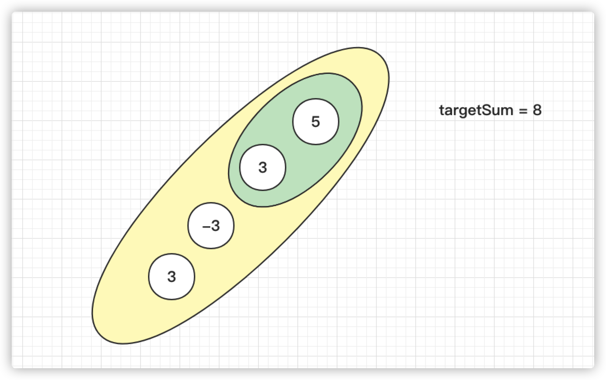
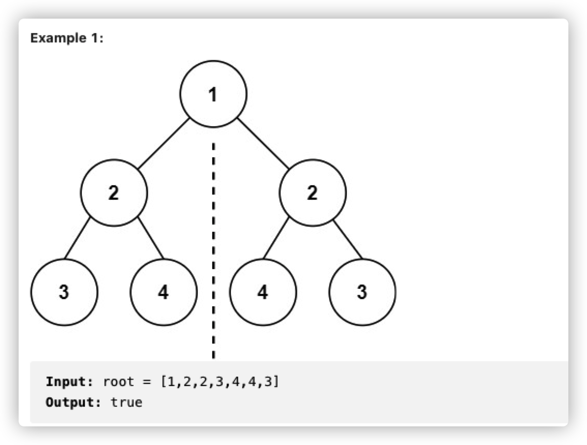

## Leetcode


### 链表


#### [160. 相交链表](https://leetcode-cn.com/problems/intersection-of-two-linked-lists/)


让a和b以统一速率从头出发，a如果到了末尾就从b的头再走一遍，b如果到了末尾就从a的头再走一遍。

这样如果有交点的话，a与b会相等。

如果没有交点的话，a与b都走到头都是null（这时a与b也相等）；

自己的写法

```java
public class Solution {
    public ListNode getIntersectionNode(ListNode headA, ListNode headB) {
        ListNode a = headA;
        ListNode b = headB;
        while(a != b  ){
            if(a != null){
               a = a.next;
            }else{
               a = headB;
            }
            if(b != null){
               b = b.next;
            }else{
               b = headA;
            }
        }
        if( a != null && b != null){
            return a;
        }else{
            return null;
        }
    }
}
```


标准答案:

```java
public ListNode getIntersectionNode(ListNode headA, ListNode headB) {
    ListNode l1 = headA, l2 = headB;
    while (l1 != l2) {
        l1 = (l1 == null) ? headB : l1.next;
        l2 = (l2 == null) ? headA : l2.next;
    }
    return l1;
}
```


#### [206. 反转链表](https://leetcode-cn.com/problems/reverse-linked-list/)


解法一: 

递归  记住 reverse( head.next)

head == null 在前 head.next == null 在后

```java
class Solution {
    public ListNode reverseList(ListNode head) {    
  			if (head == null || head.next == null) {
            return head;
        }
        ListNode last = reverseList(head.next);
        head.next.next = head;
        head.next = null;
        return last;
    }  
}
```


解法二:

双指针  注意不只需要 p 和 pre  还需要一个tmp保存p.next信息

```java
 public ListNode reverseList(ListNode head) {
   ListNode prev = null;
        ListNode curr = head;
        while (curr != null) {
            ListNode nextTemp = curr.next;
            curr.next = prev;
            prev = curr;
            curr = nextTemp;
        }
        return prev;
  }
  }
```


#### 21. 合并两链表

Merge Two Sorted Lists

1.迭代

```java
ListNode head = new ListNode(-1);
        while(l1 != null && l2 != null){
            if(l1.val >= l2.val){
                head.next = l1;
                head = l1;
                l1 = l1.next;
            }
            else{
                head.next = l2;
                head = l2;
                l2 = l2.next;
            }
        }
        if(l1 == null){
            head.next = l2;
        }else{
            head.next = l1;
        }
        return head.next;    
}
```


2.递归

```java
class Solution {
    public ListNode mergeTwoLists(ListNode l1, ListNode l2) {
       if(l1 == null){
           return l2;
       }
       else if(l2 == null){
           return l1;
       }
       else if( l1.val < l2.val){
           l1.next = mergeTwoLists(l1.next,l2);
           return l1;
       }else{
           l2.next = mergeTwoLists(l1,l2.next);
           return l2;
       }
}
}
```


#### 83.删除重复值的链表

Given the head of a sorted linked list, delete all duplicates such that each element appears only once. Return the linked list sorted as well.




```java
class Solution {
    public ListNode deleteDuplicates(ListNode head) {
        ListNode cur = head;     
        if(head == null){
            return null;
        }
        while(cur.next != null){
            if(cur.val != cur.next.val){
                cur = cur.next;
            }else{
                cur.next = cur.next.next;
            }
        }
        return head;
    }
}
```


#### 19.删除倒数n的节点


1. 先查长度，再for删除

```java
class Solution {
    public ListNode removeNthFromEnd(ListNode head, int n) {
        ListNode dummy = new ListNode(0, head);
        int length = getLength(head);
        ListNode cur = dummy;
        for (int i = 1; i < length - n + 1; ++i) {
            cur = cur.next;
        }
        cur.next = cur.next.next;
        ListNode ans = dummy.next;
        return ans;
    }

    public int getLength(ListNode head) {
        int length = 0;
        while (head != null) {
            ++length;
            head = head.next;
        }
        return length;
    }
}

```


2. 栈

```java
public ListNode removeNthFromEnd(ListNode head, int n) {
        ListNode dummy = new ListNode(0, head);
        Deque<ListNode> stack = new LinkedList<ListNode>();
        ListNode cur = dummy;
        while (cur != null) {
            stack.push(cur);
            cur = cur.next;
        }
        for (int i = 0; i < n; ++i) {
            stack.pop();
        }
        ListNode prev = stack.peek();
        prev.next = prev.next.next;
        ListNode ans = dummy.next;
        return ans;
    }
```


#### 24.交换链表的相邻节点



解法一: 递归  （递归不能拘泥于细节，要看整体）

* 问题可以分解为子问题
* 求解思路完全一样
* 存在终止条件

```java

class Solution {
    public ListNode swapPairs(ListNode head) {
        if(head == null || head.next == null){
            return head;
        }
        ListNode pre = head;
        ListNode p = head.next;
        pre.next = swapPairs(p.next);
        p.next = pre;
        return p;
    }
}
```


解法二：迭代（while）	

```javq
class Solution {
    public ListNode swapPairs(ListNode head) {
        ListNode dummyHead = new ListNode(0);
        dummyHead.next = head;
        ListNode temp = dummyHead;
        while (temp.next != null && temp.next.next != null) {
            ListNode node1 = temp.next;
            ListNode node2 = temp.next.next;
            temp.next = node2;
            node1.next = node2.next;
            node2.next = node1;
            temp = node1;
        }
        return dummyHead.next;
    }
}

```


#### 445 .链表求和 

 Add Two Numbers II (Medium)

```java
class Solution {
    public ListNode addTwoNumbers(ListNode l1, ListNode l2) {
        LinkedList<Integer> stack1 = new LinkedList<Integer>();
        LinkedList<Integer> stack2 = new LinkedList<Integer>();
        while (l1 != null) {
            stack1.push(l1.val);
            l1 = l1.next;
        }
        while (l2 != null) {
            stack2.push(l2.val);
            l2 = l2.next;
        }
        int carry = 0;
        ListNode head = null;
        while (!stack1.isEmpty() || !stack2.isEmpty() || carry != 0) {
            int a = stack1.isEmpty() ? 0 : stack1.pop();
            int b = stack2.isEmpty() ? 0 : stack2.pop();
            int cur = a + b + carry;
            carry = cur / 10;
            cur = cur % 10;
            ListNode curnode = new ListNode(cur);
            curnode.next = head;
            head = curnode;
        }
        return head;
    }
}
```


#### 234 回文链表


解法一 （自己）: 

先通过栈反转链表(其实直接和栈比较就可)，再去一个个比较

缺点：时间复杂度虽然是 o(n) 但是空间复杂度是 O(n)

```java
class Solution {
    public boolean isPalindrome(ListNode head) {
        ListNode reverseHead = reverse(head);
        ListNode p = head;
        ListNode q = reverseHead;

        while(p != null || q!= null){
            if(p.val == q.val){
                p = p.next;
                q = q.next;
            }else {
                return false;
            }
        }
        return true;
    }

     public ListNode reverse(ListNode head){
        LinkedList<Integer> stack = new LinkedList<Integer>();
        ListNode p = head;
        while (p != null){
            stack.push(p.val);
            p = p.next;
        }
        ListNode newHead = new ListNode();
        ListNode prev = newHead;
        while(!stack.isEmpty()){
            ListNode Node = new ListNode(stack.pop());
            prev.next = Node;
            prev = Node;
        }
        return newHead.next;
    }
}
```


解法二: 放入数组

把链表复制到数组(ArrayLsit)中，再前后比较。

因为ArrayList中只能存类型 integer，所以比较时需要 .equals()

O(n) O(n)

```java
class Solution {
    public boolean isPalindrome(ListNode head) {
        List<Integer> vals = new ArrayList<Integer>();
        ListNode currentNode = head;

        while(currentNode != null){
            vals.add(currentNode.val);
            currentNode = currentNode.next;
        }

        int front = 0;
        int back = vals.size() - 1;
        while(front < back){
            if(!vals.get(front).equals(vals.get(back))){
                return false;
            }
            front++;
            back--;
        }
        return true;
    }
}
```


解法三: 递归

好的结果返回 true

坏的结果返回 false

O(n)  O(n)

```java
class Solution {

     private ListNode frontPointer;

    public boolean isPalindrome(ListNode head) {
        frontPointer = head;
        return recursivelyCheck(head);
    }

    public boolean recursivelyCheck(ListNode currentNode){
        if(currentNode == null){
            return true;
        }
        if(!recursivelyCheck(currentNode.next)){
            return false;
        }
        if(currentNode.val != frontPointer.val){
            return false;
        }
        frontPointer = frontPointer.next;
        return true;    
    }
}
```


解法四: 快慢指针 **空间负责度O(1)**

我们可以将链表的后半部分反转（修改链表结构），然后将前半部分和后半部分进行比较。比较完成后我们应该将链表恢复原样。虽然不需要恢复也能通过测试用例，但是使用该函数的人通常不希望链表结构被更改。

该方法虽然可以将空间复杂度降到 O(1)O(1)，但是在并发环境下，该方法也有缺点。在并发环境下，函数运行时需要锁定其他线程或进程对链表的访问，因为在函数执行过程中链表会被修改。


* 快慢指针找到中间的节点
* 翻转后半个链表
* 比对

O(n) **O(1)**


```java
class Solution {

    public boolean isPalindrome(ListNode head) {
       ListNode firstHalfEnd = endOfFirstHalf(head);
       ListNode secondHalfStart = reverse(firstHalfEnd.next);

       // 比较
       ListNode p = head;
       ListNode q = secondHalfStart;
       boolean result = true;
       while(q != null && result){
           if(p.val != q.val){
               result = false;
           }
           p = p.next;
           q = q.next;
       }
       firstHalfEnd.next = reverse(secondHalfStart);  // 还原链表
       return result;
    }

    public ListNode endOfFirstHalf(ListNode head){
        ListNode fast = head;
        ListNode slow = head;

        while(fast.next != null && fast.next.next != null){
            fast = fast.next.next;
            slow = slow.next;
        }
        return slow;
    }

    public ListNode reverse(ListNode head){
        ListNode prev = null;
        ListNode curr = head;
        while(curr != null){
            ListNode tmp = curr.next;
            curr.next = prev;
            prev = curr;
            curr = tmp;
        }
        return prev;
    }
}
```


#### 725.分隔链表 

Split Linked List in Parts(Medium)

```java
class Solution {
    // 计算链表长度
    // if k > 链表.size 就单独分开后面补0
    // else
    // mod = arrayList.size % k 余数
    // size = arrayList.size / k 结果数
    // 结果数作为标准大小，给余数个前面的分段大小+1
    // 放到数组中 ListNode[] ans;
    public ListNode[] splitListToParts(ListNode head, int k) {
        int length = 0;
        ListNode cur = head;
        while(cur != null){
            length++;
            cur = cur.next;
        }

        int mod = length % k;
        int size = length / k;
        cur = head;
        ListNode[] ret = new ListNode[k];
        for(int i = 0; i < k && cur != null; i++){
            ret[i] = cur;
            int curSize = size + (mod-- > 0 ? 1 : 0);
            for(int j = 0; j < curSize - 1; j++){
                cur = cur.next;
            }
            ListNode next = cur.next;
            cur.next = null;
            cur = next;   
        }
        return ret;
    }
}
```


#### 328.链表元素按奇偶聚集


```java
    public ListNode oddEvenList(ListNode head) {
        
        if(head == null){
            return null;
        }
    
        ListNode odd = head;
        ListNode evenhead = head.next;
        ListNode even = evenhead;

        while(even != null && even.next != null){
            odd.next = even.next;
            odd = even.next;

            even.next = odd.next;
            even = odd.next;   
        }
        odd.next = evenhead;
        return head;
    }
}
```


### 树


#### 递归

##### 104.树的高度

```java
class Solution {
    public int maxDepth(TreeNode root) {
        if(root == null){
            return 0;
        }
        int left = maxDepth(root.left);
        int right = maxDepth(root.right);
        return left > right ? left+1 : right+1;
        // 注意保存递归的变量，不然会超时
        // return maxDepth(root.right) > maxDepth(root.left) ? maxDepth(root.right)+1 : maxDepth(root.left)+1;
    }
}
```


##### 110.平衡树

```bash
    3
   / \
  9  20
    /  \
   15   7

```

自顶向下遍历


```java
class Solution {
    public boolean isBalanced(TreeNode root) {
        if(root == null){
            return true;
        }else{
            return (Math.abs(height(root.left)-height(root.right)) <= 1  && isBalanced(root.left) && isBalanced(root.right));
        }
    }

    public int height(TreeNode root){
        if(root == null){
            return 0;
        }
        return Math.max(height(root.left),height(root.right))+1;
    }
}
```


##### 543.两节点最长路径


tips: 有可能不经过根节点，所以需要比对每一个节点之间的路径长度

​	这种情况就不会经过根节点

​	[4,-7,-3,null,null,-9,-3,9,-7,-4,null,6,null,-6,-6,null,null,0,6,5,null,9,null,null,-1,-4,null,null,null,-2]

​	树结构可视化




但是任意一条路径可以看作某个节点为起点，左右子树的遍历拼接得到



```java
class Solution {
    int max = 0;
    public int diameterOfBinaryTree(TreeNode root) {
        depth(root);
        return max;
    }

    public int depth(TreeNode node){
        if(node == null){
            return 0;
        }
        int left = depth(node.left);
        int right = depth(node.right);
        if(max < (left+right)){
            max = left+right;
        }
            return Math.max(left,right)+1;    
    }
}
```


##### 226.翻转二叉树


```java
class Solution {
    public TreeNode invertTree(TreeNode root) {
        if(root == null){
            return null;
        }
        TreeNode tmp = root.left;
        root.left = invertTree(root.right);
        root.right = invertTree(tmp);
        return root;
    }
}
```


##### 617.归并两颗树

```java
class Solution {
    public TreeNode mergeTrees(TreeNode root1, TreeNode root2) {
        
        if(root1 == null){
            return root2;
        }
        if(root2 == null){
            return root1;
        }
        TreeNode node = new TreeNode(root1.val + root2.val);
        node.left = mergeTrees(root1.left,root2.left);
        node.right = mergeTrees(root1.right,root2.right);
        return node;
           
    }
}
```


##### 112.判断路径和是否等于一个数


从头往下遍历，把目标值减去，而不是想着从下往上，把值加起来


```java
class Solution {
    public boolean hasPathSum(TreeNode root, int targetSum) {
        if(root == null){
            return false;
        }
        if(root.left == null && root.right == null){
            return root.val == targetSum;
        }
        return hasPathSum(root.left,targetSum-root.val) || hasPathSum(root.right,targetSum-root.val);
    }
}
```


##### 437.统计路径和等于一个树的数量



路径不一定以 root 开头，也不一定以 leaf 结尾，但是必须连续。


联系上一题，我们可以计算路径和是否等于一个数。

求这道题我们把问题分解一下

我们先求出一个节点下的值为 targetSum 的数量，然后再遍历整棵树把数量相加即可

但是求单个节点下的路径的值为targetSum时，要注意，就算找到了也要继续往下寻找，找到底



就算找到了 5 -> 3 也还是要往下寻找  5 -> 3 -> -3 -> 3 也是一条路径 


```java
class Solution {
    public int pathSum(TreeNode root, int targetSum) {
       if(root == null){
           return 0;
       }
       return pathSumStartWithRoot(root,targetSum)+pathSum(root.left,targetSum)+pathSum(root.right,targetSum);
    }

    public int pathSumStartWithRoot(TreeNode root,int targetSum){
        int sum = 0;
        if(root == null){
            return 0;
        }
        if(targetSum == root.val){
            sum = sum +1;
        }
        return sum+pathSumStartWithRoot(root.left,targetSum-root.val)+pathSumStartWithRoot(root.right,targetSum-root.val);
    }
}
```


##### 572.子树


算法1:

递归（深度搜索）: 先写出单个节点的递归比较，再写出整体递归遍历，直接比较根节点，再递归向两边。


```java
class Solution {
    public boolean isSubtree(TreeNode root, TreeNode subRoot) {
       if(root == null){
           return false;
       }
       return isSubtreeWithRoot(root,subRoot) || isSubtree(root.left,subRoot) || isSubtree(root.right,subRoot);

    }

    public boolean isSubtreeWithRoot(TreeNode root,TreeNode subRoot){
    if(root == null && subRoot == null){
        return true;
    }  
    if(root == null || subRoot == null){
        return false;
    }
    if(root.val != subRoot.val){
        return false;
    }
        return isSubtreeWithRoot(root.left,subRoot.left) && isSubtreeWithRoot(root.right,subRoot.right);
   }
  
}
```


算法2： Kmp


##### 101.树的对称




```java
class Solution {
    public boolean isSymmetric(TreeNode root) {
        if(root == null) return false;
        return isSymmetric(root.left,root.right);
    }

    public boolean isSymmetric(TreeNode t1,TreeNode t2){
        if(t1 == null && t2 == null) return true;
        if(t1 == null || t2 == null) return false;
        if(t1.val != t2.val){
            return false;
        }
        return isSymmetric(t1.left,t2.right) && isSymmetric(t1.right,t2.left);
    }
}
```


##### 111.树的最小路径

树的根节点到叶子节点的最小路径长度

```java
class Solution {
    public int minDepth(TreeNode root) {
        if(root == null) return 0;
         int left = minDepth(root.left);
         int right = minDepth(root.right);
         if(left == 0 || right ==0) return left+right+1;
         return Math.min(left,right)+1;
    }
}
```


##### 404.树的左叶子之和


```java
class Solution {
    public int sumOfLeftLeaves(TreeNode root) {
        if(root == null) return 0;
        if(isLeaf(root.left)){
            return root.left.val + sumOfLeftLeaves(root.right);
        }
        return sumOfLeftLeaves(root.left)+sumOfLeftLeaves(root.right);
    }

    public boolean isLeaf(TreeNode root){
        if(root == null) return false;
        return root.left == null && root.right == null;
    }
}
```


##### 687.最长同值路径


```java
class Solution {
    int maxPathValue = 0;
    public int longestUnivaluePath(TreeNode root) {
        getPathValueFromChild(root);
        return maxPathValue;
    }

    public int getPathValueFromChild(TreeNode root){
        if(root == null) return 0;
        int left = getPathValueFromChild(root.left);
        int right = getPathValueFromChild(root.right);
        int leftPathValue = (root.left != null && root.left.val == root.val) ? left+1 : 0; 
        int rightPathValue = (root.right != null && root.right.val == root.val) ? right+1 : 0;
        maxPathValue = Math.max(maxPathValue,leftPathValue + rightPathValue);
        return Math.max(leftPathValue,rightPathValue);
    }
}
```

