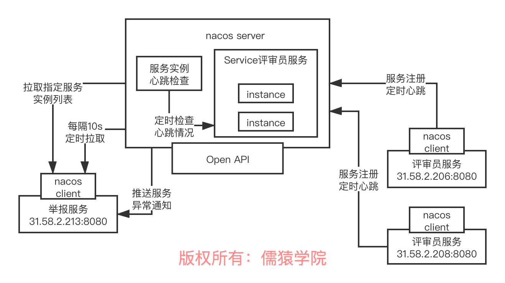
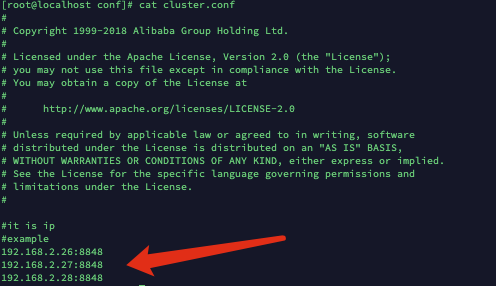
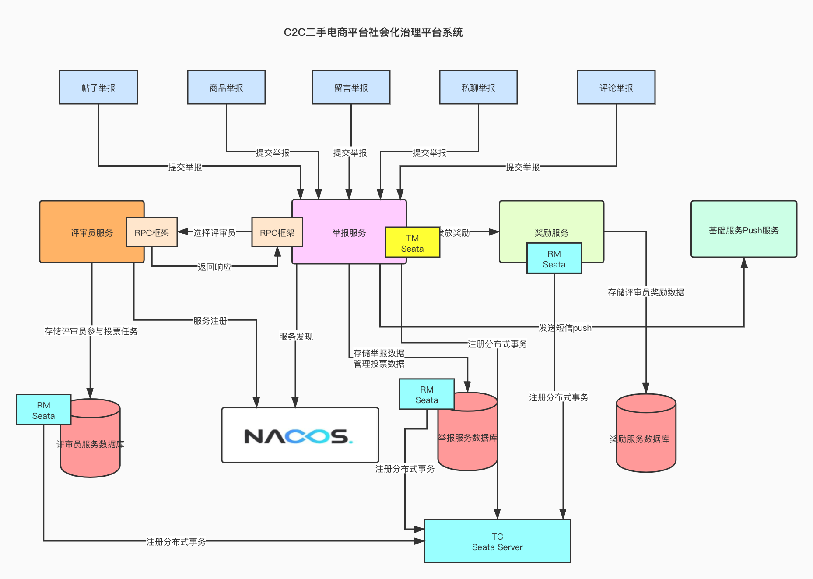

## Spring cloud


### 1.背景

技术栈对比

alibaba        netflix

注册中心：nacos -> eureka

RPC框架：dubbo -> feign+ribbon

分布式事务：seata -> 无

限流/熔断/降级：sentinel -> hystrix

API网关：无 -> zuul


携程开源的apollo（spring cloud config 配置中心）

大众点评开源的CAT（zipkin、slueth 链路监控）

加上其他国外的优秀开源项目，比如Prometheus（监控中心）

ELK(日志中心)

Spring Cloud Gateway(Nginx+lua、Kong、Zuul API网关)


中心公司开始进行分化，有部分公司还是spring cloud netflix为主的一套技术栈，有少部分公司开始尝试推行spring cloud alibaba技术栈+国内开源的组件（apollo、CAT）+ Prometheus + ELK + Spring Cloud Gateway（Nginx+lua、Kong、Zuul、API网关自研）


**注册中心 Zookeeper Eureka Consul nacos 选型对比**

Zookeeper (cp)   raft 算法  任何时候都保证数据一致性，但是牺牲了可用性，当leader节点宕机时，可能会停顿一段时间，重新选举leader。

Eureka  (ap)       任何一个节点都是平等的，需要做异步复制，但是有延迟，牺牲了数据一致性。

Consul               基于raft算法的cp模型

Nacos                基于raft算法的Cp模型，同时也支持配置成类似euraka的AP模型


建议使用Nacos 功能最完善，包括了雪崩保护，自动注销。


consistency  数据一致性 

availability   数据可用性   任何节点宕机，这个注册中心还是可以使用。


**nacos架构原理**



nacos本身的话，其实是完全可以脱离spring cloud自己独立运作的，但是他目前是集成到spring cloud alibaba里去的，也就是在spring cloud的标准之下实现了一些东西，spring cloud自己是有一个接口，叫做ServiceRegistry，也就是服务注册中心的概念

 

他是一个接口，nacos是实现了一个实现类的，也就是NacosServiceRegistry，实现了register、deregister、close、setStatus、getStatus之类的方法

 

自动装配是一个spring boot的一个概念，如果大家不理解的话，可以自行搜索一些资料去查阅，用最最简单的话来说，自动装配的意思，其实就是说系统启动的时候，自动装配机制会运行，实现一些系统的初始化、自动做一些事儿

 

比如说spring cloud alibaba，假设用dubbo开发服务，本质上是有一个自动装配类的，这个自动装配类会监听spring的ApplicationStartedEvent这个事件，其实简单理解就是服务启动的时候通过spring的一些动作，监听到某个事件就自动运行了

 

自动运行，就是去调用NacosServiceRegistry的register方法去进行服务注册

 

而且除了注册之外，还会通过schedule线程池去提交一个定时调度任务，源码如下：

 

this.exeutorService.schedule(new BeatReactor.BeatTask(beatInfo), beatInfo.getPeriod(), TimeUnit.MILLISECONDS)，这就是一个心跳机制，定时发送心跳给nacos server

 

接着会进行注册，注册的话是访问nacos server的open api，其实就是http接口，他有一个接口：http://31.208.59.24:8848/nacos/v1/ns/instance?serviceName=xx&ip=xx&port=xx，这么一个东西，也没什么特别的，这里就是访问注册接口罢了

 

nacos server那里是基于一个ConcurrentHashMap作为注册表来放服务信息的，直接会构造一个Service放到map里，然后对Service去addInstance添加一个实例，本质里面就是在维护信息，同时还会建立定时检查实例心跳的机制

 

最后还会基于一致性协议，比如说raft协议，去把注册同步给其他节点

 

服务发现的本质其实也是一个http接口，就是：http://31.208.59.24:8848/nacos/v1/ns/instance/list?serviceName=xx，就这么一个接口，其实也没特别的东西，然后就会启动定时任务，每隔10s拉取一次最新的实例列表，然后服务端还会监听他监听服务的状态，有异常就会基于UDP协议反向通知客户端这次服务异常变动


### 2.搭建环境

virtualbox 6.1.18 + centos7 镜像 

#### 2.1 注册镜像

点击虚拟光盘


2. 安装centos

   点击控制这里选择**新建** 或者直接快捷键 **command+n**


名称自己定义

类型选择 linux

版本选择 red hat 64位


后面的什么虚拟硬盘 、文件类型、 动态分配、文件位置大小全部选择默认。


双击运行。


点击start

按回车，开始安装!


选择安装语言，只要胆子大随便选。


点一下安装位置，然后点击左上角的 **(完成)done** 就行。


配一下网络。点击下面的两个叠起来的小电脑。


选择桥接模式。无线。


然后去测一下网络连接。点击网络。


点击完成，开始安装。 设完root密码的 完成(done)可能因为密码级别太低，需要点击两次完成(done)。


然后重启，主机和虚拟机互相ping一下测试网络是否连通。


#### 2.2 配置网络

```bash
vi /etc/sysconfig/network-scripts/ifcfg-enp0s3
```


```bash
#动态分配一个ip地址

ONBOOT=yes

service network restart
ip addr
```


```bash
#设置静态ip地址
BOOTPROTO=static
IPADDR=192.168.2.26
NETMASK=255.255.255.0 
GATEWAY=192.168.2.255


service network restart
```


配置DNS 

检查NetManager的状态：systemctl status NetworkManager.service

检查NetManager管理的网络接口：nmcli dev status 

检查NetManager管理的网络连接：nmcli connection show

设置dns：nmcli con mod enp0s3 ipv4.dns "114.114.114.114 8.8.8.8"

让dns配置生效：nmcli con up enp0s3


#### 2.3关闭防火墙

```bash
systemctl stop firewalld.service
systemctl disable firewalld.service
#查看防火墙情况
systemctl status firewalld 
```


#### 2.4 配置jdk

把mac的jdk复制到虚拟机中

```bash
chenqipeng@chenqipengdeMacBook-Pro centos7+jdk8 % scp jdk-8u131-linux-x64.rpm root@192.168.2.26:/usr/local

#安装jdk
rpm -ivh jdk-8u131-linux-x64.rpm  


#配置java环境
vi ~/.bashrc
```


任何保存退出

```bash
# 配置生效
~/.bashrc
java -version
```


#### 2.5互相配置ssh免密登录

配置3台CentOS为ssh免密码互相通信

 

首先在三台机器上分别各自执行下面的命令生成自己的文件：ssh-keygen -t rsa

 

生成本机的公钥，过程中不断敲回车即可，ssh-keygen命令默认会将公钥放在/root/.ssh目录下

 

在三台机器上分别各自进入目录，拷贝自己的公钥文件为authroized_keys文件，让三台机器先各自对自己免密码ssh可以登录

 

cd /root/.ssh

cp id_rsa.pub authorized_keys

将公钥复制为authorized_keys文件，此时使用ssh连接本机就不需要输入密码了

 

接着配置三台机器互相之间的ssh免密码登录，在每台机器上执行下面的命令

使用ssh-copy-id -i hostname命令将本机的公钥拷贝到指定机器的authorized_keys文件中


#### 2.6 配置 nacos

```bash
Last login: Mon Mar 29 15:39:00 2021 from hadoop01
[root@localhost ~]# cd /usr/local
[root@localhost local]# ls
jdk-8u131-linux-x64.rpm  nacos-server-1.4.0.tar.gz
[root@localhost local]# tar -zxvf nacos-server-1.4.0.tar.gz 
nacos/LICENSE
nacos/NOTICE
nacos/target/nacos-server.jar
nacos/conf/
nacos/conf/schema.sql
nacos/conf/nacos-mysql.sql
nacos/conf/application.properties.example
nacos/conf/nacos-logback.xml
nacos/conf/cluster.conf.example
nacos/conf/application.properties
nacos/bin/startup.sh
nacos/bin/startup.cmd
nacos/bin/shutdown.sh
nacos/bin/shutdown.cmd
[root@localhost local]# ls
jdk-8u131-linux-x64.rpm  nacos  nacos-server-1.4.0.tar.gz
[root@localhost local]# rm -rf nacos-server-1.4.0.tar.gz 
[root@localhost local]# cd nacos/conf
[root@localhost conf]# ls
application.properties          cluster.conf.example  nacos-mysql.sql
application.properties.example  nacos-logback.xml     schema.sql
[root@localhost conf]# mv cluster.conf.example cluster.conf
[root@localhost conf]# ls
application.properties  application.properties.example  cluster.conf  nacos-logback.xml  nacos-mysql.sql  schema.sql
[root@localhost conf]# vi cluster.conf 
[root@localhost conf]# 
```


配置 cluster.conf




单机启动 nacos

```bash
sh startup.sh -m standalone

# 查看启动日志
tail start.out
```


#### 2.7 启动nacos


```bash
Last login: Thu Apr  1 09:16:01 2021 from mac
[root@localhost ~]# ls
anaconda-ks.cfg
[root@localhost ~]# cd /usr/local
[root@localhost local]# ls
apache-maven-3.6.3-bin.tar.gz  jdk-8u131-linux-x64.rpm  maven  nacos
[root@localhost local]# cd nacos
[root@localhost nacos]# ls
bin  conf  data  LICENSE  logs  NOTICE  status  target
[root@localhost nacos]# cd bin
[root@localhost bin]# ls
derby.log           hs_err_pid3183.log  logs          shutdown.sh  startup.sh
hs_err_pid2625.log  hs_err_pid3226.log  shutdown.cmd  startup.cmd  work
[root@localhost bin]# ./startup.sh
/usr/java/latest/bin/java  -server -Xms2g -Xmx2g -Xmn1g -XX:MetaspaceSize=128m -XX:MaxMetaspaceSize=320m -XX:-OmitStackTraceInFastThrow -XX:+HeapDumpOnOutOfMemoryError -XX:HeapDumpPath=/usr/local/nacos/logs/java_heapdump.hprof -XX:-UseLargePages -Dnacos.member.list= -Djava.ext.dirs=/usr/java/latest/jre/lib/ext:/usr/java/latest/lib/ext -Xloggc:/usr/local/nacos/logs/nacos_gc.log -verbose:gc -XX:+PrintGCDetails -XX:+PrintGCDateStamps -XX:+PrintGCTimeStamps -XX:+UseGCLogFileRotation -XX:NumberOfGCLogFiles=10 -XX:GCLogFileSize=100M -Dloader.path=/usr/local/nacos/plugins/health,/usr/local/nacos/plugins/cmdb -Dnacos.home=/usr/local/nacos -jar /usr/local/nacos/target/nacos-server.jar  --spring.config.location=file:/usr/local/nacos/conf/,classpath:/,classpath:/config/,file:./,file:./config/ --logging.config=/usr/local/nacos/conf/nacos-logback.xml --server.max-http-header-size=524288
nacos is starting with cluster
nacos is starting，you can check the /usr/local/nacos/logs/start.out
[root@localhost bin]# cd ..
[root@localhost nacos]# cd logs
[root@localhost logs]# ls
alipay-jraft.log                config-trace.log                naming-performance.log.2021-03-30.0
alipay-jraft.log.2021-03-30.0   core-auth.log                   naming-performance.log.2021-03-31.0
alipay-jraft.log.2021-03-31.0   core-auth.log.2021-03-30.0      naming-push.log
cmdb-main.log                   istio-main.log                  naming-push.log.2021-03-30.0
config-client-request.log       nacos-address.log               naming-raft.log
config-dump.log                 nacos-cluster.log               naming-raft.log.2021-03-30.0
config-fatal.log                nacos-cluster.log.2021-03-30.0  naming-raft.log.2021-03-31.0
config-fatal.log.2021-03-30.0   nacos-cluster.log.2021-03-31.0  naming-rt.log
config-fatal.log.2021-03-31.0   nacos_gc.log.0.current          naming-server.log
config-memory.log               nacos.log                       naming-server.log.2021-03-30.0
config-memory.log.2021-03-30.0  nacos.log.2021-03-30.0          naming-server.log.2021-03-31.0
config-memory.log.2021-03-31.0  nacos.log.2021-03-31.0          protocol-distro.log
config-notify.log               nacos.log.2021-04-01.0          protocol-distro.log.2021-03-30.0
config-pull-check.log           naming-distro.log               protocol-distro.log.2021-03-31.0
config-pull.log                 naming-distro.log.2021-03-30.0  protocol-raft.log
config-server.log               naming-distro.log.2021-03-31.0  protocol-raft.log.2021-03-30.0
config-server.log.2021-03-30.0  naming-event.log                protocol-raft.log.2021-03-31.0
config-server.log.2021-03-31.0  naming-event.log.2021-03-30.0   start.out
config-server.log.2021-04-01.0  naming-performance.log
[root@localhost logs]# tail start.out
2021-04-06 09:37:30,478 INFO Nacos is starting...

2021-04-06 09:37:31,480 INFO Nacos is starting...

2021-04-06 09:37:32,484 INFO Nacos is starting...

2021-04-06 09:37:33,492 INFO Nacos is starting...

2021-04-06 09:37:34,496 INFO Nacos is starting...

[root@localhost logs]# tail start.out
2021-04-06 09:37:43,554 INFO Nacos is starting...

2021-04-06 09:37:43,829 INFO Nacos Log files: /usr/local/nacos/logs

2021-04-06 09:37:43,830 INFO Nacos Log files: /usr/local/nacos/conf

2021-04-06 09:37:43,830 INFO Nacos Log files: /usr/local/nacos/data

2021-04-06 09:37:43,830 INFO Nacos started successfully in cluster mode. use external storage
```


### 3.RPC框架技术对比


#### 3.1 netflix 技术栈

​	feign+ribbon，spring cloud netflix技术栈，RPC调用，用的就是feign框架+ribbon做负载均衡，暴露出来的服务接口，就是最最稀松平常的基于spring mvc写的controller暴露出来的一些http接口，定义一个http的url地址

​	通过feign框架进行RPC调用：String result = serviceA.hello(name)，会按照http协议来组装你的请求数据，数据格式都是按照http协议里的请求来做的，http请求还还必须做一个序列化，序列化成二进制的字节流，通过底层的tcp连接发送过去

​	本质上服务A的部署是基于tomcat去进行部署的，tomcat会监听你指定的端口号，当别人要发送http请求给你的时候，首先必须跟tomcat建立tcp网络连接，发送http请求给tomcat，tomcat收到之后，解析出来这个http请求，交给你的spring mvc写的controller来进行处理


#### 3.2 alibaba技术栈


​	dubbo自己使用的一套协议，自定义协议，也可以是别的协议，肯定不是http协议，去组装请求数据，然后做一个序列化，二进制字节数组或者是字节流，都可以，通过底层的网络连接把请求数据发送过去就可以了

​	ServiceA这个类，调用他里面的hello()这个方法，传入name这个参数，获取result这个返回值，然后通过网络连接把响应数据按照自己的协议封装，序列化，通过网络连接发送给服务B就可以了


服务一启动，dubbo开始干活。

* 扫描注解，看看你要发布哪些服务
* 对端口号（20880）进行监听
* 向nacos 服务注册中心注册服务

#### 3.3 grpc


能够跨语言


### 4.社会化治理平台架构




集成了mybatis和druid数据源，去基于mysql做一些增删改查，每个服务在执行业务逻辑的时候还是得对数据库做一下操作的，seata分布式事务的方案，每个服务都必须有一个自己本地的数据库的事务

 

社会化治理：social govern

举报：report

评审员：reviewer

奖励：reward

 

业务流程:

接收提交举报服务，举报数据存入数据库，调评审员服务，圈一批评审员过来进行评审，选好评审员后，评审员数据库存每个评审员当前进行的评审员任务，举报数据库存举报任务对应哪些评审员，存好之后发起push，进行数据统一(打印日志模拟)。然后进行投票，投票完毕，存入投票数据给数据库。进行给评审员的奖励服务。奖励服务数据录入数据库。


评审员: 超时检测 候补评审员