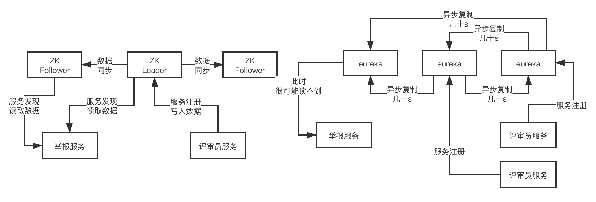

## 微服务架构


### 1.背景

技术栈对比

alibaba        netflix

注册中心：nacos -> eureka

RPC框架：dubbo -> feign+ribbon

分布式事务：seata -> 无

限流/熔断/降级：sentinel -> hystrix

API网关：无 -> zuul


携程开源的apollo（spring cloud config 配置中心）

大众点评开源的CAT（zipkin、slueth 链路监控）

加上其他国外的优秀开源项目，比如Prometheus（监控中心）

ELK(日志中心)

Spring Cloud Gateway(Nginx+lua、Kong、Zuul API网关)


中心公司开始进行分化，有部分公司还是spring cloud netflix为主的一套技术栈，有少部分公司开始尝试推行spring cloud alibaba技术栈+国内开源的组件（apollo、CAT）+ Prometheus + ELK + Spring Cloud Gateway（Nginx+lua、Kong、Zuul、API网关自研）


**注册中心 Zookeeper Eureka Consul nacos 选型对比**

Zookeeper (cp)   raft 算法  任何时候都保证数据一致性，但是牺牲了可用性，当leader节点宕机时，可能会停顿一段时间，重新选举leader。

Eureka  (ap)       任何一个节点都是平等的，需要做异步复制，但是有延迟，牺牲了数据一致性。

Consul               基于raft算法的cp模型

Nacos                基于raft算法的Cp模型，同时也支持配置成类似euraka的AP模型


建议使用Nacos 功能最完善，包括了雪崩保护，自动注销。


consistency  数据一致性 

availability   数据可用性   任何节点宕机，这个注册中心还是可以使用。




**nacos架构原理**


nacos本身的话，其实是完全可以脱离spring cloud自己独立运作的，但是他目前是集成到spring cloud alibaba里去的，也就是在spring cloud的标准之下实现了一些东西，spring cloud自己是有一个接口，叫做ServiceRegistry，也就是服务注册中心的概念

 

他是一个接口，nacos是实现了一个实现类的，也就是NacosServiceRegistry，实现了register、deregister、close、setStatus、getStatus之类的方法

 

自动装配是一个spring boot的一个概念，如果大家不理解的话，可以自行搜索一些资料去查阅，用最最简单的话来说，自动装配的意思，其实就是说系统启动的时候，自动装配机制会运行，实现一些系统的初始化、自动做一些事儿

 

比如说spring cloud alibaba，假设用dubbo开发服务，本质上是有一个自动装配类的，这个自动装配类会监听spring的ApplicationStartedEvent这个事件，其实简单理解就是服务启动的时候通过spring的一些动作，监听到某个事件就自动运行了

 

自动运行，就是去调用NacosServiceRegistry的register方法去进行服务注册

 

而且除了注册之外，还会通过schedule线程池去提交一个定时调度任务，源码如下：

 

this.exeutorService.schedule(new BeatReactor.BeatTask(beatInfo), beatInfo.getPeriod(), TimeUnit.MILLISECONDS)，这就是一个心跳机制，定时发送心跳给nacos server

 

接着会进行注册，注册的话是访问nacos server的open api，其实就是http接口，他有一个接口：http://31.208.59.24:8848/nacos/v1/ns/instance?serviceName=xx&ip=xx&port=xx，这么一个东西，也没什么特别的，这里就是访问注册接口罢了

 

nacos server那里是基于一个ConcurrentHashMap作为注册表来放服务信息的，直接会构造一个Service放到map里，然后对Service去addInstance添加一个实例，本质里面就是在维护信息，同时还会建立定时检查实例心跳的机制

 

最后还会基于一致性协议，比如说raft协议，去把注册同步给其他节点

 

服务发现的本质其实也是一个http接口，就是：http://31.208.59.24:8848/nacos/v1/ns/instance/list?serviceName=xx，就这么一个接口，其实也没特别的东西，然后就会启动定时任务，每隔10s拉取一次最新的实例列表，然后服务端还会监听他监听服务的状态，有异常就会基于UDP协议反向通知客户端这次服务异常变动


### 2.搭建环境

virtualbox 6.1.18 + centos7 镜像 

#### 2.1 注册镜像

点击虚拟光盘


2. 安装centos

   点击控制这里选择**新建** 或者直接快捷键 **command+n**


名称自己定义

类型选择 linux

版本选择 red hat 64位


后面的什么虚拟硬盘 、文件类型、 动态分配、文件位置大小全部选择默认。


双击运行。


点击start

按回车，开始安装!


选择安装语言，只要胆子大随便选。


点一下安装位置，然后点击左上角的 **(完成)done** 就行。


配一下网络。点击下面的两个叠起来的小电脑。


选择桥接模式。无线。


然后去测一下网络连接。点击网络。


点击完成，开始安装。 设完root密码的 完成(done)可能因为密码级别太低，需要点击两次完成(done)。


然后重启，主机和虚拟机互相ping一下测试网络是否连通。


#### 2.2 配置网络

```bash
vi /etc/sysconfig/network-scripts/ifcfg-enp0s3
```


```bash
#动态分配一个ip地址

ONBOOT=yes

service network restart
ip addr
```


```bash
#设置静态ip地址
BOOTPROTO=static
IPADDR=192.168.2.26
NETMASK=255.255.255.0 
GATEWAY=192.168.2.255


service network restart
```


配置DNS 

检查NetManager的状态：systemctl status NetworkManager.service

检查NetManager管理的网络接口：nmcli dev status 

检查NetManager管理的网络连接：nmcli connection show

设置dns：nmcli con mod enp0s3 ipv4.dns "114.114.114.114 8.8.8.8"

让dns配置生效：nmcli con up enp0s3


配置 hosts

```bash
vi /etc/hosts
```


#### 2.3关闭防火墙

```bash
systemctl stop firewalld.service
systemctl disable firewalld.service
#查看防火墙情况
systemctl status firewalld 
```


#### 2.4 配置jdk

把mac的jdk复制到虚拟机中

```bash
chenqipeng@chenqipengdeMacBook-Pro centos7+jdk8 % scp jdk-8u131-linux-x64.rpm root@192.168.2.26:/usr/local

#安装jdk
rpm -ivh jdk-8u131-linux-x64.rpm  


#配置java环境
vi ~/.bashrc
```


任何保存退出

```bash
# 配置生效
~/.bashrc
java -version
```


#### 2.5互相配置ssh免密登录

配置3台CentOS为ssh免密码互相通信

 

首先在三台机器上分别各自执行下面的命令生成自己的文件：ssh-keygen -t rsa

 

生成本机的公钥，过程中不断敲回车即可，ssh-keygen命令默认会将公钥放在/root/.ssh目录下

 

在三台机器上分别各自进入目录，拷贝自己的公钥文件为authroized_keys文件，让三台机器先各自对自己免密码ssh可以登录

 

cd /root/.ssh

cp id_rsa.pub authorized_keys

将公钥复制为authorized_keys文件，此时使用ssh连接本机就不需要输入密码了

 

接着配置三台机器互相之间的ssh免密码登录，在每台机器上执行下面的命令

使用ssh-copy-id -i hostname命令将本机的公钥拷贝到指定机器的authorized_keys文件中


#### 2.6 配置 nacos


重命名cluster.conf.example，去掉example，配置三台机器的地址和端口号，默认端口号是8848，使用默认的derby数据库就行了，但是生产环境下，可以部署一个MySQL数据库，执行nacos-mysql.sql初始化数据库里的表之类的东西，然后分别修改他们的application.properties文件，里面修改数据库配置

 

spring.datasource.platform=mysql

db.num=1

db.url.0=xxx

db.user=xx

db.password=xxx

 

分别进入三台机器的bin目录，执行startup.sh，检查logs目录下的start.out启动日志，如果启动成功就可以了，访问任何一个节点的8848端口的/nacos地址，进入nacos控制台，可以看到nacos集群的具体情况


```bash
Last login: Mon Mar 29 15:39:00 2021 from hadoop01
[root@localhost ~]# cd /usr/local
[root@localhost local]# ls
jdk-8u131-linux-x64.rpm  nacos-server-1.4.0.tar.gz
[root@localhost local]# tar -zxvf nacos-server-1.4.0.tar.gz 
nacos/LICENSE
nacos/NOTICE
nacos/target/nacos-server.jar
nacos/conf/
nacos/conf/schema.sql
nacos/conf/nacos-mysql.sql
nacos/conf/application.properties.example
nacos/conf/nacos-logback.xml
nacos/conf/cluster.conf.example
nacos/conf/application.properties
nacos/bin/startup.sh
nacos/bin/startup.cmd
nacos/bin/shutdown.sh
nacos/bin/shutdown.cmd
[root@localhost local]# ls
jdk-8u131-linux-x64.rpm  nacos  nacos-server-1.4.0.tar.gz
[root@localhost local]# rm -rf nacos-server-1.4.0.tar.gz 
[root@localhost local]# cd nacos/conf
[root@localhost conf]# ls
application.properties          cluster.conf.example  nacos-mysql.sql
application.properties.example  nacos-logback.xml     schema.sql
[root@localhost conf]# mv cluster.conf.example cluster.conf
[root@localhost conf]# ls
application.properties  application.properties.example  cluster.conf  nacos-logback.xml  nacos-mysql.sql  schema.sql
[root@localhost conf]# vi cluster.conf 
[root@localhost conf]# 
```


配置 cluster.conf


单机启动 nacos

```bash
sh startup.sh -m standalone

# 查看启动日志
tail start.out
```


#### 2.7 启动nacos


```bash
Last login: Thu Apr  1 09:16:01 2021 from mac
[root@localhost ~]# ls
anaconda-ks.cfg
[root@localhost ~]# cd /usr/local
[root@localhost local]# ls
apache-maven-3.6.3-bin.tar.gz  jdk-8u131-linux-x64.rpm  maven  nacos
[root@localhost local]# cd nacos
[root@localhost nacos]# ls
bin  conf  data  LICENSE  logs  NOTICE  status  target
[root@localhost nacos]# cd bin
[root@localhost bin]# ls
derby.log           hs_err_pid3183.log  logs          shutdown.sh  startup.sh
hs_err_pid2625.log  hs_err_pid3226.log  shutdown.cmd  startup.cmd  work
[root@localhost bin]# ./startup.sh
/usr/java/latest/bin/java  -server -Xms2g -Xmx2g -Xmn1g -XX:MetaspaceSize=128m -XX:MaxMetaspaceSize=320m -XX:-OmitStackTraceInFastThrow -XX:+HeapDumpOnOutOfMemoryError -XX:HeapDumpPath=/usr/local/nacos/logs/java_heapdump.hprof -XX:-UseLargePages -Dnacos.member.list= -Djava.ext.dirs=/usr/java/latest/jre/lib/ext:/usr/java/latest/lib/ext -Xloggc:/usr/local/nacos/logs/nacos_gc.log -verbose:gc -XX:+PrintGCDetails -XX:+PrintGCDateStamps -XX:+PrintGCTimeStamps -XX:+UseGCLogFileRotation -XX:NumberOfGCLogFiles=10 -XX:GCLogFileSize=100M -Dloader.path=/usr/local/nacos/plugins/health,/usr/local/nacos/plugins/cmdb -Dnacos.home=/usr/local/nacos -jar /usr/local/nacos/target/nacos-server.jar  --spring.config.location=file:/usr/local/nacos/conf/,classpath:/,classpath:/config/,file:./,file:./config/ --logging.config=/usr/local/nacos/conf/nacos-logback.xml --server.max-http-header-size=524288
nacos is starting with cluster
nacos is starting，you can check the /usr/local/nacos/logs/start.out
[root@localhost bin]# cd ..
[root@localhost nacos]# cd logs
[root@localhost logs]# ls
alipay-jraft.log                config-trace.log                naming-performance.log.2021-03-30.0
alipay-jraft.log.2021-03-30.0   core-auth.log                   naming-performance.log.2021-03-31.0
alipay-jraft.log.2021-03-31.0   core-auth.log.2021-03-30.0      naming-push.log
cmdb-main.log                   istio-main.log                  naming-push.log.2021-03-30.0
config-client-request.log       nacos-address.log               naming-raft.log
config-dump.log                 nacos-cluster.log               naming-raft.log.2021-03-30.0
config-fatal.log                nacos-cluster.log.2021-03-30.0  naming-raft.log.2021-03-31.0
config-fatal.log.2021-03-30.0   nacos-cluster.log.2021-03-31.0  naming-rt.log
config-fatal.log.2021-03-31.0   nacos_gc.log.0.current          naming-server.log
config-memory.log               nacos.log                       naming-server.log.2021-03-30.0
config-memory.log.2021-03-30.0  nacos.log.2021-03-30.0          naming-server.log.2021-03-31.0
config-memory.log.2021-03-31.0  nacos.log.2021-03-31.0          protocol-distro.log
config-notify.log               nacos.log.2021-04-01.0          protocol-distro.log.2021-03-30.0
config-pull-check.log           naming-distro.log               protocol-distro.log.2021-03-31.0
config-pull.log                 naming-distro.log.2021-03-30.0  protocol-raft.log
config-server.log               naming-distro.log.2021-03-31.0  protocol-raft.log.2021-03-30.0
config-server.log.2021-03-30.0  naming-event.log                protocol-raft.log.2021-03-31.0
config-server.log.2021-03-31.0  naming-event.log.2021-03-30.0   start.out
config-server.log.2021-04-01.0  naming-performance.log
[root@localhost logs]# tail start.out
2021-04-06 09:37:30,478 INFO Nacos is starting...

2021-04-06 09:37:31,480 INFO Nacos is starting...

2021-04-06 09:37:32,484 INFO Nacos is starting...

2021-04-06 09:37:33,492 INFO Nacos is starting...

2021-04-06 09:37:34,496 INFO Nacos is starting...

[root@localhost logs]# tail start.out
2021-04-06 09:37:43,554 INFO Nacos is starting...

2021-04-06 09:37:43,829 INFO Nacos Log files: /usr/local/nacos/logs

2021-04-06 09:37:43,830 INFO Nacos Log files: /usr/local/nacos/conf

2021-04-06 09:37:43,830 INFO Nacos Log files: /usr/local/nacos/data

2021-04-06 09:37:43,830 INFO Nacos started successfully in cluster mode. use external storage
```


### 3.RPC框架技术对比


#### 3.1 netflix 技术栈

​	feign+ribbon，spring cloud netflix技术栈，RPC调用，用的就是feign框架+ribbon做负载均衡，暴露出来的服务接口，就是最最稀松平常的基于spring mvc写的controller暴露出来的一些http接口，定义一个http的url地址

​	通过feign框架进行RPC调用：String result = serviceA.hello(name)，会按照http协议来组装你的请求数据，数据格式都是按照http协议里的请求来做的，http请求还还必须做一个序列化，序列化成二进制的字节流，通过底层的tcp连接发送过去

​	本质上服务A的部署是基于tomcat去进行部署的，tomcat会监听你指定的端口号，当别人要发送http请求给你的时候，首先必须跟tomcat建立tcp网络连接，发送http请求给tomcat，tomcat收到之后，解析出来这个http请求，交给你的spring mvc写的controller来进行处理


#### 3.2 alibaba技术栈


​	dubbo自己使用的一套协议，自定义协议，也可以是别的协议，肯定不是http协议，去组装请求数据，然后做一个序列化，二进制字节数组或者是字节流，都可以，通过底层的网络连接把请求数据发送过去就可以了

​	ServiceA这个类，调用他里面的hello()这个方法，传入name这个参数，获取result这个返回值，然后通过网络连接把响应数据按照自己的协议封装，序列化，通过网络连接发送给服务B就可以了


服务一启动，dubbo开始干活。

* 扫描注解，看看你要发布哪些服务
* 对端口号（20880）进行监听
* 向nacos 服务注册中心注册服务

#### 3.3 grpc


能够跨语言


### 4.社会化治理平台架构


集成了mybatis和druid数据源，去基于mysql做一些增删改查，每个服务在执行业务逻辑的时候还是得对数据库做一下操作的，seata分布式事务的方案，每个服务都必须有一个自己本地的数据库的事务

 

社会化治理：social govern

举报：report

评审员：reviewer

奖励：reward

 

业务流程:

接收提交举报服务，举报数据存入数据库，调评审员服务，圈一批评审员过来进行评审，选好评审员后，评审员数据库存每个评审员当前进行的评审员任务，举报数据库存举报任务对应哪些评审员，存好之后发起push，进行数据统一(打印日志模拟)。然后进行投票，投票完毕，存入投票数据给数据库。进行给评审员的奖励服务。奖励服务数据录入数据库。


评审员: 超时检测 候补评审员


### 5.全链路测试


nacos + dubbo整合，原理，以及案例代码的开发，大家都已经有了一定的了解了，手把手带着大家去做了，spring cloud alibaba去开发自己公司的项目的话，整合框架，背后的原理，设计、开发、测试、上线

 

#### 5.1系统设计（概要设计、详细设计 / 简化设计）

 

概要设计：业务架构、技术架构、业务流程、技术方案、部署方案，都需要做一个大致上的设计，架构师

 

详细设计：接口定义、数据库表结构、核心类建模、各个接口被请求时的系统运行时序图、技术方案细化

 

简化设计：画一些系统运行流程图、技术方案、接口、表、时序图

 

设计完毕之后，会有一个设计评审的过程，会找相关的其他同学过来评审，比如说给人家确认一下你设计的接口，是否满足你的调用方的需求

 

#### 5.2开发代码

 

每个人可能都是维护自己负责的子系统、服务，微服务框架，spring cloud alibaba里面的nacos + dubbo，用dubbo定义各种你需要对外提供的接口，按照你自己的设计文档以及技术方案去进行代码的开发

 

如果仅仅是一些crud的话，此时基于数据库就可以搞定了

 

但是如果说涉及到一些复杂的技术方案，使用中间件系统，es、redis、mongodb、hbase、rocketmq，等等

 

#### 5.3 本地自测

 

服务本地跑起来自己测试各个功能，直接通过dubbo服务调用，浏览器的http请求，直接请求你的接口，测试一下自己的各个功能，你自己一个人维护一个java web系统，不依赖别人的接口

 

也可能跑不起来，那就单元测试，单元测试其实是一个很专业的领域，跑本地单元测试的时候，需要把你的spring容器跑起来，然后对各种bean的注入可能需要打桩，接着再测试各个接口，这里不详细展开了

 

说句题外话，国内很规范做单元测试的公司也不多，大多公司的单元测试做的第一不规范，第二不完善，第三形同虚设，所以基本可以忽略，如果要把单测做好了，写单测的代码的时间跟你写系统代码的时间可能甚至是1:1，1:2

 

更多的还是写完代码，自己本地跑起来，想办法简单测试一下罢了

 

有的时候跑起来需要有一些其他人负责的服务的配合，这个时候有一些方案可以做到，比如说本地可以跑起来一个服务注册中心，然后其他人的服务你手头没有，那团队可以做一个统一的本地服务模拟工程，工程跑起来就自动往本地注册中心去注册，接口的返回结果都是mock的

 

然后你的服务跑起来，就可以跑通了，包括数据库，缓存，MQ这些东西，都可以在本地部署，有一个本地的maven profile，放这些配置

 

小项目，协作方不是太多

 

或者是在公司内网环境里，提供几台机器，作为dev环境，部署了数据库、缓存、MQ等中间件，服务可以部署，一台机器可以多部署几个服务，然后当你笔记本电脑在公司内网的时候，就可以访问到那几台机器，那么你本地启动，就可以直接访问到测试环境里的其他服务了

 

maven profile，spring boot profile，百度搜一下，非常的简单，都是很对不同的环境可以去放一套不同的配置资源文件

 

#### 5.4 持续集成：可选

 

很多同学可能都听说过持续集成，但是不太清楚到底是什么

 

有的公司会做持续集成，意思是你每天开发好的代码和功能，都必须有对应的单元测试可以进行自动化的测试，然后你本地单元测试跑通了，就可以提交代码到git仓库以及进行代码合并，直接触发jenkins这种集成工具，他会拉取你的最新代码，然后跑你所有的单元测试，确保你的代码在所有测试下可以正常运行

 

甚至可能是多个人维护一个系统，每个人每天/隔天，都要提交自己的代码+单测到git仓库进行代码合并，集成的概念，单人维护一个独立的工程/服务，每天不停的提交最新代码到你的git仓库里，你在不停的把自己最新写好的代码集成到已有的完整的代码里去

 

持续集成，提代码

 

多人维护一个系统，你本地写好的代码，本地跑单测是ok的，但是你提到git仓库合并进去，此时可能别人也会提代码合并进去，此时你们俩的代码集成在一起了，此时到底集成好的代码能不能正常工作呢？

 

jenkins持续集成的工具，如果发现你有提交代码以及合并的操作，此时jenkins会触发一个任务，拉取你的代码到本地，自动运行所有的单元测试，用你的单元测试自动运行和检查，来确保你现在最新的集成后的代码都是可以运行的

 

有的时候还会专门写特定的自动化集成测试代码，就是说你代码提交之后，然后可能会把你完整代码跑起来，此时所有代码是一个集成在一起的状态，接着就是运行集成测试的代码，把你集成在一起的代码都跑一下，检查是否正常

 

但是这个比较麻烦，搞持续集成，在工具上要求git、jenkins之类的整合，你要做很多配置，同时要求你每天的代码都有对应的自动化测试代码，所以真的把持续集成做好，做的很标准的公司，其实不多

 

#### 5.5 联调测试/功能测试

 

一个人维护一个java web系统，对其他人没有依赖，太low了

 

比较正常的，就是你写好了代码，自己简单自测完毕了，然后部署到一个联调测试/功能测试的环境里去，这个环境，是可能团队内部各个服务之间联调，或者甚至和其他团队的系统进行联调的地方

 

这个环境最好是独立的一套环境，部署好之后，QA会进行大量的手工测试，各种点击系统，也可能会有自动化测试，不过说实话，能玩儿自动化测试的公司不多，最后在这个环境，会有一个PM功能验收测试的过程

 

这个环境重在联调，把各个系统和服务跑通，确保功能运行没问题，一般机器都是低配置的，而且一个服务就一台机器，甚至是一台机器几个服务都有可能

 

#### 5.6 预发布测试

 

接着一般是预发布环境的测试，这个环境一般是模拟线上环境，可能会在这里做压力测试、全链路压测、性能测试、可用性测试、稳定性测试，都可能会在这里做，一般机器配置跟线上一样，每个服务都是独立机器，甚至每个服务给多台机器

 

比如说线上高峰QPS是1w+，线上机器是4核8G的，部署20台，那么预发布环境可能就是模拟每秒QPS是1000+，每个服务部署2台机器，做一个低压力测试，把全链路都压一下，测试性能，QPS，机器负载

 

有时候也可能会跑一些可用性测试，比如设计一些特殊故障之类的

 

在这个环境，通常流量是从线上获取回放过来的，有一个线上流量回放的过程，很多公司其实没这个环节，此时可能也就是走个过场，但是正经来说，是要做流量回放的，不是靠人力来测试，而是回放线上流量，看系统的功能是否正常，压力是否ok，性能是否还行，机器负载如何，全链路表现如何

 

有时候也会在这个环境让QA做一个全量功能回归测试，这可能是大版本变动的时候要做的

 

如果一切正常，那么就可以上线了


#### 5.7 线上部署

 

生产环境必须是一套独立的机器，直接进行部署即可，上线之后要通过各个机器的重要日志、请求是否正常、机器负载等是否正常、然后PM线上验收，一切正常，上线成功


##### 5.7.1.滚动发布

 

这是最常见的部署模式，一般就是说你一个服务/系统都会部署在多台机器上，部署的时候，要不然是手动依次部署，最low的比如就是每台服务器上放一个tomcat，每台机器依次停机tomcat，然后把新的代码放进去，再重新启动tomcat，各个机器逐渐重启，这就是最low的滚动发布

 

中小型公司现在稍微好点的话，都会做自动化部署，自动化部署用的比较多的是jenkins，因为jenkins是支持持续集成和持续交付的，之前说过持续集成，那么持续交付就是比持续集成更进一步，简单来说，就是你每天都提交代码，他每天都自动跑测试确保代码集成没问题，然后可能每隔几天，就把一个生产可用的小版本交付到线上

 

这个时候，就需要一个自动化部署，jenkins可以自动在多台机器上部署你的服务/系统，过程其实也是类似的，只不过把手动改成自动罢了，你自己部署tomcat/基于spring boot内嵌容器，其实都行

 

中大型公司，一般发布系统都是自己研发的，你在上面指定对一个服务，指定一个git仓库的代码分支，然后指定一个环境，指定一批机器，发布系统自动到git仓库拉取代码到本地，编译打包，然后在你指定环境的机器上，依次停止当前运行的进程，然后依次重启你新代码的服务进程

 

这都是典型的滚动发布

 

但凡发布，都要考虑两个问题，一个是验证，一个是回滚

 

验证就是说，你怎么确定你这次部署成功了？一般来说，要观察每台机器启动后处理请求时的日志，日志是否正常，是否有报错，一般日志正常、没有报错，那么就算是启动成功了，有时候也会让QA/PM做一个线上验证

 

那么万一发布失败了呢？此时就得回滚，因为不同的上线是不一样的，有时候你仅仅是对代码做一些微调，大多数时候是针对新需求有上线，加了新的代码/接口，有时候是架构重构，实现机制和技术架构都变了

 

所以回滚的话，也不太一样，比如你如果是加了一些新的接口，结果上线失败了，此时心接口没人访问，直接代码回滚到旧版本重新部署就行了；如果你是做技术架构升级，此时失败了，可能很多请求已经处理失败，数据丢失，严重的时候会导致公司丢失订单，或者是数据写入了但是都错了

 

此时可能会采用回滚代码，或者清洗错乱数据的方式来回滚，总之，针对你的发布，你要考虑到失败之后的回滚方案，回滚代码，就得用旧版本的代码，然后重新在各个机器依次部署，就算是一次回滚了，至于丢失了数据没有，要不要清洗数据，这个看情况来定

 

滚动发布的话，风险还是比较大的，因为一旦你用了自动化的滚动发布，那么发布系统会自动把你的所有机器都部署新版本的代码，这个时候中间很有可能会出现问题，导致大规模的异常和损失

 

所以现在一般中大型公司，都不会贸然用滚动发布模式了

 

 

##### 5.7.2 灰度发布(小版本)

 

灰度发布，指的就是说，不要上线就滚动全部发布到所有机器，一般就是会部署在比如1台机器上，采用新版本，然后切比如10%的流量过去，观察那10%的流量在1台机器上运行一段时间，比如运行个几天时间，观察日志、异常、数据，是否一切正常，如果验证发现全部正常，那么此时就可以全量发布了

 

全量发布的时候，就是采用滚动发布那种模式

 

这个好处就是说，你先用10%以内的小流量放到灰度新版本的那台机器上验证一段时间，感觉没问题了，才会全量部署，这么操作，即使有问题，也就10%以内的请求出现问题，损失不会太大的，如果你公司体量特别大，灰度也可以是1%，甚至0.1%的流量

 

因为体量太大的公司，1%的流量就很大了

 

如果灰度的时候有问题，那么立刻把10%以内的小流量切去请求老版本代码部署的机器，灰度版本的机器立马就没流量请求了，这个回滚速度是极快的

 

通常灰度验证过后，全量发布，都不会有太大的问题，基本上再出问题概率就很小了，所以现在中大型互联网公司，一般都是灰度发布模式的

 

##### 5.7.3 蓝绿部署（大版本）

 


蓝绿部署的意思是说，你得同时准备两个集群，一个集群放新版本代码，一个集群放老版本代码，然后新版本代码的集群准备好了过后，直接线上流量切到新版本集群上去，跑一段时间来验证，如果发现有问题，回滚就是立马把流量切回老版本集群，回滚是很快速的

 

如果新版本集群运行一段时间感觉没问题了，此时就可以把老版本集群给下线了

 

那么为什么有灰度发布了还要用蓝绿部署呢？

 

是这样的，灰度发布过后，还是要全量部署的，但是有时候，如果涉及到一些新的架构方案，或者是新的接口，10%以内的小流量可能没办法暴露出线上的**高并发问题**，所以灰度验证没问题，结果全量部署还是有一个小概率会失败。

 

此时全量发布用滚动发布的方式，逐步部署过去，很快会引发大规模的失败，此时回滚，是很慢的，因为要一台一台逐步回滚

 

所以说，一般针对那种改动不太大的小版本，比如加个接口，修改一些代码，修复几个bug，类似这种整体变动不大的情况，建议用灰度发布，因为这种一般灰度验证没问题，全量部署也不会有问题

 

但是如果涉及到那种很大规模的架构重构或者架构升级，比如数据存储架构升级，或者是技术架构整体改造，或者是代码大规模重构，类似这种场景，最好是用蓝绿部署，也就是说，完全部署一个新的集群，然后把较大的流量切过去，比如先切10%，再切50%，最后切到100%，让新集群承载100%的流量跑一段时间

 

过程中一旦有问题，立马流量全部切回老集群，这个回滚速度就比灰度发布的全量部署回滚要快多了，因为仅仅是切流量而已，不需要重新部署。


##### 5.7.4 nacos如何实现灰度、蓝绿部署？


> ​	非常遗憾的告诉大家，现在并没有一个开源项目能够完美的支持灰度发布和蓝绿部署，因为这并不是一个nacos就可以做到的，大家都知道，nacos支持namespace等高级特性，还可以带服务元数据，所以如果要基于nacos来搞灰度发布和蓝绿部署是可以的
>
>  
>
> ​	比如说，你灰度的时候，负责灰度的版本上线，就注册到一个prod-grey namespace下去，或者是你得带上一些服务标签，类似元数据的概念，然后你的网关流量入口，就得能够识别出灰度机器，按照你的配置分发流量.然后你的类似dubbo的RPC框架的负载均衡模块，也得识别出灰度机器，按照配置分发流量过去
>
>  
>
> ​	就是这个事儿要做成，必须是**nacos + dubbo + 网关**，都得做很多定制和改造，才能搞定的，其实做是可以做的，因为网关的灰度，很多开源网关都支持，dubbo的负载均衡机制也是可以扩展自定义的


对大多数中小公司而言，可能用jenkins之类的工具做一个自动化的滚动部署就差不多了，此时教大家一些经验，就是说，灰度发布，其实我们可以玩儿成伪灰度发布，什么意思呢？比如你一个服务部署了3台机器

 

那么当你有一个新版本的时候，你先部署1台机器，这不就变相的相当于是灰度了？默认会有30%+的流量进入这台机器，你先观察一下这30%的流量表现如何，如果感觉不错，再把另外2台机器部署了

 

2台机器，你有新版本，先部署1台机器，50%流量过来，先观察一下再说

 

说白了，就是人为的去控制这个部署的节奏和过程，流量分发这块不要动，还是均匀分发，搞出一个伪灰度的效果

 

蓝绿部署也是同样的，一般注册中心都是支持主动调用它的API进行服务下线的，此时你可以让你每个服务都实现一个下线的接口，里面调用eureka/nacos之类的API可以主动下线你的服务实例

 

此时你可以部署一个新版本的集群，部署好之后，他们都会注册过去，然后你依次手动调用老版本集群各个服务实例的下线接口，一般请求nacos/eureka的http接口，就可以把服务下线了，此时一旦老版本服务实例下线，那么流量就会全部给新版本的集群了

 

但是你老版本集群别停机，他仅仅是服务下线了而已，没请求了

 

如果一旦发现新版本集群有问题，再调用你的服务的注册接口，直接让各个服务主动发送http之类的请求到服务注册中心，把自己这个服务实例注册上去，把新版本集群全部手动下线一下

 

这么搞也是可以的，就是有开发成本

 

还有一种，就是说你新版本的集群直接部署，然后从存储到缓存到所有中间件，到数据库，到机器，全部是独立的一套，全新，全独立，如果需要以前的数据，可以半夜凌晨做一个停机维护，比如凌晨1点到5点，停机4个小时，把老系统所有数据都复制一份到新版本系统的数据存储里去

 

然后5点过后，简单控制一下流量分发入口，让每一个请求到老版本集群一份，也到新版本集群一份，这个其实好做，网关那块可以控制一下，然后新老集群一起跑，观察新集群是否稳定，如果稳定，再把老集群下线了，全部采用新系统对外提供服务


### 6.分布式事务


#### 6.1 事务 acid 原则

* Atomic ：原子性，一堆sql，要么一起成功，要么一起失败。
* Consistency : 一致性，一组sql执行前和执行后，数据必须是正确的。中间状态不可见。
* Isolation: 隔离性 ，事务之间不能互相影响。
* Duravility：持久性，事务成功后，对数据的修改是有效的。


#### 6.2 事务隔离级别

并发下事务会产生一些问题:

* 1. 读未提交 (Read Uncommitted) **脏读**。某个事务还没提交的时候，正在修改的数据就让别的事务读到了。很容易导致出错。


* 2. 读已提交  (Read Committed) 不可重复读。

  

  


* 3. 可重复读 （read Repeatable）事务A在执行过程中，对某个数据的值，无论读多少次都是1，事务B修改这个值为2，事务A执行过程中这个值读到还是1。

     

     


* 幻读  (串行化) 

  前面都是基于事务修改数据，幻读是针对事务插入数据。要解决幻读，可以使用串行化方式。

  


**串行化**


> ​	MySQL的默认隔离级别是Read Repeatable，就是可重复读，就是说每个事务都会开启一个自己要操作的某个数据的快照，事务期间，读到的都是这个数据的快照罢了，对一个数据的多次读都是一样的。
>
> ​	但是另外几个隔离级别都是提供的。


#### 6.3  MVCC (多版本并发控制)

​	我们聊下MySQL是如何实现可重复读 Read Repeatable的吧，因为一般我们都不修改这个隔离级别，但是你得清楚是怎么回事儿，MySQL是通过MVCC机制来实现的，就是多版本并发控制，multi-version concurrency control。

​	innodb存储引擎，会在每行数据的最后加两个隐藏列，一个保存行的创建时间，一个保存行的删除时间，但是这儿存放的不是时间，而是事务id，事务id是mysql自己维护的自增的，全局唯一。


| id   | name   | 创建事务id | 删除事务id |
| ---- | ------ | ---------- | ---------- |
| 1    | 张三   | 120        | 122        |
| 2    | 李四   | 119        | 空         |
| 2    | 小李四 | 122        | 空         |

* 事务id=121的事务，查询id=1的这一行的时候，一定会找到创建事务id <= 当前事务id的那一行，select * from table where id=1，就可以查到上面那一行
* 事务id=122的事务，将id=1的这一行给删除了，此时就会将id=1的行的删除事务id设置成122
*  事务id=121的事务，再次查询id=1的那一行，能查到吗？

​	能查到，要求创建事务id <= 当前事务id < 删除事务id

* 事务id=121的事务，查询id=2的那一行，查到 name=李四

* 事务id=122的事务，将id=2的那一行的name修改成 name=小李四
* 事务id=121的事务，查询id=2的那一行，答案是：李四，创建事务id <= 当前事务id < 删除事务id
* 事务id=123的事务，查询id=2的那一行，答案是：小李四


​	在一个事务内查询的时候，mysql只会查询创建时间的事务id小于等于当前事务id的行，这样可以确保这个行是在当前事务中创建，或者是之前创建的；同时一个行的删除时间的事务id要么没有定义（就是没删除），要么是必当前事务id大（在事务开启之后才被删除）；满足这两个条件的数据都会被查出来。 

 

​	那么如果某个事务执行期间，别的事务更新了一条数据呢？这个很关键的一个实现，其实就是在innodb中，是插入了一行记录，然后将新插入的记录的创建时间设置为新的事务的id，同时将这条记录之前的那个版本的删除时间设置为新的事务的id。

 

​	现在get到这个点了吧？这样的话，你的这个事务其实对某行记录的查询，始终都是查找的之前的那个快照，因为之前的那个快照的创建时间小于等于自己事务id，然后删除时间的事务id比自己事务id大，所以这个事务运行期间，会一直读取到这条数据的同一个版本。

 

> 记住，聊到事务隔离级别，必须把这套东西给喷出来，尤其是mvcc，说实话，市面上相当大比重的java程序员，对mvcc是不了解的，这个东西很简单，结构大家居然不知道，真是相当大的差异！


#### 6.4 spring 事务支持

> **面试题:**
>
> ​	 spring的事务支持（注解事务、声明事务、编程事务、事务的传播机制）？
>
> ​	执行某个操作，前50次成功，第51次失败。a 全部回滚；b 前50次提交，第51次抛异常。ab场景分别如何设置spring事务。

​	spring支持编程式事务，和声明式事务。编程式事务就是用个事务类。                 	TransactionTemplate来管理事务，这个一般现在没人傻到干这个事儿了；声明式事务分成在xml里配置个AOP来声明个切面加事务，一般现在也没人傻到干这个了；大部分情况下，都是用@Transactional注解。这个注解一般要加 **rollbackFor**，就是指定哪些异常类型才要回滚事务。isolation属性，你可以自己手动调整事务的隔离级别，但是这个一般不调整，记住，别乱调整事务隔离级别，一般可重复读+mysql mvcc机制跑的很好。

​	另外一个重要的事务属性，就是 **propagation**，事务的传播行为。一个加了@Transactional的事务，调用了另一个加了@Transactional的事务的时候，怎么处理。


**举例代码：**

```java
public class ServiceA {

@Autowired
private ServiceB b;

@Transactional
public void methodA() {
// 一坨数据库操作
for(int i = 0; i < 51; i++) {
	try {
	b.methodB();
			} catch(Exception e) {
        // 打印异常日志
                           }
   }
			// 一坨数据库操作
}

}

public class ServiceB {

@Transactional(propagation = ******)
	public void methodB() throws Exception {
        // 一坨数据库操作
                        }

            }

```


**七种事务传播行为** 

  默认在 ServiceB的 methodB中的 @Transactional 添加 propagation 属性。


1. **PROPAGATION_REQUIRED**（合体）  

   ​	ServiceB 的 @Transactional 的传播行为是required的话，methodB 将不会开启独立事务，而是成为methodA事务的一部分。methodA或者methodB 任何一个报错会导致整个事务的回滚。这是spring 默认的行为。  

   

2. **PROPAGATION_SUPPORTS** （判断合体） 

   ​	如果methodA开启了事务，那么methodB 就加入 methodA 事务的一部分。如果 methodA没有开启事务，那么methodB 也不开启事务

   

3. **PROPAGATION_MANDATORY** (同调)  

   ​	必须有一个开启了事务的方法调用自己，不然报错。

   

4. **PROPAGATION_REQUIRES_NEW** （分身）

   ​	methodB 把自己的操作开启新的事务，然后 methodA 的事务卡住，methodA 不受 methodB 影响，如果 methodB 报错了，methodA 进行捕获异常，自己决定**回滚**或是**提交**。

   

5. **PROPAGATION_NOT_SUPPORTED** （明确非事务执行） 

   ​	methodB 不支持事务，methodA 卡住，methodB 非事务方式执行完后，再执行 methodA。确保methodB的代码不会引起回滚。

   

6. **PROPAGATION_NEVER** (拒绝事务)  

   ​	methodB不能被事务调用。不然报错。

   

7. **PROPAGATION_NESTED**  开启嵌套事务，ServiceB开启一个子事务，如果回滚的话，那么ServiceB就回滚到开启子事务的这个save point。


#### 6.5 分布式事务解决方案

1. XA
2. TCC
3. 可靠消息最终一致性方案
4. 最大努力通知方案
5. 适合长事务（分布式）的sagas方案


单个系统的事务处理


方案一：两阶段提交方案/XA方案   


​	两阶段提交，有一个事务管理器的概念，负责协调多个数据库（资源管理器）的事务，事务管理器先问问各个数据库你准备好了吗？如果每个数据库都回复ok，那么就正式提交事务，在各个数据库上执行操作；如果任何一个数据库回答不ok，那么就回滚事务。

​	这种分布式事务方案，比较适合单块应用里，跨多个库的分布式事务，而且因为严重依赖于数据库层面来搞定复杂的事务，效率很低，绝对不适合高并发的场景。如果要玩儿，那么基于spring + JTA就可以搞定，自己随便搜个demo看看就知道了。

**缺点：** 一般来说某个系统内部如果出现跨多个库的这么一个操作，是不合规的。要求说每个服务只能操作自己对应的一个数据库。**基本不用**。


方案二：TCC方案  （Try Confirm Cancel）


1. Try阶段：这个阶段说的是对各个服务的资源做**检测**以及对资源进行**锁定**或者预留。
2. Confirm阶段：这个阶段说的是在各个服务中执行实际的**操作**。
3. Cancel阶段：如果任何一个服务的业务方法执行出错，那么这里就需要进行**补偿**，就是执行已经执行成功的业务逻辑的**回滚**操作。


举例子：

（1）Try阶段：先把两个银行账户中的资金给它冻结住就不让操作了

（2）Confirm阶段：执行实际的转账操作，A银行账户的资金扣减，B银行账户的资金增加

（3）Cancel阶段：如果任何一个银行的操作执行失败，那么就需要回滚进行补偿，就是比如A银行账户如果已经扣减了，但是B银行账户资金增加失败了，那么就得把A银行账户资金给加回去


**缺点：**严重依赖于你自己写代码来回滚和补偿了，会造成补偿代码巨大。**很少用**。

**适合场景:** 除非你是真的一致性要求太高，是你系统中核心之核心的场景，比如常见的就是资金类的场景，那你可以用TCC方案了，自己编写大量的业务逻辑，自己判断一个事务中的各个环节是否ok，不ok就执行补偿/回滚代码。


**通用性TCC技术方案**


（1）主业务服务会先在本地开启一个本地事务（这个本地事务说白了，就是你的主业务服务是不是也可能会干点儿什么事儿）

（2）主业务服务向业务活动管理器申请启动一个分布式事务活动，主业务服务向业务活动管理器注册各个从业务活动

（3）接着主业务服务负责调用各个从业务服务的try接口

（4）如果所有从业务服务的try接口都调用成功的话，那么主业务服务就提交本地事务，然后通知业务活动管理器调用各个从业务服务的confirm接口

（5）如果有某个服务的try接口调用失败的话，那么主业务服务回滚本地事务，然后通知业务活动管理器调用各个从业务服务的cancel接口

（6）如果主业务服务触发了confirm操作，但是如果confirm过程中有失败，那么也会让业务活动管理器通知各个从业务服务cancel

（7）最后分布式事务结束


方案三：本地消息表

国外的ebay搞出来的这么一套思想。


1. A系统在自己本地一个事务里操作同时，插入一条数据到消息表
2. 接着A系统将这个消息发送到MQ中去
3. B系统接收到消息之后，在一个事务里，往自己本地消息表里插入一条数据，同时执行其他的业务操作，如果这个消息已经被处理过了，那么此时这个事务会回滚，这样保证不会重复处理消息
4. B系统执行成功之后，就会更新自己本地消息表的状态以及A系统消息表的状态
5. 如果B系统处理失败了，那么就不会更新消息表状态，那么此时A系统会定时扫描自己的消息表，如果有没处理的消息，会再次发送到MQ中去，让B再次处理
6. 这个方案保证了最终一致性，哪怕B事务失败了，但是A会不断重发消息，直到B那边成功为止


**缺点**: 严重依赖于数据库的消息表来管理事务。这个会导致如果是高并发场景咋办呢？咋扩展呢？所以一般确实很少用

 

方案四：可靠消息最终一致性方案

不要用本地的消息表了，直接基于MQ来实现事务。比如阿里的RocketMQ就支持消息事务。


1. A系统先发送一个prepared消息到mq，如果这个prepared消息发送失败那么就直接取消操作别执行了。
2. 如果这个消息发送成功过了，那么接着执行本地事务，如果成功就告诉mq发送确认消息，如果失败就告诉mq回滚消息。
3. 如果发送了确认消息，那么此时B系统会接收到确认消息，然后执行本地的事务
4. mq会自动定时轮询所有prepared消息回调你的接口，问你，这个消息是不是本地事务处理失败了，所有没发送确认消息？那是继续重试还是回滚？一般来说这里你就可以查下数据库看之前本地事务是否执行，如果回滚了，那么这里也回滚吧。这个就是避免可能本地事务执行成功了，别确认消息发送失败了。
5. 这个方案里，要是系统B的事务失败了咋办？重试咯，自动不断重试直到成功，如果实在是不行，要么就是针对重要的资金类业务进行回滚，比如B系统本地回滚后，想办法通知系统A也回滚；或者是发送报警由人工来手工回滚和补偿


这个还是比较合适的，目前国内互联网公司大都是这么玩儿的，要不你举用RocketMQ支持的，要不你就自己基于类似ActiveMQ？RabbitMQ？自己封装一套类似的逻辑出来，**总之思路就是这样子的**


#### **6.6 分布式系统设计理论**


1. CAP

* 一致性 (Consistency)
  * 强一致性   修改一个数据，整个分布式系统对这个数据都必须一样。
  * 弱一致性   不能保证各个节点都一致
  * 最终一致性  过一段时间后可用保证各个节点数据一致

​        

* 可用性 (Availability) 

  ​	 分布式系统必须一直可用。

  

* 分区容忍性 ( Partition Tolerence) 

  ​	 可以容忍网络分区的故障，分布式系统各个节点无法进行通信，但是还是完成自己的工作。该干嘛干嘛。当然此时数据无法同步。


分布式系统中 CAP不可能全都保证。要么是 CP( 一致性 + 分区容忍) 或是 AP （可用性 + 分区容忍）

基于这套理论，redis、mongodb、hbase什么什么的分布式系统，都是参照着CAP理论来设计的，有些系统是CP，有些系统是AP。

 

> 为什么只能是 cp 或者是 ap ?

 		假设，出现了网络分区的故障，但是因为有P，所以分布式系统继续运转，但是此时分布式系统的节点之间无法进行通信，也就无法同步数据了。

​	假设此时要查询数据，此时系统实际上是处于一个不一致的状态，因为各个节点之间的数据是不一样的。要是要保证CP的话，就得返回一个特殊的结果（异常）给客户端。但是此时的话，就牺牲掉了A，可用性，因为此时不让你看到不一致的数据，所以你发送请求过来是返回异常的，请求失败了，此时分布式系统就暂时处于不可用的状态下，也就是保证了CP，就没有了A。


​		经典的就是一些分布式存储，比如说zookeeper、mongodb、hbase等等，跟他们都是CP的，也就是说数据100%一致，但是有可能有些时候你请求是失败的，不让你请求到不一致的数据，这就是CP

​		12306、电商系统，这种业务类系统，一般都是AP。很多人同时在订票，每次订票之后这个车票的库存就会扣减，但是车票库存扣减之后，可能不能及时的被你的12306网站展示出来，可能你查询的车票的库存，是从另外一个库里去查的，最新的库存数据还没同步过来，此时数据是不一致的。可用性是保证的，时时刻刻都让你可以看到数据，可以买票，可以查询，但是呢可能你看到的车票还剩5张，但是你发起订票的时候，人家一检查最新的库存，判断已经是0张了，就不让你买了呗。


2. BASE

所谓的BASE，Basicly Available、Soft State、Eventual Consistency，也就是**基本可用**、**软状态**、**最终一致性**。

BASE希望的是，CAP里面基本都可以同时实现，但是不要求同时全部100%完美的实现，CAP三者同时基本实现，BASE，基本可用、最终一致性。

* **基本可用**  

  ​	为了保证基本可用，当发生网络故障时，**降级**。正常情况下，查询是负载均衡到各个节点的，也就是多节点抗高并发查询。但是为了保证此时基本可用，降级为强制查询主节点。
  
  如果流量太多，主节点扛不住，就需要**限流降级**。直接返回空，一会儿再查。
  
* **最终一致性** 

  ​	一旦故障解决了，同步数据。数据最终一定是可以处于一致的。

* **软状态**

  ​	可以存在中间的数据状态，就是比如多个节点在同步数据，在一段时间内，可能每个节点数据不一致，正在同步过程中，这个就是软状态。


> CAP 和 BASE 是俩基础理论。在设计分布式系统的话，可以用CAP中的CP或者AP，也可以采用BASE理论，有一些不一样，也有一些关系。


#### 6.7  Seata分布式事务实现思路

34课

**不跟钱相关的没必要使用分布式事务,一些权益相关的可以用一下可靠消息最终一致性（支付业务、金融、银行）**

核心组件

* TC 事务协调器  （Seata自己独立部署的server，用于全面管理每个分布式事务）
* TM 事务管理者   (对单个分布式事务进行管理和注册)
* RM 资源管理者   (对一个分布式事务内的每个服务本地分支事务进行管理)


原理: 

​	TM完全可以基于一个注解驱动，Spring AOP机制。拦截方法。@XXXXTransaction 加在服务Service组件上。对这个组件的方法调用做拦截。如果你发现这个方法加了你指定的分布式事务的注解。提取一下本次请求里带的一些请求头或者是请求附加的内置参数，有没有一个全局事务id，xid，这个带着 @XXXXShishanTransaction注解的方法，他其实是一个分布式事务的起始方法，TM这样的一个组件的业务逻辑就可以开始运作起来了。

​	引入依赖，还会在spring boot配置文件里配置一下分布式事务的一些配置，分布式事务server端的地址，暴露出来的都是RESTful API接口，基于HTTP请求就可以了。

​	TM如果要找TC注册一个全局事务，此时就可以通过HTTP通信组件，发送HTTP请求到指定地址的TC server的接口就可以了，TC server可以注册一个全局事务，生成一个唯一的txid，返回给你的TM。

**RM如何可以拦截你的本地数据库的操作呢？**

​	代理你的数据源，操作数据库，必须要有一个数据库连接，JDBC接口规范里就是一个Connection对象，数据库连接池，Druid、C3P0、DBCP，维护一个数据库连接池，一定会从数据库连接池里获取一个数据库连接依托这个数据库连接去对数据库执行增删改的操作

 	你可以针对你的数据库连接去做一个代理，也就是说，业务系统拿到的数据库连接是被你代理过的，他基于你的代理数据库连接执行增删改操作，代码会先执行到你手上，此时你就可以做一些操作了

​	增删改的语句，执行一些查询，DELETE语句，UPDATE，生成一个逆向的UPDATE语句，想要把一个字段改成1100，900，生成一个INSERT语句

​	在一个本地事务里，让他执行增删改，把你生成的undo log插入到数据库的undo_log表里去，发送HTTP请求到TC去注册一个分支事务，提交本地事务，把增删改操作和undo log插入都放一个本地事务里，他们会一起成功或者失败。


#### 6.8 部署seata


registry.conf是什么，就是seata server可以集成注册中心，可以让你seata server注册到比如nacos去，作为一个服务，然后你各个服务就不用手动配置seata server地址了，直接发现就可以了，不过不用这个手动配置其实也行。


把 seata放到 /usr/local/下 修改一下 vi seata-server.sh 把启动jvm参数根据需求调一下。


```bash
[root@hadoop01 bin]# jps
2406 Jps
2155 nacos-server.jar
[root@hadoop01 bin]# nohup sh seata-server.sh -p 8091 -h 192.168.1.128 -m file > /dev/null 2>&1 &
[1] 2417
[root@hadoop01 bin]# jps
2417 Server
2155 nacos-server.jar
2443 Jps

```


面试亮点可以加一下分布式事务


### 7.服务雪崩


雪崩、隔离、熔断、限流、降级


* 服务雪崩:  一个服务挂了之后，请求还在继续，导致请求阻塞，不断消耗线程资源，最后无法处理所有请求，导致大面积的服务无法工作。
* 隔离:  隔离出(比如20个) 线程专门服务某一个服务，如果这个服务(评审员)挂掉了，那么这20个线程就阻塞了。阻塞了之后就要熔断了。
* 熔断:  假设举报服务有200个线程，在短时间内这200个线程都不会去找这20个线程，直接认为评审员服务以及挂了。假设还有请求，但是熔断开关开启，直接给这个请求返回异常。
* 降级:  假设评审员服务已经挂了，已经触发熔断了，这时还有提交举报服务的请求，这时候把这个请求储存在本地磁盘中，返回提交举报成功，等评审员服务恢复后，再取出这些请求去找那20个请求执行。
* 限流:  假设举报服务一秒钟可以承受200个请求，但是底下的评审员服务最多承受100个请求，这时限流1秒内最多提交举报请求100个。


**技术选型对比**

Spring Cloud Netflix, Hystrix这个项目，功能层面很好用，但是源码特别烂，运用了奇怪的代码方式。


Spring Cloud Alibaba , Sentinel


#### **7.1 Sentinel** 


官方文档: https://github.com/alibaba/Sentinel/wiki


>Sentinel 和 Hystrix 原则是一样的，当检测到调用链路中某个资源出现不稳定的表现，例如请求响应时间长或者异常比例升高的时候，则对这个资源的调用进行限制，让请求快速失败，避免影响到请他的资源而导致级联故障。

熔断降级:

在限制的手段上， Sentinel 和 Hystrix 采取了完全不一样的方法。

Hystrix 通过线程池隔离对资源进行隔离。好处是资源和资源之间做到了最彻底的隔离。缺点是增加了线程切换的成本，(过多的线程池导致了线程数目过多)，还需要预先给各个资源做线程池大小的分配。


Sentinel  (1.8.0以前的熔断策略)

* 并发线程数进行限制

  Sentinel通过限制资源并发线程的数量，来减少不稳定资源对其他资源的影响。不但没有切换线程的消耗，也不需要预先分配线程池的大小。某个资源出现不稳定，会造成线程数的堆积，超过一定数量之后，对该资源的新请求就会拒绝。

* 通过响应时间对资源进行降级

  Sentinel通过响应时间来快速降级不稳定的资源。当依赖的资源出现响应时间过长。所有对该资源的访问都会拒绝，直到过了指定的时间窗口后才重新恢复。

  

**1.8.0 版本对熔断降级特性进行了全新的改进升级**

Sentinel 提供以下几种熔断策略 ：

- 慢调用比例 (`SLOW_REQUEST_RATIO`)：选择以慢调用比例作为阈值，需要设置允许的慢调用 RT（即最大的响应时间），请求的响应时间大于该值则统计为慢调用。当单位统计时长（`statIntervalMs`）内请求数目大于设置的最小请求数目，并且慢调用的比例大于阈值，则接下来的熔断时长内请求会自动被熔断。经过熔断时长后熔断器会进入探测恢复状态（HALF-OPEN 状态），若接下来的一个请求响应时间小于设置的慢调用 RT 则结束熔断，若大于设置的慢调用 RT 则会再次被熔断。
- 异常比例 (`ERROR_RATIO`)：当单位统计时长（`statIntervalMs`）内请求数目大于设置的最小请求数目，并且异常的比例大于阈值，则接下来的熔断时长内请求会自动被熔断。经过熔断时长后熔断器会进入探测恢复状态（HALF-OPEN 状态），若接下来的一个请求成功完成（没有错误）则结束熔断，否则会再次被熔断。异常比率的阈值范围是 `[0.0, 1.0]`，代表 0% - 100%。
- 异常数 (`ERROR_COUNT`)：当单位统计时长内的异常数目超过阈值之后会自动进行熔断。经过熔断时长后熔断器会进入探测恢复状态（HALF-OPEN 状态），若接下来的一个请求成功完成（没有错误）则结束熔断，否则会再次被熔断。


### 8.配置中心


spring cloud netflix 跟 spring cloud alibaba

 

服务注册中心，就很多种技术选型；分布式事务，也是很多种框架；sentinel和hystrix，能干的事情类似；配置中心领域，携程开源了一款apollo，spring cloud config，nacos本身是一个服务注册中心但是也带了配置中心的功能

apollo，架构是比较复杂，比较完善的，功能上也很完善，活跃，并不一定中小型公司去使用apollo，spring cloud alibaba，nacos，nacos作为一个服务注册中心本身就包含了配置中心的功能，没必要花很多时间再去部署一套apollo

spring cloud config，如果你用的不是spring cloud alibaba，用的是spring cloud netflix，那么你可以配合那个技术栈，直接用spring cloud提供的config项目作为配置中心就可以了，因为这是属于spring cloud原生技术栈里提供的

 

 

nacos完全可以满足很多中小型公司的配置中心的需求，哪怕是大公司也可以用的，apollo确实用的公司很多，中大型公司都会去用apollo，而且他的功能很完善的。


官网链接: https://github.com/ctripcorp/apollo


原理


* ConfigService 服务于客户端
* AdminService 对配置进行管理(crud)
* ConfigService 和 AdminService往Eureka进行注册
* MetaService 通过服务发现拿到部署的 机器ip 端口号 供客户端调用
* Portal提供界面对配置进行修改


### 9.监控中心


线上系统，可能产生的三个层面的问题：

 

1、 机器资源的层面：cpu、内存、网络、磁盘、io，出现了负载过高的问题

2、 JVM进程的层面：jvm内部各个区域的内存使用以及gc频率

3、 代码层面：代码逻辑的内部，抛异常，出现一些不希望发生的系统异常

但凡是线上的系统，配置中心、分布式事务、sentinel dashboard都可以不用，主要把服务注册中心和rpc框架搞好，一套服务之间RPC调用组成的一套系统能上线就可以了，可以跑起来了，但是监控中心是必须要有的


**Zabbix、Falcon、Prometheus的选型对比**

2015~2016年左右以及之前，国内比较多的用的是Zabbix这个国外开源的监控系统，直接部署做一些配置，就可以让他去监控你的各个服务器以及部署的服务实例了；Falcon，做的还是比较好的；2018~2019再往后推，基本上跟着微服务体系，一般监控中心国外和国内，最火的，用的比较多的就是Prometheus


#### 9.1 Prometheus 架构设计以及原理介绍


在你要监控的服务器上部署exporters，比如node_exporter就是基于linux内核写的，专门收集机器的cpu、内存、网络、io、磁盘的资源使用情况，然后prometheus server就可以从exporters拉取metrics过来存储和展示，以及进行报警

 

除此之外，对什么mysql，redis之类的中间件，都有对应的exporter，你自己也可以写exporter，按照他的标准写就行了

 

还有一种，就是有一个pushgateway，可以让你直接推送metrics给他，比如你系统的一些业务指标监控，就可以走这种方式

 

然后prometheus server可以把拉取到的metrics存储到本地磁盘去，基于TSDB进行时序数据的存储，也会自动的清理旧数据，保留最新数据，TSDB是时间序列数据库，尤为适合这种监控指标的存储，按时间来存储

 

定时查询配置好的报警规则，如果发现metric满足规则，就把alert发送到alertmanager去，此时会通过钉钉了、email了、短信之类的方式去对你进行告警

 

如果要能够可视化的查看metric监控报表，一般是基于Grafana可视化系统来进行的，Grafana天然支持对接prometheus，专门是做指标可视化的，很方便使用，需要独立进行部署，不然他自己也有Prometheus Web UI，可以基于他的PromQL查询语句去查询


#### 9.2 部署

具体部署不用演示了，因为比较简单，给一下步骤就行

 

上prometheus官网下载

 

prometheus-2.4.0.linux-amd64.tar.gz

```bash


tar -zxvf prometheus-2.4.0.linux-amd64.tar.gz -C /data

cd /data

chown -R root:root prometheus-2.4.0.linux-amd64

ln -sv prometheus-2.4.0.linux-amd64 prometheus     # 软链

 

cd /data/prometheus

./prometheus
```

 

 

直接访问本机的9090端口号，就能看到prometheus的web ui

 

接着就是对要监控的机器去部署node exporter，是基于go语言写的，可以拿到cpu、内存、磁盘空间、磁盘io、网络带宽、系统负载、主板温度等一系列的机器资源监控指标，这个是最基本要做的监控

 

在https://prometheus.io/download/里面找到node exporter的下载地址，下载一个最新的版本，接着进行解压缩，直接./node_exporter运行起来，就O了，默认的监听端口是9100，然后再把这个node exporter跟prometheus集成起来

 

编辑prometheus的配置文件，有一个prometheus.yml，里面需要加入job去跟node_exporter进行集成


```bash
scrape_configs:

\-    job_name: ‘prometheus’

static_configs:

-targets: [‘192.168.xx.xx:9090’]

 \- job_name: ‘xx_node_exporter’

   static_configs:

   -targets: [‘192.168.xx.xx:9100’]
```

 

重启prometheus server就可以了，直接进入web ui就可以在targets里找到你要监控的机器，然后里面各项资源监控报表都可以看到了


让spring boot业务系统接入prometheus也很简单，首先是加入一些依赖

 

就是io.prometheus.simpleclient相关的一些依赖，这个其实大家可以自行搜索，网上很多文章讲这个，我们就是说思路，然后在Application类上加入@EnablePrometheusEndpoint注解就可以了

 

此时你访问http://localhost:8080/prometheus，就可以看到jvm的监控指标了

 

如果还要接入自定义的指标，需要加入一个拦截器，然后代码里用prometheus client提供的Counter类去进行指标计数就可以了，除此之外，还有gauge、Histogram之类的指标收集API，都可以用来统计业务指标，然后就跟之前一样，接入prometheus即可

 

业务指标：需要采集三个，**异常指标，QPS，接口时延**，TP99，TP95，TP90

 **QPS（Query Per Second）：每秒请求数，就是说服务器在一秒的时间内处理了多少个请求。**

实现思路: Spring Aop 对某个方法切面


其实说实话，这些操作步骤，搜索就是很多，所以不带着大家做了，但是希望大家脑子里应该有这么个思路


### 10.日志中心


**为什么需要一个日志中心?**


线上运行的系统，跑着跑着，突然有用户找客服反馈你的系统有个什么什么bug！bug可能有对应的异常报错，也可能没有报错，就是纯粹的是你的代码级别的bug，客服会找你们技术这边

 

快速的定位bug发生的原因，定位 -> 修复

 

通过查阅日志，分析bug发生时，系统是如何运行的，是否运行中有问题导致bug

如果你单个服务/系统部署的机器数量都超过5台了，此时必须要上日志中心。


#### **ElasticSearch（日志中心）**


《互联网Java工程师面试突击第一季》，儒猿技术窝，免费，不要钱，ES的架构原理，我都讲过，大家直接去看一下，倒排索引，正排索引，shard数据分片，replica副本，写入原理，分布式搜索原理 

业务、项目、服务、时间戳（long）、不同的日志有自己的特殊的业务id（用户id、举报渠道）、日志内容（举报的具体内容数据，json字符串来存储）

日志中心没有开源的，可能有少数的不知名的，但是连我都没听说过 

一般都是公司自己基于ES来做研发的，ES+HBase，黄金组合，HBase适合的是海量数据进行存储，ES，内置生成ES的document id，id作为rowkey把日志内容放到HBase里去，程序员，可以根据业务、项目、服务、时间戳（long）、不同的日志有自己的特殊的业务id（用户id、举报渠道）来搜索日志。


如何打log

```java
    /**
     * @param reportTask 举报任务
     * @return
     */
    @GetMapping("/report")
    public String report(ReportTask reportTask) {
        List<Long> reviewerIds = null;
        System.out.println("进入report");
        // 本地数据库增加一个举报任务
        // 打印日志
        // LOGGER.info(BUSSINES_NAME,PROJECT_NAME,SERVICE_NAME,reportUserId,channelType,"接收到用户提交的举报任务:"+reportContent)
        reportTaskService.add(reportTask);
        // LOGGER.info(BUSSINES_NAME,PROJECT_NAME,SERVICE_NAME,reportUserId,channelType,"已经将用户的举报任务存储到本地数据库:"+reportContent)

        System.out.println("结束add");

        Entry entry = null;
        try {
            entry = SphU.entry("ReviewerServiceResource");
            /*
            您的逻辑
             */
            // 调用评审员服务,选择一批评审员
             reviewerIds = reviewerService.selectReviewers(reportTask.getId());
            // LOGGER.info(BUSSINES_NAME,PROJECT_NAME,SERVICE_NAME,reportUserId,channelType,"对举报任务:" + reportTask +",完成审核人员的分配:"+reviewerIds)
        }catch (BlockException e1){
            System.out.println("系统熔断或者限流，无法正常运行......");
            return "fail";
        }catch (Exception e){
            // LOGGER.error(BUSSINES_NAME,PROJECT_NAME,SERVICE_NAME,reportUserId,channelType,"对举报任务:" + reportTask +",分配评审员失败，远程评审员服务调用异常:"+ e1)
            System.out.println("系统出现异常，无法正常运行......");
            // 在这里做一个逆向补偿，如果一旦发生评审员分配失败，则把之前保存的局部任务给删除就可以了
            return "fail";
        }
        finally {
            if(entry != null){
                entry.exit();
            }
        }

        if(reviewerIds != null){
            // 在本地数据库初始化这批评审员对举报任务的投票状态
            reportTaskVoteService.initVotes(reviewerIds, reportTask.getId());
            // LOGGER.info(BUSSINES_NAME,PROJECT_NAME,SERVICE_NAME,reportUserId,channelType,"对举报任务:" + reportTask +",完成审核人员投票状态的初始化:"+reviewerIds)
        }

        //模拟发送 push 消息给评审员
        System.out.println("模拟发送 push 消息给评审员......");

        return "success";
    }

```


dao  service 层有异常就往外抛， controller层负责接收异常，controller控制业务的流转。


### 11.链路追踪

 

日志：异常日志、请求日志

 

链路

 

请求链路

请求1次数据库  耗时多少ms

请求1次缓存    耗时多少ms

请求2次评审员服务 耗时多少ms

请求1次奖励服务    异常    耗时1s


CAT 大众点评开源


### 12.网关


网关的核心功能

（1）动态路由：新开发某个服务，动态把请求路径和服务的映射关系热加载到网关里去；服务增减机器，网关自动热感知

（2）灰度发布

（3）授权认证

（4）性能监控：每个API接口的耗时、成功率、QPS

（5）系统日志

（6）数据缓存

（7）限流熔断


几种技术选型

Kong     Zuul    Nginx+Lua   自研网关

**Kong**: Nginx里面基于lua写的模块。实现网关的功能

**Zuul** :  Spring Cloud 来玩儿微服务的技术架构 

**Nginx+Lua（OpenResty）**：亿级流量系统架构的课程，详细讲解了 Nginx+Lua 的开发

**自研网关**：自己来写类似 Zuul 的网关，基于Servlet Netty 来做网关，实现上述功能。


大厂:BAT 京东 美团 都是基于netty等技术自研网关

中小型公司: Spring Cloud 技术栈主要是 Zuul ; Dubbo技术栈，有的采用Kong等网关 ，也可以直接不用网关，很多公司直接nginx直接反向代理+负载均衡；

Zuul: 基于java开发，核心网关功能都比较简单，但是比如灰度发布、限流、动态路由之类的都要自己二次开发。

​        高并发能力不强，部署到一些机器上去，还要基于tomcat来部署，springboot 用tomcat把网关系统跑起来；java语言开发，可以直接把控源码，可以做二次开发。


Nginx（Kong、Nginx+Lua） Nginx抗高并发的能力很强，少数几台机器部署一下，就可以很高的并发。但是精通Nginx的源码很难，c语言，很难从Nginx内核层面做一些二次开发和源码定制。


**Zuul 原理**


设计模式，其实在各种开源项目里，到处都是设计模式

 

**pre过滤器**

 

-3：ServletDetectionFilter

-2：Servlet30WrapperFilter

-1：FromBodyWrapperFilter

1：DebugFilter

5：PreDecorationFilter

 

**routing过滤器**

 

10：RibbonRoutingFilter

100：SimpleHostRoutingFilter

500：SendForwardFilter

 

post过滤器 

1000：SendResponseFilter 

**error过滤器** 

0：SendErrorFilter


zuul的源码，其实非常简单的，一点都不复杂，zuul的源码，有可能是spring cloud几个核心组件里面，最简单的，ribbon差不多一个级别的简单

