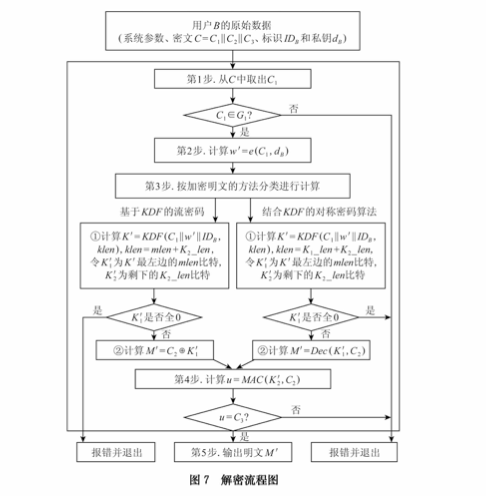

## ibe

### 对称加密算法

1. DES    (Data Encryption Standard，数据加密算法)

2. 3DES  (Triple Data Encryption Algorithm，三重数据加密算法)

3. AES    (Advanced Encryption Standard，高级加密标准，又称Rijndael加密法)

​        算法流程：
　　
　　发送者构建秘钥-->发送秘钥--> 接收者
　　
　　发送者明文-->AES算法+秘钥加密--> 密文--> 接收者
　　
　　接收者--> AES算法+秘钥解密--> 明文

4. PBE(Password-based encryption，基于口令加密)

​       一种基于口令的加密算法，其特点是使用口令代替了密钥，而口令由用户自己掌管，采用随机数杂凑多重加密等方法保证数据的安全性。PBE算法在加密过程中并不是直接使用口令来加密，而是加密的密钥由口令生成，这个功能由PBE算法中的KDF函数完成。KDF函数的实现过程为：将用户输入的口令首先通过“盐”（salt）的扰乱产生准密钥，再将准密钥经过散列函数多次迭代后生成最终加密密钥，密钥生成后，PBE算法再选用对称加密算法对数据进行加密，可以选择DES、3DES、RC5等对称加密算法。

> 　　结合了消息摘要算法和对称加密算法的优点，本质上是对MD5/SHA以及DES/3DES/AES算法的包装，不是新的算法，不过也是最为牛逼的一种方式。
> 　　
> 　　盐：指加密的随机字符串或者口令等，也可以认为是一些扰码，防止密码的暴力破解
>
> ​      口令:  当前，无论是计算机用户，还是一个银行的户头，都是用口令保护的，通过口令来验证用户的身份。在网络上，用户口令来验证用户的身份成了一种基本的手段。

​       算法流程：
　　
　　发送者构建口令-->发送口令--> 接收者
　　
　　发送者构建盐
　　
　　发送者明文-->PBE算法+口令+盐加密--> 密文（同时发送盐）--> 接收者


**java简易实现pbe算法**

   ```java
import java.security.Key;
import java.security.SecureRandom;
import javax.crypto.Cipher;
import javax.crypto.SecretKeyFactory;
import javax.crypto.spec.PBEKeySpec;
import javax.crypto.spec.PBEParameterSpec;
 
import com.sun.org.apache.xerces.internal.impl.dv.util.HexBin;
 
public class PBE {
 
	private static String src = "mu rong fei fei 636";
 
	public static void jdkPBE() {
		try {
			// 初始化加盐
			SecureRandom random = new SecureRandom();
			byte[] salt = random.generateSeed(8);
 
			// 口令与密钥
			String password = "wahaha";
			PBEKeySpec pbeKeySpec = new PBEKeySpec(password.toCharArray());
			SecretKeyFactory factory = SecretKeyFactory.getInstance("PBEWITHMD5andDES");
			Key key = factory.generateSecret(pbeKeySpec);
 
			// 加密
			PBEParameterSpec pbeParameterSpec = new PBEParameterSpec(salt, 100);
			Cipher cipher = Cipher.getInstance("PBEWITHMD5andDES");
			cipher.init(Cipher.ENCRYPT_MODE, key, pbeParameterSpec);
			byte[] result = cipher.doFinal(src.getBytes());
			System.out.println("jdk pbe encrypt:" + HexBin.encode(result));
 
			// 解密
			cipher.init(Cipher.DECRYPT_MODE, key, pbeParameterSpec);
			result = cipher.doFinal(result);
			System.out.println("jdk pbe decrypt:" + new String(result));
		} catch (Exception e) {
			e.printStackTrace();
		}
	}
 
	public static void main(String[] args) {
		jdkPBE();
	}
 
}
   ```


问题：每个人的公钥都是无意义的一串类似随机数的东西，在加密的时候，加密者怎么知道一个公钥就是接受者的公钥呢？如果加密过程中公钥使用错误，密文就不能被正确的接收者所解密。同时，这很可能就将信息透露给了错误的用户，甚至透露给恶意用户。实际上，现实生活中确实存在这样的攻击方法：恶意用户欺骗加密者，将接收者的公钥替换为自己的公钥并告知加密者，同时加密者无法得知收到的公钥是否为接收者的。


### IBE


> 有没有一种可能，可以让公钥就是用户的身份呢？所谓身份，就是指一串跟用户相关的有意义的数字，比如身份证号，姓名，邮箱地址等等。加密者在加密的过程中，不需要使用一堆无意义的数字组作为公钥了，而是使用接收者的身份进行加密。
>
> IBE体制引入了一个新的实体，叫做PKG（Private Key Generator），这个PKG可以理解为公钥加密体制中的那个可信第三方。实际上，我用一个接收者的身份进行加密的话，我怎么确定谁能够解密呢？这个确定者就是PKG了。但是，与前面说到的可信第三方不同，PKG现在变成了私钥的产生者，而非公钥的管理者。这是IBE构造的一个比较核心的变化
>
> 


> 双线性配对理论

$$
双线性性(bilinearity): P,Q\in G1,和a,b\in Z_p^*  ,e(aP,bQ) = e(P,Q)^{ab} 成立。
$$


### SM9  （优点 背景 比较）`


代替ibc 效率 安全性  应用场景

> SM9标识密码算法

为了降低公开密钥系统中密钥和证书管理的复杂性，以色列科学家、RSA算法发明人之一Adi Shamir在1984年提出了标识密码（Identity-Based Cryptography）的理念。标识密码将用户的标识（如邮件地址、手机号码、QQ号码等）作为公钥，省略了交换数字证书和公钥过程，使得安全系统变得易于部署和管理，非常适合端对端离线安全通讯、云端数据加密、基于属性加密、基于策略加密的各种场合。2008年标识密码算法正式获得国家密码管理局颁发的商密算法型号：SM9(商密九号算法)，为我国标识密码技术的应用奠定了坚实的基础。

SM9算法不需要申请数字证书，适用于互联网应用的各种新兴应用的安全保障。如基于云技术的密码服务、电子邮件安全、智能终端保护、物联网安全、云存储安全等等。这些安全应用可采用手机号码或邮件地址作为公钥，实现数据加密、身份认证、通话加密、通道加密等安全应用，并具有使用方便，易于部署的特点，从而开启了普及密码算法的大门。


SM 9标识密码算法是一种基于双线性对的标识密码算法，它可以把用户的身份标识用以 生成用户的公、私密钥对，主要用于数字签名、数据加密、密钥交换以及身份认证等. S M 9密码算法 的密钥长度为256b. S M 9密码算法的应用与管理不需要数字证书、证书库或密钥库.


**KGC和SM9。**
**KGC类中实现主密钥对和用户私钥的生成；SM9类实现各个算法功能。**

**KGC部分的接口实现**

#### Base类.     (SM9Utils)

首先，把SM9文档中描述的一些基本功能函数提取出来，放在Base类中，KGC和SM9类都继承于此类。
Base类中主要包括以下内容：

- init()：初始化SM9环境，在使用SM9之前需要调用此函数初始化SM9曲线参数，否则将抛出SM9_ERROR_NOT_INIT
- release()：释放SM9环境，在使用完SM9之后需要调用此函数释放SM9曲线参数
- H1函数：密码函数H1(IDA||hid, N)
- H2函数：密码函数H2(M||w, N)
- KDF函数：密钥派生函数
- MAC函数：消息认证码函数，在加密解密中用到
- 错误消息值获取函数


```java
 /**
     * Convert BigInteger to byte array with length at least, append zero ahead if necessary.
     * 将BigInteger转换为至少有长度的字节数组，如果需要，前面追加0
     * 符号位 0表示正数 1表示负数
     */
    public static byte[] BigIntegerToBytes(BigInteger b, int length) {
        byte[] temp = b.toByteArray();
        if (b.signum() > 0)
            if (temp[0] == 0)
                temp = Arrays.copyOfRange(temp, 1, temp.length);

        if (temp.length < length) {
            byte[] result = new byte[length];
            System.arraycopy(temp, 0, result, length - temp.length, temp.length);
            return result;
        } else {
            return temp;
        }
    }
```


> 加密

```java
 public static void test_sm9_encrypt(KGC kgc, SM9 sm9) throws Exception {
        Main.showMsg("\n----------------------------------------------------------------------\n");
        Main.showMsg("SM9加解密测试\n");

        String id_B = "Bob";
        String msg = "Chinese IBE standard";

        MasterKeyPair encryptMasterKeyPair = kgc.genEncryptMasterKeyPair();
        Main.showMsg("加密主私钥 ke:");
        Main.showMsg(encryptMasterKeyPair.getPrivateKey().toString());
        Main.showMsg("加密主公钥 Ppub-e:");
        Main.showMsg(encryptMasterKeyPair.getPublicKey().toString());

        Main.showMsg("实体B的标识IDB:");
        Main.showMsg(id_B);

        PrivateKey encryptPrivateKey = kgc.genPrivateKey(encryptMasterKeyPair.getPrivateKey(), id_B, PrivateKeyType.KEY_ENCRYPT);
        Main.showMsg("加密私钥 de_B:");
        Main.showMsg(encryptPrivateKey.toString());

        Main.showMsg("待加密消息 M:");
        Main.showMsg(msg);
        Main.showMsg("消息M的长度: "+msg.length() + " bytes");
        Main.showMsg("K1_len: "+ SM4.KEY_BYTE_LENGTH + " bytes");

        int macKeyByteLen = SM3.DIGEST_SIZE;
        Main.showMsg("K2_len: "+ SM3.DIGEST_SIZE + " bytes");

        boolean isBaseBlockCipher = false;
        for(int i=0; i<2; i++)
        {
            Main.showMsg("");
            if(isBaseBlockCipher)
                Main.showMsg("加密明文的方法为分组密码算法 测试:");
            else
                Main.showMsg("加密明文的方法为基于KDF的序列密码 测试:");

            ResultCipherText resultCipherText = sm9.encrypt(encryptMasterKeyPair.getPublicKey(), id_B, msg.getBytes(), isBaseBlockCipher, macKeyByteLen);
            Main.showMsg("加密后的密文 C=C1||C3||C2:");
            Main.showMsg(SM9Utils.toHexString(resultCipherText.toByteArray()));

            Main.showMsg("");
            byte[] msgd = sm9.decrypt(resultCipherText, encryptPrivateKey, id_B, isBaseBlockCipher, macKeyByteLen);
            Main.showMsg("解密后的明文M':");
            Main.showMsg(new String(msgd));

            if (SM9Utils.byteEqual(msg.getBytes(), msgd)) {
                Main.showMsg("加解密成功");
            } else {
                Main.showMsg("加解密失败");
            }

            isBaseBlockCipher = true;
        }
    }
```


```java
public static void test_sm9_encrypt_standard(KGC kgc, SM9 sm9) throws Exception {
    Main.showMsg("\n----------------------------------------------------------------------\n");
    Main.showMsg("SM9加解密测试\n");

    String id_B = "Bob";
    String msg = "Chinese IBE standard";

    Main.showMsg("加密主密钥和用户加密密钥产生过程中的相关值:");

    KGCWithStandardTestKey.k= new BigInteger("01EDEE3778F441F8DEA3D9FA0ACC4E07EE36C93F9A08618AF4AD85CEDE1C22", 16);
    MasterKeyPair encryptMasterKeyPair = kgc.genEncryptMasterKeyPair();
    Main.showMsg("加密主私钥 ke:");
    Main.showMsg(encryptMasterKeyPair.getPrivateKey().toString());
    Main.showMsg("加密主公钥 Ppub-e:");
    Main.showMsg(encryptMasterKeyPair.getPublicKey().toString());

    Main.showMsg("实体B的标识IDB:");
    Main.showMsg(id_B);
    Main.showMsg("IDB的16进制表示");
    Main.showMsg(SM9Utils.toHexString(id_B.getBytes()));

    PrivateKey encryptPrivateKey = kgc.genPrivateKey(encryptMasterKeyPair.getPrivateKey(), id_B, PrivateKeyType.KEY_ENCRYPT);
    Main.showMsg("加密私钥 de_B:");
    Main.showMsg(encryptPrivateKey.toString());

    Main.showMsg("待加密消息 M:");
    Main.showMsg(msg);
    Main.showMsg("M的16进制表示");
    Main.showMsg(SM9Utils.toHexString(msg.getBytes()));
    Main.showMsg("消息M的长度: "+msg.length() + " bytes");
    Main.showMsg("K1_len: "+ SM4.KEY_BYTE_LENGTH + " bytes");

    int macKeyByteLen = SM3.DIGEST_SIZE;
    Main.showMsg("K2_len: "+ SM3.DIGEST_SIZE + " bytes");

    SM9WithStandardTestKey.r = new BigInteger("AAC0541779C8FC45E3E2CB25C12B5D2576B2129AE8BB5EE2CBE5EC9E785C", 16);

    boolean isBaseBlockCipher = false;
    for(int i=0; i<2; i++)
    {
        Main.showMsg("");
        if(isBaseBlockCipher)
            Main.showMsg("加密明文的方法为分组密码算法 测试:");
        else
            Main.showMsg("加密明文的方法为基于KDF的序列密码 测试:");

        Main.showMsg("加密算法步骤A1-A8中的相关值:");
        ResultCipherText resultCipherText = sm9.encrypt(encryptMasterKeyPair.getPublicKey(), id_B, msg.getBytes(), isBaseBlockCipher, macKeyByteLen);
        Main.showMsg("密文 C=C1||C3||C2:");
        Main.showMsg(SM9Utils.toHexString(resultCipherText.toByteArray()));

        Main.showMsg("");
        Main.showMsg("解密算法步骤B1-B5中的相关值:");
        byte[] msgd = sm9.decrypt(resultCipherText, encryptPrivateKey, id_B, isBaseBlockCipher, macKeyByteLen);
        Main.showMsg("解密后的明文M':");
        Main.showMsg(new String(msgd));

        if (SM9Utils.byteEqual(msg.getBytes(), msgd)) {
            Main.showMsg("加解密成功");
        } else {
            Main.showMsg("加解密失败");
        }

        isBaseBlockCipher = true;
    }
}
```


SM2算法是我国基于ECC椭圆曲线密码理论自主研发设计，由国家密码管理局于2010年12月17日发布，在密码行业标准GMT 0003.1-2012 SM2 总则中推荐了一条256位曲线作为标准曲线，数字签名算法、密钥交换协议以及公钥加密算法都根据SM2总则选取的有限域和椭圆曲线生成密钥对；在数字签名、密钥交换方面区别于ECDSA、ECDH等国际算法，而是采取了更为安全的机制，提高了计算量和复杂性；在数字签名和验证、消息认证码的生成与验证以及随机数的生成等方面，使用国家密管理局批准的SM3密码杂凑算法和随机数生成器。SM3杂凑算法是我国自主设计的密码杂凑算法，安全性要高于MD5算法（128位）和SHA-1算法（160位），SM3算法的压缩函数与SHA-256具有相似结构，但设计更加复杂；SM4分组密码算法是我国自主设计的分组对称密码算法，与AES算法具有相同的密钥长度128位，在安全性上高于3DES算法，在实际应用中能够抵抗针对分组密码算法的各种攻击方法。

 


#### sm综述


其中SM1、SM7算法不公开，调用该算法时，需要通过加密芯片的接口进行调用；比较少人了解这些算法，在这里对这些国密算法做简单的科普


**1 SM1对称密码**
 SM1 算法是分组密码算法，分组长度为128位，密钥长度都为 128 比特，算法安全保密强度及相关软硬件实现性能与 AES 相当，算法不公开，仅以IP核的形式存在于芯片中。
 采用该算法已经研制了系列芯片、智能IC卡、智能密码钥匙、加密卡、加密机等安全产品，广泛应用于电子政务、电子商务及国民经济的各个应用领域（包括国家政务通、警务通等重要领域）。

***\*2 SM2椭圆曲线公钥密码算法\****
 SM2算法就是ECC椭圆曲线密码机制，但在签名、密钥交换方面不同于ECDSA、ECDH等国际标准，而是采取了更为安全的机制。另外，SM2推荐了一条256位的曲线作为标准曲线。
 SM2标准包括总则，数字签名算法，密钥交换协议，公钥加密算法四个部分，并在每个部分的附录详细说明了实现的相关细节及示例。
 SM2算法主要考虑素域Fp和F2m上的椭圆曲线，分别介绍了这两类域的表示，运算，以及域上的椭圆曲线的点的表示，运算和多倍点计算算法。然后介绍了编程语言中的数据转换，包括整数和字节串，字节串和比特串，域元素和比特串，域元素和整数，点和字节串之间的数据转换规则。
详细说明了有限域上椭圆曲线的参数生成以及验证，椭圆曲线的参数包括有限域的选取，椭圆曲线方程参数，椭圆曲线群基点的选取等，并给出了选取的标准以便于验证。最后给椭圆曲线上密钥对的生成以及公钥的验证，用户的密钥对为（s，sP），其中s为用户的私钥，sP为用户的公钥，由于离散对数问题从sP难以得到s，并针对素域和二元扩域给出了密钥对生成细节和验证方式。总则中的知识也适用于SM9算法。
在总则的基础上给出了数字签名算法（包括数字签名生成算法和验证算法），密钥交换协议以及公钥加密算法（包括加密算法和解密算法），并在每个部分给出了算法描述，算法流程和相关示例。
数字签名算法，密钥交换协议以及公钥加密算法都使用了国家密管理局批准的SM3密码杂凑算法和随机数发生器。数字签名算法，密钥交换协议以及公钥加密算法根据总则来选取有限域和椭圆曲线，并生成密钥对。
SM2算法在很多方面都优于RSA算法（RSA发展得早应用普遍，SM2领先也很自然）

***\*3 SM3杂凑算法\****
SM3密码杂凑（哈希、散列）算法给出了杂凑函数算法的计算方法和计算步骤，并给出了运算示例。此算法适用于商用密码应用中的数字签名和验证，消息认证码的生成与验证以及随机数的生成，可满足多种密码应用的安全需求。在SM2，SM9标准中使用。
此算法对输入长度小于2的64次方的比特消息，经过填充和迭代压缩，生成长度为256比特的杂凑值，其中使用了异或，模，模加，移位，与，或，非运算，由填充，迭代过程，消息扩展和压缩函数所构成。具体算法及运算示例见SM3标准。

***\*4 SM4对称算法\****
此算法是一个分组算法，用于无线局域网产品。该算法的分组长度为128比特，密钥长度为128比特。加密算法与密钥扩展算法都采用32轮非线性迭代结构。解密算法与加密算法的结构相同，只是轮密钥的使用顺序相反，解密轮密钥是加密轮密钥的逆序。
此算法采用非线性迭代结构，每次迭代由一个轮函数给出，其中轮函数由一个非线性变换和线性变换复合而成，非线性变换由S盒所给出。其中rki为轮密钥，合成置换T组成轮函数。轮密钥的产生与上图流程类似，由加密密钥作为输入生成，轮函数中的线性变换不同，还有些参数的区别。SM4算法的具体描述和示例见SM4标准。

***\*5 SM7对称密码\****
SM7算法，是一种分组密码算法，分组长度为128比特，密钥长度为128比特。SM7适用于非接触式IC卡，应用包括身份识别类应用(门禁卡、工作证、参赛证)，票务类应用(大型赛事门票、展会门票)，支付与通卡类应用（积分消费卡、校园一卡通、企业一卡通等）。

***\*6 SM9标识密码算法\****
为了降低公开密钥系统中密钥和证书管理的复杂性，以色列科学家、RSA算法发明人之一Adi Shamir在1984年提出了标识密码（Identity-Based Cryptography）的理念。标识密码将用户的标识（如邮件地址、手机号码、QQ号码等）作为公钥，省略了交换数字证书和公钥过程，使得安全系统变得易于部署和管理，非常适合端对端离线安全通讯、云端数据加密、基于属性加密、基于策略加密的各种场合。2008年标识密码算法正式获得国家密码管理局颁发的商密算法型号：SM9(商密九号算法)，为我国标识密码技术的应用奠定了坚实的基础。
SM9算法不需要申请数字证书，适用于互联网应用的各种新兴应用的安全保障。如基于云技术的密码服务、电子邮件安全、智能终端保护、物联网安全、云存储安全等等。这些安全应用可采用手机号码或邮件地址作为公钥，实现数据加密、身份认证、通话加密、通道加密等安全应用，并具有使用方便，易于部署的特点，从而开启了普及密码算法的大门。

***\*7 ZUC祖冲之算法\****
祖冲之序列密码算法是中国自主研究的流密码算法,是运用于移动通信4G网络中的国际标准密码算法,该算法包括祖冲之算法(ZUC)、加密算法(128-EEA3)和完整性算法(128-EIA3)三个部分。目前已有对ZUC算法的优化实现，有专门针对128-EEA3和128-EIA3的硬件实现与优化。


#### Sm9 算法

IBC（基于标识的密码系统，Identity-Based Cryptograph）是在基于传统的PKI基础上发展而来，主要简化在具体安全应用在大量数字证书的交换问题，使安全应用更加易于部署和使用。
　　IBC密码技术使用的是非对称密码体系，加密与解密使用两套不同的密钥，每个人的公钥就是他的身份标识，比如email地址，电话号码等。而私钥则以数据的形式由用户自己掌握，密钥管理相当简单，可以很方便的对数据信息进行加解密。
IBC的基础技术包括数据加密、数字签名、数据完整性机制、数字信封，用户识别，用户认证等。


SM9标识密码算法是由国密局发布的一种IBE(Identity-Based Encryption)算法。IBE算法以用户的身份标识作为公钥，不依赖于数字证书。国密SM9算法标准包括5个文档，分别为：
《GMT 0044-2016 SM9标识密码算法：第1部分 总则》
《GMT 0044-2016 SM9标识密码算法：第2部分 数字签名算法》
《GMT 0044-2016 SM9标识密码算法：第3部分 密钥交换协议》
《GMT 0044-2016 SM9标识密码算法：第4部分 密钥封装机制和公钥加密算法》
《GMT 0044-2016 SM9标识密码算法：第5部分 参数定义》

曲线参数
SM9是基于256位的BN椭圆曲线的，使用素域 Fp 和有限域 Fp2 ，双线性对使用R-ate。曲线参数主要包括：

椭圆曲线方程：y2=x3+b 
方程参数b：05
参数t：
60000000 0058F98A
基域特征q：
B6400000 02A3A6F1 D603AB4F F58EC745 21F2934B 1A7AEEDB E56F9B27 E351457D
群的阶N
B6400000 02A3A6F1 D603AB4F F58EC744 49F2934B 18EA8BEE E56EE19C D69ECF25
余因子cf：1
群1 的生成元P1 = (xp1 , yp1)：
坐标xp1：
93DE051D 62BF718F F5ED0704 487D01D6 E1E40869 09DC3280 E8C4E481 7C66DDDD
坐标yp1：
21FE8DDA 4F21E607 63106512 5C395BBC 1C1C00CB FA602435 0C464CD7 0A3EA616
群2 的生成元P2 = (xp2, yp2)：
坐标xp2：
(85AEF3D0 78640C98 597B6027 B441A01F F1DD2C19 0F5E93C4 54806C11 D8806141 ,
37227552 92130B08 D2AAB97F D34EC120 EE265948 D19C17AB F9B7213B AF82D65B )
坐标yp2：
(17509B09 2E845C12 66BA0D26 2CBEE6ED 0736A96F A347C8BD 856DC76B 84EBEB96 ,
A7CF28D5 19BE3DA6 5F317015 3D278FF2 47EFBA98 A71A0811 6215BBA5 C999A7C7 )

 

SM9算法主要包括密钥部分和算法部分。

密钥部分：包括主密钥对(公钥和私钥)和用户私钥
算法部分：包括签名验签算法、密钥封装解封算法、加密解密算法和密钥交换算法


密钥部分
SM9算法的密钥由KGC(密钥生成中心)产生，主要包括KGC的主密钥对和用户的私钥。
主密钥对分为签名主密钥对和加密主密钥对。

签名主密钥对：其私钥是一个在[1,N-1]范围内的随机数；公钥是G2群的基点P2的倍点，倍数为私钥。
加密主密钥对：其私钥是一个在[1,N-1]范围内的随机数；公钥是G1群的基点P1的倍点，倍数为私钥。


主密钥对的公私钥用在不同场景，其中主私钥仅用于计算用户私钥；主公钥则由KGC公开并用在其他部分。同时，签名主公钥仅用于签名和验签算法；加密主公钥则用于密钥封装、加密和密钥交换中。

用户私钥由KGC产生，包括签名私钥和加密私钥。

签名私钥：是G1群的基点P1的倍点。签名私钥仅用于签名中
加密私钥：是G2群的基点P2的倍点。加密私钥用于密钥解封、解密和密钥交换中
KGC使用主私钥和用户身份标识(以下简称ID)生成用户的私钥。

算法部分
SM9算法包括签名验签、密钥封装解封、加密解密和密钥交换四大部分。

签名算法：使用签名主公钥和签名者的签名私钥给数据签名
验签算法：使用签名主公钥和签名者ID验证签名
密钥封装算法：使用加密主公钥和密钥解封者(使用对称密钥的另一方)ID封装一个对称密钥
密钥解封算法：使用加密主公钥和密钥解封者ID解出封装了的对称密钥
加密算法：使用加密主公钥和解密者ID加密数据
解密算法：使用解密者的加密私钥和解密者ID解密数据
密钥交换算法：密钥交换双方使用加密主公钥、自己的加密私钥和双方的ID协商出一个共享密钥


用户身份标识符：ID
SM9算法中的用户身份标识ID主要用于用于私钥生成、验签、密钥封装解封、加密解密封和密钥交换。

主要应用的ID简单描叙如下：

私钥生成：ID是私钥属主的ID
验签：ID是签名者的ID
密钥封装解封：ID是解封者的ID
加密解密：ID是解密者的ID
密钥交换：发起方和响应方都需要自己的ID和对方的ID

————————————————
版权声明：本文为CSDN博主「拥抱不确定」的原创文章，遵循CC 4.0 BY-SA版权协议，转载请附上原文出处链接及本声明。
原文链接：https://blog.csdn.net/SkyChaserYu/article/details/88051354

##### 秘钥交换


```java
/**
 * 1.3.3密钥交换协议
 * SM9 key exchange, step 2: calculate share key and options hash values.
 *
 * @param masterPublicKey encrypt master public key
 * @param isSponsor true present sponsor; false present responder
 * @param myId myself ID
 * @param othId other's ID
 * @param myPrivateKey myself encrypt private key
 * @param myTempKeyPair myself key pair on G1 group
 * @param othTempPublicKey other's public key on G1 group
 * @param keyByteLen the byte length of key want to exchange
 * @return A key and two option hash value.
 * @throws Exception  If error occurs.
 */
public ResultKeyExchange keyExchange(MasterPublicKey masterPublicKey, boolean isSponsor, String myId, String othId,
                                     PrivateKey myPrivateKey, G1KeyPair myTempKeyPair, G1PublicKey othTempPublicKey, int keyByteLen)
        throws Exception
{
    //check R is on G1
    if(!othTempPublicKey.Q.isValid())
        throw new Exception("R is not on G1");

    //StepA5_B4
    Element g1, g2, g3;
    Element gTemp0 = mCurve.pairing(masterPublicKey.Q, mCurve.P2);
    Element gTemp2 = mCurve.pairing(othTempPublicKey.Q, myPrivateKey.d);
    if(isSponsor) {
        g1 = gTemp0.pow(myTempKeyPair.prikey.d);
        g2 = gTemp2.duplicate();
    } else {
        g1 = gTemp2.duplicate();
        g2 = gTemp0.pow(myTempKeyPair.prikey.d);
    }
    g3 = gTemp2.pow(myTempKeyPair.prikey.d);

    //Step6 : S1 or SB
    ByteArrayOutputStream bos = new ByteArrayOutputStream();
    byte[] temp;
    if(isSponsor) {
        temp = myId.getBytes();
        bos.write(temp, 0, temp.length);
        temp = othId.getBytes();
        bos.write(temp, 0, temp.length);
        temp = SM9Utils.G1ElementToBytes(myTempKeyPair.pubkey.Q);
        bos.write(temp, 0, temp.length);
        temp = SM9Utils.G1ElementToBytes(othTempPublicKey.Q);
        bos.write(temp, 0, temp.length);
    } else {
        temp = othId.getBytes();
        bos.write(temp, 0, temp.length);
        temp = myId.getBytes();
        bos.write(temp, 0, temp.length);
        temp = SM9Utils.G1ElementToBytes(othTempPublicKey.Q);
        bos.write(temp, 0, temp.length);
        temp = SM9Utils.G1ElementToBytes(myTempKeyPair.pubkey.Q);
        bos.write(temp, 0, temp.length);
    }
    byte[] bIDR = bos.toByteArray();

    bos.reset();
    temp = SM9Utils.GTFiniteElementToByte(g2);
    bos.write(temp, 0, temp.length);
    temp = SM9Utils.GTFiniteElementToByte(g3);
    bos.write(temp, 0, temp.length);
    byte[] bG2G3 = bos.toByteArray();

    byte[] bG1 = SM9Utils.GTFiniteElementToByte(g1);

    bos.reset();
    bos.write(bG2G3, 0, bG2G3.length);
    bos.write(bIDR, 0, bIDR.length);
    byte[] bHashIDRG2G3 = SM9Utils.Hash(bos.toByteArray());

    //SB1
    bos.reset();
    bos.write(0x82);
    bos.write(bG1, 0, bG1.length);
    bos.write(bHashIDRG2G3, 0, bHashIDRG2G3.length);
    byte[] SB1 = SM9Utils.Hash(bos.toByteArray());

    //StepA8_B7 : SA or S2
    bos.reset();
    bos.write(0x83);
    bos.write(bG1, 0, bG1.length);
    bos.write(bHashIDRG2G3, 0, bHashIDRG2G3.length);
    byte[] SA2 = SM9Utils.Hash(bos.toByteArray());

    //StepA7_B5 : SKA or SKB
    bos.reset();
    bos.write(bIDR, 0, bIDR.length);
    bos.write(bG1, 0, bG1.length);
    bos.write(bG2G3, 0, bG2G3.length);
    byte[] SK = SM9Utils.KDF(bos.toByteArray(), keyByteLen);

    return new ResultKeyExchange(SK, SA2, SB1);
}
```


##### 加密算法


```java
/**
 * 算法7 SM9 encryption.  1.4.4 sm9 加密算法
 *
 * @param masterPublicKey encrypt master public key
 * @param id other's ID
 * @param data source data
 * @param isBaseBlockCipher true present use base block cipher way; false present use KDF way
 * @param macKeyByteLen the key length of {@link SM9Utils#MAC(byte[], byte[])}, 32 bytes(Hash algorithm digest size of SM3) at least.
 * @return Cipher text, including C1, C2, C3.
 * @throws Exception If error occurs.
 */
public ResultCipherText encrypt(MasterPublicKey masterPublicKey, String id,
                                byte[] data, boolean isBaseBlockCipher, int macKeyByteLen)
        throws Exception
{
    CurveElement C1;
    byte[] C2, C3, K1, K2;

    //Step1 : QB=[H1(IDB||hid, N)]P1+Ppub 
    BigInteger h1 = SM9Utils.H1(id, SM9Curve.HID_ENCRYPT, mCurve.N);
    CurveElement QB = mCurve.P1.duplicate().mul(h1).add(masterPublicKey.Q);
                                                           // Ppub

    do {
        //Step2: generate r r属于[1,N-1]
        BigInteger r = SM9Utils.genRandom(mCurve.random, mCurve.N);

        //Step3 : C1=[r]QB
        C1 = QB.mul(r);

        //Step4 : g=e(Ppub-e, P2)
        Element g = mCurve.pairing(masterPublicKey.Q, mCurve.P2);

        //Step5 : calculate w=g^r
        Element w = g.duplicate().pow(r);

        //Step6_1 : K = KDF(C1 || w || IDB, klen)
        ByteArrayOutputStream bos = new ByteArrayOutputStream();
        byte[] temp = SM9Utils.G1ElementToBytes(C1);
        bos.write(temp, 0, temp.length);
        temp = SM9Utils.GTFiniteElementToByte(w);
        bos.write(temp, 0, temp.length);
        temp = id.getBytes();
        bos.write(temp, 0, temp.length);

        int k1Len = SM4.KEY_BYTE_LENGTH;
        if(!isBaseBlockCipher)
            k1Len = data.length;

        byte[] K = SM9Utils.KDF(bos.toByteArray(), k1Len+ macKeyByteLen);
        K1 = Arrays.copyOfRange(K, 0, k1Len);
        K2 = Arrays.copyOfRange(K, k1Len, K.length);
    } while(SM9Utils.isAllZero(K1));

    //Step6_2
    if(isBaseBlockCipher) {
        //C2=Enc(K1,M)
        C2 = SM4.ecbCrypt(true, K1, data, 0, data.length);
    } else {
        //C2=M^K1
        C2 = SM9Utils.xor(data, K1);
    }

    //Step7 : C3=MAC(K2,C2)
    C3 = SM9Utils.MAC(K2, C2);

    //Step8 : C=C1|C3|C2
    return new ResultCipherText(C1, C2, C3);
}
```


##### 解密算法




```java
/**
 * 算法8 SM9 decryption.    1.4.4 sm9 解密算法
 *
 * @param resultCipherText cipher text from {@link #encrypt(MasterPublicKey, String, byte[], boolean, int)}
 * @param privateKey encrypt private key
 * @param id myself id
 * @param isBaseBlockCipher true present use base block cipher way; false present use KDF way
 * @param macKeyByteLen the key length of {@link SM9Utils#MAC(byte[], byte[])}, 32 bytes(Hash algorithm digest size of SM3) at least.
 * @return source data.
 * @throws Exception If error occurs.
 */
public byte[] decrypt(ResultCipherText resultCipherText, PrivateKey privateKey, String id,
                      boolean isBaseBlockCipher, int macKeyByteLen)
        throws Exception
{
    // Step1 : check if C1 is on G1
    if(!resultCipherText.C1.isValid())
        throw new Exception("C1 is not on G1 group");

    // Step2 : w=e(C1,de)
    Element w = mCurve.pairing(resultCipherText.C1, privateKey.d);

    // Step3_1 : K = KDF(C1 || w || IDB, klen)
    ByteArrayOutputStream bos = new ByteArrayOutputStream();
    byte[] temp = SM9Utils.G1ElementToBytes(resultCipherText.C1);
    bos.write(temp, 0, temp.length);
    temp = SM9Utils.GTFiniteElementToByte(w);
    bos.write(temp, 0, temp.length);
    temp = id.getBytes();
    bos.write(temp, 0, temp.length);

    int k1Len = SM4.KEY_BYTE_LENGTH;
    if(!isBaseBlockCipher)
        k1Len = resultCipherText.C2.length;

    byte[] K = SM9Utils.KDF(bos.toByteArray(),k1Len+macKeyByteLen);
    byte[] K1 = Arrays.copyOfRange(K, 0, k1Len);
    byte[] K2 = Arrays.copyOfRange(K, k1Len, K.length);

    if(SM9Utils.isAllZero(K1))
        throw new Exception("K1 is all zero");

    // Step3_2
    byte[] M;
    if( isBaseBlockCipher ) {
        // M=Dec(K1,C2)
        M = SM4.ecbCrypt(false, K1, resultCipherText.C2, 0, resultCipherText.C2.length);
    } else {
        // M=C2^K1
        M = SM9Utils.xor(resultCipherText.C2, K1);
    }

    // Step4 : u=MAC(K2,C2)
    byte[] u = SM9Utils.MAC(K2, resultCipherText.C2);
    if(!SM9Utils.byteEqual(u, resultCipherText.C3))
        throw new Exception("C3 verify failed");

    // Step5
    return M;
}
```


## 代理重加密

A向可信第三方申请公私密钥；

B向可信第三方申请公私密钥；

A利用AES将明文加密生成密文C1；

A用非对称加密算法用自己的公钥将AES的密钥加密生成密文C2；

A将密文C1，C2上传云端；

A向第三方申请B的公钥；

A用B的公钥将自己的私钥加密生成重加密密钥Kab并将其上传云端；

云服务器用重加密密钥Kab将C2做代理重加密生成C3；

B向云端申请密文Kab，C3，C1；

B将C3解密得到对称密钥，用密钥解密C1得到明文


### SM-Util-starter


 ECB模式只进行了加密，而CBC模式则在加密之前进行了一次XOR。


## 使用说明


**maven 依赖**

```java
<!--引入jpbc依赖-->
<dependencies> 
<dependency>
    <groupId>it.unisa.dia.gas</groupId>
    <artifactId>jpbc-api</artifactId>
    <version>2.0.0</version>
</dependency>
<dependency>
    <groupId>it.unisa.dia.gas</groupId>
    <artifactId>jpbc-plaf</artifactId>
    <version>2.0.0</version>
</dependency>
</dependencies> 
  
  
 <dependency>
            <groupId>com.github.iupikachu</groupId>
            <artifactId>SM9-Start-Util</artifactId>
            <version>0.0.1</version>
 </dependency>
  
  
 <repositories>
        <repository>
            <id>lambdaupb.jpbc.fake</id>
            <name>UNMAINTAINED jPBC maven repository</name>
            <url>https://raw.github.com/lambdaupb/maven-jpbc/master/</url>
        </repository>
        <repository>
            <id>jitpack.io</id>
            <url>https://www.jitpack.io</url>
        </repository>
 </repositories>
```

### SM2椭圆曲线公钥密码算法

```java
// 加密
String encrypt(String plainText) throws IOException;

// 解密
String decrypt(String cipherText) throws IOException;

// 签名
SM2SignVO sign(String message);

// 验签
Boolean verify(String message ,SM2SignVO sign);
```


```java
@Autowired
SM2Service sm2Service;

@Test
public void testSM2Service() throws IOException {
  
    String s = "acising";
    String cipherText = sm2Service.encrypt(s);
    String plainText = sm2Service.decrypt(cipherText);
    System.out.println(plainText);
    SM2SignVO sign = sm2Service.sign(s);
    Boolean verify = sm2Service.verify(s, sign);
    System.out.println("验签是否成功:"+verify);
}
```


### SM3杂凑算法


```java
// 获得64位杂凑值
String getHash(String message);
```


```java
@Autowired
SM3Service sm3Service;

@Test
public void testSM3(){
    String s = sm3Service.getHash("acising");
    System.out.println(s);
}
```


### SM4对称算法

```java
// encrypt ECB加密
String encrypt_ECB(String message);

// decrypt ECB解密
String decrypt_ECB(String cipherText);

// encrypt CBC加密
String encrypt_CBC(String message);

// decrypt CBC解密
String decrypt_CBC(String cipherText);
```


```java
@Autowired
SM4Service sm4Service;

@Test
public void testSM4(){
    String message = "acising";
    String s1 = sm4Service.encrypt_ECB(message);
    System.out.println("ECB加密:"+s1);
    String s2 = sm4Service.decrypt_ECB(s1);
    System.out.println("ECB解密:"+s2);
    String s3 = sm4Service.encrypt_CBC(message);
    System.out.println("CBC加密:"+s3);
    String s4 = sm4Service.decrypt_CBC(s3);
    System.out.println("CBC解密:"+s4);
}
```


### SM9标识密码算法

```java
// 加密服务
ResultCipherText encrypt(String IBE_Identify,String msg) throws Exception;

// 解密服务
String decrypt(String IBE_Identify,ResultCipherText resultCipherText) throws Exception;

// 注册
Map<String, Object> register(String IBE_Identify) throws Exception;
```


```java
@Autowired
SM9Service sm9Service;

@Test
public void testSM9(){
String id = "Bob";
String msg ="acising";
ResultCipherText resultCipherText = sm9Service.encrypt(id,msg);
String s1 = sm9Service.decrypt(id, resultCipherText);
System.out.println("s1:"+s1);
}
```

