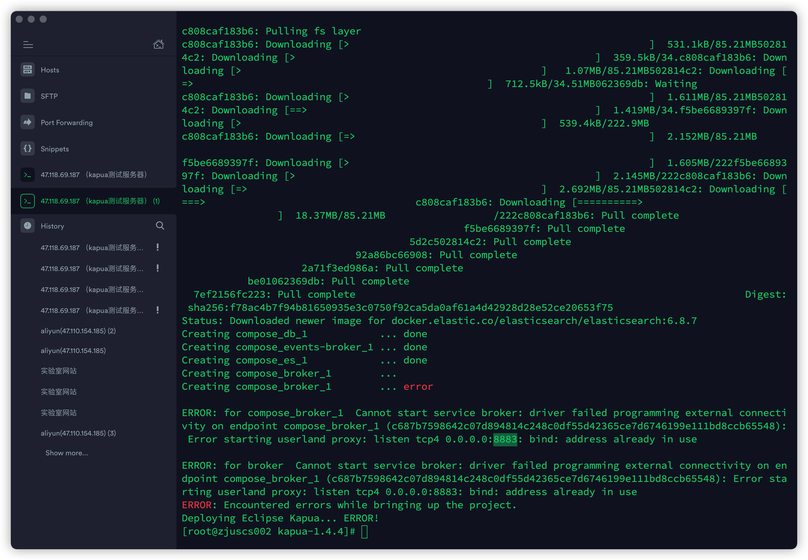
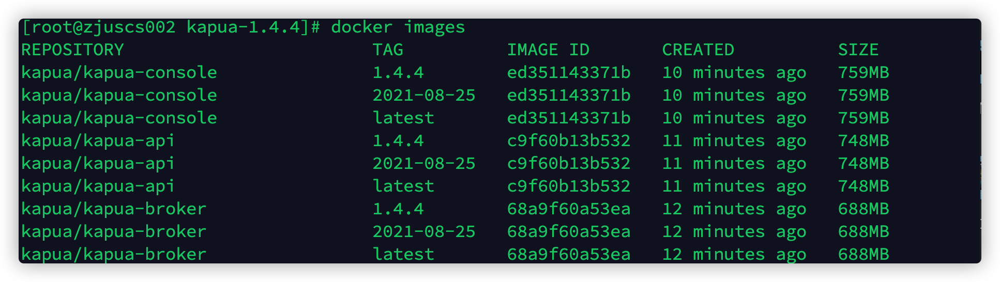
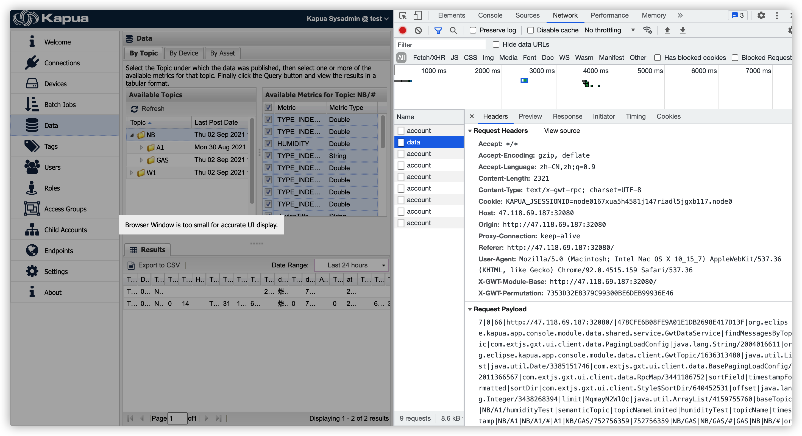

## kapua


### rest-api model 


业务代码 （resource 模块下）: rest-api/resources/src/main/java/org/eclipse/kapua/app/api/resources/v1/resources

启动类 (web 模块下) : rest-api/web/src/main/java/org/eclipse/kapua/app/api/web       RestApisApplication

访问控制+授权 （web模块下）: rest-api / resource模块   shiro.ini  		

访问控制+授权+验证   (service 模块/security模块/shiro 模块)

web.xml       rest-api模块/web模块

commons 模块：jpa


```
jdbc:h2:mem:kapua;MODE=MySQL;DB_CLOSE_DELAY=-1
```

```sql
jdbc:h2:tcp://localhost:3306/kapuadb;schema=kapuadb
```


console

http://localhost:8080/

用户名:kapua-sys

密码: kapua-passowrd


swagger 

http://localhost:8081/


h2 数据库

http://localhost:8181/


curl -X POST "localhost:8080/v1/authentication/user" -H "accept: application/json" -H "Content-Type: application/json" -d "{\"username\":\"kapua-sys\",\"password\":\"kapua-password\"}"


7.20 h2数据库 测试


测试账户

cqp

@Cqp123456789


 Migrator 类可以切换数据库

```java
private static final String MYSQL_JDBC_CONNECTION_STRING = "jdbc:mysql://localhost:3306/kapua";
```


service device call kura protobuf kurapayload.proto


### dockerfile


dockerfile 先基于 java-base 镜像部署 java环境，再基于java-base部署 jetty环境。


sql 镜像基于 java-base 安装 h2 数据库。 挂载数据卷 /var/opt/h2/data

broker 镜像基于 java-base  挂载数据卷  /opt/activemq/data

job-engine 镜像基于jetty-base镜像

events-broker 镜像基于 activemq   挂载数据卷/opt/artemis/data

console 镜像基于 jetty-base

api 镜像基于 jetty-base


console/web/target/

admin.war 


broker 端口 8883




### 服务器部署流程


服务器ip: 47.118.69.187 

用户名: root 密码: Letseatbone2020


1. github下载 kapua 源码包 kapua-1.4.4.tar.gz

2. 上传到服务器 /var/www/ 目录下解压

3. /root/.m2/repository/com/extjs/gxt/2.2.5/   下上传 gxt.jar

   /root/.m2/repository/com/extjs/gxt-ui/2.2.5/ 下上传 gxt-ui.jar 

```bash

 scp /Users/chenqipeng/Downloads/gxt-2.2.5.jar root@47.118.69.187:/root/.m2/repository/extjs/gxt/2.2.5/

 scp /Users/chenqipeng/programming/environments/maven/apache-maven-3.6.3/maven-repo/com/extjs/gxt-ui/2.2.5/gxt-ui-2.2.5.jar root@47.118.69.187:/root/.m2/repository/extjs/gxt-ui/2.2.5/
```


4. /var/www/kapua-1.4.4 下构建

```bash
mvn clean install -Pdocker,dev,console -DskipTests 
```

5. 构建docker 镜像 (需要docker-compose环境)

```bash
mvn -f assembly -Pconsole,docker
```




6. 运行脚本  运行打包好的镜像

   /var/www/kapua-1.4.4下

```bash
./deployment/docker/unix/docker-deploy.sh
```


### console模块 源码分析


console控制台，data模块，开启调试台，选择需要查询的Metric数据后，查看network，查看kapua发送的请求。请求的数据如下。




完整的Request Payload数据如下 （为了易于查看数据添加了换行）

```bash
7|0|66|http://47.118.69.187:32080/|478CFE6B08FE9A01E1DB2698E417D13F|org.eclipse.kapua.app.console.module.data.shared.service.GwtDataService|findMessagesByTopic|
com.extjs.gxt.ui.client.data.PagingLoadConfig|
java.lang.String/2004016611|
org.eclipse.kapua.app.console.module.data.client.GwtTopic/1636313480|
java.util.List|java.util.Date/3385151746|
com.extjs.gxt.ui.client.data.BasePagingLoadConfig/2011366567|
com.extjs.gxt.ui.client.data.RpcMap/3441186752|
sortField|timestampFormatted|sortDir|
com.extjs.gxt.ui.client.Style$SortDir/640452531|
offset|java.lang.Integer/3438268394|limit|MqmayM2WlQc|
java.util.ArrayList/4159755760|baseTopic|
NB/A1/humidityTest|semanticTopic|topicNameLimited|humidityTest|topicName|timestamp|NB/A1|NB/A1/#|A1|NB/GAS/752756359|752756359|NB/GAS|NB/GAS/#|GAS|NB|NB/#|org.eclipse.kapua.app.console.module.data.shared.model.GwtHeader/3246377801|name|TYPE_INDEX_DEVICE_STATE|type|Double|TYPE_INDEX_CSQ_VALUE|HUMIDITY|TYPE_INDEX_RSSI_VALUE|String|TYPE_INDEX_HEAT_VALUE|TYPE_INDEX_TIME_STAMP|TYPE_INDEX_RSRP_VALUE|TYPE_INDEX_GAS_THRESHOLD|deviceTitle|TYPE_INDEX_PPM_VALUE|deviceId|ASSETNAME|TYPE_INDEX_EVENT_TYPE|at|TEMPERATURE|TYPE_INDEX_RSRQ_VALUE|TYPE_INDEX_TAC_VALUE|TYPE_INDEX_GAS_VALUE|TYPE_INDEX_PERIODIC_SEND_INTERVAL|TYPE_INDEX_CELLID_VALUE|TYPE_INDEX_SNR_VALUE|EQUIPID|TYPE_INDEX_SOS_SEND_INTERVAL|dataStreamId|1|2|3|4|6|5|6|7|8|9|9|10|0|1|11|4|12|6|13|14|15|2|16|17|0|18|17|250|19|7|20|2|7|20|1|7|20|0|-9|1|11|5|21|6|22|23|-14|24|6|25|26|-15|27|0|-7|1|11|5|21|6|28|23|6|29|24|6|30|26|-19|27|9|XuU7VB$|7|20|1|7|20|0|-21|1|11|5|21|6|31|23|-26|24|6|32|26|-27|27|0|-7|1|11|5|21|6|33|23|6|34|24|6|35|26|-31|27|9|Xuk6FR6|0|1|11|5|21|6|36|23|6|37|24|-34|26|-34|27|9|Xuk6FR6|20|24|38|1|11|2|39|6|40|41|6|42|38|1|11|2|39|6|43|41|-41|38|1|11|2|39|6|44|41|-41|38|1|11|2|39|6|45|41|6|46|38|1|11|2|39|6|47|41|-41|38|1|11|2|39|6|48|41|-41|38|1|11|2|39|6|49|41|-41|38|1|11|2|39|6|50|41|-41|38|1|11|2|39|6|51|41|-51|38|1|11|2|39|6|52|41|-41|38|1|11|2|39|6|53|41|-51|38|1|11|2|39|6|54|41|-51|38|1|11|2|39|6|55|41|-41|38|1|11|2|39|6|56|41|-51|38|1|11|2|39|6|57|41|-41|38|1|11|2|39|6|58|41|-41|38|1|11|2|39|6|59|41|-51|38|1|11|2|39|6|60|41|-41|38|1|11|2|39|6|61|41|-41|38|1|11|2|39|6|62|41|-51|38|1|11|2|39|6|63|41|-41|38|1|11|2|39|6|64|41|-41|38|1|11|2|39|6|65|41|-41|38|1|11|2|39|6|66|41|-51|9|Xuf3m5n|9|XulBTUk|
```


根据payload前面给出的org.eclipse.kapua.app.console.module.data.shared.service.GwtDataService|findMessagesByTopic深入源码

findMessagesByTopic源码如下：

```java
@Override
    public PagingLoadResult<GwtMessage> findMessagesByTopic(PagingLoadConfig loadConfig, String scopeId, GwtTopic topic, List<GwtHeader> headers, Date startDate, Date endDate)
            throws GwtKapuaException {
        StorablePredicate predicate;
        if (topic.getSemanticTopic().endsWith("/#")) {
            predicate = DATASTORE_PREDICATE_FACTORY.newChannelMatchPredicate(topic.getSemanticTopic().replaceFirst("/#$", "/"));
        } else {
            predicate = DATASTORE_PREDICATE_FACTORY.newTermPredicate(MessageField.CHANNEL, topic.getSemanticTopic());
        }

        return findMessages(loadConfig, scopeId, headers, startDate, endDate, predicate);
    }
```


这个方法主要就是生成 predict类，然后调用findMessages

findMessage 源码如下：

```java
  private PagingLoadResult<GwtMessage> findMessages(PagingLoadConfig loadConfig, String scopeId, List<GwtHeader> headers, Date startDate, Date endDate, StorablePredicate predicate)
            throws GwtKapuaException {
        MessageStoreService messageService = LOCATOR.getService(MessageStoreService.class);
        List<GwtMessage> messages;
        int totalLength = 0;
        MessageQuery query = MESSAGE_STORE_FACTORY.newQuery(GwtKapuaCommonsModelConverter.convertKapuaId(scopeId));    
        query.setLimit(loadConfig.getLimit());
        query.setOffset(loadConfig.getOffset());
        AndPredicate andPredicate = DATASTORE_PREDICATE_FACTORY.newAndPredicate();
        if (predicate != null) {
            andPredicate.getPredicates().add(predicate);
        }
        RangePredicate dateRangePredicate = DATASTORE_PREDICATE_FACTORY.newRangePredicate(MessageField.TIMESTAMP, startDate, endDate);
        andPredicate.getPredicates().add(dateRangePredicate);
        if (headers != null) {
            OrPredicate metricsPredicate = DATASTORE_PREDICATE_FACTORY.newOrPredicate();
            for (GwtHeader header : headers) {
                metricsPredicate.getPredicates().add(DATASTORE_PREDICATE_FACTORY.newExistsPredicate(String.format(MessageSchema.MESSAGE_METRICS + ".%s", header.getName())));
            }
            andPredicate.getPredicates().add(metricsPredicate);
        }
        query.setPredicate(andPredicate);
        if (!StringUtils.isEmpty(loadConfig.getSortField())) {
            String sortField = loadConfig.getSortField();
            if (sortField.equals("timestampFormatted")) {
                sortField = MessageField.TIMESTAMP.field();
            } else if (sortField.equals("clientId")) {
                sortField = MessageField.CLIENT_ID.field();
            }
            query.setSortFields(Collections.singletonList(SortField.of(sortField, SortDirection.valueOf(loadConfig.getSortDir().name()))));
        }
        messages = getMessagesList(query, headers);
        try {
            totalLength = (int) messageService.count(query);
            if (totalLength > 10000) {
                totalLength = 10000;
            }
        } catch (KapuaException e) {
            KapuaExceptionHandler.handle(e);
        }
        return new BasePagingLoadResult<GwtMessage>(messages, loadConfig.getOffset(), totalLength);
    }
```


GwtKapuaCommonsModelConverter.convertKapuaId(scopeId) 对scopeId 进行base64解码，再转成KapuaEid返回。


主要流程:

1. List<GwtMessage> messages 存放数据

2. 设置各种predict 查询的限制条件,放入query， query.setPredicate(andPredicate);
3. 核心:  messages = getMessagesList(query, headers);
4. 最后返回查询到的数据的包装类 BasePagingLoadResult

