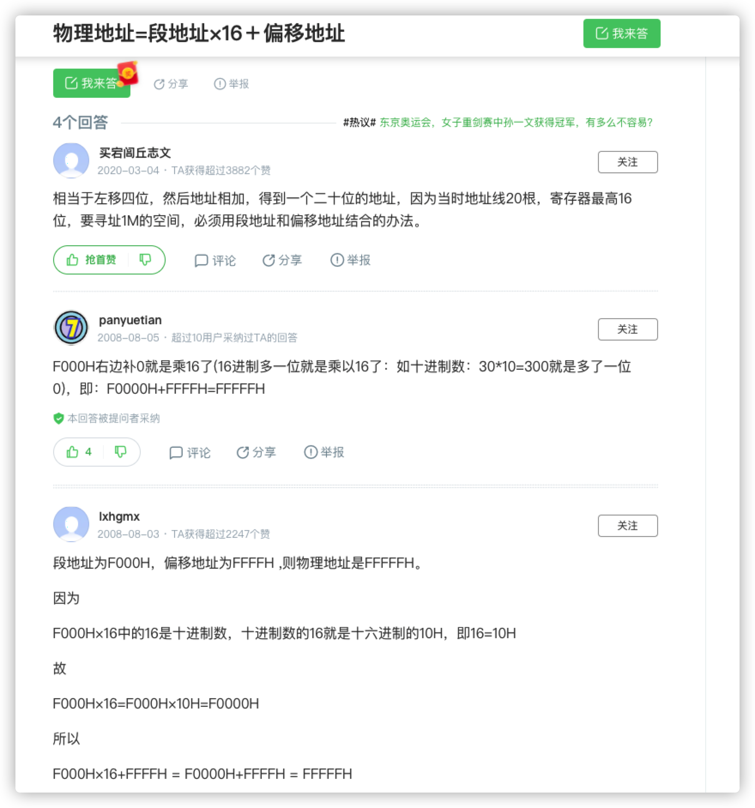

### 1.寄存器

CPU 相关组件提供两个地址：段地址和偏移地址，这两个地址都是 16 位的，他们经由`地址加法器`变为 20 位的物理地址，这个地址即是输入输出控制电路传递给内存的物理地址，由此完成物理地址的转换。

地址加法器采用 **「物理地址 = 段地址 \* 16 + 偏移地址」** 的方法用段地址和偏移地址合成物理地址。

### 2.题目

1. 线程同步有几种方式（悲观乐观 + wait-Notify）

2. 线程池的七大参数，线程池[keep]()AliveTime参数的作用（这个当时有点忘了，没说出来） 

 Java中如何实现线程安全 

 synchronized和ReentrantLock区别，ReentrantLock底层实现 

 synchronized锁升级是怎样的 

 ReentrantLock公平锁与非公平锁区别以及如何实现非公平与公平（这个实现也没说好，面试官让我记一下，之后看看）