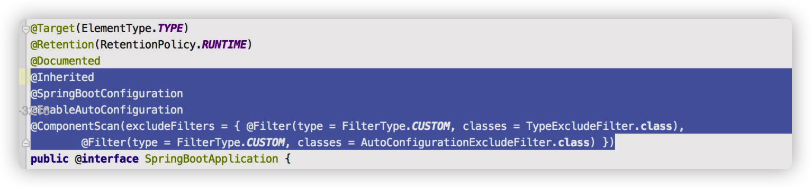

## springboot  学习整理笔记

### 1.默认的主启动类 （自动配置初理解）

```java
//@SpringBootApplication 来标注一个主程序类//说明这是一个Spring Boot应用@SpringBootApplicationpublic class SpringbootApplication {
   public static void main(String[] args) {     //以为是启动了一个方法，没想到启动了一个服务      SpringApplication.run(SpringbootApplication.class, args);   }
}
```


#### 1.1注解解析

@SpringBootApplication

* 说明是springboot主配置类

* 整个应用的入口

  进入这个注解：可以看到上面还有很多其他注解！

​       

* @ComponentScan 

  这个注解在Spring中很重要 ,它对应XML配置中的元素。

  作用：自动扫描并加载符合条件的组件或者bean ， 将这个bean定义加载到IOC容器中

*  @SpringBootConfiguration

​       作用：SpringBoot的配置类 ，标注在某个类上 ， 表示这是一个SpringBoot的配置类；

 

说明这是一个配置类 ，配置类就是对应Spring的xml 配置文件；

Configuration再进去看

 

@Component 这就说明，启动类本身也是Spring中的一个组件而已，负责启动应用！


* @EnableAutoConfiguration:  开启自动配置功能

  以前我们需要自己配置的东西，而现在SpringBoot可以自动帮我们配置 ；@EnableAutoConfiguration告诉SpringBoot开启自动配置功能，这样自动配置才能生效；


**@AutoConfigurationPackage ：自动配置包**


**@import** ：Spring底层注解@import ， 给容器中导入一个组件

Registrar.class 作用：将主启动类的所在包及包下面所有子包里面的所有组件扫描到Spring容器 ；


返回看

**@Import({AutoConfigurationImportSelector.class}) ：给容器导入组件 ；**

AutoConfigurationImportSelector ：自动配置导入选择器，那么它会导入哪些组件的选择器呢？我们点击去这个类看源码：

1.这个类继承的父类  **AutoConfigurationImportSelector**   有这样一个方法


2.这个方法又调用了  SpringFactoriesLoader 类的静态方法！我们进入SpringFactoriesLoader类loadFactoryNames() 方法


```java
public static List<String> loadFactoryNames(Class<?> factoryClass, ClassLoader classLoader) {
        String factoryClassName = factoryClass.getName();

        try {
          
          //去获取一个资源 "META-INF/spring.factories"
          
            Enumeration<URL> urls = classLoader != null ? classLoader.getResources("META-INF/spring.factories") : ClassLoader.getSystemResources("META-INF/spring.factories");
            ArrayList result = new ArrayList();
            
          //将读取到的资源遍历，封装成为一个Properties

            while(urls.hasMoreElements()) {
                URL url = (URL)urls.nextElement();
                Properties properties = PropertiesLoaderUtils.loadProperties(new UrlResource(url));
                String propertyValue = properties.getProperty(factoryClassName);
                String[] var8 = StringUtils.commaDelimitedListToStringArray(propertyValue);
                int var9 = var8.length;

                for(int var10 = 0; var10 < var9; ++var10) {
                    String factoryName = var8[var10];
                    result.add(factoryName.trim());
                }
            }

            return result;
        } catch (IOException var12) {
            throw new IllegalArgumentException("Unable to load factories from location [META-INF/spring.factories]", var12);
        }
    }
```

3.发现一个多次出现的文件：spring.factories，全局搜索它

#### 1.2 spring.factories


**WebMvcAutoConfiguration**

我们在上面的自动配置类随便找一个打开看看，比如 ：WebMvcAutoConfiguration


可以看到这些一个个的都是JavaConfig配置类，而且都注入了一些Bean.

所以，自动配置真正实现是从classpath中搜寻所有的META-INF/spring.factories配置文件 ，并将其中对应的 org.springframework.boot.autoconfigure. 包下的配置项，通过反射实例化为对应标注了 @Configuration的JavaConfig形式的IOC容器配置类 ， 然后将这些都汇总成为一个实例并加载到IOC容器中。

**结论：**

1. SpringBoot在启动的时候从类路径下的META-INF/spring.factories中获取EnableAutoConfiguration指定的值
2. 将这些值作为自动配置类导入容器 ， 自动配置类就生效 ， 帮我们进行自动配置工作；
3. 整个J2EE的整体解决方案和自动配置都在springboot-autoconfigure的jar包中；
4. 它会给容器中导入非常多的自动配置类 （xxxAutoConfiguration）, 就是给容器中导入这个场景需要的所有组件 ， 并配置好这些组件 ；
5. 有了自动配置类 ， 免去了我们手动编写配置注入功能组件等的工作；


### 2.自动配置再理解


分析一波


自动配置属性

```java
@EnableConfigurationProperties(HttpEncodingProperties.class)
```

点进去看这个properties文件


一一对应的。   固有规律 xxxProperties    xxxAutoConfiguration

回去看下面的三个注解

spring底层注解 根据不同的条件判断当前配置或者类是否生效

```java
@ConditionalOnWebApplication
@ConditionalOnClass(CharacterEncodingFilter.class)
@ConditionalOnProperty(prefix = "spring.http.encoding", value = "enabled", matchIfMissing = true)
```


自动装配原理

1.spring boot启动会加载大量自动配置类

2.给容器中自动配置类添加组件时，会从properties类中获取某些属性，我们只需要在配置文件中指定这些属性的值即可；


### 3.springboot web开发

jar：webapp

自动装配

* 导入静态资源  WebMvcAutoApplication下的方法

```java
    @Override
   public void addResourceHandlers(ResourceHandlerRegistry registry) {
      if (!this.resourceProperties.isAddMappings()) {
         logger.debug("Default resource handling disabled");
         return;
      }
      Duration cachePeriod = this.resourceProperties.getCache().getPeriod();
      CacheControl cacheControl = this.resourceProperties.getCache().getCachecontrol().toHttpCacheControl();
      if (!registry.hasMappingForPattern("/webjars/**")) {
         customizeResourceHandlerRegistration(registry.addResourceHandler("/webjars/**")
               .addResourceLocations("classpath:/META-INF/resources/webjars/")
               .setCachePeriod(getSeconds(cachePeriod)).setCacheControl(cacheControl));
      }
      String staticPathPattern = this.mvcProperties.getStaticPathPattern();
      if (!registry.hasMappingForPattern(staticPathPattern)) {
         customizeResourceHandlerRegistration(registry.addResourceHandler(staticPathPattern)
               .addResourceLocations(getResourceLocations(this.resourceProperties.getStaticLocations()))
               .setCachePeriod(getSeconds(cachePeriod)).setCacheControl(cacheControl));
      }
   }
```


什么是webjars？

可以以jar包的形式引入前端框架


可以按照这个路径访问到下面的文件


下面的代码表示


* 首页

​       1.前面的public resource static 中如果有index.html会将其解析为主页。

​       2.需要thymleaf模板引擎的支持

​       springboot-starter 的官网地址https://docs.spring.io/spring-boot/docs/current/reference/htmlsingle/#using-boot-starter


```xml
<!--thymeleaf-->
<dependency>
    <groupId>org.thymeleaf</groupId>
    <artifactId>thymeleaf-spring5</artifactId>
</dependency>
<dependency>
    <groupId>org.thymeleaf.extras</groupId>
    <artifactId>thymeleaf-extras-java8time</artifactId>
</dependency>
```


```java
//在templates下面的所有页面只能通过controller来跳转
//这个需要模版引擎的支持    thymeleaf
@Controller
public class IndexController {
    @RequestMapping("/test")
    public String test(){
        return "test";
    }
}
```


这样就可以访问到templates模板包下的页面了

结论：只要使用thymeleaf ，只需要导入对应的依赖就可以了 我们将html放在我们的templates目录下

​            

* jsp 模版引擎Thymeleaf

  

```java
//在templates下面的所有页面只能通过controller来跳转
//这个需要模版引擎的支持    thymeleaf
@Controller
public class IndexController {
    @RequestMapping("/test")
    public String test(Model model){
        model.addAttribute("msg","hello springboot");
        return "test";
    }
}
```


```html
<html xmlns:th="http://www.thymeleaf.org">

ps：别忘记加这个命名空间
```


```html
<!DOCTYPE html>
<html xmlns:th="http://www.thymeleaf.org">
<head>
    <meta charset="UTF-8">
    <title></title>
</head>
<body>
<!--所有的html元素迪欧可以被thymeleaf接管： th：元素名-->
<div th:text="${msg}"></div>

</body>
</html>
```


* 装配扩展SpringMvc


​    这个类必须是 WebMvcConfigurer类

扩展方法：


例子：扩展视图跳转功能

```java
//如果要扩展springmvc 官方建议我们这样去做！
//全面接管 springmvc
@Configuration
public class MyMvcConfig implements WebMvcConfigurer {
    //视图跳转
    @Override
    public void addViewControllers(ViewControllerRegistry registry) {
        registry.addViewController("/cqp").setViewName("test");
    }
}
```


**@EnableWebMvc ** 这玩意就是导入了一个类 DelegationWebMvcConfiguration（作用：从容器中获取所有的webmvcconfig）这个类又继承了 WebMvcConfigurationSupport。


总结：在springboot中，有非常多的xxxxx Configuration帮助我们进行扩展配置，只要看见了这个东西，我们就要注意了。


* 增删改查

  准备工作：模拟数据库中的数据

```java
//部门表
@Data
@AllArgsConstructor
@NoArgsConstructor
public class Department {
        private Integer id;
        private String departmentName;
}
```


```java
//员工表
@Data
@NoArgsConstructor
public class Employee {
    private Integer id;
    private String lastName;
    private String email;
    private Integer gender;  //0:女  1:男
    private Department department;
    private Date birth;

    public Employee(Integer id, String lastName, String email, Integer gender, Department department) {
        this.id = id;
        this.lastName = lastName;
        this.email = email;
        this.gender = gender;
        this.department = department;
        //默认创建日期
        this.birth = new Date();
    }
}
```


```java
//部门dao
@Repository
public class DepartmentDao {
    //模拟数据库中的数据

    private static Map<Integer, Department> departments=null;

    static{
        departments=new HashMap<Integer, Department>(); //创建一个部门表
        departments.put(101,new Department(101,"教学部"));
        departments.put(102,new Department(102,"市场部"));
        departments.put(103,new Department(103,"教研部"));
        departments.put(104,new Department(104,"运营部"));
        departments.put(105,new Department(105,"后勤部"));

    }

    //获得所有部门信息
    public Collection<Department> getDepartments(){
        return departments.values();
    }
    //通过id得到部门
    public Department getDepartmentById(Integer id){
        return departments.get(id);
    }
}
```


```java
//员工Dao
@Repository
public class EmployeeDao {

    //模拟数据库中的数据
    private static Map<Integer, Employee> employees=null;
    //员工有所属的部门
    @Autowired
    private DepartmentDao departmentDao;
    static{
        employees=new HashMap<Integer, Employee>(); //创建一个员工表
        employees.put(1001,new Employee(1001,"AA","12341241@qq.com",1,new Department(101,"教学部")));
        employees.put(1002,new Employee(1002,"BB","1234RE41@qq.com",1,new Department(102,"市场部")));
        employees.put(1003,new Employee(1003,"CC","12343541@qq.com",0,new Department(103,"教研部")));
        employees.put(1004,new Employee(1004,"DD","123T3241@qq.com",0,new Department(104,"运营部")));
        employees.put(1005,new Employee(1005,"EE","1234RT41@qq.com",1,new Department(105,"后勤部")));
    }
    //主键自增
    private  static Integer initId=1006;
    //增加一个员工
    public  void save(Employee employee){
        if(employee.getId()==null){
            employee.setId(initId++);    }
        employee.setDepartment(departmentDao.getDepartmentById(employee.getDepartment().getId()));
        employees.put(employee.getId(),employee);
    }
    //查询全部员工信息
    public Collection<Employee> getAll(){
        return employees.values();
    }
    //通过id查询员工
    public  Employee getEmployeeById(Integer id){
        return employees.get(id);
    }
    //删除员工
    public  void  delete(Integer id){   employees.remove(id);
    }
}
```


首页实现

。。。。。。。。

登陆功能


```java
@Controller
public class LoginController {
    @RequestMapping("/user/login")
    @ResponseBody
    public String login(){
        return "OK";
    }
}
```


跑通之后再往下完善功能


  #### 3.1 员工列表展示

​      1.提取公共页面


​        


传递参数（active='xxx'）接收参数

```html
 <a th:class="${active=='main.html'?'nav-link active':'nav-link'}" th:href="@{/main.html}">
```


**展示数据**

```html
<table class="table table-striped table-sm">
							<thead>
								<tr>
									<th>id</th>
									<th>lastName</th>
									<th>email</th>
									<th>gender</th>
									<th>department</th>
									<th>birth</th>
									<th>操作</th>
								</tr>
							</thead>
							<tbody>

							<tr th:each="emp:${emps}">
							      <td th:text="${emp.getId()}"></td>
							      <td>[[${emp.getLastName()}]]</td>
							      <td th:text="${emp.getEmail()}"></td>
							      <td th:text="${emp.getGender()==0?'女':'男'}"></td>
							      <td th:text="${emp.department.getDepartmentName()}"></td>
								  <td th:text="${#dates.format(emp.getBirth(),'yyyy-MM-dd hh:mm:ss')}"></td>
								  <td>
									  <button class="btn btn-sm btn-primary">编辑</button>
									  <button class="btn btn-sm btn-danger">删除</button>
								  </td>
							</tr>
							</tbody>
						</table>
```

```java
@Controller
public class EmployeeController {
    @Autowired
    EmployeeDao employeeDao;
    @RequestMapping("/emps")
    public String list(Model model){
        Collection<Employee> employees= employeeDao.getAll();
        model.addAttribute("emps",employees);
        return "emp/list";
    }
}
```

结果


#### 3.2添加员工

1.按钮跳转

2.跳转到添加页面

3.添加员工成功

4.返回首页


跳转按钮。默认为get方法

```html
<h2><a class="btn btn-sm btn-success " th:href="@{/emp}">添加员工</a></h2>
```

add.html代码

```html
<main role="main" class="col-md-9 ml-sm-auto col-lg-10 pt-3 px-4">
   <form th:action="@{/emp}" method="post">
      <div class="form-group">
         <label>LastName</label>
         <input type="text" name="lastName" class="form-control" placeholder="chen">
      </div>
      <div class="form-group">
         <label>Email</label>
         <input type="email" name="email" class="form-control" placeholder="2111053717@qq.com">
      </div>
      <div class="form-group">
         <label>Gender</label>
         <div class="form-check form-check-inline">
            <input class="form-check-input"  type="radio" name="gender" value="1">
            <label class="form-check-label">男</label>
         </div>
         <div class="form-check form-check-inline">
            <input class="form-check-input" type="radio" name="gender" value="0">
            <label class="form-check-label">女</label>
         </div>
      </div>
      <div class="form-group">
         <label>department</label>
         <select class="form-control" name="department.id">
            <option th:each="dept:${departments}" th:text="${dept.getDepartmentName()}"th:value="${dept.getId()}">
               </option>

         </select>
      </div>
      <div class="form-group">
         <label>Birth</label>
         <input type="text" name="birth" class="form-control" placeholder="8.23">
      </div>
      <button type="submit" class="btn btn-primary">添加</button>
   </form>
</main> 
```

**表单提交会根据controller里的参数类型进行自动对表单数据的封装。**

表单中的input name的属性值必须和controller中的参数类型的属性名一致。

一个form对应一个对象


EmployeeController代码。 

```java
@GetMapping("/emp")
public String toAddpage(Model model){
    //查出所有部门的信息
    Collection<Department> departments = departmentDao.getDepartments();
    model.addAttribute("departments",departments);
    return "emp/add";
}

@PostMapping("/emp")
public String addEmp(Employee employee){
    //添加的操作
    System.out.println("save>>"+employee);
    employeeDao.save(employee);//调用底层业务方法保存员工信息
    return "redirect:/emps";
}
```


问题：如果日期不是  2019/1/1的格式会报错？

如何解决：

这个和springmvc自带的格式转换器有关。

对时间日期格式化


跟随这个format‘源码找到它的默认格式是 dd/MM/yyyy


#### 3.3修改员工

​    传递参数


${}取变量

/()传递参数


第一种括号传参的话参数可以传递但是不支持restFul风格

第二种写法：


```html
<!--传递参数${emp.id}-->
<a class="btn btn-sm btn-primary" th:href="@{/emp/}+${emp.getId()}" >编辑</a>
```


update.html

```html
<main role="main" class="col-md-9 ml-sm-auto col-lg-10 pt-3 px-4">
   <form th:action="@{/updateEmp}" method="post">
      <input type="hidden" name="id" th:value="${emp.getId()}">
      <div class="form-group">
         <label>LastName</label>
         <input type="text" th:value="${emp.getLastName()}" name="lastName" class="form-control" placeholder="chen">
      </div>
      <div class="form-group">
         <label>Email</label>
         <input type="email" th:value="${emp.getEmail()}" name="email" class="form-control" placeholder="2111053717@qq.com">
      </div>
      <div class="form-group">
         <label>Gender</label>
         <div class="form-check form-check-inline">
            <input th:checked="${emp.getGender()==1}"  class="form-check-input"  type="radio" name="gender" value="1">
            <label class="form-check-label">男</label>
         </div>
         <div class="form-check form-check-inline">
            <input th:checked="${emp.getGender()==0}" class="form-check-input" type="radio" name="gender" value="0">
            <label class="form-check-label">女</label>
         </div>
      </div>
      <div class="form-group">
         <label>department</label>
         <select class="form-control" name="department.id">
            <option th:selected="${dept.getId()==emp.getDepartment().getId()}"    th:each="dept:${departments}" th:text="${dept.getDepartmentName()}"th:value="${dept.getId()}">
            </option>

         </select>
      </div>
      <div class="form-group">
         <label>Birth</label>
         <input th:value="${#dates.format(emp.getBirth(),'yyyy-MM-dd HH:mm')  }" type="text" name="birth" class="form-control" placeholder="8.23">
      </div>
      <button type="submit" class="btn btn-primary">添加</button>
   </form>
</main>
```


```java
    //去员工的修改页面
@GetMapping("/emp/{id}")
    public String toUpdateEmp(@PathVariable("id")Integer id,Model model ){
        //查出原来的数据
    Employee employee= employeeDao.getEmployeeById(id);
    model.addAttribute("emp",employee);
    Collection<Department> departments = departmentDao.getDepartments();
    model.addAttribute("departments",departments);

    return "emp/update";
    }

    //修改员工信息
    @PostMapping("/updateEmp")
    public String updateEmp(Employee employee){
        employeeDao.save(employee);
        return "redirect:/emps";
    }
```


注销

```html
<a class="nav-link" th:href="@{/user/logout}">注销</a>
```

```java
//注销
@RequestMapping("/user/logout")
public String logout(HttpSession session){
    session.invalidate();
    return "redirect:/index.html";
}
```

* 404

​     在templates包下建一个error包 放入404.html  500.html即可

* 拦截器


```java
public class LoginHandleInterceptor implements HandlerInterceptor {
    @Override
    public boolean preHandle(HttpServletRequest request, HttpServletResponse response, Object handler) throws Exception {
        //登陆成功之后 应该有用户的session
       Object loginuser=request.getSession().getAttribute("loginUser");
       if(loginuser==null){//没有登陆
           request.setAttribute("msg","没有权限，请先登陆");
           request.getRequestDispatcher("/index.html").forward(request,response);
           return false;
       }else{
           return true;
       }

    }


}
```


```java
//如果要扩展springmvc 官方建议我们这样去做！
//全面接管 springmvc
@Configuration
public class MyMvcConfig implements WebMvcConfigurer {
    @Override
    public void addViewControllers(ViewControllerRegistry registry) {
        registry.addViewController("/").setViewName("index");
        registry.addViewController("/index.html").setViewName("index");
        registry.addViewController("/main.html").setViewName("dashboard");
    }

    @Override
    public void addInterceptors(InterceptorRegistry registry) {
        registry.addInterceptor(new LoginHandleInterceptor())
                .addPathPatterns("/**").excludePathPatterns("/index.html","/","/user/login","/asserts/**");
    }
}
```


* 国际化


### 4.Data

对于数据访问层，无论是sql（关系型数据库）还是nosql（非关系型数据库）springBoot底层都是采用Spring Data的方式统一处理。

Spring Date也是Spring中与 Spring Cloud Spring Boot等齐名的知名项目。

https://spring.io/projects/spring-data


测试数据源

```java
@Test
void contextLoads() throws SQLException {
    //查看默认数据源  class com.zaxxer.hikari.HikariDataSource
    System.out.println(dataSource.getClass());
    //获得数据库连接
    Connection connection = dataSource.getConnection();
    System.out.println(connection);

    // xxxxTemplate  :springboot已经配置好的模板，拿来即用
    // CRUD增删改查的方法在这个template下封装好了
    // jdbc
    // redis

    //关闭
    connection.close();
```


查询数据库用户表

```java
@RestController
public class JDBCController {
    @Autowired
    JdbcTemplate jdbcTemplate;

    //查询数据库的所有信息
    //没有实体类 数据库中的东西怎么获取？ 存到map里
    @GetMapping("/userList")
    public List<Map<String,Object>> userList(){
        String sql="select * from tb_user_info";
        List<Map<String, Object>> list_maps = jdbcTemplate.queryForList(sql);
        return list_maps;
    }

}
```


```java
@GetMapping("/addUser")
public String addUser(){
   String sql="insert into tb_user_info(id,user_name,password,create_user) values(99,'小值','123456','admin')";
   jdbcTemplate.update(sql);
   return "add-ok";
}

@GetMapping("/updateUser/{id}")
public String updateUser(@PathVariable("id") int id){
    String sql="update tb_user_info set user_name=?,password=? where id="+id;
    //封装
    Object[] objects=new Object[2];
    objects[0]="小明";
    objects[1]="zzzzzz";
    jdbcTemplate.update(sql,objects);
    return "update-ok";
}

@GetMapping("/deleteUser/{id}")
public String deleteUser(@PathVariable("id") int id){
    String sql="delete from tb_user_info where id=?";
    jdbcTemplate.update(sql,id);
    return "delete-ok";
}
```

#### 4.1 druid


```xml
<!-- https://mvnrepository.com/artifact/com.alibaba/druid -->
<dependency>
    <groupId>com.alibaba</groupId>
    <artifactId>druid</artifactId>
    <version>1.1.24</version>
</dependency>

```


引入jar包之后    type属性指定就ok了

```yaml
spring:
  datasource:
    username: root
    password: 123456
    url: jdbc:mysql://localhost:3306/iiot?useUnicode=true&characterEncoding=utf-8
    driver-class-name: com.mysql.jdbc.Driver
    type: com.alibaba.druid.pool.DruidDataSource
    #Spring Boot默认是不注入这些属性值的，需要自己绑定
    #druid数据源专有配置
    initialsize: 5
    minIdle: 5
    maxActive: 20
    maxWait: 600e0
    timeBetweenEvictionRunsMillis: 60000
    minEvictableIdleTimeMillis: 3e0e0e
    validationQuery: SELECT 1 FROM DUAL
    testwhileIdle: true
    testOnBorrow: false
    testOnReturn: false
    poolPreparedStatements: true
    #配置监控统计拦截的filters，stat:监控统计、Log4j:日志记录、walL:防御sqL注入
    #如果允许时报错java.Lang.CLassNotFoundException: org.apache.Log4j.Priority
    #则导入log4j依赖即可，Maven 地址: https: //mvnrepository.com/artifact/Log4j/Log4j
    filters: stat,wall,log4j
    maxPoolpreparedstatementPerConnectionsize: 20
    useGlobalDataSourcestat: true
    connectionProperties: druid.stat.mergeSql=true;druid.stat.slowSqlMillis=500
```


druid可以自定义配置


application.yml文件要与config类绑定起来

不配置的话yml中的私有化属性不会生效


将自定义的容器druidDataSource加入到spring容器中，就不需要springboot自己创建了。现在就可以配置它了。可以实现一些高级功能，比如说监控

```java
@Configuration
public class DruidConfig {
    @ConfigurationProperties(prefix = "spring.datasource")
    @Bean
    public DataSource druidDataSource(){
        return new DruidDataSource();
    }

    //后台监控  :这个类写出来相当于 web.xml  因为springboot 内置了servlet容器 所以没有web.xml
    //替代方法: ServletRegistrationBean 注册到bean容器中
    // servlet注册bean   需要放入druid的注册bean
    @Bean
    public ServletRegistrationBean StatViewServlet(){
        ServletRegistrationBean<StatViewServlet> bean = new ServletRegistrationBean<>(new StatViewServlet(), "/druid/*");

        //后台需要有人登陆，账号密码配置
        HashMap<String, String> initParameters = new HashMap<>();
        //增加配置
        initParameters.put("loginUsername","admin");  //登陆key是固定的  loginUsername  loginPassword
        initParameters.put("loginPassword","123456");
        //允许谁可以访问
        initParameters.put("allow","");
        //禁止谁能访问
       // initParameters.put("lll","192.168.11.123");

        bean.setInitParameters(initParameters); //设置初始化参数
        return bean;
    }
}
```


运行结果：


补充：filter

```java
//filter
@Bean
public FilterRegistrationBean webStartFilter(){
      FilterRegistrationBean bean=new FilterRegistrationBean();
      bean.setFilter(new WebStatFilter());
      //可以过滤哪些请求?
    HashMap<String, String> initParameters = new HashMap<>();
    //这些东西不进行统计
    initParameters.put("exclusions","*.js,*.css,/druid/*");
    return bean;
}
```


#### 4.2  mybatis

整合包

mybatis-spring-boot-starter       官方文档：http://mybatis.org/spring-boot-starter/mybatis-spring-boot-autoconfigure/

```xml
<!-- https://mvnrepository.com/artifact/org.mybatis.spring.boot/mybatis-spring-boot-starter -->
<dependency>
    <groupId>org.mybatis.spring.boot</groupId>
    <artifactId>mybatis-spring-boot-starter</artifactId>
    <version>2.1.3</version>
</dependency>

```

新建项目。勾选下面三个依赖。


放入上面的maven依赖


写数据库配置

```properties
spring.datasource.username=root
spring.datasource.password=123456
spring.datasource.url=jdbc:mysql://localhost:3306/iiot?serverTimezone=UTC&useUnicode=true&characterEncoding=utf-8
spring.datasource.driver-class-name=com.mysql.cj.jdbc.Driver
```


连接测试成功


现在开始使用mybatis

第一步：实体类


第二步 mapper接口


第三步 sql语句

原来是要在mapper包下写mapper.xml文件

但是这里写在resource包下 方便管理。（但是这样就不能用class访问了 这会导致注解和resource下不能同时使用，只能全部用配置文件）

resource包下建mybatis包 mybatis包下建mapper包 再建立UserMapper.xml文件


第四步：全局配置mybatis属性


第五步：写个controller测试一下


ok！


### 5. SpringSecurity(安全)


Spring Security is a powerful and highly customizable authentication and access-control framework.

Spring Security是一个功能强大且高度可定制的身份验证和访问控制框架。

https://docs.spring.io/spring-security/site/docs/5.4.0/reference/html5/#new

**简介**

SpringSecurity是针对spring项目的安全框架，也是springboot底层安全模块默认的技术选型，可以实现强大的web安全控制，对于安全控制，我们仅需要引入spring-boot-starter-security模块，进行少量的配置，即可实现强大的安全管理。

记住几个类：

* WebSecurityConfigurerAdapter   自定义Security策略

* AuthenticationManagerBuilder  自定义认证策略

* @EnableWebSecurity  开启WebSecurity模式  @Enablexxxx开启某个功能

  

核心是把权限赋给角色 而不是具体的用户

用户通过活得角色来获得相应的权限


shiro  和 spring security很像。除了类和名字不一样

认证 授权（vip1 vip2 vip3）

* 功能权限
* 访问权限
* 菜单权限
* 拦截器 过滤器


准备工作 搭建学习环境

导入静态页面

导入thymleaf web 依赖

编写路由控制


第一步导入 springsecurity依赖


```xml
<dependency>
    <groupId>org.springframework.boot</groupId>
    <artifactId>spring-boot-starter-security</artifactId>
</dependency>
```


官网例子


```java
//AOP横切编程
@EnableWebSecurity
public class SecurityConfig extends WebSecurityConfigurerAdapter {
    //授权
    @Override
    protected void configure(HttpSecurity http) throws Exception {
        //首页所有人可以访问  功能页只有对应有权限的人才能访问
        http.authorizeRequests()
                .antMatchers("/").permitAll()
                .antMatchers("/level1/**").hasRole("vip1")
                .antMatchers("/level2/**").hasRole("vip2")
                .antMatchers("/level3/**").hasRole("vip3");

        //没有权限默认会到登陆页面
        http.formLogin();
      
        //注销 开启注销跳到首页
        http.logout().logoutSuccessUrl("/");
      
        //开启记住我功能  cookie
        http.rememberMe();
    }


    //认证   springboot 2.1.x 可以直接使用
    //报错 There is no PasswordEncoder mapped for the id "null"
    //在spring 5中新增了很多加密方式
    //真实场景数据应该从数据库中取出
    @Override
    protected void configure(AuthenticationManagerBuilder auth) throws Exception {
        auth.inMemoryAuthentication().passwordEncoder(new BCryptPasswordEncoder())
                .withUser("cqp").password(new BCryptPasswordEncoder().encode("123456") ).roles("vip2","vip3")
                .and()
                .withUser("root").password(new BCryptPasswordEncoder().encode("123456")).roles("vip1","vip2","vip3")
                .and()
                .withUser("guest").password(new BCryptPasswordEncoder().encode("123456")).roles("vip1");

    }
}
```


不同的角色能够进入不同的页面 没有权限会被拒绝


现在实现的话所有用户登陆后会看到所有的信息


但是我们想实现如果cqp登陆的话 只能看到level2和level3被授予权限的内容。


先导整合包

```xml
<!--整合包-->
 <!-- https://mvnrepository.com/artifact/org.thymeleaf.extras/thymeleaf-extras-springsecurity4 -->
 <dependency>
     <groupId>org.thymeleaf.extras</groupId>
     <artifactId>thymeleaf-extras-springsecurity5</artifactId>
     <version>3.0.4.RELEASE</version>
 </dependency>
```


有了这个整合包可以在thymleaf里写 spring security的操作

先解决如果登陆显示logout和登录名 如果没登陆显示登陆按钮

注意命名空间  xmlns:sec="http://www.thymeleaf.org/extras/spring-security"


成功！


现在实现只显示有权限的内容


成功！！！


踩坑：

spring security和thymleaf整合包最新版本thymeleaf-extras-springsecurity4不支持springboot的高版本。

导入*DefaultWebSecurityManager*时很容易误导入*import org.apache.shiro.mgt.DefaultSecurityManager;*

包导致项目报错。

应导为import org.apache.shiro.web.mgt.DefaultWebSecurityManager; 包

### 6.shiro

shiro笔记


### 7.分布式Dubbo+Zookeeper + SpringBoot


#### 7.1 dubbo


官网地址：http://dubbo.apache.org/zh-cn/docs/user/quick-start.html

#### 7.2 RPC（Remote Procedure Call）远程过程调用


Http Springcloud（生态）

netty 

RPC两个核心模块：通信 序列化（方便数据传输，数据传输需要转换）


dubbo 18年重启项目 Dubbo 3.x   （rpc框架）


#### 7.3 dubbo

什么是dubbo？

dubbo是一款高性能,轻量级的开源java rpc 框架，提供了三大核心能力：**面向接口的远程方法调用**，**智能容错和负载均衡**，**以及服务自动注册和发现**。


服务提供者(Provider) :暴露服务的服务提供方，服务提供者在启动时，向注册中心注册自己提供的服务。
服务消费者(Consumer) : 调用远程服务的服务消费方，服务消费者在启动时，向注册中心订阅自己所需的服务，服务消费者，从提供者地址列表中，基于软负载均衡算法，选一台提供者进行调用，如果调用失败，再选另一台调用。
注册中心(Registry) :注册中心返回服务提供者地址列表给消费者，如果有变更，注册中心将基于长连接推送变更数据给消费者
监控中心(Monitor) :服务消费者和提供者，在内存中累计调用次数和调用时间，定时每分钟发送一次统计数据到监控中心


##### 调用关系说明

1. 服务容器负责启动，加载，运行服务提供者。
2. 服务提供者在启动时，向注册中心注册自己提供的服务。
3. 服务消费者在启动时，向注册中心订阅自己所需的服务。
4. 注册中心返回服务提供者地址列表给消费者，如果有变更，注册中心将基于长连接推送变更数据给消费者。
5. 服务消费者，从提供者地址列表中，基于软负载均衡算法，选一台提供者进行调用，如果调用失败，再选另一台调用。
6. 服务消费者和提供者，在内存中累计调用次数和调用时间，定时每分钟发送一次统计数据到监控中心。


zookeeper：hadoop hive


配置安装zookeeper    （mac版本）

1.下载zookeeper，[下载地址](https://mirrors.tuna.tsinghua.edu.cn/apache/zookeeper/)
2.解压在需要安装的目录，随意就行，然后打开在zookeeper的conf目录下找到zoo_sample.cfg文件，复制一份，并重命名为zoo.cfg，就放在同目录下就行。

然后在zookeeper文件夹下新建 data 和logs文件夹

```xml
tickTime=2000 
dataDir= /Users/chenqipeng/programming/environments/zookeeper/zookeeper-3.4.14/data
dataLogDir=/Users/chenqipeng/programming/environments/zookeeper/zookeeper-3.4.14/logs  
clientPort=2181
```


启动zookeeper，进入到zookeeper的bin目录下，执行zkServer.sh start或者（zkServer.sh start-foreground），运行zkCli.sh查看是否能连接上本机的2181端口

```
Connecting to localhost:21811
```

或者输入jps

```
1157 QuorumPeerMain1
```

有QuorumPeerMain就说明启动成功。（后续的步骤中都不要关闭它，保持运行状态）


参考：https://blog.csdn.net/d007letian/article/details/78018176


打包这个目录

```xml
mvn package -Dmaven.test.skip=true
```


   

打包成功


执行jar包。 


 ps:zookeeper开启才会成功访问 


默认用户名是root

默认密码是root


上述方式也可以通过idea导入maven项目再在idea里打包。

dubbo-admin：是一个监管后台 可以查看我们注册了哪些服务，哪些服务被消费了。


#### 7.4 demo 实战

1.新创建空项目

2.添加module 勾选一个web模块


配置


添加注解


3.maven jar包导入。版本错误会启动失败. springboot 版本 2.2.1

```xml

		<!--导入dubbo和zookeeper依赖-->
		<!-- https://mvnrepository.com/artifact/org.apache.dubbo/dubbo-spring-boot-starter -->
		<dependency>
			<groupId>org.apache.dubbo</groupId>
			<artifactId>dubbo-spring-boot-starter</artifactId>
			<version>2.7.8</version>
		</dependency>
		<!--zkclient-->
		<!-- https://mvnrepository.com/artifact/com.github.sgroschupf/zkclient -->
		<dependency>
			<groupId>com.github.sgroschupf</groupId>
			<artifactId>zkclient</artifactId>
			<version>0.1</version>
		</dependency>
        <!--引入zookeeper日志会冲突  引入下面的依赖可以解决-->
		<!-- https://mvnrepository.com/artifact/org.apache.curator/curator-framework -->
		<dependency>
			<groupId>org.apache.curator</groupId>
			<artifactId>curator-framework</artifactId>
			<version>2.12.0</version>
		</dependency>
		<dependency>
			<groupId>org.apache.curator</groupId>
			<artifactId>curator-recipes</artifactId>
			<version>2.8.0</version>
		</dependency>
		<dependency>
			<!-- https://mvnrepository.com/artifact/org.apache.zookeeper/zookeeper -->
				<groupId>org.apache.zookeeper</groupId>
				<artifactId>zookeeper</artifactId>
				<version>3.6.2</version>
			<!--排除这个slf4j-log412-->
			<exclusions>
				<exclusion>
					<groupId>org.slf4j</groupId>
					<artifactId>slf4j-log4j12</artifactId>
				</exclusion>
			</exclusions>
		</dependency>

```


启动ProviderServerApplication后访问dubbo-admin


成功监听到生产者

4.新建模块 consumer-server

引入jar包  编写配置文件 配置注册中心


消费的业务代码


实现两个模块调用

编写测试。并运行


成功。


总结：

步骤：(前提：zookeeper服务开启)

1.提供者提供服务

​     1.导入依赖

​     2.配置注册中心的地址，以及服务发现名 和要扫描的包

​     3.在想要被注册的服务上面 增加注解@Service （dubbo包下的）

2.消费者如何消费

   1.导入依赖

   2.配置注册中心地址 配置自己的服务名

   3.从远程注入服务。@Reference


ps: maven环境配置

1.先在命令行下敲：vi  .profile  (也可以是  vi ~/.profile  这个是配置你自己当前用户的环境变量，别的用户用不了)

2.进入文件后，敲  i  ,进入编辑模式

然后就写下下面这几行就好

MAVEN_HOME=/Users/user/workspace/software/apache-maven-3.5.3 （找到自己下载后且解压的maven文件路径）

export MAVEN_HOME

export PATH=$MAVEN_HOME/bin:$PATH

3.上面几行敲完后就要保存文件了。

3.1 按下  esc 键退出编辑模式。

3.2 敲下命令   :wq!  这四个字符，注意是四个字符！！！

4.保存完文件就是让这个环境变量可以马上好使啊。

敲下命令行  source .profile  (当前用户的话是  source  ~/.profile)

5.验证maven环境变量是否好使，

敲下命令  mvn  -v

敲下命令后出现你maven的版本号后，那就恭喜你成功了。


springboot测试类报错的话，请先导入        

```xml
<dependency>
            <groupId>org.junit.platform</groupId>
            <artifactId>junit-platform-launcher</artifactId>
            <scope>test</scope>
</dependency>
```


### 8.swagger简介

官网：https://swagger.io/


**springboot集成swagger项目**


1.新建一个springboot web项目

2.导入相关依赖

```xml
<!-- https://mvnrepository.com/artifact/io.springfox/springfox-swagger2 -->
<dependency>
    <groupId>io.springfox</groupId>
    <artifactId>springfox-swagger2</artifactId>
    <version>2.9.2</version>
</dependency>
<!-- https://mvnrepository.com/artifact/io.springfox/springfox-swagger-ui -->
<dependency>
    <groupId>io.springfox</groupId>
    <artifactId>springfox-swagger-ui</artifactId>
    <version>2.9.2</version>
</dependency>

```

3.编写hello过程

4.配置swagger。  config

```java

@Configuration
@EnableSwagger2   //开启swagger
public class SwaggerConfig {
}
```

这样swagger才能运行 有默认配置

运行测试 

访问http://localhost:8080/swagger-ui.html


**配置swagger**

swagger的bean实例 Docket

```java
@Configuration
@EnableSwagger2   //开启swagger
public class SwaggerConfig {

    //配置类sawgger的docket bean实例
    @Bean
    public Docket docket(){
        return new Docket(DocumentationType.SWAGGER_2)
                .apiInfo(apiInfo())
                ;
    }
    //配置swagger信息=apiInfo
    private ApiInfo apiInfo(){
        //作者信息
        Contact contact=new Contact("cqp","asdasd.com","2111053717@qq.com");
        return new ApiInfo("cqp的swagger API文档",
                "三天皆勤勉，昨天今天明天！",
                "v1.0",
                "urn:tos",
                contact,
                "Apache 2.0",
                "http://www.apache.org/licenses/LICENSE-2.0",
                new ArrayList());

    }

}
```


**Swagger配置扫描接口**

Docket.select

```java
public Docket docket(){
    return new Docket(DocumentationType.SWAGGER_2)
            .apiInfo(apiInfo())
            .select()
            //RequestHandlerSelectors : 配置扫描接口的方式
            //basePackage : 指定要扫描的包
            //any（）: 扫描全部
            // none（）：都不扫描
            // withClassAnnotation 扫描类上的注解 参数是一个注解的反射对象
            // withMethodAnnotation 扫描方法上的注解
            .apis(RequestHandlerSelectors.basePackage("com.cqp.swagger.controller"))
            //过滤 什么路径 只扫描/cqp/** 下的东西
            .paths(PathSelectors.ant("/cqp/**"))
            .build()
            ;
}
```

配置是否启动swagger


如何做到swagger在生产环境中使用，在发布的时候不使用？

* 判断是不是生产环境  
* 注入enable（）


**配置api文档的分组**


​	


如何配置多个分组？

多个docket实例即可


**实体类扫描**


测试接口


总结：

* 可以通过swagger给难理解的属性或者接口增加注释信息
* 接口文档实时更新
* 可以在线测试


【注意点】 正式发布时关闭swagger


### 9.任务

异步任务～

定时任务～

邮件发送～

### 10.注意事项

**@RequestBody只支持POST请求，GET请求不能使用@RequestBody，修改GET请求为POST即可，如果需要使用GET请求，可以使用@RequestParam和@PathVariable**


### 11.常用注解解析


#### 11.1 @Configuration


前置知识:https://cloud.tencent.com/developer/article/1751910


spring在启动时会默认加载一些 postProcessor 后置处理器。

ConfigurationClassPostProcessor 专门处理带有@Configuration注解的类。

```java
public void enhanceConfigurationClasses(ConfigurableListableBeanFactory beanFactory)
```

处理器其中的enhanceConfigurationClasses方法来处理。

第一个for循环读取所有带 @Configuration注解的类。

第二个for循环对类进行增强代理。用代理类去替换原来带注解的类。


@configuration 注解下的 带了@bean注解的类执行方法时，也会被拦截做处理。(Callback 里的 BeanMethodInterceptor)

**拦截了做什么?**


一开始会创建 author 这个bean注入容器中。

然后创建book这个bean，由于里面调用了author，被拦截发现已经创建了author这个bean了，直接返回之前创建的 author，而不用重复创建。

所以@configuration中的 bean是单例的。


#### 11.2 @springbootApplication


启动类



* @SpringbootConfiguration 和 @Comfiguration没什么区别
* @EnableAutoConfiguration 开启自动化配置

​        最关键的是其中导入两个配置类

​		

​	AutoConfigurationImportSelector.class : 导入自动化配置类，从spring.factories文件去加载。

​    

​	还有一个是@AutoConfigurationPackage 里面的 AutoConfigurationPackages.Registrar.class


* @componentScan 扫描当前包下，所以启动类要放到根包下，不然扫不到


@Filter 除去两个

1. 自定义类 给一个自定义的空间，只要去实现 TypeExcludeFilter.class就可以了
2. 自动配置类，因为前面的@EnableAutoConfiguration已经导入了相应的bean了，不用扫了，前面已经处理过了。


#### 11.3 @import

参考资料: https://blog.csdn.net/mamamalululu00000000/article/details/86711079


@Import注解是用来导入配置类或者一些需要前置加载的类


在原生的 Spring Framework 中，bean(组件)装配有三个阶段:

1. spring 2.5+ @component 注解装配
2. spring3.0+ 使用 @Configuration + @Bean 装配
3. spring3.1+ @EnableXXX + @import


```java
public class Apple {
    private String name;

    public String getName() {
        return name;
    }
    public void setName(String name) {
        this.name = name;
    }
}
```


```java
public class Banana {
    private String name;
    public String getName() {

        return name;

    }
   public void setName(String name) {
        this.name = name;
    }

}
```


```java
@Retention(RetentionPolicy.RUNTIME)

@Target(ElementType.TYPE)

@Import({Apple.class, Banana.class})
@Import({FruitImportDefinitionRegistar.class})

public @interface EnableFruit {
}
```


在启动类上加 @EnableFruit，项目启动后，Apple和Banana被注入到容器中了。

一共有四种注入方式，上面是最简单的第一种。


#### 11.4 @Autowired 和 @Resource


假设有两个类型一样的bean 

例如 JdbcTemplate类    jdbcTemplateOne 和 jdbcTemplateTwo

 用@Autowired 就区分不出来了

两种方法注入：@Autowired + @Qualifier    |        @Resource(name="xxxxxx")

```java

@Autowired
@Qualifier("jdbcTemplateOne")
JdbcTemplate jdbcTemplateOne;

@Resource(name = "jdbctemplateTwo")
JdbcTemplate jdbcTemplateTwo;
  
```


### 12.maven 工程依赖 (parent)


<parent> 里面如果包含了models，那么会把包含的models一起打包，并且子模块无法单独打包成功，只能父模块打包。父模块打包会把子模块和整个项目都打包。

例子: vhr打包可以  vhr-web/vhr-model打包失败


```xml
   <parent>
        <groupId>org.springframework.boot</groupId>
        <artifactId>spring-boot-starter-parent</artifactId>
        <version>2.5.1</version>
        <relativePath/> <!-- lookup parent from repository -->
    </parent>
```

parent的作用:

* 定义java的编译版本
* 定义项目编码格式
* 定义依赖的版本号
* 项目打包配置
* 自动化资源过滤 (application.properties yaml 文件中定义属性的话自动过滤，类似resource节点)
* 自动化插件配置


如果需要继承公司的parent，可以让公司的parent继承springboot的parent，如果比较老，继承不了的话，可以在项目里用<dependencyManagement>

这样在使用依赖的时候就不用添加版本号


一文搞懂pom.xml文件中dependencyManagement和properties标签的作用

https://blog.csdn.net/weixin_43190860/article/details/94460675


### 13.tomcat 配置


#### 13.1 禁止内置tomcat启动，可以更换为别的容器。

```xml
<dependency>
            <groupId>org.springframework.boot</groupId>
            <artifactId>spring-boot-starter-web</artifactId>
<!--            <exclusions>
                <exclusion>
                    <groupId>org.springframework.boot</groupId>
                    <artifactId>spring-boot-starter-tomcat</artifactId>
                </exclusion>
            </exclusions>-->
        </dependency>

<!--        <dependency>
            <groupId>org.springframework.boot</groupId>
            <artifactId>spring-boot-starter-undertow</artifactId>
        </dependency>-->
```


#### 13.2 tomcat 日志分为两种类型


* accesslog 访问日志
* 服务器内部


```xml
# 生成的访问日志将在该目录下
server.tomcat.basedir=my-tomcat
# 开启访问日志，默认的日志位置在项目运行的临时目录中，默认生成的日志格式 access_log.2020-12-10.log
server.tomcat.accesslog.enabled=true
# 生成日志文件名的前缀，默认是 access_log
server.tomcat.accesslog.prefix=javaboy_log
# 生成的日志文件后缀
server.tomcat.accesslog.suffix=.log
# 日志文件名中的日期格式
server.tomcat.accesslog.file-date-format=.yyyyMMdd

# 生成的日志文件内容格式也是可以调整的
# %h 请求的客户端 IP
# %l 用户的身份
# %u 用户名
# %t 请求时间
# %r 请求地址
# %s 响应的状态码
# %b 响应的大小
server.tomcat.accesslog.pattern=%h %l %u %t \"%r\" %s %b

# 服务器内部日志开启

logging.level.org.apache.tomcat=debug
logging.level.org.apache.catalina=debug
```


###  14.属性注入


####  14.1 普通属性注入(pdf)

####  14.2 安全属性注入(pdf)


####  14.3 配置文件中引用maven配置


application.properties文件

```properties
bb.name = javaboy
aa.name = ${bb.name}
```

这时候不会properties里面引用的是 javaboy不会去找maven中的 bb.name。和maven引用冲突了。


要用@xxx@来引用

```properties
app.encoding = @project.build.sourceEncoding@
app.java.version = @java.version@
```


打包之后，目标文件中的 application.properties就引用了maven中的配置参数


自定义这个符号：在pom.xml中

```xml
<properties>
		<java.version>1.8</java.version>
    <resource.delimiter>#</resource.delimiter>
</properties>
```

```properties
app.encoding = #project.build.sourceEncoding#
app.java.version = #java.version#
```

结果一样，可以读取pom.xml的配置


思考: 如果这些配置写在book.properties中会读取到maven的配置吗?

```properties
app.encoding = #project.build.sourceEncoding#
app.java.version = #java.version#
```


不会，因为在pom.xml中没有配置过滤，springboot默认对application.properties过滤，如果要生效的话需要在pom.xml中给book.properties配置过滤filter。


14.4  命令行启动jar


设置启动的默认端口值

```properties
server.port=${port:8888}$
```


#### 14.4 yaml


属性注入


注入


运行结果:


添加作者


#### 14.5 profile


使用prod的配置


### 15.springboot 日志


https://mp.weixin.qq.com/s/kkp2PTC3rbmHlXHnF95FLw


搜索一下日志springboot启动时打印日志的代码


springboot 默认自带的是logback 日志实现。

可以在application.properties中对日志进行配置。不过在application.properties中只能实现简单的配置，如果要实现更加细粒度的日志配置，就需要使用日志实现的原生配置。

例如:

* Logback 的 classpath:logback.xml
* Log4j 的 classpath:log4j.xml

​	

配置log4j2日志

默认情况下 classpath 下当然不存在 `Log4j2` 的依赖，如果想使用 `Log4j2`，可以排除已有的 `Logback`，然后再引入 `Log4j2`

```xml
<dependency>
    <groupId>org.springframework.boot</groupId>
    <artifactId>spring-boot-starter-web</artifactId>
    <exclusions>
        <exclusion>
            <groupId>org.springframework.boot</groupId>
            <artifactId>spring-boot-starter-logging</artifactId>
        </exclusion>
    </exclusions>
</dependency>
<dependency>
    <groupId>org.springframework.boot</groupId>
    <artifactId>spring-boot-starter-log4j2</artifactId>
</dependency>
```


`Log4j2` 的配置就比较容易了，在 reources 目录下新建 log4j2.xml 文件，内容如下：

```xml
<?xml version="1.0" encoding="UTF-8"?>
<configuration status="warn">
    <properties>
        <Property name="app_name">logging</Property>
        <Property name="log_path">logs/${app_name}</Property>
    </properties>
    <appenders>
        <console name="Console" target="SYSTEM_OUT">
            <PatternLayout pattern="[%d][%t][%p][%l] %m%n" />
        </console>
        <RollingFile name="RollingFileInfo" fileName="${log_path}/info.log"
                     filePattern="${log_path}/$${date:yyyy-MM}/info-%d{yyyy-MM-dd}-%i.log.gz">
            <Filters>
                <ThresholdFilter level="INFO" />
                <ThresholdFilter level="WARN" onMatch="DENY"
                                 onMismatch="NEUTRAL" />
            </Filters>
            <PatternLayout pattern="[%d][%t][%p][%c:%L] %m%n" />
            <Policies>
                <TimeBasedTriggeringPolicy interval="1" modulate="true" />
                <SizeBasedTriggeringPolicy size="2 MB" />
            </Policies>
            <DefaultRolloverStrategy compressionLevel="0" max="10"/>
        </RollingFile>
        <RollingFile name="RollingFileWarn" fileName="${log_path}/warn.log"
                     filePattern="${log_path}/$${date:yyyy-MM}/warn-%d{yyyy-MM-dd}-%i.log.gz">
            <Filters>
                <ThresholdFilter level="WARN" />
                <ThresholdFilter level="ERROR" onMatch="DENY"
                                 onMismatch="NEUTRAL" />
            </Filters>
            <PatternLayout pattern="[%d][%t][%p][%c:%L] %m%n" />
            <Policies>
                <TimeBasedTriggeringPolicy interval="1" modulate="true" />
                <SizeBasedTriggeringPolicy size="2 MB" />
            </Policies>
            <DefaultRolloverStrategy compressionLevel="0" max="10"/>
        </RollingFile>

        <RollingFile name="RollingFileError" fileName="${log_path}/error.log"
                     filePattern="${log_path}/$${date:yyyy-MM}/error-%d{yyyy-MM-dd}-%i.log.gz">
            <ThresholdFilter level="ERROR" />
            <PatternLayout pattern="[%d][%t][%p][%c:%L] %m%n" />
            <Policies>
                <TimeBasedTriggeringPolicy interval="1" modulate="true" />
                <SizeBasedTriggeringPolicy size="2 MB" />
            </Policies>
            <DefaultRolloverStrategy compressionLevel="0" max="10"/>
        </RollingFile>
    </appenders>
    <loggers>
        <root level="info">
            <appender-ref ref="Console" />
            <appender-ref ref="RollingFileInfo" />
            <appender-ref ref="RollingFileWarn" />
            <appender-ref ref="RollingFileError" />
        </root>
    </loggers>
</configuration>
```


https://thinkwon.blog.csdn.net/article/details/101627162

Filters决定日志事件能否被输出。过滤条件有三个值：`ACCEPT(接受)`，`DENY(拒绝)`，`NEUTRAL(中立)`。

ThresholdFilter

输出warn级别一下的日志

```xml
<Filters>
    <!--如果是error级别拒绝，设置 onMismatch="NEUTRAL" 可以让日志经过后续的过滤器-->
    <ThresholdFilter level="error" onMatch="DENY" onMismatch="NEUTRAL"/>
    <!--如果是debug\info\warn级别的日志输出-->
    <ThresholdFilter level="debug" onMatch="ACCEPT" onMismatch="DENY"/>
</Filters>
```


只输出error级别以上的日志

```xml
<Filters>
    <ThresholdFilter level="error" onMatch="ACCEPT" onMismatch="DENY"/>
</Filters>
```


TimeFilter

时间过滤器可用于将过滤器限制为仅当天的某个部分。

```xml
<Filters>
    <!-- 只允许在每天的 8点~8点半 之间输出日志 -->
    <TimeFilter start="08:00:00" end="08:30:00" onMatch="ACCEPT" onMismatch="DENY" />
</Filters>
```


### 16.json框架


Json三大主流框架

* jackson
* gson
* fastjson

springmvc框架中，jackson 和 gson 已经自动配置好了。只要引入依赖，不用任何配置，服务端自动返回json。

fastjson需要依赖+手动配置


序列化 : 对象-> json (响应json)
反序列化: json -> 对象  （请求参数是json）


**HttpMessageConverter** 

所有的json工具都会提供各自的 HttpMessageConverter


-jackson:  MappingJackson2HttpMessageConverter

-gson:  GsonHttpMessageConverter

-fastjson:

转换器: 对象 -> json  json -> 对象


#### 16.1 jackson配置

两种方式:

1. 在对象上配置
2. 全局配置


```java
public class User {
    // 指定属性序列化/反序列化时的名称、默认名称就是属性名
    @JsonProperty(value = "aaage",index = 99)
    private Integer age;
    @JsonProperty(index = 98)
    private String username;
    @JsonProperty(index = 97)
    private Date birthday;
    @JsonProperty(index = 96)
    private String address;
```


```java
@RestController
public class UserController {
    @GetMapping("/user")
    public User getUserById(){
        User user = new User();
        user.setUsername("cqp");
        user.setBirthday(new Date());
        user.setAddress("com.cqp.java");
        user.setAge(24);
        return user;
    }

    /**
     * 反序列化
     * 默认是按照 key value
     * 加 @RequestBody 就是把参数以json字符串传递了
     * @param user
     */
    @PostMapping("/user")
    public void addUser(@RequestBody User user){
        System.out.println(user.toString());
    }
}
```


没有@JsonProperty时


加上@JsonProperty时


测试反序列化


@JsonIgnore

```java
// 序列化、反序列化时忽略的字段
@JsonIgnore
private String address;
```


@JsonIgnoreProperties

```java
// 批量忽略字段
@JsonIgnoreProperties({"birthday","address"})
public class User {
```


@JsonFormat 日期格式 注意时区问题

```java
 @JsonFormat(pattern = "yyyy-MM-dd HH:mm:ss",timezone = "Asia/Shanghai") 
    private Date birthday;
```


以上都是手动局部配置，如何全局简化。


JacksonAutoConfiguration 如果我们没有自己手动往容器注册一个 ObjectMapper，那他会自动帮我们注册一个默认的ObjectMapper。


#### 16.2 Gson配置


先排除 jackson依赖


再加上 Gson依赖


### 17.静态资源


等价于


而且参数为可变长度，可以配置多个。


### 18.文件上传


上传的文件可以放在

* 项目临时目录 (重启项目后，临时目录就丢失了)
* 放到固定位置，把path写死  （系统任意一个盘符下面）
* 自己搭建fastdfs上传服务 
* 云服务 obs对象存储服务 (调api 自动备份)


#### 18.1 单文件上传

注意前端中的name="file" 与后端参数的MultipartFile file需要一致

```html
<!DOCTYPE html>
<html lang="en">
<head>
    <meta charset="UTF-8">
    <title>Title</title>
</head>
<body>
    <form action="/upload" method="post" enctype="multipart/form-data">
        <input type="file" name="file">
        <input type="submit" value="上传">
    </form>

</body>
</html>
```


```java
package com.cqp.demo4springboot.fileupload;

import org.springframework.web.bind.annotation.PostMapping;
import org.springframework.web.bind.annotation.RestController;
import org.springframework.web.multipart.MultipartFile;

import javax.servlet.http.HttpServletRequest;
import java.io.File;
import java.io.IOException;
import java.text.SimpleDateFormat;
import java.util.Date;
import java.util.UUID;

/**
 * @author cqp
 * @version 1.0.0
 * @ClassName FileUploadController.java
 * @Description 文件上传
 * @createTime 2021年06月21日 13:58:00
 */

@RestController
public class FileUploadController {
    SimpleDateFormat sdf = new SimpleDateFormat("/yyyy/MM/dd/");
    @PostMapping("/upload")
    public String upload(MultipartFile file, HttpServletRequest req){
        // 临时目录
        String realPath = req.getServletContext().getRealPath("/");
        String format = sdf.format(new Date());
        String path = realPath + format;
        File folder = new File(path);
        if(!folder.exists()){
            folder.mkdirs();
        }
        String oldName = file.getOriginalFilename();
        System.out.println("oldName:"+oldName);
        String newName = UUID.randomUUID().toString() + oldName.substring(oldName.lastIndexOf("."));
        System.out.println("newName:"+newName);
        try{
            // 给定文件路径和名称，写入到磁盘上
            file.transferTo(new File(folder,newName));
            // 生成文件访问路径 由于部署时才能决定是 http 还是 https 所以不能写死
            // 动态获取 拼接url
            String s = req.getScheme() + "://" + req.getServerName() + ":" + req.getServerPort() + format + newName;
            return s;
        } catch (IOException e) {
            e.printStackTrace();
        }
        return "";
    }
}

```


还可以在application.properties 中配置文件上传的限制


#### 18.2 多文件上传


```html
<!DOCTYPE html>
<html lang="en">
<head>
    <meta charset="UTF-8">
    <title>Title</title>
</head>
<body>
    <form action="/upload2" method="post" enctype="multipart/form-data">
        <input type="file" name="files" multiple>
        <input type="submit" value="上传">
    </form>

</body>
</html>
```


```java
package com.cqp.demo4springboot.fileupload;

import org.springframework.web.bind.annotation.PostMapping;
import org.springframework.web.bind.annotation.RestController;
import org.springframework.web.multipart.MultipartFile;

import javax.servlet.http.HttpServletRequest;
import java.io.File;
import java.io.IOException;
import java.text.SimpleDateFormat;
import java.util.Date;
import java.util.UUID;

/**
 * @author cqp
 * @version 1.0.0
 * @ClassName FileUploadController.java
 * @Description 文件上传
 * @createTime 2021年06月21日 13:58:00
 */

@RestController
public class FileUploadController2 {
    SimpleDateFormat sdf = new SimpleDateFormat("/yyyy/MM/dd/");
    @PostMapping("/upload2")
    public void upload(MultipartFile[] files, HttpServletRequest req){
        // 临时目录
        String realPath = req.getServletContext().getRealPath("/");
        String format = sdf.format(new Date());
        String path = realPath + format;
        File folder = new File(path);
        if(!folder.exists()){
            folder.mkdirs();
        }
        try {
            for (MultipartFile file : files) {
                String oldName = file.getOriginalFilename();
                System.out.println("oldName:"+oldName);
                String newName = UUID.randomUUID().toString() + oldName.substring(oldName.lastIndexOf("."));
                System.out.println("newName:"+newName);

                // 给定文件路径和名称，写入到磁盘上
                file.transferTo(new File(folder,newName));
                // 生成文件访问路径 由于部署时才能决定是 http 还是 https 所以不能写死
                // 动态获取 拼接url
                String s = req.getScheme() + "://" + req.getServerName() + ":" + req.getServerPort() + format + newName;
                System.out.println(s);
            }
        } catch (IOException e) {
            e.printStackTrace();
        }


    }
}
```


#### 18.3 ajax文件上传


### 19. 异常


**@ControllerAdvice**   增强controller

功能:

* 全局异常处理
* 全局数据绑定
* 全局数据预处理


#### 19.1  异常处理

 

```java
@RestControllerAdvice
public class MyGlobalException {
    // 全局异常捕获，也可以捕获特殊的异常
    @ExceptionHandler(Exception.class)
    public String customException(Exception e){
        return e.getMessage();
    }
}
```


#### 19.2 全局数据绑定

```java
@ControllerAdvice
public class MyGlobalDate {
    @ModelAttribute("info")
    public Map<String,String> mydata(){
        Map<String,String> info = new HashMap<>();
        info.put("username","cqp");
        info.put("address","xinchang");
        return info;
    }
}
```


```java
@RestController
public class HelloController {
    @GetMapping("/hello")
    public void hello(Model model){
        Map<String, Object> map = model.asMap();
        Map<String ,String> info = (Map<String, String>) map.get("info");
        Set<String> keySet = info.keySet();
        for (String s : keySet) {
            System.out.println(s + "----"+info.get(s));
        }
    }
}
```


#### 19.3 全局数据预处理


   Author Book 都有name属性

springboot接收时会将其拼接在一起。


解决方法:

其实应该在设计的时候就应该避免这种情况。但是也可以解决。用@ModelAttribute起别名


```java
@ControllerAdvice
public class MyGlobalDataBind {
    
    @InitBinder("b")
    public void b(WebDataBinder binder){
        binder.setFieldDefaultPrefix("b.");
    }

    @InitBinder("a")
    public void a(WebDataBinder binder){
        binder.setFieldDefaultPrefix("a.");
    }
}
```


```java
@RestController
public class BookController {
    @PostMapping("/book")
    public void addBook(@ModelAttribute("b") Book book,@ModelAttribute("a") Author author){
        System.out.println("book=" + book);
        System.out.println("author=" + author);
    }
}
```


分别绑定了


#### 19.4 异常页面


先动态后静态 先精确后模糊


templates/error/404.html

static/error/404.html

templates/error/4xx.html

static/error/4xx.html


#### 19.5 自定义异常数据

4-15

自定义错误数据

MyErrorAttributes extends DefaultErrorAttributes

自定义错误页面

MyErrorViewResolver extends DefaultErrorViewResolver


```java
/**
 * @author cqp
 * @version 1.0.0
 * @ClassName MyErrorAttributes.java
 * @Description 自定义异常数据
 * @createTime 2021年06月22日 13:59:00
 */

@Component
public class MyErrorAttributes extends DefaultErrorAttributes {
    @Override
    public Map<String, Object> getErrorAttributes(WebRequest webRequest, ErrorAttributeOptions options) {
        Map<String, Object> map = super.getErrorAttributes(webRequest, options);
        if((Integer)map.get("status") == 404){
            map.put("message","页面不存在");
        }
        return map;
    }
}
```


```java
@Component
public class MyErrorViewResolver extends DefaultErrorViewResolver {

    public MyErrorViewResolver(ApplicationContext applicationContext, WebProperties.Resources resources) {

        super(applicationContext, resources);

    }


    @Override

    public ModelAndView resolveErrorView(HttpServletRequest request, HttpStatus status, Map<String, Object> model) {

        Map<String, Object> map = new HashMap<>();

        map.putAll(model);

        if ((Integer) model.get("status") == 500) {

            map.put("message", "服务器内部错误");

        }

        ModelAndView view = new ModelAndView("javaboy/999",map);

        return view;

    }

}
```


### 20. cors 跨域

Cross-Origin Resource Sharing

跨域资源共享

域: 协议+域名/IP + 端口

有一个不对就是跨域了。

同源策略: ajax请求只能请求同一个域内的资源

为了防止xss攻击 (用户浏览网页时，网页中内嵌了恶意的代码)。


当请求不是一个简单请求时，比如说是一次 put 、delete 请求时，

在请求发送前会先来一次预检请求，查看服务端是否支持这个请求。

服务端会回一个请求，告诉客户端支持的请求。客户端收到后再发送。


后端解决方案:


1. 特定端口加特定注解

@CrossOrigin("http://localhost:8081")

允许localhost:8081 访问这个接口的数据

```java
@RestController
public class HelloController {
    @CrossOrigin("http://localhost:8081")
    @GetMapping("/hello")
    public String hello(){
        return "hello cors";
    }
}
```


@CrossOrigin("http://localhost:8081")

在服务端的响应response 头中加入了这行 Access-Control-Allow-Origin: http://localhost:8081

这样浏览器就不会拦截了。


测试一下put 

put请求会预先发送一个option探测请求


```java
@PutMapping("/hello")
public String hello2(){
    return "hello cors put!需要预先发送探测请求";
}
```

```html
<!DOCTYPE html>
<html lang="en">
<head>
    <meta charset="UTF-8">
    <title>Title</title>
    <script src="https://code.jquery.com/jquery-3.5.1.js" integrity="sha256-QWo7LDvxbWT2tbbQ97B53yJnYU3WhH/C8ycbRAkjPDc=" crossorigin="anonymous"></script>
</head>
<body>
        <input type="button" onclick="getData()" value="get">
        <input type="button" onclick="putData()" value="put">
        <script>
            function getData(){
                $.get("http://localhost:8080/hello",function (msg){
                    alert(msg);
                })
            }
            function putData(){
                $.ajax({
                    url:'http://localhost:8080/hello',
                    type:'put',
                    success:function (msg){
                        alert(msg);
                    }
                })
            }
        </script>
</body>
</html>
```


2. 全局配置

```java
@Configuration
public class WebMvcConfig implements WebMvcConfigurer {
    @Override
    public void addCorsMappings(CorsRegistry registry) {
        registry.addMapping("/**")
                .allowedHeaders("*")
                .allowedMethods("*")
                .allowedOrigins("http://localhost:8081")
                .maxAge(1800);
    }
}
```

  


3. corsFilter

   ```java
   @Bean
   CorsFilter corsFilter() {
       UrlBasedCorsConfigurationSource source = new UrlBasedCorsConfigurationSource();
       CorsConfiguration cfg = new CorsConfiguration();
       cfg.addAllowedOrigin("http://localhost:8081");
       cfg.addAllowedMethod("*");
       source.registerCorsConfiguration("/**", cfg);
       return new CorsFilter(source);
   }
   ```


### 21.参数解析


由于需要把参数转换为对象进行接收，在转换为对象时，会出现转换的问题。


postman传递因为没有 @responseBody

所以是以key-value形式传递的


结果报错


这是因为前端传的 birthday 是string形式

而 user的birthday是date对象

不匹配，导致错误。


解决方法: Converter对数据进行转换

```java

/**
 * @author cqp
 * @version 1.0.0
 * @ClassName MyDataConverter.java
 * @Description 把前端给的 String 2020-01-01 转成 Date 不然报404错误
 * @createTime 2021年06月22日 21:46:00
 */
// Converter<S,T> s:源数据 t:目标对象
@Component
public class MyDataConverter implements Converter<String,Date> {
    SimpleDateFormat sdf = new SimpleDateFormat("yyyy-MM-dd");
    @Override
    public Date convert(String s) {
        // 这里的s就是传过来的字符串参数
        try {
            return sdf.parse(s);
        } catch (ParseException e) {
            e.printStackTrace();
        }
        return null;
    }
}
```

springmvc 会根据前端给的数据格式 比如说（2020-01-22）匹配了 yyyy-MM-dd

这样就会转换成 Date 给user对象。 


总结:

Post请求，参数可以是 key/value 形式，也可以是 json形式

自定义的类型转换器对 key/value 的参数有效

JSON 形式的参数，不需要类型转换器，json字符串是通过 HttpMessageConverter 转换为 User对象的。


### 22.路径映射


可以对web项目路径配置映射


```java
@Configuration
public class WebMvcConfig implements WebMvcConfigurer {
    @Override
    public void addViewControllers(ViewControllerRegistry registry) {
//        registry.addViewController("/02").setViewName("02");
        registry.addViewController("/02").setViewName("02");
    }
}
```

可以直接访问 http://localhost:8080/02

会直接将/resource/templates下面的02.html页面返回


### 23. Session共享 (redis)


学习链接：http://itboyhub.com/2021/01/25/spring-boot2-spring-session/

在传统的单服务架构中，一般来说，只有一个服务器，那么不存在 Session 共享问题，但是在分布式/集群项目中，Session 共享则是一个必须面对的问题，先看一个简单的架构图：


在这样的架构中，会出现一些单服务中不存在的问题，例如客户端发起一个请求，这个请求到达 Nginx 上之后，被 Nginx 转发到 Tomcat A 上，然后在 Tomcat A 上往 session 中保存了一份数据，下次又来一个请求，这个请求被转发到 Tomcat B 上，此时再去 Session 中获取数据，发现没有之前的数据。对于这一类问题的解决，思路很简单，就是将各个服务之间需要共享的数据，保存到一个公共的地方（主流方案就是 Redis）：


一个简化的方案就是使用 Spring Session 来实现这一功能，Spring Session 就是使用 Spring 中的代理过滤器，将所有的 Session 操作拦截下来，自动的将数据 同步到 Redis 中，或者自动的从 Redis 中读取数据。

对于开发者来说，所有关于 Session 同步的操作都是透明的，开发者使用 Spring Session，一旦配置完成后，具体的用法就像使用一个普通的 Session 一样。


```xml
<dependencies>
    <dependency>
        <groupId>org.springframework.boot</groupId>
        <artifactId>spring-boot-starter-data-redis</artifactId>
    </dependency>
    <dependency>
        <groupId>org.springframework.boot</groupId>
        <artifactId>spring-boot-starter-web</artifactId>
    </dependency>
    <dependency>
        <groupId>org.springframework.session</groupId>
        <artifactId>spring-session-data-redis</artifactId>
    </dependency>
</dependencies>
```

```properties
spring.redis.host=192.168.66.128
spring.redis.port=6379
spring.redis.password=123
spring.redis.database=0
```

引入了redis 和 session 依赖后，原来session是存在内存中的，现在框架自动把session拦截，存到redis中。


```java
@RestController
public class HelloController {
    @Value("${server.port}")
    Integer port;
    @GetMapping("/set")
    public String set(HttpSession session) {
        session.setAttribute("user", "javaboy");
        return String.valueOf(port);
    }
    @GetMapping("/get")
    public String get(HttpSession session) {
        return session.getAttribute("user") + ":" + port;
    }
}
```

自动拦截 session的get set 操作

考虑到一会 Spring Boot 将以集群的方式启动 ，为了获取每一个请求到底是哪一个 Spring Boot 提供的服务，需要在每次请求时返回当前服务的端口号，因此这里我注入了 server.port 。


此时关于 session 共享的配置就已经全部完成了，session 共享的效果我们已经看到了，但是每次访问都是我自己手动切换服务实例，因此，接下来我们来引入 Nginx ，实现服务实例自动切换。  


**Docker 启动 nginx**


```bash
docker run --name mynginx -p 80:80 -d nginx
docker exec -it mynginx /bin/bash
cd /etc/nginx/
cat nginx.conf
```


### 24.RestFul


用jpa+rest 可以直接crud

* 创建实体类
* 创建dao 继承 JpaRepository

如 实体类 user  （get请求） localhost://localhost:8080/users  查所有用户      

​							  (get请求)     localhost://localhost:8080/users/1  查id =1 的用户

​								(get请求)   localhost://localhost:8080/users?page=0&size=3&sort=id,desc   自带分页查询


添加请求


修改请求


删除请求


并不只是主键查询，jpa支持只要你的声明方法符合jpa规范，就不用写sql了。


通过search查询接口访问链接


嫌弃方法名在访问链接里太长

加注解


还可以屏蔽它给你写好的接口


还可以改这个地方，加注解。(默认规则是 首字母小写后面加s)


 


mybatis不支持这样

因为spring-data-关系型数据库只有

jpa

jdbc


这些也可以配置


### 25.Redis实现接口幂等性


接口幂等性:	用户对于同一操作发起的一次请求或者多次请求的结果是一致的，不会因为多次点击二产生副作用。


​	举个最简单的例子，那就是支付，用户购买商品后支付，支付扣款成功，但是返回结果的时候网络异常，此时钱已经扣了，用户再次点击按钮，此时会进行第二次扣款，返回结果成功，用户查询余额返发现多扣钱了，流水记录也变成了两条,这就没有保证接口的幂等性


解决方案:

使用redis 存储 token机制实现接口幂等性

1. 生成全局唯一的token,token放到redis或jvm内存,token会在页面跳转时获取.存放到pageScope中,支付请求提交先获取token
2. 提交后后台校验token，执行提交逻辑,提交成功同时删除token，生成新的token更新redis ,这样当第一次提交后token更新了,页面再次提交携带的token是已删除的token后台验证会失败不让提交


代码: 6-5 idempontent


### 26.动态代理


 静态代理: 代理类与被代理类在代码运行前就已经决定了。编译期确定。

动态代理: 代理类在程序运行的时候生成。运行时才知道代理什么。


#### 静态代理

接口（包含需要代理的方法）

被代理类: 实现这个接口的类

代理类: 实现这个接口，并且包含被代理类的实例对象，重写接口方法时，调用被代理类的实例对象，在其前后可以做一系列其余的工作。

```java
public interface Calculator {
    //需要代理的接口
    public int add(int a,int b);
    //接口实现类,执行真正的a+b操作
    public static class CalculatorImpl implements Calculator{
        @Override
        public int add(int a, int b) {
            System.out.println("doing ");
            return a+b;
        }
    }
    //静态代理类的实现.代码已经实现好了.
    public static class CalculatorProxy implements Calculator{
        private Calculator calculator;
        public CalculatorProxy(Calculator calculator) {
            this.calculator=calculator;
        }
        @Override
        public int add(int a, int b) {
            //执行一些操作
            System.out.println("begin ");
            int result = calculator.add(a, b);
            System.out.println("end ");
            return result;
        }
    }
}
```


#### 动态代理

> 动态代理的优势是实现无侵入式的代码扩展，做方法的增强；让你可以在不用修改源码的情况下，增强一些方法；在方法的前后你可以做你任何想做的事情（甚至不去执行这个方法就可以）。


##### JDK Proxy


接口 声明被代理的方法

```java
public interface Moveable {
    void move();
}
```


被代理类 实现接口方法，做实际的操作

```java
public class Car implements Moveable {
    @Override
    public void move() {
        // 开车
        try {
            Thread.sleep(new Random().nextInt(1000));
            System.out.println("汽车行驶中");
        } catch (InterruptedException e) {
            e.printStackTrace();
        }
    }
}
```


InvocationHandler 中的invoke 做方法的增强

```java
/**
 * @author cqp
 * @version 1.0.0
 * @ClassName TimeHandler.java
 * @Description 动态代理
 * 在运行时通过反射实现动态代理，可以代理任何对象
 *
 * @createTime 2021年06月01日 10:11:00
 */
public class TimeHandler implements InvocationHandler {
    private Object target;

    public TimeHandler(Object target) {
        this.target = target;
    }

    /**
     *
     * @param proxy 被代理对象
     * @param method 被代理对象的方法
     * @param args 方法的参数
     * @return
     * @throws Throwable
     */
    @Override
    public Object invoke(Object proxy, Method method, Object[] args) throws Throwable {

        long starttime = System.currentTimeMillis();
        System.out.println("汽车开始行驶....");
        method.invoke(target);
        long endtime = System.currentTimeMillis();
        System.out.println("汽车结束行驶....  汽车行驶时间：" + (endtime - starttime) + "毫秒！");
        return null;
    }
}
```


测试

```java
 * 动态代理实现思路
 * 实现功能: 通过Proxy的 newProxyInstance返回代理对象
 * 1. 声明一段源码 (动态产生代理)
 * 2. 编译源码(JDK Compiler API)，产生新的类(代理类)
 * 3. 将这个类load到内存中，产生一个新的对象 (代理对象)
 * 4. return 代理对象
 *
 * @createTime 2021年06月01日 10:37:00
 */
public class JDKProxyTest {
    public static void main(String[] args) {
        Car car = new Car();  // 被代理类 实现了Moveable接口
        InvocationHandler h = new TimeHandler(car); // 执行者 增强Moveable接口下方法的功能
        // 代理类
        Moveable m = (Moveable) Proxy.newProxyInstance(car.getClass().getClassLoader(), car.getClass().getInterfaces(), h);
        m.move();
        //System.out.println(m.toString()); 对 toString() equals() hashCode() 方法也会进行handler.invoke()中的代理逻辑处理
    }
}
```


源码分析:


```java
Moveable m = (Moveable) Proxy.newProxyInstance(car.getClass().getClassLoader(), car.getClass().getInterfaces(), h);
```

**newProxyinstance 方法传入 car被代理类的 classloader  interface invocationhandler 是如何生成的代理对象？**


```java
public static Object newProxyInstance(ClassLoader loader,
                                          Class<?>[] interfaces,
                                          InvocationHandler h)
        throws IllegalArgumentException
    {
        Objects.requireNonNull(h);   // 1.

        final Class<?>[] intfs = interfaces.clone(); // 2.
        final SecurityManager sm = System.getSecurityManager();
        if (sm != null) {
            checkProxyAccess(Reflection.getCallerClass(), loader, intfs);
        }

        /*
         * Look up or generate the designated proxy class.
         */
        Class<?> cl = getProxyClass0(loader, intfs);     // 3.

        /*
         * Invoke its constructor with the designated invocation handler.
         */
        try {
            if (sm != null) {
                checkNewProxyPermission(Reflection.getCallerClass(), cl);
            }

            final Constructor<?> cons = cl.getConstructor(constructorParams);  // 4. 
            final InvocationHandler ih = h;                                   // 5.
            if (!Modifier.isPublic(cl.getModifiers())) {
                AccessController.doPrivileged(new PrivilegedAction<Void>() {
                    public Void run() {
                        cons.setAccessible(true);
                        return null;
                    }
                });
            }
            return cons.newInstance(new Object[]{h});          // 6.
```


1. 对 Innovacationhandler 做判空处理
2. 复制传入的接口
3. 根据 类加载器和接口对象在 jvm缓存中生成一个类对象
4. 获取这个类对象的构造器
5. InvacationHandler的引用
6. 把 InvactionHandler作为参数传入构造器，构造器 newInstance 实例化代理对象


**这个代理对象又是怎样调用 invoke方法，如何实现方法增强?**

分析生成的代理对象

这个地方通过这段代码将Proxy0的class字节码输出到文件。

```java

byte[] classFile = ProxyGenerator.generateProxyClass("$Proxy0", WeiboProvider.class.getInterfaces());
String path = "C:**/IdeaProjects/study/out/production/study/SimpleProxy.class";
try(FileOutputStream fos = new FileOutputStream(path)) {
    fos.write(classFile);
    fos.flush();
    System.out.println("代理类class文件写入成功");
   } catch (Exception e) {
     System.out.println("写文件错误");
 }
```


反编译Proxy0如下：

```java
//Proxy0 是动态生成的类，继承自Proxy，实现了IProvider接口
public final class $Proxy0 extends Proxy implements IProvider {
    private static Method m1;
    private static Method m2;
    private static Method m3;
    private static Method m0;

    public $Proxy0(InvocationHandler var1) throws  {
        super(var1);
    }

    public final boolean equals(Object var1) throws  {
        try {
            return ((Boolean)super.h.invoke(this, m1, new Object[]{var1})).booleanValue();
        } catch (RuntimeException | Error var3) {
            throw var3;
        } catch (Throwable var4) {
            throw new UndeclaredThrowableException(var4);
        }
    }

    public final String toString() throws  {
        try {
            return (String)super.h.invoke(this, m2, (Object[])null);
        } catch (RuntimeException | Error var2) {
            throw var2;
        } catch (Throwable var3) {
            throw new UndeclaredThrowableException(var3);
        }
    }

    public final String getData(String var1) throws  {
        try {
            //m3就是IProvider 接口的getData方法 
            //super.h 是父类java.lang.reflect.Proxy的属性 InvocationHandler
            return (String)super.h.invoke(this, m3, new Object[]{var1});
        } catch (RuntimeException | Error var3) {
            throw var3;
        } catch (Throwable var4) {
            throw new UndeclaredThrowableException(var4);
        }
    }

    public final int hashCode() throws  {
        try {
            return ((Integer)super.h.invoke(this, m0, (Object[])null)).intValue();
        } catch (RuntimeException | Error var2) {
            throw var2;
        } catch (Throwable var3) {
            throw new UndeclaredThrowableException(var3);
        }
    }

    static {
        try {
            m1 = Class.forName("java.lang.Object").getMethod("equals", new Class[]{Class.forName("java.lang.Object")});
            m2 = Class.forName("java.lang.Object").getMethod("toString", new Class[0]);
            //m3就是IProvider 接口的getData方法
            m3 = Class.forName("aop.IProvider").getMethod("getData", new Class[]{Class.forName("java.lang.String")});
            m0 = Class.forName("java.lang.Object").getMethod("hashCode", new Class[0]);
        } catch (NoSuchMethodException var2) {
            throw new NoSuchMethodError(var2.getMessage());
        } catch (ClassNotFoundException var3) {
            throw new NoClassDefFoundError(var3.getMessage());
        }
    }
}
```


静态代码块加载每个方法的 Method对象 包括(equals() toString() hashCode())  和 一开始接口里的方法 （这里是 getData()）

getData在这里调用invocationHandler的 invoke方法  m3通过反射拿到method方法 

```java
  public final String getData(String var1) throws  {
        try {
            //m3就是IProvider 接口的getData方法 
            //super.h 是父类java.lang.reflect.Proxy的属性 InvocationHandler
            return (String)super.h.invoke(this, m3, new Object[]{var1});
        } catch (RuntimeException | Error var3) {
            throw var3;
        } catch (Throwable var4) {
            throw new UndeclaredThrowableException(var4);
        }
    }
```


**总结:**

1. 写一个InnovacationHandler 在其invoke()方法里实现需要增强的功能
2. JDK的 Proxy类去 newProxyInstance，传入被代理对象的 classloader 、 interface 、innovacationHandler
3. 根据 classloader 和 interface 在jvm生成代理类，并且传入 innovacation 引用
4. 生成的代理类如果调用了 那个被增强的方法，在代理类内部会调用 innovationhandler的 invoke()方法，执行我们写在 innovacationHandler 中的增强功能，innovacationHandler 中的 method.invoke 是我们原本的业务代码
5. 生成的代理类不知会代理我们接口里定义的方法，还会增强 toString() HashCode() equals() 方法


**jdk实现动态代理的限制**

* 只能代理有接口的类，对接口下的方法实现增强

  

##### CGLib 实现动态代理

如果一个类没有实现接口怎么办？JDKProxy 无法对其代理。

JDK的代理类的实现方式是实现相关的接口成为接口的实现类。

CGLib使用继承的方式实现相关的代理类。


需要代理的类

```java
public class Train {

    public void move(){
        System.out.println("火车行驶中......");
    }

    public void aaa(){
        System.out.println("啊啊啊啊啊");
    }
}
```


Cglib代理类

```java
public class CglibProxy implements MethodInterceptor {
     // 创建代理类
     private Enhancer enhancer = new Enhancer();

     public Object getProxy(Class clazz){
         // 设置创建子类(代理类)的类
         enhancer.setSuperclass(clazz);
         enhancer.setCallback(this);
         return enhancer.create();
     }

    /**
     *  拦截所有目标类方法的调用
     * @param obj     增强的对象
     * @param method  被拦截的方法
     * @param args    被拦截方法的参数
     * @param proxy   代理   触发父类的方法对象
     * @return
     * @throws Throwable
     */
    @Override
    public Object intercept(Object obj, Method method, Object[] args, MethodProxy proxy) throws Throwable {


        System.out.println("日志开始......");
        // 代理类调用父类(需要增强的对象)方法
        proxy.invokeSuper(obj, args);
        System.out.println("日志结束......");
        return null;
    }
}
```


测试

```java
 public static void main(String[] args) {
        CglibProxy proxy = new CglibProxy();
        Train t  = (Train) proxy.getProxy(Train.class);
        t.move();
        t.aaa();
    }
```


实验结果 


**原理分析**

CGLIB底层使用了ASM（一个短小精悍的字节码操作框架）来操作字节码生成新的类


原理图


