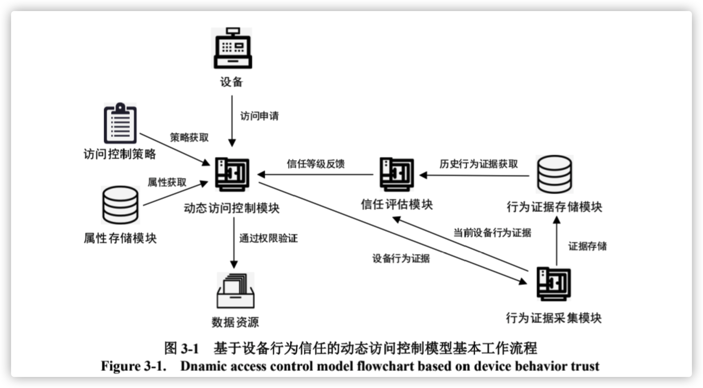
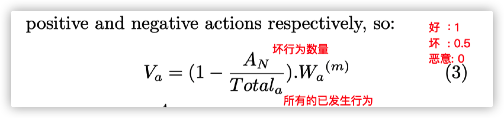
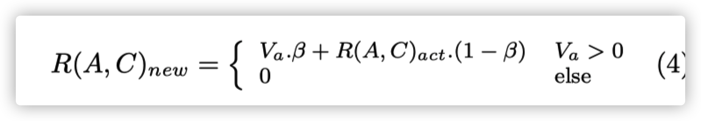
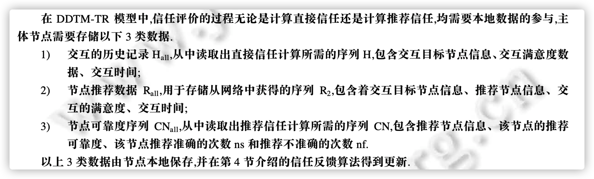

## 信任管理问题


1. PKG 的 Validate 服务验证设备身份。

2. 再次使用设备 C 对云端数据发起多次高频率的访问请求，**同时提高 C 的内存**
   **占用率以**让 C 的访问证据出现异常，可以发现网关对设备 C 的信任度评估开始下
   降，当前日志中设备的信任度被评估为 0.43，被分配的信任等级为 low，因此设备
   C 无法通过本次访问控制而被网关拒绝访问请求。

3. 针对传统访问控制模型缺乏对主体行为状态监控与可信度分析的问题，
   在属性访问控制模型使用实体属性对主体、客体进行统一描述的基础上引入动态
   信任的概念，**从设备访问行为证据的采集和处理**入手，建立设备行为动态信任等
   级评估机制，利用信任等级来反应设备当前访问的可信性作为授权决策的依据以
   实现对设备的动态访问控制。


4. 行为证据的获取 

   设备行为证据指用来定量评估设备访问行为信任水平的基础数据，可通过软
   硬件检测工具或技术获取，目前获取行为证据的方法有：入侵检测工具如 Snort、
   RealSecur，可以检测端口扫描等恶意或可疑行为；流量检测工具如 Bandwidthd，
   可查看 IP 流量等网络状态；网络数据采集工具如 NetFlow Tracker，可实时获取设
   备带宽利用率等证据；网关自带的审计与跟踪系统对设备访问的监测中产生的审计记录和操作日志等系统事件记录。




5. 云端数据


6. 找不到访问控制策略表

​      

这里代码的 主体信任等级是 数值易于比较 而不是normal


jcasbin

https://www.bilibili.com/read/cv7682262/


任务:

用java 采取linux 系统信息


信任管理证据:

* cpu利用率

* 内存利用率

* 丢包率

* 平均吞吐量


```java
import java.io.BufferedReader;
import java.io.FileInputStream;
import java.io.IOException;
import java.io.InputStreamReader;
import java.util.ArrayList;
import java.util.HashMap;
import java.util.List;
import java.util.Map;
import java.util.StringTokenizer;
 
import org.apache.commons.io.FileSystemUtils;
 
public class OSUtils {
 
    /**
     * 功能：可用磁盘
     * */
    public static int disk() {
        try {
            long total = FileSystemUtils.freeSpaceKb("/home");
            double disk = (double) total / 1024 / 1024;
            return (int) disk;
        } catch (IOException e) {
            e.printStackTrace();
        }
        return 0;
    }
 
    /**
     * 功能：获取Linux系统cpu使用率
     * */
    public static int cpuUsage() {
        try {
            Map<?,?> map1 = OSUtils.cpuinfo();
            Thread.sleep(5 * 1000);
            Map<?,?> map2 = OSUtils.cpuinfo();
 
            long user1 = Long.parseLong(map1.get("user").toString());
            long nice1 = Long.parseLong(map1.get("nice").toString());
            long system1 = Long.parseLong(map1.get("system").toString());
            long idle1 = Long.parseLong(map1.get("idle").toString());
            long user2 = Long.parseLong(map2.get("user").toString());
            long nice2 = Long.parseLong(map2.get("nice").toString());
            long system2 = Long.parseLong(map2.get("system").toString());
            long idle2 = Long.parseLong(map2.get("idle").toString());
            long total1 = user1 + system1 + nice1;
            long total2 = user2 + system2 + nice2;
            float total = total2 - total1;
            long totalIdle1 = user1 + nice1 + system1 + idle1;
            long totalIdle2 = user2 + nice2 + system2 + idle2;
            float totalidle = totalIdle2 - totalIdle1;
 
            float cpusage = (total / totalidle) * 100;
            return (int) cpusage;
        } catch (InterruptedException e) {
            e.printStackTrace();
        }
        return 0;
    }
 
    /**
     * 功能：cpu使用信息
     * */
    public static Map<?,?> cpuinfo() {
        InputStreamReader inputs = null;
        BufferedReader buffer = null;
        Map<String,Object> map = new HashMap<String,Object>();
        try {
            inputs = new InputStreamReader(new FileInputStream("/proc/stat"));
            buffer = new BufferedReader(inputs);
            String line = "";
            while (true) {
                line = buffer.readLine();
                if (line == null) {
                    break;
                }
                if (line.startsWith("cpu")) {
                    StringTokenizer tokenizer = new StringTokenizer(line);
                    List<String> temp = new ArrayList<String>();
                    while (tokenizer.hasMoreElements()) {
                        String value = tokenizer.nextToken();
                        temp.add(value);
                    }
                    map.put("user",temp.get(1));
                    map.put("nice",temp.get(2));
                    map.put("system",temp.get(3));
                    map.put("idle",temp.get(4));
                    map.put("iowait",temp.get(5));
                    map.put("irq",temp.get(6));
                    map.put("softirq",temp.get(7));
                    map.put("stealstolen",temp.get(8));
                    break;
                }
            }
        } catch (Exception e) {
            e.printStackTrace();
        } finally {
            try {
                buffer.close();
                inputs.close();
            } catch (Exception e2) {
                e2.printStackTrace();
            }
        }
        return map;
    }
 
    /**
     * 功能：内存使用率
     * */
    public static int memoryUsage() {
        Map<String,Object>();
        InputStreamReader inputs = null;
        BufferedReader buffer = null;
        try {
            inputs = new InputStreamReader(new FileInputStream("/proc/meminfo"));
            buffer = new BufferedReader(inputs);
            String line = "";
            while (true) {
                line = buffer.readLine();
                if (line == null)
                    break;
                int beginIndex = 0;
                int endIndex = line.indexOf(":");
                if (endIndex != -1) {
                    String key = line.substring(beginIndex,endIndex);
                    beginIndex = endIndex + 1;
                    endIndex = line.length();
                    String memory = line.substring(beginIndex,endIndex);
                    String value = memory.replace("kB","").trim();
                    map.put(key,value);
                }
            }
 
            long memTotal = Long.parseLong(map.get("MemTotal").toString());
            long memFree = Long.parseLong(map.get("MemFree").toString());
            long memused = memTotal - memFree;
            long buffers = Long.parseLong(map.get("Buffers").toString());
            long cached = Long.parseLong(map.get("Cached").toString());
 
            double usage = (double) (memused - buffers - cached) / memTotal * 100;
            return (int) usage;
        } catch (Exception e) {
            e.printStackTrace();
        } finally {
            try {
                buffer.close();
                inputs.close();
            } catch (Exception e2) {
                e2.printStackTrace();
            }
        }
        return 0;
    }
}
```


### 信任模型

#### 1. PTM (Personalized Trust Model)

在该模型中，信任依赖于节点过去的历史交互经验 ,声望通过其他节点的推荐和意见计算得出;随后 ,通过加权平均的方法将这两个参数合并成最终的信任评价 ，而加权平均的权重会对该模型信任评估的准确性产生影响。

​       


**信任形成过程:** 

​	第一次加入的实体不需要证据来建立信任值。但是为了建立初始值，我们用两个数据 

 1.  直接的信息

    直接的信息根据实体的特征、属性和在现实世界中的相互联系得出。

    如果实体是未知的，根据相应的安全策略，建立一个信任关系，给他一个默认的初始信任值，

    当了解了这个实体这个值可以根据用户或者额外的信息增加。

 2. 间接的信息

    当两个互相未知的实体想要交互时，可信第三方(TTP) 有可能推荐 C实体 -> A实体

    通过两种方式:

    1. 推荐信任值 (recommended trust value)
    2. 证书 （certificate）

这两种机制都被称为" 推荐 (recommendations) " 需要信任值去计算实体C的信任级别

设定 想要建立连接 实体C    可信第三方 B    接收连接 实体A

* B 给 A一个推荐信任值 Rb ，Rb就是B的信任值

* 推荐是通过B的证书发布时，我们认为 Rb 为 1，因为传统的 PKI 是 boolean。

  一个证书只能被认为是信任的，或者不信任的 (拒绝的)。


**信任值计算**






**实验验证:**

SL(smart lab) 集成和嵌入设备。设备可以提供各种服务 如: 打印、复印、传真、视频监控、多媒体放映。 

这些设备被不同的人使用。

B: 熟悉的使用者 (研究人员，教授)

C : 访问者  可以使用SL的服务通过自动配置，c使用某个设备服务时，自动设置信任关系对于设备，而不是找管理员要一个远程的ca认证许可。


ci 操作某个实体，请求服务，在案例中我们假设我们没有ci 的任何信息，然后我们授权ci允许服务通过给他一个信任的初始值0.5，β也是0.5。信任等级m: 2。

B的信任等级 m:1 。因为B在一个更安全的环境中。


### **信任度计算方式:**


#### 方法一: 层次分析法

#### 方法二: 向量机


#### 方法三:

考虑信任可靠度的分布式动态信任管理模型

对信任数据可靠性的评估


本地数据存储: 



