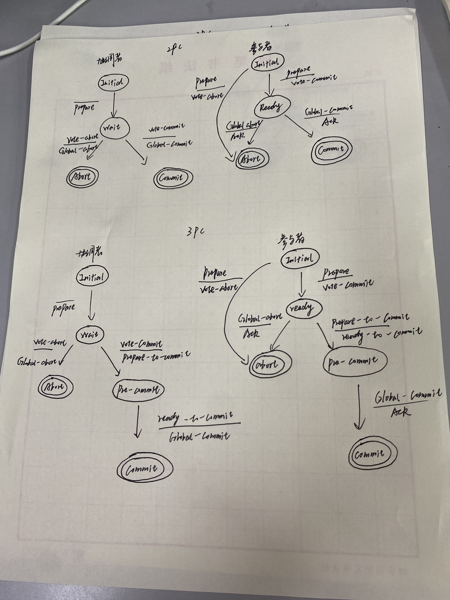

## 分布式数据库系统

### 论述

**一. 分布式数据库设计时，为什么要对数据进行分片？什么是关系的片段？关系的片段有哪些主要类型？**

对数据分片的目的是产生一个对全局数据合适的划分方案，使用这种方案得到的片段作为分布式数据库中数据的分配和存储单位时，不但能够减少应用中的操作量，而且能够对于应用具有最大可能的本地性，即使得各片段位于其使用最多的站点。

* 数据量大时不适合把整张表(关系)存储在数据库节点上，会出现大量不必要的远程数据访问或数据复制
* 分片支持横向扩展，分散负载时只需要添加机器
* 分片后，以片段作为单位可以支持事务的并发执行，增加并发度，提高系统吞吐量

关系的片段: 对数据库管理系统中的关系进行分割，将分割后得到的各部分元组，就称为该关系的逻辑片段。

关系的片段主要类型有 :

（ 1 ）水平片段：按一定的条件把全局关系的所有元组划分成若干不相交的子集，每个子集 为关系的一个片段。也是通过对一全局对象的实例（或元组）进行选择得到的子集构。

（ 2 ）垂直片段：把一个全局关系的属性集分成若干子集，并在这些子集上做投影运算，每个投影为垂直分片。也是通过将全局对象在其属性子集上进行投影得到的。

（ 3 ）混合分片：将水平分片与垂直分片方式综合使用则为混合分片。

**二. 数据分片应遵守哪些基本原则？数据分片有哪些基本类型和方法？**

*  若 R={R1 ， R2 ，…， Rn} 满足：

   1) **完整性** (completeness) 条件：

   如果 a ∈ R ，则必有 a ∈ Ri ， i=l ， 2 ，…， n

   2) **可重构** (reconstructed) 条件：

   R= ∪ Ri ， ( 水平分片 ) 或 R= ∞ Ri ， ( 垂直分片 ) 

   3) **不相交** (disjoint) 条件：

   Ri ∩ Rj= φ， i ≠ j ， i ， j ： =1 ， 2 ，…， n( 水平分片 )

   Ri ∩ Rj= 主键属性， i ， j=1 ， 2 ，…， n( 垂直分片 )

  有两种基本的数据分片方法：

  （ 1 ）使用**水平分片**方法得到水平片段，水平片段是通过对一全局对象的实例 ( 或元组 ) 进行选择得到的子集构成。

  水平分片是对全局关系执行“选择”操作，把具有相同性质的元组进行分组，构成若干个不相交的子集。水平分片的方法可归为初级分片 (primary fragmentation) 和导出分片 (derivation fragmentation) 两类。

  （ 2 ）使用**垂直分片**方法得到垂直片段，垂直片段是通过将全局对象在其属性子集上进行投影得到的。

  一个全局关系的垂直分片是通过“投影”操作把它的属性分成若干组。确定一全局关系 R 的垂直分片需要根据应用以“同样方式” ( 例如具有相同的使用频率 ) 访问的属性来进行分组。这里把垂直分片问题和垂直群集 (vettical clustering) 问题区分开来，垂直分片的组必须只焦基个键属性上重叠，其他属性不可重叠，而垂直群集的组在其他属性上也可以重叠。

  通过交替水平分片与垂直分片，可以产生**混合分片**。

**三. 概述基于关系代数等价变换的查询优化算法的基本原则和实现步骤。**

基本原理： 把查询问题转变为 关系代数 表达式 , 分析得到查询树 ( 语法树 ), 进行从全局到片段的变换得到基于片段的查询树 , 然后利用 关系代数 变换规则的优化算法 , 尽可能先执行选择和投影操作 . 这样 , 一方面可以减少其后操作的操作量 , 另一方面可以减少操作次数 . 对该查询树进行优化 , 从而达到查询优化的目的 .

实现步骤：

1、  将一个查询问题转换成关系代数表达式

2、  从关系代数表达式到查询树的变换：对一个关系代数表达式进行语法分析，可以得到一颗语法书，即树的叶子是已知的关系（或片段）、树的结点是关系操作符、节点是按代数表达式中的操作顺序组成的一组关系操作符。

3、  从全局查询到片段查询的变换：在具有分片透明性的系统中，这个变换的典型方法是：把基于全局关系的查询树中的全局关系名用其重构该全局关系的各片段名替换，变换成相应在片段上的查询树。

4、  利用关系代数等价变换规则的优化算法，对片段上的查询树进行优化处理，最后达到优化查询的目的。

**四. 概述两阶段提交协议的执行过程。**

1. 协调者进入初始状态，将一个 begin_commit 写入日志中，向所有参与站点发送prepare消息，进入WAIT等待状态
2. 参与者收到prepare 消息，检查是否可以提交事务
   * 可以，将 ready 记录写入到日志中，向协调者发送 vote-commit 消息
   * 不可以，将 abort 记录写入到日志中吗，向协调者发送 vote-abort 消息。单方面取消，直接将事务丢弃
3. 协调者收到所有参与者的回复，决定取消事务还是提交
   * 有任何一个参与者投了否决票，执行全局取消，协调者将 abort 写入到日志中，向所有参与者发送 global-abort，并进入 abort 状态。
   * 所有参与者都发送了提交消息，执行全局提交，协调者将 commit 写入到日志中，向所有参与者发送 global-commit 消息，进入 commit状态。
4. 参与者收到全局请求，向协调者发送 ACK，协调者收到所有ACK,终结这个事务，把 end_of_transaction记录写入到日志中。

2pc中，参与者在ready阶段等待协调者的global-commit/global-abort时超时，但是参与者已经投了vote-commit，此时他既不能单方面取消事务（万一大家都投了vote-commit，结果你自己取消了，数据不一致了），也不能提交事务（也许别的参与者投了取消），可能是协调者发生了故障，那么参与者就要一直被阻塞。

**五. 采用 DATAID-D 方法的分布式数据库设计与传统的集中式数据库设计在步骤和内容上有什么不同？**

DATAID—D 是作为集中式数据库设计 DATAID 一 1 方法论的扩充而构造的，后者分成四个阶段：需求分析、概念设计、逻辑设计和物理设计。 DATAID—D 要求对其增加两个阶段：分布要求分析阶段和分布设计阶段

 1) 分布要求分析阶段：需要这一阶段是为了收集关于分布的信息，如水平分片的划分谓词，每一应用在各站点激活的频率等。为了收集关于数据和应用分布的信息，必须从概念设计阶段的某些结果出发来收集关于分布要求。因此，分布要求分析阶段将位于概念设计阶段之后。

2) 分布设计阶段：这一阶段始于全局数据库模式的规格说明和所收集的分布要求，然后产生全局数据的分片模式和片段的位置分配模式，分配模式描述了分配在各站点上的数据情况。

**六. 描述分布式事务的可串行化理论的一些定义：事务、冲突操作、并发调度、串行调度、一致性调度、两个调度等价、可串行化调度。**

事务 ：在分布式系统中，事务是一个分布式操作的序列，被操作的数据分布在不同的站点上。

冲突操作 ：如果两个操作 P 和 Q ，对同一个数据 X 操作，其中至少有一个是写操作 W(X) 则 P 和 Q 称为冲突操作。

并发调度 ：并发事务的一个调度简称并发事务。

串行调度 ：若一个调度 S ，其每个事务的执行均有 Ti<Tj ，即事务 Ti 所有操作都先于事务 Tj 操作，每个事务相继执行，这样的调度 S 成为串行调度。

一致性调度 ：执行一个调度可以使得数据库从一个一致性状态转变为另一个一致性状态，则称调度为一致性调度。

可串行化调度 ：如果一个调度等价于某个串行调度，则该调度称为可串行调度。

两个调度等价 ：冲突等价以及视图等价。

**七. 在分布式数据库系统中如何产生和调整全局时标？讨论基于时标的并发控制技术中的基本时标和保守时标法。**

**全局时标分配方法：**

使用全局的单调递增的计数器，全局的计数器维护是个难题。全局唯一时间的形成与调整：每个站点设置一个计数器 , 每发生一个事务 , 计数器加一。发送报文时包含本地计数器值 , 近似同步各站点计数器。

**基本时标法规则：**

每个事务在本站点开始时赋予一个全局 唯一时标。在事务结束前，不对数据库进行物理更新。事务的每个读操作或写操作都具有该事务的时标。对每个数据项 x, 记下写和读操作的最大时标，记为 WTM(x) 和 RTM(x) 。如果事务被重新启动，则被赋予新的时标。

**保守时标法规则：**

每个事务只在一个站点执行 , 它不能激活远程的程序 , 但是可以向远程站点发读写请求。站点 i 接收到来自不同站点 j 的读 写请求必须按时标顺序，即每个站点必须按时标顺序发送读写数据请求，在传输中也不会改变这个顺序。每个站点都为其它站点发来的读 写操作开辟一个缓冲区 分别保存收到的读写申请 。

**八. 乐观并发控制技术和其他的并发控制技术的异同，为什么它们也被称为确认或者验证技术？讨论一个乐观并发控制方法的典型阶段。**

并发控制乐观方法的基本思想是：对于冲突操作不像悲观方法那样采取挂起或拒绝的方法，而是让一个事务执行直到完成。在乐观方法中，改变了通常每个“读集包含写集”事务执行的三个阶段的顺序，

（1）读/计算阶段；

（2）验证阶段；

（3）写阶段。

**九. 掌握三阶段提交协议中事务状态转换图，并结合图简述其原理。**

**十. 为什么说可串行化是个过于严格的正确性条件？请给出一个例子，能保证一致性，却不是可串行化的。**

**十一. 什么是三阶段提交协议？讨论三阶段提交协议的终结协议和三阶段提交**

**协议的恢复协议。**

三阶段提交协议 :为非阻塞而设计的协议， 在 2PC 的等待状态和提交状态之间增加一个状态，作为一个缓冲，用于在准备提交但是还没有提交的时候。 因为从初始状态到提交状态之间有三次状态转换，所以称为三阶段提交协议。

终结协议:

* 协调者超时

  * Wait状态超时，协调者单方面取消事务，日志写入abort，发送 global-abort
  * pre-commit状态超时，重发上一阶段的 prepare-to-commit
  * commit/abort阶段超时，不做处理，让参与者超时处理

* 参与者超时

  * 等待prepare消息，**Initial状态超时**，必然协调者在initial发生故障，单方面取消事务，如果之后收到prepare消息，可以检查日志，寻找abort记录，回复 vote-abort，或者直接不管，让协调者在wait状态下超时，取消事务。
  * **Ready状态超时**，参与者已经投过票了，既不能单方面终止事务，也不能自己提交事务，这时选举一个新的协调者。新的协调者采取终结协议。
  * **PreCommit状态超时**，情况同Ready状态超时。新的协调者采取终结协议。

  新的协调者终结协议:

  根据新的协调者所处的阶段进行处理

  * Wait阶段，全局取消事务。发送global-commit
  * Precommit阶段，全局提交事务
  * Abort阶段 ，全局取消事务

恢复协议:

* 协调者故障
  * Initial 状态时故障，恢复时启动提交进程
  * Wait 状态故障,参与者处于ready状态超时，会重新选举协调者执行终结计划，所以恢复时，询问事务的终结情况
  * Pre-Commit 状态故障，已经选举了新的协调者进行了终结协议，有可能事务Commit或者abort，所以需要向参与者询问事务的情况
  * Commit/Abort 状态故障，已经发出了最终决策。
    * 如果收到所有ACK，什么都不做
    * 如果没有收到所有ACK，执行终结协议

* 参与者故障
  * Initial 状态故障，恢复时，参与者直接单方面取消(反正协调者已经超时了)
  * Ready 状态故障，恢复时，类似于Ready状态超时，执行终结协议，选举新的协调者
  * Pre-Commit 状态故障，向其他参与者询问事务终结情况
  * Abort/Commit 状态故障，事务已经终结，不做处理

**十二. 概述基于直接连接算法查询优化的基本原理和适用情形。**

基本原理： 基于直接连接算法的查询优化处理中的站点依赖算法、分片和复制算法。站点依赖和数据复制算法，以及 Hash 划分算法，主要是使得连接操作的数据传送量小（最好是无数据传送）和负载均衡，从而达到优化的目的。

使用情形： 直接连接查询优化的算法有四种，通过比较，站点依赖算法的数据传送量最小（实际上没有），连接数据量最小切利用索引，因而能获得最佳性能。其次是 Hash 划分算法，最后是片段和复制算法。尽管如此，站点依赖算法只有在给出适当的可用语义信息时才使用； Hash 划分算法要求相对均匀的数据分布来得到良好的性能，最坏的情况下，两个关系可能被映射到同一个站点，而达不到负载均衡；在某个关系已经复制在包含其他关系片段的站点中，可在本地立即进行无数据传送处理，这种场合下使用分片和复制算法要好于 Hash 划分算法。在高速的局域网中，本地处理的代价也必须考虑在内，那么使用全连接是比较合适的。此时，查询优化策略就是去确定选择执行全连接的最佳方法。

### 分析设计 

一. 为什么说在关系型分布式数据库中使用导出式水平分片，使关系之间的连接 变得更加容易？试举一例。

全局关系的导出式水平分片不是以其自身的属性性质为基础，而是从另一个关系的属性性质或水平片段推导出来的。采用导出分片可使片段与片段之间的“连接” (join) 变得更容易。

 例：  设全局关系 SC(S# ． po’d C# ， SCORE) 

 S(S# ， SNAME ， AGE ， SEX)

 若要将 SC 划分为男生的各门课成绩和女生的各门课成绩。这就不可能从 SC 本身的属性性质来执行选择，必须从关系 S 的属性性质或水平片段来导出。

 define fragment SC 1 as 

 select SC ． S# ， C# ， SCORE from SC ， S

 where SC ． S#=S.S# and SEX=’M’

 define fragment SC2 as

 select SC.S# ， C# ， SCORE from SC ， S

 where SC.S#=S.S# and SEX=’F’

 如果 S 已经进行水平分片，分为 SF 、和 SM ，分别为男生全体和女生全体，则上述的片段定义可以基于片段 SF 和 SM 导出：

 define fragment SC 1 as

 select*from SC where S# in(select SF.S# from SF)

 define fragment SC2 as

 Select * from SC where S# in(select SM.S# from SM)

 由此可见，使用导出式水平分片，使关系之间的连接变得更加容易。这是因为可将连接条件代之以子查询，从而使它变为一般的判别条件。

二. 讨论两阶段提交协议的终结协议和两阶段提交协议的恢复协议

终结协议:

- 协调者超时

  - Wait状态超时，协调者单方面取消事务，日志写入abort，发送 global-abort
  - commit/abort阶段超时，不做处理，让参与者超时处理

- 参与者超时

  - 等待prepare消息，**Initial状态超时**，必然协调者在initial发生故障，单方面取消事务，如果之后收到prepare消息，可以检查日志，寻找abort记录，回复 vote-abort，或者直接不管，让协调者在wait状态下超时，取消事务。

  - **Ready状态超时**，参与者已经投过票了，既不能单方面终止事务，也不能自己提交事务，只能等待最终的决策，被阻塞住了。

    

恢复协议:

- 协调者故障
  - Initial 状态时故障，恢复时启动提交进程
  - Wait 状态故障, 恢复时重新发送prepare消息从零开始重启事务
  - Commit/Abort 状态故障，已经发出了最终决策。
    - 如果收到所有ACK，什么都不做
    - 如果没有收到所有ACK，执行终结协议

- 参与者故障
  - Initial 状态故障，恢复时，参与者直接单方面取消(反正协调者已经超时了)。
  - Ready 状态故障，恢复时，类似于Ready状态超时，执行终结协议。
  - Abort/Commit 状态故障，事务已经终结，不做处理。

三. 考虑下图公司数据库的分片和分布情况，假设该公司有 3 个计算机站点，站 点 2 和 3 分别属于部门 2 和 3。现在希望在站点 2 和 3 上分别频繁访问 EMPLOYEE 和 PROJECT 表中有关工作在该部门的雇员和该部门管辖的项目信息。雇员信息 主要是指 EMP 表中的 NAME、SSN、SALARY 和 SUPERSSN 属性。站点 1 供公司 总部（部门 1）使用，除了经常存取为社会保险目的而记录的 DEPENDENT 信 息外， 还定期地存取所有雇员和项目的信息。 根据给出的这些要求， 对 COMPANY 关系数据库中的关系进行分片和分布设计。(注：主键用下标线标出)

整个数据库存放在站点1,对要复制到站点2和站点3的数据进行分片。

先根据Department 表的主码DNO进行水平分片，然后基于外码部门号(DNO)将导出的片段应用到关系Employee、Project、Dept_Location上。再对Employee片段进行垂直分片，得到只含属性(Name,ESSN，Salary,Superssn,Dno)的片段。

Project、Dept_Location、Department根据相应的部门编号进行分片，分配给对应的站点。

现在只剩下 works_on 表需要分配。由于Works_on只有员工编号和项目编号和工期，无法确定数据是哪个部门的。所以我们可以根据员工编号连接employee表得到DNO，根据这个DNO进行垂直切片得到新的works_on表(ESSN、PNO、HOURS、DNO)再根据DNO水平切片分给相应的部门。

https://blog.csdn.net/DreamFarLoveNear/article/details/104997369
