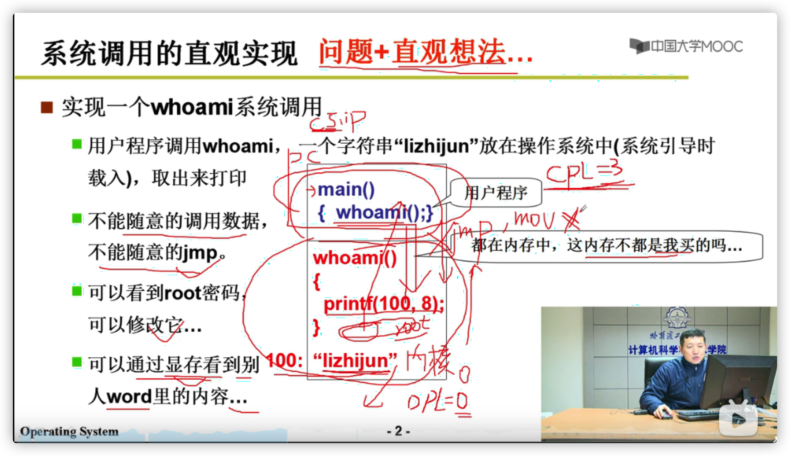
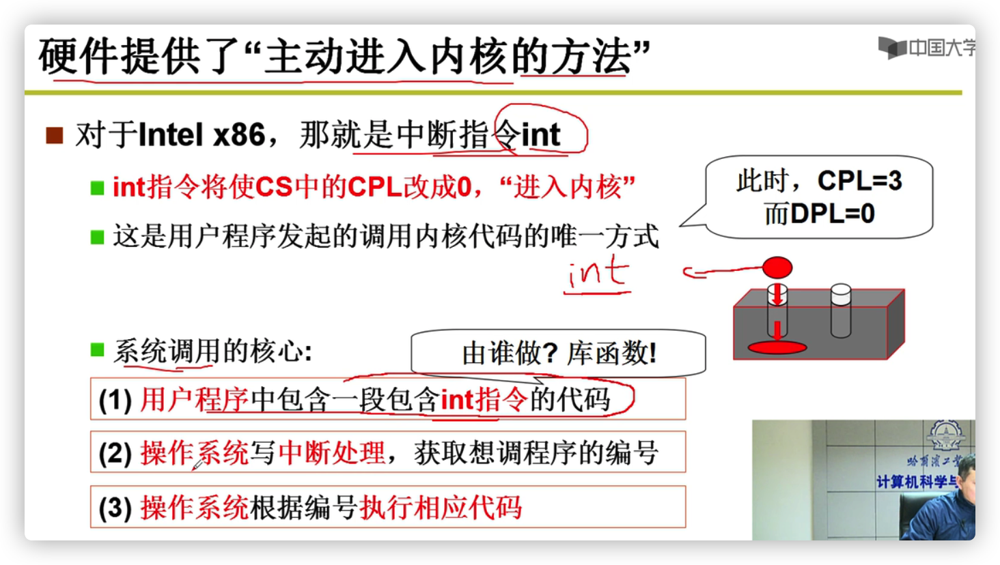
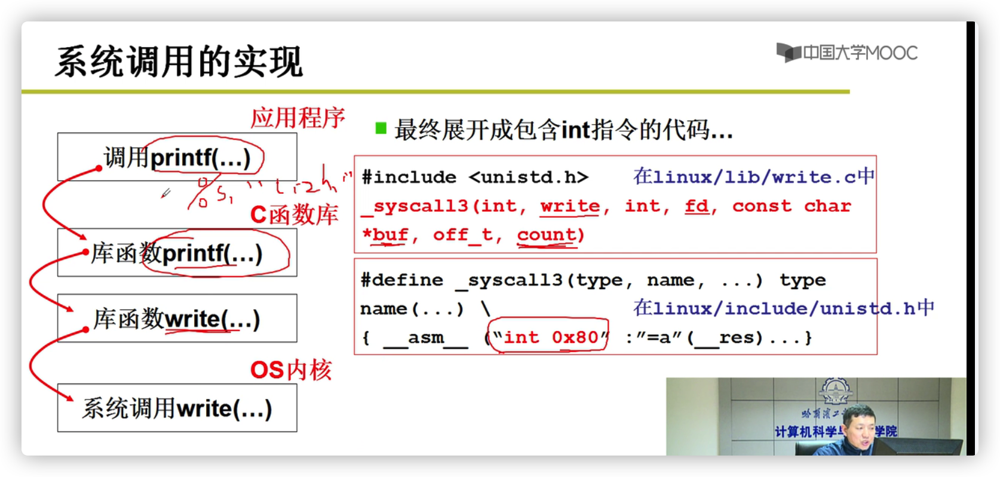
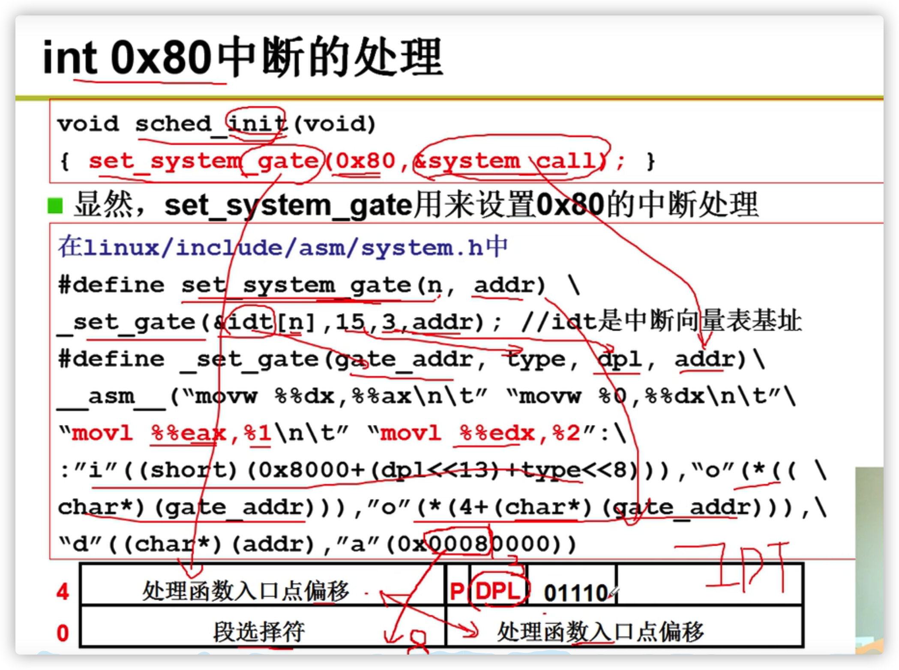

## 操作系统

### 1.系统调用的实现

> 为什么应用级别的函数无法获取内核中的地址？比如 jmp 

为了安全考虑，设计了(硬件级别)检查

* CPL（current provilege level）当前进程的权限级别
* DPL（Descriptor Privilege Level）访问该段的权限级别，每个段的DPL固定
* RPL (request Privilege level) 请求权限等级

操作系统初始化的时候，会对内核态的代码和数据建立GDT (全局描述符表)如下图，对应的DPL为0。0为最高等级。

用户态的程序指令cpl=3，检查指令是否合法符合特权级要求。只有cpl <= dpl 才合法。

进入内核时，cpl变为0，也只有cpl为0的指令才可以进入内核。每一次跳转jmp还是mov指令都要访问GDT表，因为要访问段寄存器，通过段地址进行跳转，访问GDT表的时候发现DPL=0,CPL=3，cpl > dpl 无权访问。

> 那程序指令如何进去内核？	

例如 printf() ，应用程序调用printf()，printf() 会调用c函数库中的printf()，这里的printf()里面包含了操作系统的库函数write()

write()接口 转成汇编就包含了中断，可以进入内核。

中断触发的时候，访问IDT(Interrupt Descriptor table) 中断描述表，这里也有DPL，并且故意设置成了3。可以访问。

