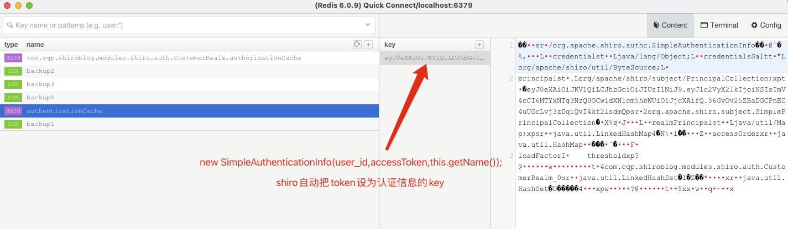

## 简单实用! 前后端分离 shiro + springboot +mybatis+ Jwt 实现权限管理

 

​	之前学习了shiro和Jwt，就想找个项目练一下手，可是b站上没有找到前后端分离加上用shiro和jwt做权限控制的教程。后来看到一篇文章https://blog.csdn.net/weixin_42236404/article/details/89319359，这篇文章对于shiro流程的讲解对我非常有帮助，我用mybatis 和 JWT 结合了一下这篇文章的源码。

​	代码地址:

### 1.Jwt简介

json web token 是一个开放标准，通过 json 的形式作为 web 应用中的令牌，用于在各方之间安全地将信息作为 json 对象传输。

#### 1.1 Jwt能做什么？

1. 授权   

​       一旦用户登录，每个后续请求将包括JWT,从而允许该用户访问该令牌允许的路由，服务和资源。 **单点登录**是当今广泛使用JWT的一项功能。

2. 信息交换

   jwt 可以很好的在各方之间安全的传输信息。因为可以对 jwt进行签名，所以可以确保发件人的身份。签名是用标头和有效负载计算的，还可以验证内容是否被篡改。


ps: 在本项目中 Jwt 起到用户凭证和保存用户简单信息的作用。

本人学习视频：https://www.bilibili.com/video/BV1i54y1m7cP


### 2.1 Shiro简介

Apache Shiro是Java的一个安全框架。目前，使用Apache Shiro的人越来越多，因为它相当简单，对比Spring Security，可能没有Spring Security做的功能强大，但是在实际工作时可能并不需要那么复杂的东西，所以使用小而简单的Shiro就足够了。

本人学习视频:https://www.bilibili.com/video/BV1uz4y197Zm


### 3.开始


#### 3.1 使用的依赖

```xml
<!-- shiro-->
      <dependency>
         <groupId>org.apache.shiro</groupId>
         <artifactId>shiro-spring</artifactId>
         <version>1.3.2</version>
      </dependency>
      <!--mp-->
      <dependency>
         <groupId>com.baomidou</groupId>
         <artifactId>mybatis-plus-boot-starter</artifactId>
         <version>3.2.0</version>
      </dependency>
        <!-- 引入jwt-->
        <dependency>
            <groupId>com.auth0</groupId>
            <artifactId>java-jwt</artifactId>
            <version>3.11.0</version>
        </dependency>

```

#### 3.2 自定义的Token 


```java
public class JwtToken implements AuthenticationToken {

    private String token;

    public JwtToken(String jwt){
        this.token = jwt;
    }

    @Override
    public Object getPrincipal() {
        return token;
    }
  
    @Override
    public Object getCredentials() {
        return token;
    }
}
```


#### 3.3 自定义Filter 

```java
@Component
public class AuthFilter extends AuthenticatingFilter {
    private static final ObjectMapper MAPPER = new ObjectMapper();
    /**
     *  把请求中的token封装为自定义的token
     */
    @Override
    protected AuthenticationToken createToken(ServletRequest servletRequest, ServletResponse servletResponse) throws Exception {
        System.out.println("进入createToken");
        HttpServletRequest request = (HttpServletRequest) servletRequest;
        String jwt = request.getHeader("Authorization");
        if(org.springframework.util.StringUtils.isEmpty(jwt)){
            return null;
        }
        return new JwtToken(jwt);

    }
    /**
     * 步骤1. 将所有请求拒绝访问除了（Option请求）
     */
    @Override
    protected boolean isAccessAllowed(ServletRequest request, ServletResponse response, Object mappedValue) {
        System.out.println("---进入 isAccessAllowed---");
        if(((HttpServletRequest)request).getMethod().equals(RequestMethod.OPTIONS.name())){
             return true; // 放行OPTIONS请求
        }
        return false;
    }

    /**
     *  步骤2.拒绝访问的请求，会调用 onAccessDenied方法,onAccessDenied方法先获取 token,再调用executeLogin方法
     */
    @Override
    protected boolean onAccessDenied(ServletRequest request, ServletResponse response) throws Exception {
        // 先获取请求的token,token 不存在的话就返回
        System.out.println("---进入onAccessDenied---");
        String jwt = JWTUtils.getRequestToken((HttpServletRequest) request);
        if(StringUtils.isBlank(jwt)){
            HttpServletResponse httpResponse = (HttpServletResponse) response;
            httpResponse.setHeader("Access-Control-Allow-Credentials", "true");
            httpResponse.setHeader("Access-Control-Allow-Origin", HttpContextUtil.getOrigin());
            httpResponse.setCharacterEncoding("UTF-8");
            Map<String,Object> result = new HashMap<>();
            result.put("status",403);
            result.put("msg","请先登陆");
            String json = MAPPER.writeValueAsString(result);
            httpResponse.getWriter().print(json);
            return false;
        }
        // 校验 jwt 失效就会报错
        JWTUtils.verify(jwt);
        // 执行登录
        return executeLogin(request,response); // shiro的 AuthenticatingFilter 中会调用 subject.login(token) 和createToken;
    }

    /*
    token失效的时候调用
     */
    @Override
    protected boolean onLoginFailure(AuthenticationToken token, AuthenticationException e, ServletRequest request, ServletResponse response) {
        System.out.println("---进入onloginfailure---");
        HttpServletResponse httpResponse = (HttpServletResponse) response;
        httpResponse.setContentType("application/json;charset=utf-8");
        httpResponse.setHeader("Access-Control-Allow-Credentials", "true");
        httpResponse.setHeader("Access-Control-Allow-Origin", HttpContextUtil.getOrigin());
        httpResponse.setCharacterEncoding("UTF-8");
        try {
            //处理登录失败的异常
            Throwable throwable = e.getCause() == null ? e : e.getCause();
            Map<String, Object> result = new HashMap<>();
            result.put("status", 403);
            result.put("msg", "登录凭证已失效，请重新登录");
            String json = MAPPER.writeValueAsString(result);
            httpResponse.getWriter().print(json);
        } catch (IOException e1) {
        }
        return false;
    }
}
```

#### 3.4 自定义Realm

```java
@Component
public class CustomerRealm extends AuthorizingRealm {
    @Autowired
    UserService userService;
    @Override
    public boolean supports(AuthenticationToken token) {
        return token instanceof JwtToken;
    }
    @Override
    protected AuthorizationInfo doGetAuthorizationInfo(PrincipalCollection principalCollection) {
        System.out.println("====CustomerRealm.授权====");
        // 1.获取登录用户的信息
        String user_id=(String) principalCollection.getPrimaryPrincipal();
        // 2.添加角色和权限
        SimpleAuthorizationInfo simpleAuthorizationInfo = new SimpleAuthorizationInfo();
        User user = userService.findRolesByUserId(Integer.parseInt(user_id));
        for(Role role : user.getRoles() ){
            // 2.1 添加角色
            simpleAuthorizationInfo.addRole(role.getRoleName());
            Integer roleId = role.getRoleId();
            Role role_permission = userService.findPermissionByRoleId(roleId);
            for(Permission permission : role_permission.getPermissions()){
                //2.1.1添加权限
                simpleAuthorizationInfo.addStringPermission(permission.getPermission());
                System.out.println("permissions: "+permission.getPermission());
            }
        }
        return simpleAuthorizationInfo;
    }
    @Override
    protected AuthenticationInfo doGetAuthenticationInfo(AuthenticationToken token) throws AuthenticationException {
        System.out.println("====CustomerRealm.认证====");
        DecodedJWT tokenInfo = JWTUtils.getTokenInfo((String) token.getPrincipal());
        String accessToken = (String) token.getPrincipal();
        String user_id = tokenInfo.getClaims().get("user_id").asString();
        /*
        String user_id = tokenInfo.getClaims().get("user_id").asString();
        String username = tokenInfo.getClaims().get("username").asString();
        可以根据 user表的 status字段锁定账户
        if(user.getStatus() == -1){
        throw new LockedAccountException("账户已被锁定");
        }
         */
        return new SimpleAuthenticationInfo(user_id,accessToken,this.getName());
    }
}
```

#### 3.5 ShiroConfig

```java
@Component
public class ShiroConfig {
    @Bean("securityManager")
    public SecurityManager securityManager(@Qualifier("getRealm") Realm realm) {
        DefaultWebSecurityManager securityManager = new DefaultWebSecurityManager();
        securityManager.setRealm(realm);
        securityManager.setRememberMeManager(null);
        return securityManager;
    }
    @Bean("shiroFilter")
    public ShiroFilterFactoryBean shirFilter(SecurityManager securityManager) {
        ShiroFilterFactoryBean shiroFilter = new ShiroFilterFactoryBean();
        shiroFilter.setSecurityManager(securityManager);
        //auth过滤
        Map<String, Filter> filters = new HashMap<>();
        // 设置过滤
        filters.put("auth", new AuthFilter());
        shiroFilter.setFilters(filters);
        Map<String, String> filterMap = new LinkedHashMap<>();
        // anno匿名访问  auth验证
        filterMap.put("/webjars/**", "anon");
        filterMap.put("/druid/**", "anon");
        filterMap.put("/sys/login", "anon");
        filterMap.put("/sys/register","anon");
        filterMap.put("/swagger/**", "anon");
        filterMap.put("/v2/api-docs", "anon");
        filterMap.put("/swagger-ui.html", "anon");
        filterMap.put("/swagger-resources/**", "anon");
        filterMap.put("/doc.html", "anon");
        // 除了以上路径，其他都需要权限验证
        //过滤链定义，从上向下顺序执行，一般将 /**放在最为下边 -->:这是一个坑呢，一不小心代码就不好使了;
        filterMap.put("/**", "auth");// 主要通过注解方式校验权限
        shiroFilter.setFilterChainDefinitionMap(filterMap);
        return shiroFilter;
    }
    // 创建自定义realm
    @Bean
    public Realm getRealm(){
        CustomerRealm customerRealm = new CustomerRealm();
        return customerRealm;
    }

    @Bean("lifecycleBeanPostProcessor")
    public LifecycleBeanPostProcessor lifecycleBeanPostProcessor() {
        return new LifecycleBeanPostProcessor();
    }

    // 开启注解代理（默认好像已经开启，可以不要）
    @Bean
    public AuthorizationAttributeSourceAdvisor authorizationAttributeSourceAdvisor(SecurityManager securityManager) {
        AuthorizationAttributeSourceAdvisor advisor = new AuthorizationAttributeSourceAdvisor();
        advisor.setSecurityManager(securityManager);
        return advisor;
    }
    @Bean
    public static DefaultAdvisorAutoProxyCreator getDefaultAdvisorAutoProxyCreator() {
        DefaultAdvisorAutoProxyCreator creator = new DefaultAdvisorAutoProxyCreator();
        return creator;
    }
}
```


### 4. 将权限认证信息放到redis中


#### 4.1 导入 redis依赖

```xml
<!--redis整合springboot-->
<dependency>
    <groupId>org.springframework.boot</groupId>
    <artifactId>spring-boot-starter-data-redis</artifactId>
</dependency>
<dependency>
    <groupId>org.springframework.data</groupId>
    <artifactId>spring-data-redis</artifactId>
    <version>2.4.2</version>
</dependency>
```

#### 4.2 配置redis连接

```xml
spring:
  redis:
    port: 6379
    host: 47.110.154.185
    database: 0
```

#### 4.3 确保redis服务开启

#### 4.4在 shiro包下新建cache包 

编写 RedisCache 和 RedisCacheManager

```java
public class RedisCacheManager<k,v> implements CacheManager {


    @Override
    public <K, V> Cache<K, V> getCache(String cacheName) throws CacheException {
        System.out.println("cacheName: "+cacheName);
        return new RedisCache<K,V>(cacheName);
    }
}
```

```java
public class RedisCache<k,v> implements Cache<k,v> {
    private String cacheName;
    public RedisCache() {
    }

    public RedisCache(String cacheName) {
        this.cacheName = cacheName;
    }

    private RedisTemplate getRedisTemplate(){
        RedisTemplate redisTemplate = (RedisTemplate) ApplicationContextUtils.getBean("redisTemplate");
        // RedisTemplate默认对对象进行操作  k是字符串 v就是对象 所以改变redisTemplte k的序列化方式 改为String的序列化方式
        redisTemplate.setKeySerializer(new StringRedisSerializer());
        // Redis 的 Hash 结构   Map<String,Map<String, Object>>;
        redisTemplate.setHashKeySerializer(new StringRedisSerializer());
        return redisTemplate;
    }


    @Override
    // 从redis中获取缓存
    public v get(k k) throws CacheException {
        System.out.println("redis get key:"+k);
        return (v) getRedisTemplate().opsForHash().get(this.cacheName,k.toString());
    }

    @Override
    // 把查询数据库的东西放入缓存
    public v put(k k, v v) throws CacheException {
        System.out.println("redis put key:"+k);
        System.out.println("redis put value:"+v);
        getRedisTemplate().opsForHash().put(this.cacheName,k.toString(),v);
        return null;
    }

    @Override
    // 清空指定的缓存
    public v remove(k k) throws CacheException {
        System.out.println("===remove===");
        return (v)getRedisTemplate().opsForHash().delete(this.cacheName,k.toString());
    }

    @Override
    // 清空缓存
    public void clear() throws CacheException {
        System.out.println("===clear===");
        getRedisTemplate().delete(this.cacheName);
    }

    @Override
    public int size() {
        return getRedisTemplate().opsForHash().size(this.cacheName).intValue();
    }

    @Override
    public Set<k> keys() {
        return getRedisTemplate().opsForHash().keys(this.cacheName);
    }

    @Override
    public Collection<v> values() {
        return getRedisTemplate().opsForHash().values(this.cacheName);
    }
}
```


4.5 更改 ShiroConfig 在getRealm中添加 RedisCache

```java
// 创建自定义realm
@Bean
public Realm getRealm(){
    CustomerRealm customerRealm = new CustomerRealm();
    // 开启缓存管理
    customerRealm.setCacheManager(new RedisCacheManager<>());
    customerRealm.setCachingEnabled(true); // 开启全局缓存
    customerRealm.setAuthenticationCachingEnabled(true);// 认证缓存
    customerRealm.setAuthenticationCacheName("authenticationCache");
    customerRealm.setAuthorizationCachingEnabled(true);// 授权缓存
    customerRealm.setAuthorizationCacheName("authorizationCache");
    return customerRealm;
}
```

分别给**认证信息**和**授权信息**缓存起名。传入参数 cacheName 这样采用 redis的hash存储结构，可以给缓存起名字。

一个hash结构可以放入许多个用户的认证,授权信息。


4.6 看看效果





这样之后用户就不用查询数据库去获得认证和授权的数据了，而是先去缓存里找。