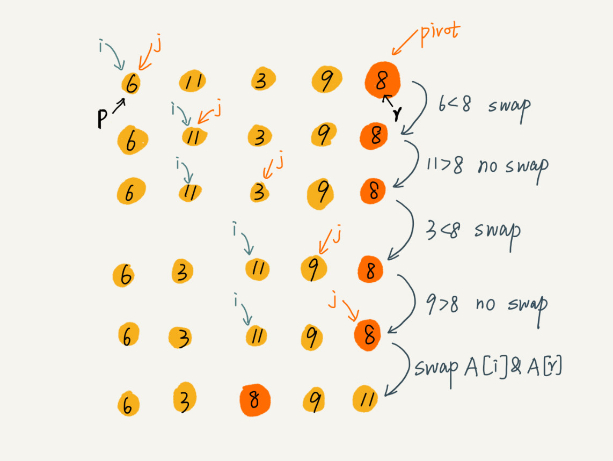

## **算法与数据结构**


我个人的习惯是找例子来引导自己的思路，一点一点的接近算法的核心。唯一需要注意的是，一定要写代码，光看没有用的。对于经典算法的学习，大体上分成几个阶段：

- 第一阶段：对于某一个具体的算法，首先要搞清楚这个算法解决的问题是什么，可能是实现一个具体的功能，也可能是在某些方面，比如时间复杂度或者空间复杂度方面很卓越，总之**搞清楚这个算法被研究出来的目的是什么**。
- 第二阶段：然后就要弄清楚这个算法的生存环境了，也就是看看你此时研究的东西是不是对**别的知识有依赖**，应该先把底层依赖的知识理解并掌握。这些问题都解决之后，就进入到算法本身的学习，理解一个算法是一件辛苦的事情，刚开始看必然会产生很多的困惑，比如经常会怀疑作者讲述的内容的重要性？这些内容和这个算法有什么联系呢？经常会有这种摸不着头脑的感觉，其实作者做的铺垫都是为了建立起**描述算法主要内容的基础**，只有接受和理解这些基础，才能逐渐触碰到算法的精髓，所以耐心是很重要的。
- 第三阶段：算法的主要过程看完之后，往往还是会感到困惑，主要是不知道这个过程好在哪，这就进入了下一个阶段，**理解作者对这个过程在功能性或者效率卓越这件事上的解释和证明**。这才真正触碰到算法最精髓的部分，也就是深度的理解算法的主要过程所带来的好处，这才是最锻炼人理解能力的地方。
- 第四阶段：上面几点是算法学习阶段的过程了，接下来就是研究**算法的代码实现**，自己设计测试用例亲自跑一下代码，以及从代码运行时间的角度分析这个算法的优势，这也是加深对算法的理解的过程。
- 第五阶段：最后是**配合相应的题目练习**，让自己通过题目练习的方式，会用、善用学习到的算法，并对这个算法产生一定的敏感程度，具体是指看到某些题目时，能够根据题目的特点，产生与该算法的对应，也就是具备举一反三的能力。


贪心算法：只顾今天，不管明天；
分治算法：大事化小，小事化了；
动态规划：孙子成才，儿子才成；
穷举搜索：穷人寻财，一步步来。


### 1.基本数据结构


#### 1.1 数组


数组（Array）是一种**线性表**数据结构。它用一组**连续的内存空间**，来存储一组具有相同类型的数据。


* **线性表**就是数据排成像一条线一样的结构。每个线性表上的数据最多只有前和后两个方向。
* **连续的内存空间和相同类型的数据**。正是因为这两个限制，它才有了一个堪称“杀手锏”的特性：“随机访问”。


>  数组是适合查找操作，但是查找的时间复杂度并不为 O(1)。即便是排好序的数组，你用二分查找，时间复杂度也是 O(logn)。所以，正确的表述应该是，数组支持随机访问，根据下标随机访问的时间复杂度为 O(1)。


**插入操作**

如果在数组的末尾插入元素，那就不需要移动数据了，这时的时间复杂度为 O(1)。但如果在数组的开头插入元素，那所有的数据都需要依次往后移动一位，所以最坏时间复杂度是 O(n)。 因为我们在每个位置插入元素的概率是一样的，所以**平均情况时间复杂度**为 (1+2+...n)/n=O(n)。


如果数组中的数据是**有序**的，我们在某个位置插入一个新的元素时，就必须按照刚才的方法搬移 k 之后的数据。但是，如果数组中存储的数据并没有任何规律，数组只是被当作一个存储数据的集合。在这种情况下，如果要将某个数据插入到第 k 个位置，为了避免大规模的数据搬移，我们还有一个简单的办法就是，直接将第 k 位的数据搬移到数组元素的最后，把新的元素直接放入第 k 个位置。

利用这种处理技巧，在特定场景下，在第 k 个位置插入一个元素的时间复杂度就会降为 O(1)。这个处理思想在快排中也会用到，


**删除操作**

如果我们要删除第 k 个位置的数据，为了内存的连续性，也需要搬移数据，不然中间就会出现空洞，内存就不连续了。

和插入类似，如果删除数组末尾的数据，则最好情况时间复杂度为 O(1)；如果删除开头的数据，则最坏情况时间复杂度为 O(n)；平均情况时间复杂度也为 O(n)。


实际上，在某些特殊场景下，我们并不一定非得追求数组中数据的连续性。如果我们将多次删除操作集中在一起执行，删除的效率是不是会提高很多呢？


为了避免 d，e，f，g，h 这几个数据会被搬移三次，我们可以先记录下已经删除的数据。每次的删除操作并不是真正地搬移数据，只是记录数据已经被删除。当数组没有更多空间存储数据时，我们再触发执行一次真正的删除操作，这样就大大减少了删除操作导致的数据搬移。（JVM标记清除算法）


作为高级语言编程者，是不是数组就无用武之地了呢？当然不是，有些时候，用数组会更合适些，总结了几点自己的经验。

1. Java ArrayList 无法存储基本类型，比如 int、long，需要封装为 Integer、Long 类，而 Autoboxing、Unboxing 则有一定的性能消耗，所以如果特别关注性能，或者希望使用基本类型，就可以选用数组。

2. 如果数据大小事先已知，并且对数据的操作非常简单，用不到 ArrayList 提供的大部分方法，也可以直接使用数组。
3. 还有一个是我个人的喜好，当要表示多维数组时，用数组往往会更加直观。比如 Object[][] array；而用容器的话则需要这样定义：ArrayList > array。我总结一下，对于业务开发，直接使用容器就足够了，省时省力。毕竟损耗一丢丢性能，完全不会影响到系统整体的性能。但如果你是做一些非常底层的开发，比如开发网络框架，性能的优化需要做到极致，这个时候数组就会优于容器，成为首选。


#### 1.2 链表

通过“指针”将一组零散的内存块串联起来使用。


在进行数组的插入、删除操作时，为了保持内存数据的连续性，需要做大量的数据搬移，所以时间复杂度是 O(n)。而在链表中插入或者删除一个数据，我们并不需要为了保持内存的连续性而搬移结点，因为链表的存储空间本身就不是连续的。所以，在链表中插入和删除一个数据是非常快速的，所以对应的时间复杂度是 O(1)。


1. 单链表


2. 循环链表

循环链表的尾结点指针是指向链表的头结点。


和单链表相比，循环链表的优点是从链尾到链头比较方便。当要处理的数据具有环型结构特点时，就特别适合采用循环链表。比如著名的**约瑟夫问题**。尽管用单链表也可以实现，但是用循环链表实现的话，代码就会简洁很多。


3. 双向链表

而双向链表，顾名思义，它支持两个方向，每个结点不止有一个后继指针 next 指向后面的结点，还有一个前驱指针 prev 指向前面的结点。


，双向链表可以支持 O(1) 时间复杂度的情况下找到前驱结点，正是这样的特点，也使双向链表在某些情况下的插入、删除等操作都要比单链表简单、高效。


**删除操作**

在实际的软件开发中，从链表中删除一个数据无外乎这两种情况：

* 删除结点中“值等于某个给定值”的结点
* 删除给定指针指向的结点


​	对于第一种情况，不管是单链表还是双向链表，为了查找到值等于给定值的结点，都需要从头结点开始一个一个依次遍历对比，直到找到值等于给定值的结点，然后再通过我前面讲的指针操作将其删除。尽管单纯的删除操作时间复杂度是 O(1)，但**遍历查找的时间是主要的耗时点**，对应的时间复杂度为 O(n)。根据时间复杂度分析中的加法法则，删除值等于给定值的结点对应的链表操作的总时间复杂度为 O(n)。

​	对于第二种情况，我们已经找到了要删除的结点，但是删除某个结点 q 需要知道其前驱结点，而单链表并不支持直接获取前驱结点，所以，为了找到前驱结点，我们还是要从头结点开始遍历链表，直到 p->next=q，说明 p 是 q 的前驱结点。

​	但是对于双向链表来说，这种情况就比较有优势了。因为双向链表中的结点已经保存了前驱结点的指针，不需要像单链表那样遍历。所以，针对第二种情况，单链表删除操作需要 O(n) 的时间复杂度，而双向链表只需要在 O(1) 的时间复杂度内就搞定了！

​	同理，如果我们希望在链表的某个指定结点前面插入一个结点，双向链表比单链表有很大的优势。双向链表可以在 O(1) 时间复杂度搞定，而单向链表需要 O(n) 的时间复杂度。

​	除了插入、删除操作有优势之外，对于一个有序链表，双向链表的按值查询的效率也要比单链表高一些。因为，我们可以记录上次查找的位置 p，每次查询时，根据要查找的值与 p 的大小关系，决定是往前还是往后查找，所以平均只需要查找一半的数据。

> LinkedHashMap 这个容器。如果你深入研究 LinkedHashMap 的实现原理，就会发现其中就用到了双向链表这种数据结构。


**链表数组性能对比**


不过，数组和链表的对比，并不能局限于时间复杂度。而且，在实际的软件开发中，不能仅仅利用复杂度分析就决定使用哪个数据结构来存储数据。

数组简单易用，在实现上使用的是连续的内存空间，可以借助 CPU 的缓存机制，预读数组中的数据，所以访问效率更高。而链表在内存中并不是连续存储，所以对 CPU 缓存不友好，没办法有效预读。


**链表与数组的最大区别**

数组的缺点是大小固定，一经声明就要占用整块连续内存空间。如果声明的数组过大，系统可能没有足够的连续内存空间分配给它，导致“内存不足（out of memory）”。

链表本身没有大小的限制，天然地支持动态扩容。


除此之外，如果你的代码对内存的使用非常苛刻，那数组就更适合你。因为链表中的每个结点都需要消耗额外的存储空间去存储一份指向下一个结点的指针，所以内存消耗会翻倍。而且，对链表进行频繁的插入、删除操作，还会导致频繁的内存申请和释放，容易造成内存碎片，如果是 Java 语言，就有可能会导致频繁的 GC（Garbage Collection，垃圾回收）。


**如何用链表来实现 LRU 缓存淘汰策略呢？**


* 先进先出策略 FIFO（First In，First Out）
* 最少使用策略 LFU（Least Frequently Used）
* 最近最少使用策略 LRU（Least Recently Used）


我们维护一个有序单链表，越靠近链表尾部的结点是越早之前访问的。当有一个新的数据被访问时，我们从链表头开始顺序遍历链表。

1. 如果此数据之前已经被缓存在链表中了，我们遍历得到这个数据对应的结点，并将其从原来的位置删除，然后再插入到链表的头部。

2. 如果此数据没有在缓存链表中，又可以分为两种情况：

   * 如果此时缓存未满，则将此结点直接插入到链表的头部；

   * 如果此时缓存已满，则链表尾结点删除，将新的数据结点插入链表的头部。

基于链表的实现思路，缓存访问的时间复杂度为 O(n)。因为需要遍历链表。我们可以继续优化这个实现思路，比如引入散列表（Hash table）来记录每个数据的位置，将缓存访问的时间复杂度降到 O(1)。


#### 1.3 栈

后进者先出，先进者后出。

栈是一种“操作受限”的线性表，只允许在一端插入和删除数据。


**为什么需要栈?**

事实上，从功能上来说，数组或链表确实可以替代栈，但你要知道，特定的数据结构是对特定场景的抽象，而且，数组或链表暴露了太多的操作接口，操作上的确灵活自由，但使用时就比较不可控，自然也就更容易出错。


当某个数据集合只涉及在一端插入和删除数据，并且满足后进先出、先进后出的特性，这时我们就应该首选“栈”这种数据结构。


用数组实现的栈，我们叫作**顺序栈**。

用链表实现的栈，我们叫作**链式栈**。


顺序栈是固定大小的，链式栈大小不受限制，但是需要额外存储指针，内存消耗相对较多。

**如何基于数组实现一个可以支持动态扩容的栈呢？**

当数组空间不够时，我们就重新申请一块更大的内存，将原来数组中数据统统拷贝过去。这样就实现了一个支持动态扩容的数组。


**栈在表达式求值中的应用**

​		其中一个保存操作数的栈，另一个是保存运算符的栈。我们从左向右遍历表达式，当遇到数字，我们就直接压入操作数栈；当遇到运算符，就与运算符栈的栈顶元素进行比较。

​		如果比运算符栈顶元素的优先级高，就将当前运算符压入栈；如果比运算符栈顶元素的优先级低或者相同，从运算符栈中取栈顶运算符，从操作数栈的栈顶取 2 个操作数，然后进行计算，再把计算完的结果压入操作数栈，继续比较。


**栈在括号匹配中的应用**

 **栈实现浏览器的前进和后退**


#### 1.4 队列

先进者先出，后进者后出。

所以，队列跟栈一样，也是一种**操作受限的线性表**数据结构。

​	队列的概念很好理解，基本操作也很容易掌握。作为一种非常基础的数据结构，队列的应用也非常广泛，特别是一些具有某些额外特性的队列，比如**循环队列**、**阻塞队列**、**并发队列**。它们在很多偏底层系统、框架、中间件的开发中，起着关键性的作用。

​	比如高性能队列 Disruptor、Linux 环形缓存，都用到了循环并发队列；Java concurrent 并发包利用 ArrayBlockingQueue 来实现公平锁等。


数组实现，**顺序队列**。（出队时 tail=n 时，需要进行数据搬移）

链表实现，**链式队列**。


**循环队列**


```java
private String[] items;
private int head = 0;
private int tail = 0;
int capacity = 0;

// 申请内存空间
public ArrayQueue1(int capacity) {
    this.capacity = capacity;
}

// 入栈
public boolean enqueue(String item) {
    if (tail == capacity) {
        if (head == 0) {
            return false; // 栈满
        }
        for (int i = head; i < tail; i++) {
            items[i - head] = items[i];
        }
        items[capacity - head] = item;
        tail = capacity - head + 1;
        return true;
    }
    items[tail] = item;
    tail++;
    return true;
}

// 出栈
public String dequeue() {
    if (head == tail) {
        return null; // 栈空
    }
    String ret = items[head];
    head = head - 1;
    return ret;
}

public static void main(String[] args) {
    ArrayQueue1 arrayQueue = new ArrayQueue1(3);
    arrayQueue.enqueue("a");
    arrayQueue.enqueue("b");
    boolean c = arrayQueue.enqueue("c");
    boolean d = arrayQueue.enqueue("d");
    String dequeue = arrayQueue.dequeue();
    arrayQueue.enqueue("e");
}
```


### 2.递归

三个条件:

1. 一个问题的解可以**分解**为几个子问题的解何为子问题？子问题就是数据规模更小的问题。比如，前面讲的电影院的例子，你要知道，“自己在哪一排”的问题，可以分解为“前一排的人在哪一排”这样一个子问题。
2.  这个问题与分解之后的子问题，除了数据规模不同，求解思路完全一样。
3. 存在**递归终止条件**把问题分解为子问题，把子问题再分解为子子问题，一层一层分解下去，不能存在无限循环，这就需要有终止条件。

### 3.排序算法


排序算法稳定性的重要性:

​	不稳定的话还需要找出相同值的对象进行重新排序，如果是稳定的排序算法的只需要在前面排序的基础上，再重新排序即可。

> 应用场景：
>
> ​	按照金额从小到大对订单数据排序。对于金额相同的订单，我们希望按照下单时间从早到晚有序。对于这样一个排序需求，我们怎么来做呢？
>
> ​	先按照下单时间给订单排序，注意是按照下单时间，不是金额。排序完成之后，我们用稳定排序算法，按照订单金额重新排序。两遍排序之后，我们得到的订单数据就是按照金额从小到大排序。


#### 3.1 冒泡排序 （Bubble Sort）

​	冒泡排序只会操作相邻的两个数据。每次冒泡操作都会对相邻的两个元素进行比较，看是否满足大小关系要求。如果不满足就让它俩互换。一次冒泡会让至少一个元素移动到它应该在的位置，重复 n 次，就完成了 n 个数据的排序工作。


* 冒泡排序是原地排序的算法

* 稳定的排序算法 (相等时不做交换)

* 时间复杂度

  最好情况: 123456 一次冒泡  时间复杂度 O(n)

  最坏情况: 654321 六次冒泡 时间复杂度  O(n^2)

  平均情况(加权平均期望时间复杂度):  O(n^2)


#### 3.2 插入排序（Insertion Sort）

将数组分成两部分，前面是已排序，后面是未排序。将未排序的第一个元素，与排序的元素从后到前一个一个比较，直到找到比这个小的数据，插入在这个数据之后。


```java
/**
     * 插入排序     4  6  7  5  2
     *                  j   i
     */
    public static void InsertionSort( int a[] , int n){
        if( n <= 1){
            return;
        }

        for(int i=1;i<n;i++){
            int value = a[i];
            int j=i-1;
            for(;j>=0;j--){
                if(a[j]>value){
                    a[j+1] = a[j];
                }else {
                    break;
                }
            }
            a[j+1] = value;
        }
    }
```


* 原地排序
* 稳定
* 时间复杂度 
  * 最好时间复杂度 O(n)
  * 最差时间复杂度 O(n^2)
  * 平均时间复杂度 O(n^2)


#### 3.3 选择排序(Selection Sort)


第一轮遍历从整个数组中找到最小的值，然后与前面的值交换.重复这个遍历。使前面的有序区域越来越大。

* 原地排序

* 不稳定 

  ​	比如 5，8，5，2，9 这样一组数据，使用选择排序算法来排序的话，第一次找到最小元素 2，与第一个 5 交换位置，那第一个 5 和中间的 5 顺序就变了，所以就不稳定了。正是因此，相对于冒泡排序和插入排序，选择排序就稍微逊色了。

* 时间复杂度

  * 最好时间复杂度 O(n^2)

  * 最坏情况时间复杂度 O(n^2) 不管怎样都要遍历无序区域寻找最小值

  * 平均情况时间复杂度 O(n^2)

    

**相对于冒泡排序和插入排序，选择排序就稍微逊色了。**


> 为什么插入排序要比冒泡排序更受欢迎呢？

​	

从代码实现上来看，冒泡排序的数据交换要比插入排序的数据移动要复杂，冒泡排序需要 3 个赋值操作，而插入排序只需要 1 个。

```java

冒泡排序中数据的交换操作：
if (a[j] > a[j+1]) { // 交换
   int tmp = a[j];
   a[j] = a[j+1];
   a[j+1] = tmp;
   flag = true;
}

插入排序中数据的移动操作：
if (a[j] > value) {
  a[j+1] = a[j];  // 数据移动
} else {
  break;
}
```


#### 3.4 归并排序 (Merge Sort)

> 冒泡排序、插入排序、选择排序这三种排序算法，它们的时间复杂度都是 O(n2)，比较高，适合小规模数据的排序。
>
> 两种时间复杂度为 O(nlogn) 的排序算法，归并排序和快速排序。这两种排序算法适合大规模的数据排序。更加常用。


归并排序使用的就是**分治思想**。

分治思想跟我们前面讲的递归思想很像。是的，分治算法一般都是用**递归**来实现的。分治是一种解决问题的处理思想，递归是一种编程技巧，这两者并不冲突。

```java
递推公式：
merge_sort(p…r) = merge(merge_sort(p…q), merge_sort(q+1…r))

终止条件：
p >= r 不用再继续分解
```


* 稳定的

* 时间复制度: O(nlogn)

  递归的适用场景是，一个问题 a 可以分解为多个子问题 b、c，那求解问题 a 就可以分解为求解问题 b、c。问题 b、c 解决之后，我们再把 b、c 的结果合并成 a 的结果。如果我们定义求解问题 a 的时间是 T(a)，求解问题 b、c 的时间分别是 T(b) 和 T( c)，那我们就可以得到这样的递推关系式：

      ```bash
      
      T(a) = T(b) + T(c) + K
      
      其中 K 等于将两个子问题 b、c 的结果合并成问题 a 的结果所消耗的时间。
      ```

**不仅递归求解的问题可以写成递推公式，递归代码的时间复杂度也可以写成递推公式。**


```bash

T(1) = C；   n=1时，只需要常量级的执行时间，所以表示为C。
T(n) = 2*T(n/2) + n； n>1
* 这里的n是因为 合并方法需要O(n)的时间复杂度

T(n) = 2*T(n/2) + n
     = 2*(2*T(n/4) + n/2) + n = 4*T(n/4) + 2*n
     = 4*(2*T(n/8) + n/4) + 2*n = 8*T(n/8) + 3*n
     = 8*(2*T(n/16) + n/8) + 3*n = 16*T(n/16) + 4*n
     ......
     = 2^k * T(n/2^k) + k * n
     ......
```

当 T(n/2^k)=T(1) 时，也就是 n/2^k=1，我们得到 k=log2n 。我们将 k 值代入上面的公式，得到 T(n)=Cn+nlog2n 。如果我们用大 O 标记法来表示的话，T(n) 就等于 O(nlogn)。所以归并排序的时间复杂度是 O(nlogn)。

归并排序的执行效率与要排序的原始数组的有序程度无关，所以其时间复杂度是非常稳定的，不管是最好情况、最坏情况，还是平均情况，时间复杂度都是 O(nlogn)。

* 空间复杂度 O(n)  （内存空间的占用并不随着程序的执行一直增长，而是可重复使用的，所以和时间复杂度的分析不一样）
* 致命的“弱点”，那就是归并排序不是原地排序算法。需要借助新的内存空间。


#### 3.5 快速排序 （Quick Sort）




归并的处理过程是由下到上，先处理子问题，然后再合并。

快排相反，处理过程由上到下，先分区，再处理子问题。

归并排序虽然是稳定的、时间复杂度为 O(nlogn) 的排序算法，但是它是非原地排序算法。主要原因是合并函数无法在原地执行。快速排序通过设计巧妙的原地分区函数，可以实现原地排序，解决了归并排序占用太多内存的问题。


* 时间复杂度 O(nlogn)
* 原地
* 不稳定  如 6 8 7 6 5 9 4 会导致6的前后顺序发生变化


> **O(n) 时间复杂度内求无序数组中的第 K 大元素。**比如，4， 2， 5， 12， 3 这样一组数据，第 3 大元素就是 4。


分治和分区

​		我们选择数组区间 A[0...n-1]的最后一个元素 A[n-1]作为 pivot，对数组 A[0...n-1]原地分区，这样数组就分成了三部分，A[0...p-1]、A[p]、A[p+1...n-1]。如果 p+1=K，那 A[p]就是要求解的元素；如果 K>p+1, 说明第 K 大元素出现在 A[p+1...n-1]区间，我们再按照上面的思路递归地在 A[p+1...n-1]这个区间内查找。同理，如果 K

​		如果 p+1=K，那 A[p]就是要求解的元素；如果 K>p+1, 说明第 K 大元素出现在 A[p+1...n-1]区间，我们再按照上面的思路递归地在 A[p+1...n-1]这个区间内查找。同理，如果 K<p+1,就在A[0--p-1]区间找。

​		我们再来看，**为什么上述解决思路的时间复杂度是 O(n)？**第一次分区查找，我们需要对大小为 n 的数组执行分区操作，需要遍历 n 个元素。第二次分区查找，我们只需要对大小为 n/2 的数组执行分区操作，需要遍历 n/2 个元素。依次类推，分区遍历元素的个数分别为、n/2、n/4、n/8、n/16.……直到区间缩小为 1。如果我们把每次分区遍历的元素个数加起来，就是：n+n/2+n/4+n/8+...+1。这是一个等比数列求和，最后的和等于 2n-1。所以，上述解决思路的时间复杂度就为 O(n)。


#### 3.6 评价

​	归并排序算法是一种在任何情况下时间复杂度都比较稳定的排序算法，这也使它存在致命的缺点，即归并排序不是原地排序算法，空间复杂度比较高，是 O(n)。正因为此，它也没有快排应用广泛。快速排序算法虽然最坏情况下的时间复杂度是 O(n2)，但是平均情况下时间复杂度都是 O(nlogn)。不仅如此，快速排序算法时间复杂度退化到 O(n2) 的概率非常小，我们可以通过合理地选择 pivot 来避免这种情况。


> 题目: 现在你有 10 个接口访问日志文件，每个日志文件大小约 300MB，每个文件里的日志都是按照时间戳从小到大排序的。你希望将这 10 个较小的日志文件，合并为 1 个日志文件，合并之后的日志仍然按照时间戳从小到大排列。如果处理上述排序任务的机器内存只有 1GB，你有什么好的解决思路，能“快速”地将这 10 个日志文件合并吗？

归并思路： 1.每个文件从**最小值记录**开始维护一个**游标**，标志当前文件遍历的记录位置。 2.维护一个10空间大小的**小顶堆**，将每个文件的游标记录压入，顶端的就是最小值。 3.将堆顶数据取出，写入新的文件。 4.将取出的记录对应的文件游标向前拨动，取出对应的记录（就是下一个记录），压入小顶堆。没有记录说明改文件遍历完毕。 5.重复操作3。 （这里的小顶堆作用就是快速取出最小的那个值，考虑到堆结构的代码实现难度，这个地方用简单的有序列表，新的数据有序插入，取出最小的也很ok，10条记录随便搞，慢不到哪里，优化也快不到哪里，简单就好） 这个简单思路占用空间很小，就是10条数据的小顶堆。但题目给出的是，1G内存，有很大的优化空间，优化点在磁盘IO，优化方式就是批量读文件，批量写文件。 1.批量读，每个文件读取50M到内存，总计500M。上面的游标就对应到内存游标，只是游标到底之后，需要读取对应文件下一个50M数据 2.批量写，上面的写文件，优化为写内存，给予500M的内存空间，写满后再一次刷入新的文件。