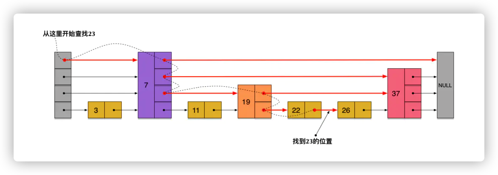

## **算法与数据结构**


我个人的习惯是找例子来引导自己的思路，一点一点的接近算法的核心。唯一需要注意的是，一定要写代码，光看没有用的。对于经典算法的学习，大体上分成几个阶段：

- 第一阶段：对于某一个具体的算法，首先要搞清楚这个算法解决的问题是什么，可能是实现一个具体的功能，也可能是在某些方面，比如时间复杂度或者空间复杂度方面很卓越，总之**搞清楚这个算法被研究出来的目的是什么**。
- 第二阶段：然后就要弄清楚这个算法的生存环境了，也就是看看你此时研究的东西是不是对**别的知识有依赖**，应该先把底层依赖的知识理解并掌握。这些问题都解决之后，就进入到算法本身的学习，理解一个算法是一件辛苦的事情，刚开始看必然会产生很多的困惑，比如经常会怀疑作者讲述的内容的重要性？这些内容和这个算法有什么联系呢？经常会有这种摸不着头脑的感觉，其实作者做的铺垫都是为了建立起**描述算法主要内容的基础**，只有接受和理解这些基础，才能逐渐触碰到算法的精髓，所以耐心是很重要的。
- 第三阶段：算法的主要过程看完之后，往往还是会感到困惑，主要是不知道这个过程好在哪，这就进入了下一个阶段，**理解作者对这个过程在功能性或者效率卓越这件事上的解释和证明**。这才真正触碰到算法最精髓的部分，也就是深度的理解算法的主要过程所带来的好处，这才是最锻炼人理解能力的地方。
- 第四阶段：上面几点是算法学习阶段的过程了，接下来就是研究**算法的代码实现**，自己设计测试用例亲自跑一下代码，以及从代码运行时间的角度分析这个算法的优势，这也是加深对算法的理解的过程。
- 第五阶段：最后是**配合相应的题目练习**，让自己通过题目练习的方式，会用、善用学习到的算法，并对这个算法产生一定的敏感程度，具体是指看到某些题目时，能够根据题目的特点，产生与该算法的对应，也就是具备举一反三的能力。


贪心算法：只顾今天，不管明天；
分治算法：大事化小，小事化了；
动态规划：孙子成才，儿子才成；
穷举搜索：穷人寻财，一步步来。


### 1.基本数据结构


#### 1.1 数组


数组（Array）是一种**线性表**数据结构。它用一组**连续的内存空间**，来存储一组具有相同类型的数据。


* **线性表**就是数据排成像一条线一样的结构。每个线性表上的数据最多只有前和后两个方向。
* **连续的内存空间和相同类型的数据**。正是因为这两个限制，它才有了一个堪称“杀手锏”的特性：“随机访问”。


>  数组是适合查找操作，但是查找的时间复杂度并不为 O(1)。即便是排好序的数组，你用二分查找，时间复杂度也是 O(logn)。所以，正确的表述应该是，数组支持随机访问，根据下标随机访问的时间复杂度为 O(1)。


**插入操作**

如果在数组的末尾插入元素，那就不需要移动数据了，这时的时间复杂度为 O(1)。但如果在数组的开头插入元素，那所有的数据都需要依次往后移动一位，所以最坏时间复杂度是 O(n)。 因为我们在每个位置插入元素的概率是一样的，所以**平均情况时间复杂度**为 (1+2+...n)/n=O(n)。


如果数组中的数据是**有序**的，我们在某个位置插入一个新的元素时，就必须按照刚才的方法搬移 k 之后的数据。但是，如果数组中存储的数据并没有任何规律，数组只是被当作一个存储数据的集合。在这种情况下，如果要将某个数据插入到第 k 个位置，为了避免大规模的数据搬移，我们还有一个简单的办法就是，直接将第 k 位的数据搬移到数组元素的最后，把新的元素直接放入第 k 个位置。

利用这种处理技巧，在特定场景下，在第 k 个位置插入一个元素的时间复杂度就会降为 O(1)。这个处理思想在快排中也会用到，


**删除操作**

如果我们要删除第 k 个位置的数据，为了内存的连续性，也需要搬移数据，不然中间就会出现空洞，内存就不连续了。

和插入类似，如果删除数组末尾的数据，则最好情况时间复杂度为 O(1)；如果删除开头的数据，则最坏情况时间复杂度为 O(n)；平均情况时间复杂度也为 O(n)。


实际上，在某些特殊场景下，我们并不一定非得追求数组中数据的连续性。如果我们将多次删除操作集中在一起执行，删除的效率是不是会提高很多呢？


为了避免 d，e，f，g，h 这几个数据会被搬移三次，我们可以先记录下已经删除的数据。每次的删除操作并不是真正地搬移数据，只是记录数据已经被删除。当数组没有更多空间存储数据时，我们再触发执行一次真正的删除操作，这样就大大减少了删除操作导致的数据搬移。（JVM标记清除算法）


作为高级语言编程者，是不是数组就无用武之地了呢？当然不是，有些时候，用数组会更合适些，总结了几点自己的经验。

1. Java ArrayList 无法存储基本类型，比如 int、long，需要封装为 Integer、Long 类，而 Autoboxing、Unboxing 则有一定的性能消耗，所以如果特别关注性能，或者希望使用基本类型，就可以选用数组。

2. 如果数据大小事先已知，并且对数据的操作非常简单，用不到 ArrayList 提供的大部分方法，也可以直接使用数组。
3. 还有一个是我个人的喜好，当要表示多维数组时，用数组往往会更加直观。比如 Object[][] array；而用容器的话则需要这样定义：ArrayList > array。我总结一下，对于业务开发，直接使用容器就足够了，省时省力。毕竟损耗一丢丢性能，完全不会影响到系统整体的性能。但如果你是做一些非常底层的开发，比如开发网络框架，性能的优化需要做到极致，这个时候数组就会优于容器，成为首选。


#### 1.2 链表

通过“指针”将一组零散的内存块串联起来使用。


在进行数组的插入、删除操作时，为了保持内存数据的连续性，需要做大量的数据搬移，所以时间复杂度是 O(n)。而在链表中插入或者删除一个数据，我们并不需要为了保持内存的连续性而搬移结点，因为链表的存储空间本身就不是连续的。所以，在链表中插入和删除一个数据是非常快速的，所以对应的时间复杂度是 O(1)。


1. 单链表


2. 循环链表

循环链表的尾结点指针是指向链表的头结点。


和单链表相比，循环链表的优点是从链尾到链头比较方便。当要处理的数据具有环型结构特点时，就特别适合采用循环链表。比如著名的**约瑟夫问题**。尽管用单链表也可以实现，但是用循环链表实现的话，代码就会简洁很多。


3. 双向链表

而双向链表，顾名思义，它支持两个方向，每个结点不止有一个后继指针 next 指向后面的结点，还有一个前驱指针 prev 指向前面的结点。


，双向链表可以支持 O(1) 时间复杂度的情况下找到前驱结点，正是这样的特点，也使双向链表在某些情况下的插入、删除等操作都要比单链表简单、高效。


**删除操作**

在实际的软件开发中，从链表中删除一个数据无外乎这两种情况：

* 删除结点中“值等于某个给定值”的结点
* 删除给定指针指向的结点


​	对于第一种情况，不管是单链表还是双向链表，为了查找到值等于给定值的结点，都需要从头结点开始一个一个依次遍历对比，直到找到值等于给定值的结点，然后再通过我前面讲的指针操作将其删除。尽管单纯的删除操作时间复杂度是 O(1)，但**遍历查找的时间是主要的耗时点**，对应的时间复杂度为 O(n)。根据时间复杂度分析中的加法法则，删除值等于给定值的结点对应的链表操作的总时间复杂度为 O(n)。

​	对于第二种情况，我们已经找到了要删除的结点，但是删除某个结点 q 需要知道其前驱结点，而单链表并不支持直接获取前驱结点，所以，为了找到前驱结点，我们还是要从头结点开始遍历链表，直到 p->next=q，说明 p 是 q 的前驱结点。

​	但是对于双向链表来说，这种情况就比较有优势了。因为双向链表中的结点已经保存了前驱结点的指针，不需要像单链表那样遍历。所以，针对第二种情况，单链表删除操作需要 O(n) 的时间复杂度，而双向链表只需要在 O(1) 的时间复杂度内就搞定了！

​	同理，如果我们希望在链表的某个指定结点前面插入一个结点，双向链表比单链表有很大的优势。双向链表可以在 O(1) 时间复杂度搞定，而单向链表需要 O(n) 的时间复杂度。

​	除了插入、删除操作有优势之外，对于一个有序链表，双向链表的按值查询的效率也要比单链表高一些。因为，我们可以记录上次查找的位置 p，每次查询时，根据要查找的值与 p 的大小关系，决定是往前还是往后查找，所以平均只需要查找一半的数据。

> LinkedHashMap 这个容器。如果你深入研究 LinkedHashMap 的实现原理，就会发现其中就用到了双向链表这种数据结构。


**链表数组性能对比**


不过，数组和链表的对比，并不能局限于时间复杂度。而且，在实际的软件开发中，不能仅仅利用复杂度分析就决定使用哪个数据结构来存储数据。

数组简单易用，在实现上使用的是连续的内存空间，可以借助 CPU 的缓存机制，预读数组中的数据，所以访问效率更高。而链表在内存中并不是连续存储，所以对 CPU 缓存不友好，没办法有效预读。


**链表与数组的最大区别**

数组的缺点是大小固定，一经声明就要占用整块连续内存空间。如果声明的数组过大，系统可能没有足够的连续内存空间分配给它，导致“内存不足（out of memory）”。

链表本身没有大小的限制，天然地支持动态扩容。


除此之外，如果你的代码对内存的使用非常苛刻，那数组就更适合你。因为链表中的每个结点都需要消耗额外的存储空间去存储一份指向下一个结点的指针，所以内存消耗会翻倍。而且，对链表进行频繁的插入、删除操作，还会导致频繁的内存申请和释放，容易造成内存碎片，如果是 Java 语言，就有可能会导致频繁的 GC（Garbage Collection，垃圾回收）。


**如何用链表来实现 LRU 缓存淘汰策略呢？**


* 先进先出策略 FIFO（First In，First Out）
* 最少使用策略 LFU（Least Frequently Used）
* 最近最少使用策略 LRU（Least Recently Used）


我们维护一个有序单链表，越靠近链表尾部的结点是越早之前访问的。当有一个新的数据被访问时，我们从链表头开始顺序遍历链表。

1. 如果此数据之前已经被缓存在链表中了，我们遍历得到这个数据对应的结点，并将其从原来的位置删除，然后再插入到链表的头部。

2. 如果此数据没有在缓存链表中，又可以分为两种情况：

   * 如果此时缓存未满，则将此结点直接插入到链表的头部；

   * 如果此时缓存已满，则链表尾结点删除，将新的数据结点插入链表的头部。

基于链表的实现思路，缓存访问的时间复杂度为 O(n)。因为需要遍历链表。我们可以继续优化这个实现思路，比如引入散列表（Hash table）来记录每个数据的位置，将缓存访问的时间复杂度降到 O(1)。


#### 1.3 栈

后进者先出，先进者后出。

栈是一种“操作受限”的线性表，只允许在一端插入和删除数据。


**为什么需要栈?**

事实上，从功能上来说，数组或链表确实可以替代栈，但你要知道，特定的数据结构是对特定场景的抽象，而且，数组或链表暴露了太多的操作接口，操作上的确灵活自由，但使用时就比较不可控，自然也就更容易出错。


当某个数据集合只涉及在一端插入和删除数据，并且满足后进先出、先进后出的特性，这时我们就应该首选“栈”这种数据结构。


用数组实现的栈，我们叫作**顺序栈**。

用链表实现的栈，我们叫作**链式栈**。


顺序栈是固定大小的，链式栈大小不受限制，但是需要额外存储指针，内存消耗相对较多。

**如何基于数组实现一个可以支持动态扩容的栈呢？**

当数组空间不够时，我们就重新申请一块更大的内存，将原来数组中数据统统拷贝过去。这样就实现了一个支持动态扩容的数组。


**栈在表达式求值中的应用**

​		其中一个保存操作数的栈，另一个是保存运算符的栈。我们从左向右遍历表达式，当遇到数字，我们就直接压入操作数栈；当遇到运算符，就与运算符栈的栈顶元素进行比较。

​		如果比运算符栈顶元素的优先级高，就将当前运算符压入栈；如果比运算符栈顶元素的优先级低或者相同，从运算符栈中取栈顶运算符，从操作数栈的栈顶取 2 个操作数，然后进行计算，再把计算完的结果压入操作数栈，继续比较。


**栈在括号匹配中的应用**

 **栈实现浏览器的前进和后退**


#### 1.4 队列

先进者先出，后进者后出。

所以，队列跟栈一样，也是一种**操作受限的线性表**数据结构。

​	队列的概念很好理解，基本操作也很容易掌握。作为一种非常基础的数据结构，队列的应用也非常广泛，特别是一些具有某些额外特性的队列，比如**循环队列**、**阻塞队列**、**并发队列**。它们在很多偏底层系统、框架、中间件的开发中，起着关键性的作用。

​	比如高性能队列 Disruptor、Linux 环形缓存，都用到了循环并发队列；Java concurrent 并发包利用 ArrayBlockingQueue 来实现公平锁等。


数组实现，**顺序队列**。（出队时 tail=n 时，需要进行数据搬移）

链表实现，**链式队列**。


**循环队列**


```java
private String[] items;
private int head = 0;
private int tail = 0;
int capacity = 0;

// 申请内存空间
public ArrayQueue1(int capacity) {
    this.capacity = capacity;
}

// 入栈
public boolean enqueue(String item) {
    if (tail == capacity) {
        if (head == 0) {
            return false; // 栈满
        }
        for (int i = head; i < tail; i++) {
            items[i - head] = items[i];
        }
        items[capacity - head] = item;
        tail = capacity - head + 1;
        return true;
    }
    items[tail] = item;
    tail++;
    return true;
}

// 出栈
public String dequeue() {
    if (head == tail) {
        return null; // 栈空
    }
    String ret = items[head];
    head = head - 1;
    return ret;
}

public static void main(String[] args) {
    ArrayQueue1 arrayQueue = new ArrayQueue1(3);
    arrayQueue.enqueue("a");
    arrayQueue.enqueue("b");
    boolean c = arrayQueue.enqueue("c");
    boolean d = arrayQueue.enqueue("d");
    String dequeue = arrayQueue.dequeue();
    arrayQueue.enqueue("e");
}
```


### 2.递归

三个条件:

1. 一个问题的解可以**分解**为几个子问题的解何为子问题？子问题就是数据规模更小的问题。比如，前面讲的电影院的例子，你要知道，“自己在哪一排”的问题，可以分解为“前一排的人在哪一排”这样一个子问题。
2.  这个问题与分解之后的子问题，除了数据规模不同，求解思路完全一样。
3. 存在**递归终止条件**把问题分解为子问题，把子问题再分解为子子问题，一层一层分解下去，不能存在无限循环，这就需要有终止条件。

### 3.排序算法


排序算法稳定性的重要性:

​	不稳定的话还需要找出相同值的对象进行重新排序，如果是稳定的排序算法的只需要在前面排序的基础上，再重新排序即可。

> 应用场景：
>
> ​	按照金额从小到大对订单数据排序。对于金额相同的订单，我们希望按照下单时间从早到晚有序。对于这样一个排序需求，我们怎么来做呢？
>
> ​	先按照下单时间给订单排序，注意是按照下单时间，不是金额。排序完成之后，我们用稳定排序算法，按照订单金额重新排序。两遍排序之后，我们得到的订单数据就是按照金额从小到大排序。


#### 3.1 冒泡排序 （Bubble Sort）

​	冒泡排序只会操作相邻的两个数据。每次冒泡操作都会对相邻的两个元素进行比较，看是否满足大小关系要求。如果不满足就让它俩互换。一次冒泡会让至少一个元素移动到它应该在的位置，重复 n 次，就完成了 n 个数据的排序工作。


* 冒泡排序是原地排序的算法

* 稳定的排序算法 (相等时不做交换)

* 时间复杂度

  最好情况: 123456 一次冒泡  时间复杂度 O(n)

  最坏情况: 654321 六次冒泡 时间复杂度  O(n^2)

  平均情况(加权平均期望时间复杂度):  O(n^2)


#### 3.2 插入排序（Insertion Sort）

将数组分成两部分，前面是已排序，后面是未排序。将未排序的第一个元素，与排序的元素从后到前一个一个比较，直到找到比这个小的数据，插入在这个数据之后。


```java
/**
     * 插入排序     4  6  7  5  2
     *                  j   i
     */
    public static void InsertionSort( int a[] , int n){
        if( n <= 1){
            return;
        }

        for(int i=1;i<n;i++){
            int value = a[i];
            int j=i-1;
            for(;j>=0;j--){
                if(a[j]>value){
                    a[j+1] = a[j];
                }else {
                    break;
                }
            }
            a[j+1] = value;
        }
    }
```


* 原地排序
* 稳定
* 时间复杂度 
  * 最好时间复杂度 O(n)
  * 最差时间复杂度 O(n^2)
  * 平均时间复杂度 O(n^2)


#### 3.3 选择排序(Selection Sort)


第一轮遍历从整个数组中找到最小的值，然后与前面的值交换.重复这个遍历。使前面的有序区域越来越大。

* 原地排序

* 不稳定 

  ​	比如 5，8，5，2，9 这样一组数据，使用选择排序算法来排序的话，第一次找到最小元素 2，与第一个 5 交换位置，那第一个 5 和中间的 5 顺序就变了，所以就不稳定了。正是因此，相对于冒泡排序和插入排序，选择排序就稍微逊色了。

* 时间复杂度

  * 最好时间复杂度 O(n^2)

  * 最坏情况时间复杂度 O(n^2) 不管怎样都要遍历无序区域寻找最小值

  * 平均情况时间复杂度 O(n^2)

    

**相对于冒泡排序和插入排序，选择排序就稍微逊色了。**


> 为什么插入排序要比冒泡排序更受欢迎呢？

​	

从代码实现上来看，冒泡排序的数据交换要比插入排序的数据移动要复杂，冒泡排序需要 3 个赋值操作，而插入排序只需要 1 个。

```java

冒泡排序中数据的交换操作：
if (a[j] > a[j+1]) { // 交换
   int tmp = a[j];
   a[j] = a[j+1];
   a[j+1] = tmp;
   flag = true;
}

插入排序中数据的移动操作：
if (a[j] > value) {
  a[j+1] = a[j];  // 数据移动
} else {
  break;
}
```


#### 3.4 归并排序 (Merge Sort)

> 冒泡排序、插入排序、选择排序这三种排序算法，它们的时间复杂度都是 O(n2)，比较高，适合小规模数据的排序。
>
> 两种时间复杂度为 O(nlogn) 的排序算法，归并排序和快速排序。这两种排序算法适合大规模的数据排序。更加常用。


归并排序使用的就是**分治思想**。

分治思想跟我们前面讲的递归思想很像。是的，分治算法一般都是用**递归**来实现的。分治是一种解决问题的处理思想，递归是一种编程技巧，这两者并不冲突。

```java
递推公式：
merge_sort(p…r) = merge(merge_sort(p…q), merge_sort(q+1…r))

终止条件：
p >= r 不用再继续分解
```


* 稳定的

* 时间复制度: O(nlogn)

  递归的适用场景是，一个问题 a 可以分解为多个子问题 b、c，那求解问题 a 就可以分解为求解问题 b、c。问题 b、c 解决之后，我们再把 b、c 的结果合并成 a 的结果。如果我们定义求解问题 a 的时间是 T(a)，求解问题 b、c 的时间分别是 T(b) 和 T( c)，那我们就可以得到这样的递推关系式：

      ```bash
      
      T(a) = T(b) + T(c) + K
      
      其中 K 等于将两个子问题 b、c 的结果合并成问题 a 的结果所消耗的时间。
      ```

**不仅递归求解的问题可以写成递推公式，递归代码的时间复杂度也可以写成递推公式。**


```bash

T(1) = C；   n=1时，只需要常量级的执行时间，所以表示为C。
T(n) = 2*T(n/2) + n； n>1
* 这里的n是因为 合并方法需要O(n)的时间复杂度

T(n) = 2*T(n/2) + n
     = 2*(2*T(n/4) + n/2) + n = 4*T(n/4) + 2*n
     = 4*(2*T(n/8) + n/4) + 2*n = 8*T(n/8) + 3*n
     = 8*(2*T(n/16) + n/8) + 3*n = 16*T(n/16) + 4*n
     ......
     = 2^k * T(n/2^k) + k * n
     ......
```

当 T(n/2^k)=T(1) 时，也就是 n/2^k=1，我们得到 k=log2n 。我们将 k 值代入上面的公式，得到 T(n)=Cn+nlog2n 。如果我们用大 O 标记法来表示的话，T(n) 就等于 O(nlogn)。所以归并排序的时间复杂度是 O(nlogn)。

归并排序的执行效率与要排序的原始数组的有序程度无关，所以其时间复杂度是非常稳定的，不管是最好情况、最坏情况，还是平均情况，时间复杂度都是 O(nlogn)。

* 空间复杂度 O(n)  （内存空间的占用并不随着程序的执行一直增长，而是可重复使用的，所以和时间复杂度的分析不一样）
* 致命的“弱点”，那就是归并排序不是原地排序算法。需要借助新的内存空间。


#### 3.5 快速排序 （Quick Sort）


归并的处理过程是由下到上，先处理子问题，然后再合并。

快排相反，处理过程由上到下，先分区，再处理子问题。

归并排序虽然是稳定的、时间复杂度为 O(nlogn) 的排序算法，但是它是非原地排序算法。主要原因是合并函数无法在原地执行。快速排序通过设计巧妙的原地分区函数，可以实现原地排序，解决了归并排序占用太多内存的问题。


* 时间复杂度 O(nlogn)
* 原地
* 不稳定  如 6 8 7 6 5 9 4 会导致6的前后顺序发生变化


> **O(n) 时间复杂度内求无序数组中的第 K 大元素。**比如，4， 2， 5， 12， 3 这样一组数据，第 3 大元素就是 4。


分治和分区

​		我们选择数组区间 A[0...n-1]的最后一个元素 A[n-1]作为 pivot，对数组 A[0...n-1]原地分区，这样数组就分成了三部分，A[0...p-1]、A[p]、A[p+1...n-1]。如果 p+1=K，那 A[p]就是要求解的元素；如果 K>p+1, 说明第 K 大元素出现在 A[p+1...n-1]区间，我们再按照上面的思路递归地在 A[p+1...n-1]这个区间内查找。同理，如果 K

​		如果 p+1=K，那 A[p]就是要求解的元素；如果 K>p+1, 说明第 K 大元素出现在 A[p+1...n-1]区间，我们再按照上面的思路递归地在 A[p+1...n-1]这个区间内查找。同理，如果 K<p+1,就在A[0--p-1]区间找。

​		我们再来看，**为什么上述解决思路的时间复杂度是 O(n)？**第一次分区查找，我们需要对大小为 n 的数组执行分区操作，需要遍历 n 个元素。第二次分区查找，我们只需要对大小为 n/2 的数组执行分区操作，需要遍历 n/2 个元素。依次类推，分区遍历元素的个数分别为、n/2、n/4、n/8、n/16.……直到区间缩小为 1。如果我们把每次分区遍历的元素个数加起来，就是：n+n/2+n/4+n/8+...+1。这是一个等比数列求和，最后的和等于 2n-1。所以，上述解决思路的时间复杂度就为 O(n)。


#### 3.6 评价

​	归并排序算法是一种在任何情况下时间复杂度都比较稳定的排序算法，这也使它存在致命的缺点，即归并排序不是原地排序算法，空间复杂度比较高，是 O(n)。正因为此，它也没有快排应用广泛。快速排序算法虽然最坏情况下的时间复杂度是 O(n2)，但是平均情况下时间复杂度都是 O(nlogn)。不仅如此，快速排序算法时间复杂度退化到 O(n2) 的概率非常小，我们可以通过合理地选择 pivot 来避免这种情况。


> 题目: 现在你有 10 个接口访问日志文件，每个日志文件大小约 300MB，每个文件里的日志都是按照时间戳从小到大排序的。你希望将这 10 个较小的日志文件，合并为 1 个日志文件，合并之后的日志仍然按照时间戳从小到大排列。如果处理上述排序任务的机器内存只有 1GB，你有什么好的解决思路，能“快速”地将这 10 个日志文件合并吗？

归并思路： 1.每个文件从**最小值记录**开始维护一个**游标**，标志当前文件遍历的记录位置。 2.维护一个10空间大小的**小顶堆**，将每个文件的游标记录压入，顶端的就是最小值。 3.将堆顶数据取出，写入新的文件。 4.将取出的记录对应的文件游标向前拨动，取出对应的记录（就是下一个记录），压入小顶堆。没有记录说明改文件遍历完毕。 5.重复操作3。 （这里的小顶堆作用就是快速取出最小的那个值，考虑到堆结构的代码实现难度，这个地方用简单的有序列表，新的数据有序插入，取出最小的也很ok，10条记录随便搞，慢不到哪里，优化也快不到哪里，简单就好） 这个简单思路占用空间很小，就是10条数据的小顶堆。但题目给出的是，1G内存，有很大的优化空间，优化点在磁盘IO，优化方式就是批量读文件，批量写文件。 1.批量读，每个文件读取50M到内存，总计500M。上面的游标就对应到内存游标，只是游标到底之后，需要读取对应文件下一个50M数据 2.批量写，上面的写文件，优化为写内存，给予500M的内存空间，写满后再一次刷入新的文件。


#### 3.7 线性排序算法

三种时间复杂度是 O(n) 的排序算法：

* 桶排序
* 计数排序
* 基数排序

这些排序算法的时间复杂度是线性的，所以我们把这类排序算法叫作线性排序（Linear sort）。

之所以能做到线性的时间复杂度，主要原因是，这三个算法是非基于比较的排序算法，都不涉及元素之间的比较操作。

对要排序的数据要求很苛刻，所以学习重点是掌握这些排序算法的**适用场景**。


##### 3.7.1 桶排序 （Bucket sort）


核心思想是将要排序的数据分到几个有序的桶里，每个桶里的数据再单独进行排序。桶内排完序之后，再把每个桶里的数据按照顺序依次取出，组成的序列就是有序的了。


限制条件:

* 要排序的数据需要很容易就能划分成 m 个桶
* 桶与桶之间有着天然的大小顺序
* 数据在各个桶之间的分布是比较均匀的


适用条件:

* 比较适合用在外部排序中,所谓的外部排序就是数据存储在外部磁盘中，数据量比较大，内存有限，无法将数据全部加载到内存中。


> **例子:** 比如说我们有 10GB 的订单数据，我们希望按订单金额（假设金额都是正整数）进行排序，但是我们的内存有限，只有几百 MB，没办法一次性把 10GB 的数据都加载到内存中。这个时候该怎么办呢？


​	我们可以先扫描一遍文件，看订单金额所处的数据范围。假设经过扫描之后我们得到，订单金额最小是 1 元，最大是 10 万元。我们将所有订单根据金额划分到 100 个桶里，第一个桶我们存储金额在 1 元到 1000 元之内的订单，第二桶存储金额在 1001 元到 2000 元之内的订单，以此类推。每一个桶对应一个文件，并且按照金额范围的大小顺序编号命名（00，01，02...99）。理想的情况下，如果订单金额在 1 到 10 万之间均匀分布，那订单会被均匀划分到 100 个文件中，每个小文件中存储大约 100MB 的订单数据，我们就可以将这 100 个小文件依次放到内存中，用快排来排序。等所有文件都排好序之后，我们只需要按照文件编号，从小到大依次读取每个小文件中的订单数据，并将其写入到一个文件中，那这个文件中存储的就是按照金额从小到大排序的订单数据了。

​	订单按照金额在 1 元到 10 万元之间并不一定是均匀分布的 ，所以 10GB 订单数据是无法均匀地被划分到 100 个文件中的。有可能某个金额区间的数据特别多，划分之后对应的文件就会很大，没法一次性读入内存。这又该怎么办呢？

​	我们可以继续划分，比如，订单金额在 1 元到 1000 元之间的比较多，我们就将这个区间继续划分为 10 个小区间，1 元到 100 元，101 元到 200 元，201 元到 300 元....901 元到 1000 元。如果划分之后，101 元到 200 元之间的订单还是太多，无法一次性读入内存，那就继续再划分，直到所有的文件都能读入内存为止。


##### 3.7.2 计数排序 (Counting sort)


​	计数排序其实是桶排序的一种特殊情况。当要排序的 n 个数据，所处的范围并不大的时候，比如最大值是 k，我们就可以把数据划分成 k 个桶。每个桶内的数据值都是相同的，省掉了桶内排序的时间。


**算法步骤:**

1. 知道总的数据个数8  数据区间:[0~5]
2. 根据数据区间创建数组c[6] 下标对应数据的值，放入对应数据的个数
3. 对 c[6]进行顺序求和 (自己当前的值加上前面下标的值的和) 得到可以知道自己所处第几位的c[6]
4. 创建 r[8] 数组 根据 c[6] 从后往前遍历数据 (**为了保证稳定性**), 扫描到的数据对应 c[6]的下标，c[6]的值就是当前扫描到的数据在 r[8] 中的位置，如果是3就表示在r[8]的第三个位置，全部扫描完，r[8]就是排完序的结果

**限制条件:**

* 数据范围不大 
* 只能给非负整数排序，或者把数据转化为非负整数

​	比如，还是拿考生这个例子。如果考生成绩精确到小数后一位，我们就需要将所有的分数都先乘以 10，转化成整数，然后再放到 9010 个桶内。再比如，如果要排序的数据中有负数，数据的范围是[-1000, 1000]，那我们就需要先对每个数据都加 1000，转化成非负整数。


##### 3.7.3 基数排序 (Radix sort)


> ​	我们来看这样一个排序问题。假设我们有 10 万个手机号码，希望将这 10 万个手机号码从小到大排序，你有什么比较快速的排序方法呢？


​	手机号码有 11 位，范围太大，显然不适合用这两种排序算法。

​	我们这里也可以借助相同的处理思路，先按照最后一位来排序手机号码，然后，再按照倒数第二位重新排序，以此类推，最后按照第一位重新排序。经过 11 次排序之后，手机号码就都有序了。

​	根据每一位来排序，我们可以用刚讲过的桶排序或者计数排序，它们的时间复杂度可以做到 O(n)。如果要排序的数据有 k 位，那我们就需要 k 次桶排序或者计数排序，总的时间复杂度是 O(k*n)。当 k 不大的时候，比如手机号码排序的例子，k 最大就是 11，所以基数排序的时间复杂度就近似于 O(n)。


​	有时候要排序的数据并不都是等长的，比如我们排序牛津字典中的 20 万个英文单词，最短的只有 1 个字母，最长的我特意去查了下，有 45 个字母，中文翻译是尘肺病。对于这种不等长的数据，基数排序还适用吗？实际上，我们可以把所有的单词补齐到相同长度，位数不够的可以在后面补“0”，因为根据ASCII 值，所有字母都大于“0”，所以补“0”不会影响到原有的大小顺序。这样就可以继续用基数排序了。


**限制条件:**

* 数据需要可以分割出独立的 “位” 比较，而且位之间有递进关系。如果 a 数据的高位比 b 数据大，那剩下的低位就不用比较了
* 每一位的数据范围不能太大，要可以用线性排序算法来排序，否则，基数排序的时间复杂度就无法做到 O(n) 了。


> 如何根据年龄给 100 万用户排序？

根据年龄给 100 万用户排序，就类似按照成绩给 50 万考生排序。我们假设年龄的范围最小 1 岁，最大不超过 120 岁。我们可以遍历这 100 万用户，根据年龄将其划分到这 120 个桶里，然后依次顺序遍历这 120 个桶中的元素。这样就得到了按照年龄排序的 100 万用户数据。


#### 3.8 通用、高性能的排序算法


​	线性排序算法的时间复杂度比较低，适用场景比较特殊。所以如果要写一个通用的排序函数，不能选择线性排序算法。

​	时间复杂度是 O(nlogn) 的排序算法不止一个，我们已经讲过的有归并排序、快速排序，后面讲堆的时候我们还会讲到堆排序。堆排序和快速排序都有比较多的应用，比如 Java 语言采用堆排序实现排序函数，C 语言使用快速排序实现排序函数。

​	归并排序并不是原地排序算法，空间复杂度是 O(n)。所以，粗略点、夸张点讲，如果要排序 100MB 的数据，除了数据本身占用的内存之外，排序算法还要额外再占用 100MB 的内存空间，空间耗费就翻倍了。

​	快速排序比较适合来实现排序函数，但是，我们也知道，快速排序在最坏情况下的时间复杂度是 O(n2)，如何来解决这个“复杂度恶化”的问题呢？

​	如果数据原来就是有序的或者接近有序的，每次分区点都选择最后一个数据，那快速排序算法就会变得非常糟糕，时间复杂度就会退化为 O(n2)。实际上，这种 O(n2) 时间复杂度出现的主要原因还是因为我们分区点选得不够合理。

两个比较常用、比较简单的分区算法:

* **三数取中法**  从区间的首、尾、中间，分别取出一个数，然后对比大小，取这 3 个数的中间值作为分区点。
* **随机法 **  随机法就是每次从要排序的区间中，随机选择一个元素作为分区点。


### 4.查找算法


#### 4.1 二分查找法 (BinarySearch)


O(logn) 惊人的查找速度。logn 是一个非常“恐怖”的数量级，即便 n 非常非常大，对应的 logn 也很小。比如 n 等于 2 的 32 次方，这个数很大了吧？大约是 42 亿。也就是说，如果我们在 42 亿个数据中用二分查找一个数据，最多需要比较 32 次。


这是一个等比数列。其中 n/2k=1 时，k 的值就是总共缩小的次数。而每一次缩小操作只涉及两个数据的大小比较，所以，经过了 k 次区间缩小操作，时间复杂度就是 O(k)。通过 n/2k=1，我们可以求得 k=log2n，所以时间复杂度就是 O(logn)。


**非递归实现**

```java

public int bsearch(int[] a, int n, int value) {
  int low = 0;
  int high = n - 1;

  while (low <= high) {
    int mid = (low + high) / 2;
    if (a[mid] == value) {
      return mid;
    } else if (a[mid] < value) {
      low = mid + 1;
    } else {
      high = mid - 1;
    }
  }

  return -1;
}
```


**递归实现**

```java

// 二分查找的递归实现
public int bsearch(int[] a, int n, int val) {
  return bsearchInternally(a, 0, n - 1, val);
}

private int bsearchInternally(int[] a, int low, int high, int value) {
  if (low > high) return -1;

  int mid =  low + ((high - low) >> 1);
  if (a[mid] == value) {
    return mid;
  } else if (a[mid] < value) {
    return bsearchInternally(a, mid+1, high, value);
  } else {
    return bsearchInternally(a, low, mid-1, value);
  }
}
```


**限制条件：**

* 依赖的是**顺序表**结构，简单点说就是数组。

  需要按照下标随机访问元素。但是链表随机访问的时间复杂度是  O（n）。所以链表用二分时间复杂度会很高。

  

* 针对的是**有序**数据

  排序的时间复杂度最低是 O(nlogn)。但是，如果我们的数据集合有**频繁的插入和删除**操作，要想用二分查找，要么每次插入、删除操作之后保证数据仍然有序，要么在每次二分查找之前都先进行排序。

  

* **数据量太小**不适合二分查找

  这里有一个例外。如果数据之间的比较操作非常耗时，不管数据量大小，都推荐使用二分查找。

  

* **数据量太大**也不适合二分查找

  二分查找的底层需要依赖数组这种数据结构，而数组为了支持随机访问的特性，要求内存空间连续，对内存的要求比较苛刻。比如，我们有 1GB 大小的数据，如果希望用数组来存储，那就需要 1GB 的连续内存空间。


> 题目1.如何在 1000 万个整数中快速查找某个整数？内存限制是 100MB


​	这个问题并不难。我们的内存限制是 100MB，每个数据大小是 8 字节，最简单的办法就是将数据存储在数组中，内存占用差不多是 80MB，符合内存的限制。借助今天讲的内容，我们可以先对这 1000 万数据从小到大排序，然后再利用二分查找算法，就可以快速地查找想要的数据了。

​	看起来这个问题并不难，很轻松就能解决。实际上，它暗藏了“玄机”。如果你对数据结构和算法有一定了解，知道散列表、二叉树这些支持快速查找的动态数据结构。你可能会觉得，用散列表和二叉树也可以解决这个问题。实际上是不行的。

​	虽然大部分情况下，用二分查找可以解决的问题，用散列表、二叉树都可以解决。但是，我们后面会讲，不管是散列表还是二叉树，都会需要比较多的额外的内存空间。如果用散列表或者二叉树来存储这 1000 万的数据，用 100MB 的内存肯定是存不下的。而二分查找底层依赖的是数组，除了数据本身之外，不需要额外存储其他信息，是最省内存空间的存储方式，所以刚好能在限定的内存大小下解决这个问题。


> 题目2: 在庞大的地址库中逐一比对 IP 地址所在的区间，是非常耗时的。假设我们有 12 万条这样的 IP 区间与归属地的对应关系，如何快速定位出一个 IP 地址的归属地呢？

​	当我们要查询某个 IP 归属地时，我们可以先通过二分查找，找到最后一个起始 IP 小于等于这个 IP 的 IP 区间，然后，检查这个 IP 是否在这个 IP 区间内，如果在，我们就取出对应的归属地显示；如果不在，就返回未查找到。


#### 4.2 跳表  (SkipList)


学习资料:https://juejin.cn/post/6844903446475177998 （非常好）

理论: https://www.bilibili.com/video/BV18J411s7eN?from=search&seid=2626933940845464363

手撕: https://www.bilibili.com/video/BV1Er4y1P7k1?p=2




O(logn)


#### 4.3 散列表 (Hash Table)


散列表用的是数组支持按照下标随机访问数据的特性，所以散列表其实就是数组的一种扩展，由数组演化而来。

key（关键字）------> (映射)     hash（散列值）

散列表依靠的是数组按照下标随机访问，时间复杂度是O(1)。我们通过散列函数把元素的键值映射为下标，然后将数据存储在数组中对应下标的位置。当按照键值查找元素时，用同样的散列函数，将键值转化为数组下标，从对应的数组下标位置取数据。


构造散列函数的基本要求:

1. 散列函数计算得到的散列值是一个非负整数；
2. 如果 key1 = key2，那 hash(key1) == hash(key2)；
3. 如果 key1 ≠ key2，那 hash(key1) ≠ hash(key2)。


**散列冲突**

不同的键值散列到同一个下标，就是散列冲突。


**解决方案:**

1. **开放寻址法**   (如果出现了散列冲突，我们就重新探测一个空闲位置，将其插入)
   * 线性探测   (探测步长: 0 1)
   * 二次探测 （探测步长: 0 1^2  2^2  3^2    ）
   * 双重散列 （使用一组hash函数）

2. **链表法**

 


装载因子:

```bash

散列表的装载因子=填入表中的元素个数/散列表的长度
```

装载因子越大，说明空闲位置越少，冲突越多，散列表的性能会下降。


**优缺点分析**


**开放寻址法**:

优点:  

1. 散列表中的数据都存储在数组中，可以有效地利用 CPU 缓存加快查询速度
2. 序列化起来比较简单。链表法包含指针，序列化起来就没那么容易。

缺点:

1. 删除数据的时候比较麻烦，需要特殊标记已经删除掉的数据。
2. 所有的数据都存储在一个数组中，比起链表法来说，冲突的代价更高。(装载因子不能太高，更浪费内存空间)


总结:

当数据量比较小、装载因子小的时候，适合采用开放寻址法。这也是 Java 中的ThreadLocalMap使用开放寻址法解决散列冲突的原因。


**链表法:**

优点:

1. 链表法对内存的利用率比开放寻址法要高。
2. 对大装载因子的容忍度更高。开放寻址法只能适用装载因子小于 1 的情况。接近 1 时，就可能会有大量的散列冲突，导致大量的探测、再散列等，性能会下降很多。但是对于链表法来说，只要散列函数的值随机均匀，即便装载因子变成 10，也就是链表的长度变长了而已，虽然查找效率有所下降，但是比起顺序查找还是快很多。


缺点:

1. 要存储指针，所以对于比较小的对象的存储，是比较消耗内存的，还有可能会让内存的消耗翻倍。
2. 链表中的结点是零散分布在内存中的，不是连续的，所以对 CPU 缓存是不友好的
3. 不容易序列化

总结:

基于链表的散列冲突处理方法比较适合存储大对象、大数据量的散列表，而且，比起开放寻址法，它更加灵活，支持更多的优化策略，比如用**红黑树**代替链表


**分析 java HashMap**

1. 初始大小

   HashMap 默认的初始大小是 16，当然这个默认值是可以设置的，如果事先知道大概的数据量有多大，可以通过修改默认初始大小，减少动态扩容的次数，这样会大大提高 HashMap 的性能。

2. 装载因子和动态扩容

   最大装载因子默认是 0.75，当 HashMap 中元素个数超过 0.75*capacity（capacity 表示散列表的容量）的时候，就会启动扩容，每次扩容都会扩容为原来的两倍大小。

3. 散列冲突解决方法  

   HashMap 底层采用链表法来解决冲突。即使负载因子和散列函数设计得再合理，也免不了会出现拉链过长的情况，一旦出现拉链过长，则会严重影响 HashMap 的性能。于是，在 JDK1.8 版本中，为了对 HashMap 做进一步优化，我们引入了红黑树。而当链表长度太长（默认超过 8）时，链表就转换为红黑树。我们可以利用红黑树快速增删改查的特点，提高 HashMap 的性能。当红黑树结点个数少于 8 个的时候，又会将红黑树转化为链表。因为在数据量较小的情况下，红黑树要维护平衡，比起链表来，性能上的优势并不明显。

4. 散列函数

   ```java
   
   int hash(Object key) {
       int h = key.hashCode()；
       return (h ^ (h >>> 16)) & (capicity -1); //capicity表示散列表的大小
   }
   ```


​		(h ^ (h >>> 16)) & (capicity -1)  **扰动函数** 

​		**为什么要右移16位再与本身异或?**

   1. hash返回值 int 有 32位，直接拿这个 int 作为下标大概有40亿的映射空间，但是内存不够，放不下。

   2. 用自己的高16位和低16位进行异或，因为后续计算index要截取低位，所以异或后的值可以保证低位的随机性，只要HashCode的32位有一位发生变化，整个异或后的值就会改变。

      

      **为什么要减1和按位与  & (capicity -1)?**

      A % B = A & (B - 1) 当B是2的指数时，等式成立。 本质上是使用了「除留余数法」。

​       capicity-1 相当于一个低位掩码，保证了index的位置分布均匀。

> 以初始长度16为例，16-1=15。2进制表示是00000000 00000000 00001111。“与”操作的结果就是截取了最低的四位值。也就相当于取模操作。


#### 4.4  散列表和双向链表结合


##### **LRU 缓存淘汰算法**


回顾一下当时我们是如何通过链表实现 LRU 缓存淘汰算法的。

我们需要维护一个按照访问时间从大到小有序排列的链表结构。因为缓存大小有限，当缓存空间不够，需要淘汰一个数据的时候，我们就直接将链表头部的结点删除。当要缓存某个数据的时候，先在链表中查找这个数据。如果没有找到，则直接将数据放到链表的尾部；如果找到了，我们就把它移动到链表的尾部。因为查找数据需要遍历链表，所以单纯用链表实现的 LRU 缓存淘汰算法的时间复杂很高，是 O(n)。


如果我们将散列表和链表两种数据结构组合使用，可以将这三个操作的时间复杂度都降低到 O(1)


我们使用双向链表存储数据，链表中的每个结点处理存储数据（data）、前驱指针（prev）、后继指针（next）之外，还新增了一个特殊的字段 hnext。

每个结点会在两条链中。一个链是刚刚我们提到的双向链表，另一个链是散列表中的拉链。前驱和后继指针是为了将结点串在双向链表中，hnext 指针是为了将结点串在散列表的拉链中。


* **查找一个数据** 

  散列表中查找数据的时间复杂度接近 O(1)，所以通过散列表，我们可以很快地在缓存中找到一个数据。当找到数据之后，我们还需要将它移动到双向链表的尾部。

* **删除一个数据**

  借助散列表，我们可以在 O(1) 时间复杂度里找到要删除的结点。因为我们的链表是双向链表，双向链表可以通过前驱指针 O(1) 时间复杂度获取前驱结点，所以在双向链表中，删除结点只需要 O(1) 的时间复杂度。

* **添加一个数据**

  * 数据在缓存中，将其移动到双向链表的尾部。
  * 数据不在缓存中，如果缓存没满，将其添加到链表的尾部；如果缓存满了，将双向链表的头结点删除，然后再将数据放到链表的尾部。


##### **Redis 有序集合**

如果我们仅仅按照分值将成员对象组织成跳表的结构，那按照键值来删除、查询成员对象就会很慢，解决方法与 LRU 缓存淘汰算法的解决方法类似。我们可以再按照键值构建一个散列表，这样按照 key 来删除、查找一个成员对象的时间复杂度就变成了 O(1)。同时，借助跳表结构，其他操作也非常高效。实际上，Redis 有序集合的操作还有另外一类，也就是查找成员对象的排名（Rank）或者根据排名区间查找成员对象。这个功能单纯用刚刚讲的这种组合结构就无法高效实现了。这块内容我后面的章节再讲。


##### LinkedHashMap

双向链表+散列

可以实现顺序打印

```java

HashMap<Integer, Integer> m = new LinkedHashMap<>();
m.put(3, 11);
m.put(1, 12);
m.put(5, 23);
m.put(2, 22);

for (Map.Entry e : m.entrySet()) {
  System.out.println(e.getKey());
}
```

面的代码会按照数据插入的顺序依次来打印，也就是说，打印的顺序就是 3，1，5，2。

不仅支持按照插入顺序遍历数据，还支持按照访问顺序来遍历数据。

```java

// 10是初始大小，0.75是装载因子，true是表示按照访问时间排序
HashMap<Integer, Integer> m = new LinkedHashMap<>(10, 0.75f, true);
m.put(3, 11);
m.put(1, 12);
m.put(5, 23);
m.put(2, 22);

m.put(3, 26);
m.get(5);

for (Map.Entry e : m.entrySet()) {
  System.out.println(e.getKey());
}
```

这段代码打印的结果是 1，2，3，5。

每次调用 put() 函数，往 LinkedHashMap 中添加数据的时候，都会将数据添加到链表的尾部。

在第 8 行代码中，再次将键值为 3 的数据放入到 LinkedHashMap 的时候，会先查找这个键值是否已经有了，然后，再将已经存在的 (3,11) 删除，并且将新的 (3,26) 放到链表的尾部。

当第 9 行代码访问到 key 为 5 的数据的时候，我们将被访问到的数据移动到链表的尾部。

**LinkedHashMap 本身就是一个支持 LRU 缓存淘汰策略的缓存系统**


散列表支持高效的数据插入、删除、查找。

但是不支持按照某种顺序遍历数据。因为散列表是动态数据结构，不停地有数据的插入、删除，所以每当我们希望按顺序遍历散列表中的数据的时候，都需要先排序，那效率势必会很低。为了解决这个问题，我们将散列表和链表（或者跳表）结合在一起使用。


> 假设猎聘网有 10 万名猎头，每个猎头都可以通过做任务（比如发布职位）来积累积分，然后通过积分来下载简历。假设你是猎聘网的一名工程师，如何在内存中存储这 10 万个猎头 ID 和积分信息，让它能够支持这样几个操作：
>
> 根据猎头的 ID 快速查找、删除、更新这个猎头的积分信息；
>
> 查找积分在某个区间的猎头 ID 列表；
>
> 查找按照积分从小到大排名在第 x 位到第 y 位之间的猎头 ID 列表。


额，感觉大家把数据结构这门课里边的节点存储的数据类型固化了，不一定只是存int这种基本数据类型，可以存 封装了相关信息的bean ，
可能 面向对象语言开发者（java、c# 等） 更容易理解这句话。。。

另外，根据老师的意思：
对于一些数据结构的设计实现问题
不一定 非要强行附和到 现有、已学的数据结构，
可以另辟蹊径，将现有的数据结构 用 **并列组合** 等方式 自行创建。

比如 第二题 猎头这个题，很明显；
第一问 ：
根据id 查找 猎头积分，可以用散列表将查找的效率 做到极致的 O(1)，只不过散列表的数组实现中 存的是 猎头信息集合 bean就好了
第二问：
查找某个积分区间的猎头信息，散列表这种 根据id散列后 无序的存放形式 肯定就不行了，需要找 高效的有序的 数据结构来实现，比如 跳表
第三问：
查找 积分第x到第y位的，直接在第二问的基础上 顺序遍历就好了

所以，可以设计实现中，可以同时并行组合使用 散列表+跳表，

不一定非得是 散列表和跳表 强行关联耦合成一个数据结构

