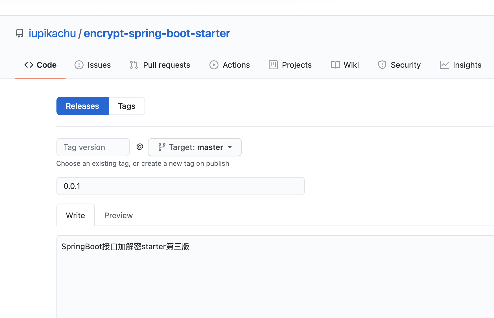
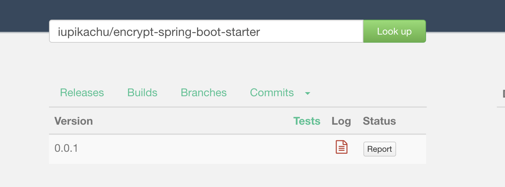
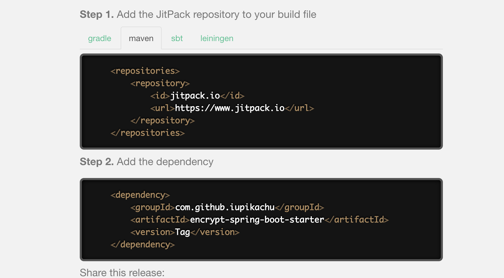

## 自定义Springboot-Starter （接口参数加密解密工具）

学习自 微信公众号: 江南一点雨


### 1.开发加解密starter

引入 spring-boot-starter-web 依赖：

```xml
<dependency>
    <groupId>org.springframework.boot</groupId>
    <artifactId>spring-boot-starter-web</artifactId>
    <scope>provided</scope>
    <version>2.4.3</version>
</dependency>
```

这个工具是为 Web 项目开发的，以后必然使用在 Web 环境中，所以这里添加依赖时 scope 设置为 provided。这样就不会把这个依赖打包。


#### 1.1 加密工具类

```java
public class AESUtils {

    private static final String AES_ALGORITHM = "AES/ECB/PKCS5Padding";

    // 获取 cipher
    private static Cipher getCipher(byte[] key, int model) throws Exception {
        SecretKeySpec secretKeySpec = new SecretKeySpec(key, "AES");
        Cipher cipher = Cipher.getInstance(AES_ALGORITHM);
        cipher.init(model, secretKeySpec);
        return cipher;
    }

    // AES加密
    public static String encrypt(byte[] data, byte[] key) throws Exception {
        Cipher cipher = getCipher(key, Cipher.ENCRYPT_MODE);
        return Base64.getEncoder().encodeToString(cipher.doFinal(data));
    }

    // AES解密
    public static byte[] decrypt(byte[] data, byte[] key) throws Exception {
        Cipher cipher = getCipher(key, Cipher.DECRYPT_MODE);
        return cipher.doFinal(Base64.getDecoder().decode(data));
    }
}
```


需要说明的是，加密后的数据可能不具备可读性，因此我们一般需要对加密后的数据再使用 Base64 算法进行编码，获取可读字符串。换言之，上面的 AES 加密方法的返回值是一个 Base64 编码之后的字符串，AES 解密方法的参数也是一个 Base64 编码之后的字符串，先对该字符串进行解码，然后再解密。


#### 1.2 定义两个注解 `@Decrypt` 和 `@Encrypt`：


注解按生命周期来划分可分为3类：

1、RetentionPolicy.SOURCE：注解只保留在源文件，当Java文件编译成class文件的时候，注解被遗弃；
2、RetentionPolicy.CLASS：注解被保留到class文件，但jvm加载class文件时候被遗弃，这是默认的生命周期；
3、RetentionPolicy.RUNTIME：注解不仅被保存到class文件中，jvm加载class文件之后，仍然存在；

这3个生命周期分别对应于：Java源文件(.java文件) ---> .class文件 ---> 内存中的字节码。

那怎么来选择合适的注解生命周期呢？

首先要明确生命周期长度 SOURCE < CLASS < RUNTIME ，所以前者能作用的地方后者一定也能作用。一般如果需要在运行时去动态获取注解信息，那只能用 RUNTIME 注解；如果要在编译时进行一些预处理操作，比如生成一些辅助代码（如 ButterKnife），就用 CLASS注解；如果只是做一些检查性的操作，比如 @Override 和 @SuppressWarnings，则可选用 SOURCE 注解。


```java
/**
 * @Description 加密注解
 */
@Retention(RetentionPolicy.RUNTIME)
@Target(ElementType.METHOD)
public @interface Encrypt {
}

/**
 * @Description 解密注解
 */
@Retention(RetentionPolicy.RUNTIME)
@Target({ElementType.METHOD,ElementType.PARAMETER})
public @interface Decrypt {
}
```


#### 1.3 读取用户自己配置的key

用户可能会自己配置加密的 key，因此我们再来定义一个 EncryptProperties 类来读取用户配置的 key：

```java
@Component
@ConfigurationProperties(prefix = "spring.encrypt")
public class EncryptProperties {
    private final static String DEFAULT_KEY = "www.itboyhub.com";
    private String key = DEFAULT_KEY;

    public String getKey() {
        return key;
    }

    public void setKey(String key) {
        this.key = key;
    }
}
```

key是16位字符串


#### 1.4 ResponseBodyAdvice 和 RequestBodyAdvice

RequestBodyAdvice 在做解密的时候倒是没啥问题，而 ResponseBodyAdvice 在做加密的时候则会有一些局限，不过影响不大，如果想非常灵活的掌控一切，那还是自定义过滤器吧。


```java
public interface ResponseBodyAdvice<T> {
/**
 * Whether this component supports the given controller method return type
 * and the selected {@code HttpMessageConverter} type.
 * @param returnType the return type
 * @param converterType the selected converter type
 * @return {@code true} if {@link #beforeBodyWrite} should be invoked;
 * {@code false} otherwise
 */
boolean supports(MethodParameter returnType, Class<? extends HttpMessageConverter<?>> converterType);

/**
 * Invoked after an {@code HttpMessageConverter} is selected and just before
 * its write method is invoked.
 * @param body the body to be written
 * @param returnType the return type of the controller method
 * @param selectedContentType the content type selected through content negotiation
 * @param selectedConverterType the converter type selected to write to the response
 * @param request the current request
 * @param response the current response
 * @return the body that was passed in or a modified (possibly new) instance
 */
T beforeBodyWrite(T body, MethodParameter returnType, MediaType selectedContentType,
		Class<? extends HttpMessageConverter<?>> selectedConverterType,
		ServerHttpRequest request, ServerHttpResponse response);
		}
```


这个接口有beforeBodyWrite方法，可以提前对response的body进行一些操作。如加密解密。


ResponseBodyAdvice 在你使用了 @ResponseBody 注解的时候才会生效，RequestBodyAdvice 在你使用了 @RequestBody 注解的时候才会生效，换言之，前后端都是 JSON 交互的时候，这两个才有用。不过一般来说接口加解密的场景也都是前后端分离的时候才可能有的事。


#### 1.5 接口加密

```java
@EnableConfigurationProperties(EncryptProperties.class)
@ControllerAdvice
public class EncrpyResponse implements ResponseBodyAdvice<RespBean> {
    private ObjectMapper om = new ObjectMapper();
    @Autowired
    EncryptProperties encryptProperties;
    @Override
    public boolean supports(MethodParameter returnType, Class<? extends HttpMessageConverter<?>> aClass) {
        return returnType.hasMethodAnnotation(Encrypt.class);
    }

    @Override
    public RespBean beforeBodyWrite(RespBean body, MethodParameter returnType, MediaType selectedContentType, Class<? extends HttpMessageConverter<?>> aClass, ServerHttpRequest request, ServerHttpResponse response) {
        byte[] keyBytes = encryptProperties.getKey().getBytes();
        try {
            if (body.getMsg()!=null) {
                body.setMsg(AESUtils.encrypt(body.getMsg().getBytes(),keyBytes));
            }
            if (body.getObj() != null) {
                body.setObj(AESUtils.encrypt(om.writeValueAsBytes(body.getObj()), keyBytes));
            }
        } catch (Exception e) {
            e.printStackTrace();
        }
        return body;

    }
}
```

1. supports：这个方法用来判断什么样的接口需要加密，参数 returnType 表示返回类型，我们这里的判断逻辑就是方法是否含有 `@Encrypt` 注解，如果有，表示该接口需要加密处理，如果没有，表示该接口不需要加密处理。
2. beforeBodyWrite：这个方法会在数据响应之前执行，也就是我们先对响应数据进行二次处理，处理完成后，才会转成 json 返回。我们这里的处理方式很简单，RespBean 中的 status 是状态码就不用加密了，另外两个字段重新加密后重新设置值即可。
3. 另外需要注意，自定义的 ResponseBodyAdvice 需要用 `@ControllerAdvice` 注解来标记。


#### 1.6 接口解密

```java
@EnableConfigurationProperties(EncryptProperties.class)
@ControllerAdvice
public class DecryptRequest extends RequestBodyAdviceAdapter {
    @Autowired
    EncryptProperties encryptProperties;

    @Override
    public boolean supports(MethodParameter methodParameter, Type type, Class<? extends HttpMessageConverter<?>> aClass) {
        return methodParameter.hasMethodAnnotation(Decrypt.class) || methodParameter.hasParameterAnnotation(Decrypt.class);
    }

    @Override
    public HttpInputMessage beforeBodyRead(final HttpInputMessage  inputMessage, MethodParameter parameter, Type targetType, Class<? extends HttpMessageConverter<?>> converterType) throws IOException {
        byte[] body = new byte[inputMessage.getBody().available()];
        inputMessage.getBody().read(body);
        try {
            byte[] decrypt = AESUtils.decrypt(body, encryptProperties.getKey().getBytes());
            final ByteArrayInputStream bais = new ByteArrayInputStream(decrypt);
            return new HttpInputMessage() {
                @Override
                public InputStream getBody() throws IOException {
                    return bais;
                }

                @Override
                public HttpHeaders getHeaders() {
                    return inputMessage.getHeaders();
                }
            };
        } catch (Exception e) {
            e.printStackTrace();
        }
        return super.beforeBodyRead(inputMessage, parameter, targetType, converterType);
    }

}
```

1. 首先大家注意，DecryptRequest 类我们没有直接实现 `RequestBodyAdvice` 接口，而是继承自 RequestBodyAdviceAdapter 类，该类是 RequestBodyAdvice 接口的子类，并且实现了接口中的一些方法，这样当我们继承自 RequestBodyAdviceAdapter 时，就只需要根据自己实际需求实现某几个方法即可。
2. supports：该方法用来判断哪些接口需要处理接口解密，我们这里的判断逻辑是方法上或者参数上含有 `@Decrypt` 注解的接口，处理解密问题。
3. beforeBodyRead：这个方法会在参数转换成具体的对象之前执行，我们先从流中加载到数据，然后对数据进行解密，解密完成后再重新构造 HttpInputMessage 对象返回。


#### 1.7 定义自动化配置类

```java
@Configuration
@ComponentScan("com.cqp.encryptspringbootstarter")
public class EncryptAutoConfiguration {
}
```


#### 1.8 自动加载

最后，resources 目录下定义 META-INF，然后再定义 spring.factories 文件

```properties
EnableAutoConfiguration=com.cqp.encryptspringbootstarter.autoconfig.EncryptAutoConfiguration
```

这样当项目启动时，就会自动加载该配置类。

starter到此为止开发完毕。


### 2.打包发布

可以将项目安装到本地仓库，也可以发布到线上供他人使用。

#### 2.1 安装到本地仓库

安装到本地仓库比较简单，直接 `mvn install`，或者在 IDEA 中，点击右边的 Maven，然后双击 install，如下：

#### 2.2 发布到线上

使用 JitPack

首先我们在 GitHub 上创建一个仓库，将我们的代码上传上去

上传成功后，点击右边的 `Create a new release`按钮，发布一个正式版



发布成功后，打开 jitpack，输入仓库的完整路径，点击 lookup 按钮，查找到之后，再点击 `Get it` 按钮完成构建，如下：



构建成功后，JitPack 上会给出项目引用方式：




如下引用这个starter

```xml
<dependencies>
   <dependency>
	    <groupId>com.github.iupikachu</groupId>
	    <artifactId>encrypt-spring-boot-starter</artifactId>
	    <version>0.0.1</version>
	</dependency>
</dependencies>
<repositories>
    <repository>
        <id>jitpack.io</id>
        <url>https://jitpack.io</url>
    </repository>
</repositories>
```

