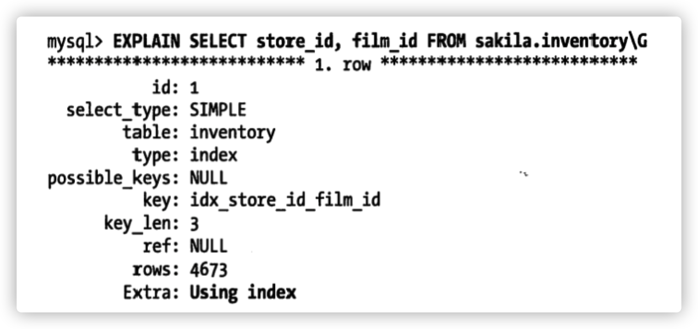

## **高性能Mysql **

笔记来源于        极客时间     《Mysql实战45讲》—— 丁奇   

​							 中华石杉	 《从零开始带你成为MySQL实战优化高手》 ——救火队长


### 1.基础架构


* Server 层
  * 连接器
  * 查询缓存
  * 分析器
  * 优化器
  * 执行器
* 存储引擎层
  * InnoDB
  * MyISAM
  * Memory


**不同的存储引擎共用一个 Server层**


#### 1.1 连接器

第一步，你会先连接到这个数据库上，这时候接待你的就是连接器。连接器负责跟客户端**建立连接**、**获取权限**、**维持和管理连接**。连接命令一般是这么写的：

```mysql
mysql -h$ip -P$port -u$user -p
```

在完成经典的 TCP 握手后，连接器就要开始认证你的身份，这个时候用的就是你输入的用户名和密码。

如果用户名或密码不对，你就会收到一个"Access denied for user"的错误，然后客户端程序结束执行。

如果用户名密码认证通过，连接器会到权限表里面查出你拥有的权限。之后，这个连接里面的权限判断逻辑，都将依赖于此时读到的权限。


连接完成后，如果你没有后续的动作，这个连接就处于空闲状态，你可以在 show processlist 命令中看到它。其中的 Command 列显示为“Sleep”的这一行，就表示现在系统里面有一个空闲连接。


​		客户端如果太长时间没动静，连接器就会自动将它断开。这个时间是由参数 **wait_timeout** 控制的，默认值是 8 小时。

​		**长连接**:	连接成功后，如果客户端持续有请求，则一直使用同一个连接		

​		**短连接:**	每次执行完很少的几次查询就断开连接，下次查询再重新建立一个

​		建立连接的过程比较复杂,尽量使用长连接。但是因为mysql执行过程中临时使用的内存是管理在连接对象中的，这些资源在		连接断开时才会释放，所以长连接不断累积，会导致内存占用太大，被系统强行杀掉(OOM)，会看到mysql异常重启了。

​		解决方法:

​			1. 定期断开长连接。使用一段时间或者执行过一次占用大内存的大查询后断开，要查询的话再重连

​			2. Mysql 5.7 或更新的版本，可以在执行较大操作后，执行 **mysql_reset_connection** 重新初始化连接资源，这个过程不需要重连和重新做权限验证，但是会将连接恢复到刚刚创建完的状态。


连接池：c3p0 druid

数据库端连接池与客户端连接池是一一对应的。

网络连接需要后台线程去监听端口和解析数据。


#### 1.2 查询缓存


MySQL 拿到一个查询请求后，会先到查询缓存看看，之前是不是执行过这条语句。

之前执行过的语句及其结果可能会以 **key-value** 对的形式，被直接缓存在内存中。

key 是查询的语句，value 是查询的结果。如果你的查询能够直接在这个缓存中找到 key，那么这个 value 就会被直接返回给客户端。

如果语句不在查询缓存中，就会继续后面的执行阶段。执行完成后，执行结果会被存入查询缓存中。


**但是大多数情况下我会建议不要使用查询缓存**

查询缓存的失效非常频繁，只要有对一个表的更新，这个表上所有的查询缓存都会被清空。

MySQL 8.0 版本直接将查询缓存的整块功能删掉了，也就是说 8.0 开始彻底没有这个功能了。


#### 1.3 分析器

如果没有命中查询缓存，就要开始真正执行语句了。


* **词法分析**：MySQL 需要识别出里面的字符串分别是什么，代表什么。比如说：把字符串“T”识别成“表名 T”，把字符串“ID”识别成“列 ID”。

* **语法分析: ** 根据语法规则，判断你输入的这个 SQL 语句是否满足 MySQL 语法。

  如果你的语句不对，就会收到“You have an error in your SQL syntax”的错误提醒，一般语法错误会提示第一个出现错误的位置，所以你要关注的是紧接“use near”的内容。


#### 1.4  优化器

经过了分析器，MySQL 就知道你要做什么了。在开始执行之前，还要先经过优化器的处理。

优化器是在表里面有多个索引的时候，决定使用哪个索引；或者在一个语句有多表关联（join）的时候，决定各个表的连接顺序。


```mysql

mysql> select * from t1 join t2 using(ID)  where t1.c=10 and t2.d=20;

```


* 既可以先从表 t1 里面取出 c=10 的记录的 ID 值，再根据 ID 值关联到表 t2，再判断 t2 里面 d 的值是否等于 20。
* 也可以先从表 t2 里面取出 d=20 的记录的 ID 值，再根据 ID 值关联到 t1，再判断 t1 里面 c 的值是否等于 10。

这两种执行方法的逻辑结果是一样的，但是执行的效率会有不同，而优化器的作用就是决定选择使用哪一个方案。


#### 1.5 执行器


MySQL 通过分析器知道了你要做什么，通过优化器知道了该怎么做，于是就进入了执行器阶段，开始执行语句。


* 先判断一下你对这个表 T 有没有执行查询的权限，如果没有，就会返回没有权限的错误。

* 如果有权限，就打开表继续执行。打开表的时候，执行器就会根据表的引擎定义，去使用这个引擎提供的接口。

```mysql

mysql> select * from T where ID=10;

ERROR 1142 (42000): SELECT command denied to user 'b'@'localhost' for table 'T'
```


**执行器的执行流程：**

1. 调用 InnoDB 引擎接口取这个表的第一行，判断 ID 值是不是 10，如果不是则跳过，如果是则将这行存在结果集中；

2. 调用引擎接口取“下一行”，重复相同的判断逻辑，直到取到这个表的最后一行。

3. 执行器将上述遍历过程中所有满足条件的行组成的记录集作为结果集返回给客户端。


在数据库的慢查询日志中看到一个 **rows_examined** 的字段，表示这个语句执行过程中扫描了多少行。这个值就是在执行器每次调用引擎获取数据行的时候累加的。

执行器调用一次，在引擎内部则扫描了多行，因此**引擎扫描行数**跟 **rows_examined** 并不是完全相同的。


> 如果表 T 中没有字段 k，而你执行了这个语句 select * from T where k=1, 那肯定是会报“不存在这个列”的错误： “Unknown column ‘k’ in ‘where clause’”。你觉得这个错误是在我们上面提到的哪个阶段报出来的呢？


分析器


总的流程分析 :

1. java客户端程序通过 mysql数据库驱动与 mysql建立网络连接 （建立连接和关闭连接耗时较大，所以使用了连接池）
2. 数据库后台线程接收到请求拿到数据，查询一下在不在缓存中。
3. 通过sql接口执行，分析器分析sql语句。识别一下表、变量，语法检查一下。
4. 优化器，生成最优的执行计划
5. 执行器判断有没有权限，调用存储引擎的接口去完成执行计划 (操作磁盘数据)


### 2.日志系统


一条更新语句的执行流程又是怎样的呢？MySQL 可以恢复到半个月内任意一秒的状态，惊叹的同时，你是不是心中也会不免会好奇，这是怎样做到的呢？


两个重要的日志模块:

1.  **redo log** （重做日志）
2.  **bin log**  (归档日志)


#### 2.1 redo log

WAL 技术 Write-Ahead Logging 先写日志，再写磁盘。

具体来说，当有一条记录需要更新的时候，InnoDB 引擎会先把记录写到 redo log ，并更新内存，这个时候更新就算完成了，同时，InnoDB引擎会在适当的时候将这个操作记录更新到磁盘，而这个更新往往是在系统比较空闲的时候。


例子: 	粉板(redo log)	 账本(bin log)

如果今天赊账的不多，掌柜可以等打烊后再整理。但如果某天赊账的特别多，粉板写满了，又怎么办呢？这个时候掌柜只好放下手中的活儿，把粉板中的一部分赊账记录更新到账本中，然后把这些记录从粉板上擦掉，为记新账腾出空间。


与此类似，InnoDB 的 redo log 是固定大小的，比如可以配置为一组 4 个文件，每个文件的大小是 1GB，那么这块“粉板”总共就可以记录 4GB 的操作。从头开始写，写到末尾就又回到开头循环写，如下面这个图所示。


write pos 是当前记录的位置，一边写一边后移，写到第 3 号文件末尾后就回到 0 号文件开头。checkpoint 是当前要擦除的位置，也是往后推移并且循环的，擦除记录前要把记录更新到数据文件。


write pos 和 checkpoint 之间的是“粉板”上还空着的部分，可以用来记录新的操作。如果 write pos 追上 checkpoint，表示“粉板”满了，这时候不能再执行新的更新，得停下来先擦掉一些记录，把 checkpoint 推进一下。


有了 redo log，InnoDB 就可以保证即使数据库发生异常重启，之前提交的记录都不会丢失，这个能力称为 **crash-safe** 。数据库重启了，**内存中的数据页没有同步到磁盘中**，可以通过redo log日志恢复。


#### 2.2 bin log

MySQL 整体来看，其实就有两块：一块是 Server 层，它主要做的是 MySQL 功能层面的事情；还有一块是引擎层，负责存储相关的具体事宜。


上面的粉板 redo log 是 InnoDB 引擎特有的日志，而 Server 层也有自己的日志，称为 binlog（归档日志）。


> 为什么会有两份日志呢？

最开始 MySQL 里并没有 InnoDB 引擎。MySQL 自带的引擎是 MyISAM，但是 MyISAM 没有 crash-safe 的能力，binlog 日志只能用于归档。


**redo log 和 bin log 的不同处:**

1. redo log 是 InnoDB 引擎特有的；binlog 是 MySQL 的 Server 层实现的，所有引擎都可以使用。

2. redo log 是物理日志，记录的是“在某个数据页上做了什么修改”；binlog 是逻辑日志，记录的是这个语句的原始逻辑，比如“给 ID=2 这一行的 c 字段加 1 ”。

3. redo log 是循环写的，空间固定会用完；binlog 是可以追加写入的。“追加写”是指 binlog 文件写到一定大小后会切换到下一个，并不会覆盖以前的日志。

   

执行器和 InnerDB引擎在执行这条 Update语句的流程:

1. 执行器先找引擎取 ID=2 这一行。ID 是主键，引擎直接用树搜索找到这一行。如果 ID=2 这一行所在的数据页本来就在内存中，就直接返回给执行器；否则，需要先从磁盘读入内存，然后再返回。
2. 执行器拿到引擎给的行数据，把这个值加上 1，比如原来是 N，现在就是 N+1，得到新的一行数据，再调用引擎接口写入这行新数据。
3. 引擎将这行新数据更新到内存中，同时将这个更新操作记录到 redo log 里面，此时 redo log 处于 prepare 状态。然后告知执行器执行完成了，随时可以提交事务。
4. 执行器生成这个操作的 binlog，并把 binlog 写入磁盘。
5. 执行器调用引擎的提交事务接口，引擎把刚刚写入的 redo log 改成提交（commit）状态，更新完成。


update 语句的执行流程图，图中浅色框表示是在 InnoDB 内部执行的，深色框表示是在执行器中执行的。


redo log 的写入拆成了两步: prepare commit  这就是 **两阶段提交**

如果不使用“两阶段提交”，那么数据库的状态就有可能和用它的日志恢复出来的库的状态不一致。

> 这个概率是不是很低，平时也没有什么动不动就需要恢复临时库的场景呀？


其实不是的，不只是误操作后需要用这个过程来恢复数据。当你需要扩容的时候，也就是需要再多搭建一些备库来增加系统的读能力的时候，现在常见的做法也是用**全量备份**加上应用 **binlog** 来实现的，这个“不一致”就会导致你的线上出现**主从数据库不一致**的情况。


简单说，redo log 和 binlog 都可以用于表示事务的提交状态，而两阶段提交就是让这两个状态保持逻辑上的一致。

redolog和binlog具有关联行，在恢复数据时，redolog用于恢复主机故障时的未更新的物理数据，binlog用于备份操作。

每个阶段的log操作都是记录在磁盘的，在恢复数据时，redolog 状态为commit则说明binlog也成功，直接恢复数据；

如果redolog是prepare，则需要查询对应的binlog事务是否成功，决定是回滚还是执行。

**通过查看redo日志状态，手工决定后续操作，以此来保证数据一致性。**


**两个重要参数**

redo log 用于保证 crash-safe 能力。**innodb_flush_log_at_trx_commit** 这个参数设置成 1 的时候，表示每次事务的 redo log 都直接持久化到磁盘。这个参数我建议你设置成 1，这样可以保证 MySQL 异常重启之后数据不丢失。

**sync_binlog** 这个参数设置成 1 的时候，表示每次事务的 binlog 都持久化到磁盘。这个参数我也建议你设置成 1，这样可以保证 MySQL 异常重启之后 binlog 不丢失。


**分析一条 update 语句**

```sql
#原先的 name = 'zhangsan'
update users set name = 'xxx' where id =10
```


innoDB 会先将 "id = 10"这一行数据看看是否在缓冲池里，如果不在的话会直接从磁盘里加载到缓冲池里，而且还会对这行记录加**独占锁**。


innodb把要更新的值 zhangsan id=10 这些信息写入到 **undo日志**中。


先更新内存缓冲池中的记录，此时这个记录就是**脏数据**。

磁盘上这行数据的 name 还是 zhangsan , 但是内存里这行数据已经被修改了。


为了避免此时mysql宕机，导致内存中的数据丢失，此时把对内存所做的修改写入到 **Redo Log Buffer** 中。

redo日志，其实就是记录修改 id=10 修改了name 字段为xxx。


假设: 发生宕机，事务没提交，此时丢失了内存中的数据和redo log，事务失败，数据还是正确的，无影响。

我们要提交事务了，就要依据设置的策略先把redo 日志从 redo log buffer 刷入到磁盘文件里。

策略: innodb_flush_log_at_trx_commitu 参数

1. 设置为 0，提交事务不会把 redo log buffer 里的日志刷入磁盘。此时宕机，内存数据和日志全部丢失。
2. 设置为1，提交事务时，必须把 redo log 刷入磁盘，此时宕机，就算更新的数据还没刷入磁盘，但是redo log 刷入了磁盘，可以根据 redo log 来恢复内存中的数据。 


3. 设置为2，把redo log 写入磁盘文件对应的 os cache 内存缓存里，实际没到磁盘上。此时宕机，内存数据一样会丢失，会丢失一秒的数据。


准备提交事务，依据策略把 **binlog** 日志写入磁盘。

**binlog日志策略:** sync_binlog 参数

1. sync_binlog: 0 日志写入 os cache 内存缓存。机器宕机，会丢失数据。
2. sync_binlog: 1 强制提交事务的时候，binlog直接写入到磁盘文件里去。机器宕机，数据也可以恢复。


最后把本次更新对应的 binlog文件名称和这次更新的 binlog日志在文件中的位置都写入到 redo log 日志中，同时在redo log日志文件里写入一个 commit。最终完成了事务的提交。

```bash
binlog文件名称: 
binlog文件位置:
commit
```

这样做是为了保持 redo log和bin log一致的。


假设我们已经提交了事务

内存中id 为10的 name已经是 'xxx' 了。但是磁盘里的id 为10的name 还是 'zhangsan' 。此时就是脏数据。

mysql有一个io后台线程，会在某个时间，随机把内存 buffer pool中的修改后的脏数据刷回到磁盘上的数据文件。


哪怕mysql宕机了，也没关系，因为重启之后，可以根据 redo log 恢复之前提交事务的修改到内存中。把 id=10的name修改为 ‘xxx’，等合适的时机，io线程自然会把修改后的数据刷到磁盘。

**1234步骤属于更新阶段，56属于事务开始阶段**


**update语句执行流程总结**:

1. 先判断innodb的 buffer pool缓冲池里面是否有数据，如果没有就从磁盘读取,缓存到缓冲池，在更新前加独占锁。
2. 把更新前的值写到 undo日志里面，便于后面的回滚操作。
3. 在更新前先写 redo log 到redo log buffer里  innodb_flush_log_at_trx_commitu 参数为1,此时同步把redo log刷入到磁盘中。
4. 准备提交事务时，sync_binlog:1  binlog日志直接写入磁盘。并且在 redo log中写入这次事务的binlog 名称和位置 和 commit。事务提交完成，事务执行成功。
5. mysql后台io线程随机把内存中已经完成事务修改后的数据刷入到磁盘中。


**问题:**


当前事务提交了，但是其他事务可能还需要 undo log 读取旧版本的数据。

undo log 是回滚段，当没有事务需要使用这个 undo log 来进行版本号数据查询时会被清理。


#### 2.3 undo log

在Innodb当中，INSERT操作在事务提交前只对当前事务可见，Undo log在事务提交后即会被删除，因为新插入的数据没有历史版本，所以无需维护insert的 Undo log。 (基本没有人会对刚插入的数据有可见性需求)

而对于UPDATE、DELETE，则需要维护多版本信息。 在InnoDB当中，UPDATE和DELETE操作产生的Undo log都属于同一类型：update_undo。（update可以视为insert新数据到原位置，delete旧数据，undo log暂时保留旧数据）。


Undo log指事务开始之前，在操作任何数据之前,首先将需操作的数据备份到一个地方 (Undo Log)。

UndoLog是为了实现事务的原子性而出现的产物。


**Undo Log实现了事务的原子性：**

事务处理过程中如果出现了错误或者用户执行了 ROLLBACK语句，MySQL可以利用Undo Log中的备份将数据恢复到事务开始之前的状态。


**MySQL InnoDB通过Undo log实现MVCC：**

事务未提交之前，Undo log保存了未提交之前的版本数据，Undo log中的数据可作为数据旧版本快照供其他并发事务进行快照读。 


### 2.4 总结


在InnoDB中，有三种日志跟事务的ACID关系都很大：

1. **undo log负责原子性**，保护事务在exception或手动rollback时可以回滚到历史版本数据
2. **redo log负责落盘式持久性**，保证事务提交后新的数据不会丢失
3. **binlog负责副本式持久性**，可以将主节点上的数据复制到从节点，主节点crash后业务可以正常运转


**undo log只关心过去，redo log只关心未来**


作者：普通熊猫
链接：https://www.zhihu.com/question/445644612/answer/1742967478
来源：知乎
著作权归作者所有。商业转载请联系作者获得授权，非商业转载请注明出处。

https://mp.weixin.qq.com/s/V-Calkc3rmhdkH581Qc7rA


### 3.事务

事务就是要保证一组数据库操作，要么全部成功，要么全部失败。

#### 3.1 隔离性与隔离级别

ACID（Atomicity、Consistency、Isolation、Durability，即原子性、一致性、**隔离性**、持久性）

隔离程度越大，效率越低。


事务隔离级别:

* 读未提交:  一个事务还没提交时，它对数据的更改，就能被其他事务看到。
* 读提交:  事务提交后，它做的更改才会被其他事务看到。
* 可重复读: 事务执行过程中看到的数据，和这个事务启动时看到的数据一致。 (mvcc)
* 串行化: 写会加写锁，读会加读锁，出现冲突时，后访问的事务必须等前一个事务执行完成，才能继续执行


Oracle 数据库的默认隔离级别: 读提交

Mysql 数据库的默认隔离级别: 可重复读

对于一些从 Oracle 迁移到 MySQL 的应用，为保证数据库隔离级别的一致，你一定要记得将 MySQL 的隔离级别设置为“读提交”。


如何实现事务的隔离性:

**MVCC**：多版本并发控制，通过undo log版本链和read-view实现事务隔离 （可重复读）

维持一个数据的多个版本，使得读写操作没有冲突，使用快照读具体实现mvcc。

**作用：**

* 并发读写数据库时，可以在读操作时不阻塞写操作，写操作时不阻塞读操作，提高并发读写性能
* 解决了脏读、幻读、不可重复读等事务隔离问题，单不能解决更新丢失问题


同一条记录在系统中可以存在多个版本，就是数据库的多版本并发控制（MVCC）

假设一个值从 1 被按顺序改成了 2、3、4，在回滚日志里面就会有类似下面的记录。


当前值是 4，但是在查询这条记录的时候，不同时刻启动的事务会有不同的 read-view。

对于 read-view A，要得到 1，就必须将当前值依次执行图中所有的回滚操作得到。

在可重复读隔离级别中，表中的数据其实已经改变，在前面的视图里，需要查找某条记录时，是通过取当前数据，再取视图对应的回滚段回滚到该视图的值。

> **什么时候删除回滚日志(undo log) ?**

在不需要的时候才删除。也就是说，系统会判断，当没有事务再需要用到这些回滚日志时，回滚日志会被删除。

当系统里没有比这个回滚日志更早的 read-view 的时候。

> **基于上面的说明，我们来讨论一下为什么建议你尽量不要使用长事务。**

长事务意味着系统里面会存在很老的事务视图。由于这些事务随时可能访问数据库里面的任何数据，所以这个事务提交之前，数据库里面它可能用到的回滚记录都必须保留，这就会导致大量占用存储空间。

除了对回滚段的影响，长事务还占用锁资源，也可能拖垮整个库。


MySQL 的事务启动方式:

* 显式启动事务语句， begin 或 start transaction。配套的提交语句是 commit，回滚语句是 rollback。
* set autocommit=0，这个命令会将这个线程的自动提交关掉。执行select语句，事务也会启动，直到rollback或者 commit。

有些客户端连接框架会默认连接成功后先执行一个 set autocommit=0 的命令。这就导致接下来的查询都在事务中，如果是长连接，就导致了意外的长事务。

建议总是使用 set autocommit=1, 通过显式语句的方式来启动事务。


可以在 information_schema 库的 innodb_trx 这个表中查询长事务，比如下面这个语句，用于查找持续时间超过 60s 的事务。

```mysql

select * from information_schema.innodb_trx where TIME_TO_SEC(timediff(now(),trx_started))>60
```


脏读:  一个事务读取了另一个事务未提交的数据

不可重复读: 一个事务读取表中数据，多次读取结果不同

幻读: 一个事务读取到了别的事务插入的数据，导致前后读取不一致 


> 如何避免长事务对业务的影响?

应用开发角度:

1. 确认是否使用了 **set autocommit=0**。这个确认工作可以在测试环境中开展，把 MySQL 的 general_log 开起来，然后随便跑一个业务逻辑，通过 general_log 的日志来确认。一般框架如果会设置这个值，也就会提供参数来控制行为，你的目标就是把它改成 1。

2. 确认是否有不必要的**只读事务**。有些框架会习惯不管什么语句先用 begin/commit 框起来。我见过有些是业务并没有这个需要，但是也把好几个 select 语句放到了事务中。这种只读事务可以去掉。

3. 业务连接数据库的时候，根据业务本身的预估，通过 **SET MAX_EXECUTION_TIME** 命令，来控制每个语句执行的最长时间，避免单个语句意外执行太长时间。


数据库端:

1. 监控 information_schema.Innodb_trx 表，设置长事务阈值，超过就报警 / 或者 kill；
2. Percona 的 pt-kill 这个工具不错，推荐使用；
3. 在业务功能测试阶段要求输出所有的 general_log，分析日志行为提前发现问题；
4. 如果使用的是 MySQL 5.6 或者更新版本，把 innodb_undo_tablespaces 设置成 2（或更大的值）。如果真的出现大事务导致回滚段过大，这样设置后清理起来更方便。


### 4.索引


**索引的常见模型:**

1. 哈希表 (范围查询效率很低，适用于等值查询，比如Memcached Nosql)
2. 有序数组 (范围查询和等值查询性能都跟优秀，更新数据效率很低，适用于静态存储引擎)
3. 二叉搜索树


下面只说明 innoDB的 B-tree 索引

#### **4.1 索引存储结构**


> 为了让一个查询尽量少地读磁盘，就必须让查询过程访问尽量少的数据块。那么，我们就不应该使用二叉树，而是要使用“N 叉”树。这里，“N 叉”树中的“N”**取决于数据块的大小**。
>
> 以 InnoDB 的一个整数字段索引为例，这个 N 差不多是 1200。这棵树高是 4 的时候，就可以存 1200 的 3 次方个值，这已经 17 亿了。考虑到树根的数据块总是在内存中的，一个 10 亿行的表上一个整数字段的索引，查找一个值最多只需要访问 3 次磁盘。其实，树的第二层也有很大概率在内存中，那么访问磁盘的平均次数就更少了。

为了提高效率使用 n 叉树。

mysql 默认 一页内存大小为16KB

一个整数(bigint)字段索引为 8B 另外还有跟着索引指向其子树的指针6B   一个索引 14B

16KB/14B = 16 * 1024 /14 = 1170


N 叉树由于在读写上的性能优点，以及适配磁盘的访问模式，已经被广泛应用在数据库引擎中了。

在 MySQL 中，索引是在存储引擎层实现的，所以并没有统一的索引标准，即不同存储引擎的索引的工作方式并不一样。


>  为什么使用B树 ？

系统读取内存上的数据时是非常快的，主存存取的时间仅仅与存取次数呈线性关系，不存在机器操作，效率非常快。

系统读取磁盘上的数据时，磁盘I/O存在机械运动损耗，需要磁盘头去寻道，效率不高。

索引一般以文件形式存储在磁盘上。

将一个B树的节点(包括索引页节点、数据节点)大小设为等于一个页，这样每个节点只需要一次 磁盘I/O就可以完全载入。

为了减少访问磁盘的次数，树要矮壮一些，树的高度不能太高，红黑树相对来说较高，多叉树，像B树非常合适。像上面分析的可以有1000+的叉，三层就可以存储百万以上的数据。搜索只需要最多只需要3次磁盘I/O


> InnoDB （聚集索引） 与 MyISAM （非聚集索引）的区别 ?


Innodb使用的是聚集索引(**聚簇索引**)，将主键作为索引，行数据存储在主键的索引树的叶子节点上。将数据存储与索引放到了一起。

 id 为主键有主键索引   name 为字段 有name字段的辅助索引  

* 查询时用 where  id = '1001' 直接查找这棵树的主键索引树，返回行数据。
* 查询时用 where  name = 'xxx' ，先搜寻name自己的辅助索引，辅助索引存储的是主键索引的值，拿到主键的值之后，再重新查询主键的索引树，拿到行数据。这个操作叫做 "回表" , 需要查询两棵树。

 


MyISAM 使用的是非聚集索引，非聚集索引的两颗B+树没有什么区别，节点的结构完全一致，只是存储内容不同，主键的索引树的叶子节点存储的是主键，辅助索引树叶子节点存储的是辅助键。

行数据存储在独立的地方，辅助键检索树不需要通过主键去拿行数据，不会有"回表"的情况。


二级索引同辅助索引


**聚集索引的特点**

* 唯一性 数据和索引放在一起，所以一个表仅有一个聚簇索引。
* 表中行的物理顺序和索引中行的物理顺序相同。数据行 按照一定的顺序排列，并且自动维护这个顺序（按照主键索引的顺序排列）；
* 聚集索引默认是主键，如果表中没有主键，InnoDB会选择唯一且非空的索引代替，如果没有这样的索引,InnoDB会隐式定义一个主键。


**聚集索引的优点**

* 因为数据行是按照主键顺序排列的，所以可以把相关的数据保存在一起。

  例如实现电子邮箱的 时候，可以根据用户id来聚集数据，这样只需要从磁盘读取少量的数据页就能获得某个用户的全部邮件。如果没有使用聚集索引，则每封邮件都可能导致一次磁盘I/O。

* 数据访问更快。因为数据和索引保存在同一棵B-Tress中。

* 覆盖索引索引扫描的查询可以直接使用页节点中的主键值。


**聚集索引的缺点**

* 对于在磁盘上的数据，聚簇索引极大的提高了效率。但是如果数据在内存中的话，数据的有序对访问效率就没那么重要了，聚集所以也就没什么优势了。因为内存根据地址直接返回数据，而磁盘需要一个磁头读取的时间。
* 插入速度依赖于插入顺序。按照主键自增插入是最快的方法，但是如果不按照主键顺序插入数据，要移动后面的数据，如果页满了无法插入也会有**页分裂**的情况，影响性能。
* 更新聚簇索引列的代价很高，InnoDB将每个被更新的行移动到新的位置。也可能会导致**页分裂**的问题。当行的主键值要求必须将这一行插入到某个已满的页中时，存储引擎会将该页分裂成两个页面来容纳该行，导致表占用更多的磁盘空间。
* 辅助索引(二级索引)的叶子节点保存了行的主键列，主键列比较大的话，辅助索引也会比较占空间。
* 二级索引访问需要两次索引查找，**回表**问题。


**MyISAM数据分布**

MyISAM的数据分布很简单，按照数据的插入顺序存储在磁盘上。MyISAM的辅助索引(二级索引)和主键索引并无区别。

 


**InnoDB 数据分布**


InnorDB的聚簇索引，就是整张表。

聚簇索引的每一个叶子节点都包含了 

* 主键值
* 事务ID
* 回滚指针 (用于事务和mvcc)
* 剩余的数据列 (例子中是col2)


InnorDB （辅助索引）二级索引的叶子节点存储的不是 “行指针”，而是主键值，以此去聚簇索引搜寻行数据。


> innorDB 为什么建议自定义自增主键？

如果正在使用的 InnorDB表 没有什么数据需要聚集，那么可以定义一个代理键作为主键。

这种主键的数据应该和业务无关，最简单的是使用 AUTO_INCREMENT 自增列。可以保证数据行是按顺序写入。

最好避免随机的（不连续且值的范围非常大）聚簇索引。

从性能的角度，使用UUID作为索引很糟糕，使得聚簇索引的插入变得完全随机。数据没有任何聚集特性。

使用UUID作为主键插入数据时，因为新行的主键值不一定比之前插入大，所以InnoDB无法简单地总是把新行插入到索引的最后，而是需要寻找新的位置，很有可能是中间位置。这会导致:

* 写入的目标页可能已经从缓存中移除，或者还没有加载到缓存，那就只能从磁盘去拿，导致大量的磁盘I/O
* 写入是乱序的，InnoDB不得不频繁地做页分裂操作，以便为新的行分配空间，页分裂会导致大量的数据移动。
* 由于页分裂，页会变得稀疏，最终会有数据碎片。

**tips**: 在把这些随机值载入到聚簇索引后，也许需要一次 **OPTIMIZE TABLE** 重建表的底层优化这些页。


**顺序的主键也有缺点：**

高并发下，按主键顺序插入会造成 **争用**。主键的上界会成为 **热点**，因为所有的插入都发生在这里，并发插入会导致间隙锁竞争。

另一个热点是 AUTO_INCREMENT 锁机制。


####  4.2 索引建立原则


#### 4.3 索引使用

* 独立的列 作为索引的字段不能是表达式的一部分，也不能是函数的参数。要保持列的干净。

  ```mysql
  mysql> SELECT actor_id FROM sakila. actor WHERE actor_id+1=5;
  ```

  无法使用索引。

* 最左匹配原则

  ```mysql
   SHOW INDEX FROM employees.titles;
  ```

  

主索引为<emp_no, title, from_date>

   1. 全列匹配

      ```mysql
      EXPLAIN SELECT * FROM employees.titles WHERE emp_no='10001' AND title='Senior Engineer' AND from_date='1986-06-26';
      
      EXPLAIN SELECT * FROM employees.titles WHERE from_date='1986-06-26' AND emp_no='10001' AND title='Senior Engineer';
      ```

      按照索引中的列进行精确匹配，索引对列的顺序是敏感的，但是Mysql的查询优化器会自动调整子句的条件顺序以满足合适的索引。效果是一样的。

​       	

2. 最左前缀匹配

      ```mysql
      # 用到了 emp_no 索引
      EXPLAIN SELECT * FROM employees.titles WHERE emp_no='10001';
      
      # 用到了 <emp_no,title> 索引
      EXPLAIN SELECT * FROM employees.titles WHERE emp_no='10001' AND title='Senior Engineer' ;
      
      # 中间的 title索引未提供 所以只用到了 emp_no索引
      EXPLAIN SELECT * FROM employees.titles WHERE emp_no='10001' AND from_date='1986-06-26';
      
      
      # 填坑 如果中间缺失的字段列值比较少，可以用in填充 这样就可以用到<emp_no,title,from_date>
      EXPLAIN SELECT * FROM employees.titles
      WHERE emp_no='10001'
      AND title IN ('Senior Engineer', 'Staff', 'Engineer', 'Senior Staff', 'Assistant Engineer', 'Technique Leader', 'Manager')
      AND from_date='1986-06-26';
      
      # 不指定第一列   无法使用索引
      EXPLAIN SELECT * FROM employees.titles WHERE from_date='1986-06-26';
      
      # 使用 like  用到了 <emp_no,title>索引
      EXPLAIN SELECT * FROM employees.titles WHERE emp_no='10001' AND title LIKE 'Senior%';
      
      # 范围查询 
      # 范围列后面的列无法用到索引  只使用了 <emp_no> 索引
      EXPLAIN SELECT * FROM employees.titles WHERE emp_no < '10010' and title='Senior Engineer';
      
      ```


3. 前缀索引 

   索引选择性(Selectivity)就是不重复的索引值 (Cardinality)与表记录数 （#T）的比值。 
   
    Index Selectivity = Cardinality / #T
   
   选择性越高的索引价值越大
   
   用这个索引选择性找到合适长度的前缀
   
   

 找到合适的前缀长度，创建前缀索引


前缀索引可以让索引更小、更快。但是Mysql无法用前缀索引做 order by 和 group by，也无法使用前缀索引做覆盖扫描。

使用场景: 存储网站会话(Session)时，需要在一个很长的十六进制字符串上建索引，此时如果用长度为8的前缀索引能显著提升性能。


4. 多列索引

     给每一个where后面的字段建索引是错误的，并不能显著提高mysql的性能。

     虽然mysql5.0之后可以根据两个单列的索引进行查询再合并的操作，以前版本的直接扫描全表。

     但是这是优化的结果，也说明索引建的很糟糕。


当以下情况出现时可以用全列索引:

* 查询有大量索引相交操作情况(多个and)

* 查询有大量索引联合操作情况(多个or)   会消耗大量的cpu和内存资源在算法的缓存、排序和合并中，索引选择性不高时，更加严重。

* 更重要的是，优化器只关心随机磁盘读取I/O,查询成本被低估，还不如全表扫描。

  如果在 **EXPLAIN**中看到有索引合并:

  * 看看是不是最优的
  * 关闭参数 optimizer_switch 关闭索引的合并功能
  * 使用 IGNORE_INDEX 让优化器忽略某些索引


创建多列索引需要考虑顺序问题

经验法则: 选择性高的列放前面 (不一定适用，不绝对)

举例:

```mysql
SELECT * FROM payment WHERE staff_id = 2 AND customer_id = 584;
```

对于这个语句应该创建<staff_id , customer_id> 索引还是<customer_id , staff_id>？


1. 看一下数据基数

   

customer_id 基数少，优先考虑 customer_id 放前面，因为数量更小。


2. 看一下选择性


customer_id 选择性更高，所以将其放前面更合适。

```mysql
ALTER TABLE payment ADD KEY(customer_id,staff_id)
```


但是建立索引不能但看某个查询，如果没有单个具体的查询那么还是按照经验法则来做。

因为经验法则考虑的是全局基数和选择性。


5. 覆盖索引

   用索引直接获取列的数据，就不用再读取行数据了。就不需要回表了。

   索引包含(覆盖)了查询需要的字段的值，这就是覆盖索引。


当发起一个被索引覆盖的查询时 ，EXPLAIN的 Extra列可以看到 “Using index” 。


举例

表 sakila.inventory有一个多列索引（store_id,film_id）



mysql 访问这两列，就可以使用这个索引做覆盖索引。


> 联合索引的技巧：

1、覆盖索引：如果查询条件使用的是普通索引（或是联合索引的最左原则字段），查询结果是联合索引的字段或是主键，不用回表操作，直接返回结果，减少IO磁盘读写读取正行数据
2、最左前缀：联合索引的最左 N 个字段，也可以是字符串索引的最左 M 个字符
3、联合索引：根据创建联合索引的顺序，以最左原则进行where检索，比如（age，name）以age=1 或 age= 1 and name=‘张三’可以使用索引，单以name=‘张三’ 不会使用索引，考虑到存储空间的问题，还请根据业务需求，将查找频繁的数据进行靠左创建索引。
4、索引下推：like 'hello%’and age >10 检索，MySQL5.6版本之前，会对匹配的数据进行回表查询。5.6版本后，会先过滤掉age<10的数据，再进行回表查询，减少回表率，提升检索速度

### 5.锁


#### 5.1 全局锁

全局锁就是对整个数据库实例加锁。MySQL 提供了一个加全局读锁的方法，命令是 Flush tables with read lock (FTWRL)。当你需要让整个库处于只读状态的时候，可以使用这个命令，之后其他线程的以下语句会被阻塞：数据更新语句（数据的增删改）、数据定义语句（包括建表、修改表结构等）和更新类事务的提交语句。

全局锁的典型使用场景是，做**全库逻辑备份**。也就是把整库每个表都 select 出来存成文本。


但是让整库都只读，听上去就很危险：

* 如果你在主库上备份，那么在备份期间都不能执行更新，业务基本上就得停摆；

* 如果你在从库上备份，那么备份期间从库不能执行主库同步过来的 binlog，会导致主从延迟。


为了避免数据库备份时数据不一致。

比如： 用户想买一门课，余额表的钱扣掉了，这时候开始备份，用户的课程表还没有加上课程。

这时在这个备份中，用户花了钱，但是没有课程。


所以如果不加锁的话，系统备份得到的库不是一个逻辑时间点。这个视图是逻辑不一致的。

有一个方法可以拿到逻辑一致性视图: 可重复读隔离级别下开启一个事务。


1. 所有的表使用事务引擎(innodb)的库备份 

​	官方自带的逻辑备份工具是 mysqldump。当 mysqldump 使用参数–single-transaction 的时候，导数据之前就会启动一个事务，来确保拿到一致性视图。而由于 MVCC 的支持，这个过程中数据是可以正常更新的。


2. 有的表使用了不支持事务的引擎 (myisam)

   只能通过 FTWRL（Flush tables with read lock）执行这个语句让整个库处于只读状态。

   把这个数据库锁住，只能读。


所以 innordb 这种支持事务的数据库做逻辑备份时，只需要开启一个事务就行，期间还可以进行数据更新，但是 myisam这种不支持事务的数据库做逻辑备份的时候，需要加全局锁，避免数据逻辑不一致。

全局锁主要用在逻辑备份过程中。对于全部是 InnoDB 引擎的库，我建议你选择使用–single-transaction 参数，对应用会更友好。


#### 5.2 表级锁


mysql 表锁有两种

* 表锁
* 元数据锁 (meta data lock  MDL)


**表锁:**

与 FTWRL 类似，可以用 unlock tables 主动释放锁，也可以在客户端断开的时候自动释放。

 

举例:

线程A 执行

```mysql
lock tables t1 read,t2 write;
```


线程A: 表t1 只能读，表t2 读写都可以 写t1 不被允许，更不能访问别的表

其他线程 :   写t1被阻塞 读写t2被阻塞


**元数据锁 MDL:**


* 对一个表做增删改查操作的时候，加 MDL 读锁

* 对表做结构变更操作的时候，加 MDL 写锁

MDL 锁是系统默认会加的，但却是你不能忽略的一个机制。


sessionA先启动，对表t加一个MDL读锁, sessionB也需要 MDL读锁，所以可以正常执行。

sessionC 需要MDL写锁，但是sessionA还在读，读锁没有释放，所以sessionC被阻塞。

这时sessionD也被阻塞。会形成一个等待队列，队列中写锁优先级高于读锁。

所有对表的增删改查都需要MDL读锁，现在都被阻塞，导致现在的表本来可以增删改查，现在完全不可以增删改查，整个表不可读了。

如果某个表上的查询语句频繁，而且客户端有重试机制，也就是说超时后会再起一个新 session 再请求的话，这个库的线程很快就会爆满。

所以对表结构的更改在高并发下需要非常小心。

> 线上如何安全的给表加字段？

修改表的字段时，mdl元数据写锁会进入队列，mdl读锁就会被阻塞，对表的增删改查都需要mdl读锁，此时现在无法增删改查。

* **解决长事务**，事务不提交一直占着MDL锁。

  在MySQL的information_schema库的innodb_trx表中，可以查到当前执行的事务。如果要做DDL变更的表刚好有长事务在执行，要考虑先暂停DDL，或者kill掉这个长事务

* 如果你要变更的表是一个热点表，虽然数据量不大，但是上面的请求很频繁，kill 可能未必管用，因为新的请求马上就来了。

  比较理想的机制是，在 alter table 语句里面**设定等待时间**，如果在这个指定的等待时间里面能够拿到 MDL 写锁最好，拿不到也不要阻塞后面的业务语句，先放弃。之后开发人员或者 DBA 再通过重试命令重复这个过程。

  MariaDB 已经合并了 AliSQL 的这个功能，所以这两个开源分支目前都支持 DDL NOWAIT/WAIT n 这个语法。

  ```sql
  
  ALTER TABLE tbl_name NOWAIT add column ...
  ALTER TABLE tbl_name WAIT N add column ... 
  ```

  

详细解析: https://blog.csdn.net/q2878948/article/details/96430129


tips: 

​	表锁一般是在数据库引擎不支持行锁时用到，如果应用程序里有 lock tables 这样的语句。

* 系统还在用 myisam这种不支持事务的引擎，安排升级引擎

* 引擎升级了，但是代码没升级。业务开发需要把 lock tables 和 unlock tables 改为 begin commit

  因为原本需要用到表锁的场景可以直接用事务代替，事务自动添加mdl锁，可以区别对待表结构的修改和普通增删改查，粒度更细。

* MDL 会直到事务提交才释放，在做表结构变更的时候，你一定要小心不要导致锁住线上查询和更新。


> 当备库用–single-transaction 做逻辑备份的时候，如果从主库的 binlog 传来一个 DDL 语句会怎么样？

假设这个ddl 是想要该表表t1的结构。

备份中的关键语句:

```mysql

Q1:SET SESSION TRANSACTION ISOLATION LEVEL REPEATABLE READ;
Q2:START TRANSACTION  WITH CONSISTENT SNAPSHOT；
/* other tables */
Q3:SAVEPOINT sp;
/* 时刻 1 */
Q4:show create table `t1`;
/* 时刻 2 */
Q5:SELECT * FROM `t1`;
/* 时刻 3 */
Q6:ROLLBACK TO SAVEPOINT sp;
/* 时刻 4 */
/* other tables */
```

* 备份开始的时候，为了确保 RR（可重复读）隔离级别，再设置一次 RR 隔离级别 (Q1);
* 启动事务，这里用 WITH CONSISTENT SNAPSHOT 确保这个语句执行完就可以得到一个一致性视图（Q2)；
* 设置一个保存点，这个很重要 (Q6之后还需要备份其他表。备份期间会占用DML读锁，设置回滚点，读完数据后，回滚释放锁。将锁的占用时间控制到最短。) 
* show create 是为了拿到表结构 (Q4)，然后正式导数据 （Q5），回滚到 SAVEPOINT sp，在这里的作用是释放 t1 的 MDL 锁 （Q6）。

DDL 从主库传过来的时间按照效果不同，我打了四个时刻。题目设定为小表，我们假定到达后，如果开始执行，则很快能够执行完成。


答案:

1. Q4 语句执行之前到达，现象：没有影响，备份拿到的是 DDL 后的表结构。
2. 如果在“时刻 2”到达，则表结构被改过，Q5 执行的时候，报 Table definition has changed, please retry transaction，现象：mysqldump 终止；
3. 如果在“时刻 2”和“时刻 3”之间到达，mysqldump 占着 t1 的 MDL 读锁，binlog 被阻塞，现象：主从延迟，直到 Q6 执行完成。
4. 从“时刻 4”开始，mysqldump 释放了 MDL 读锁，现象：没有影响，备份拿到的是 DDL 前的表结构。


#### 5.3 行级锁


两阶段锁协议:

innoDB事务中，行锁在 事务begin时加上，commit之后才释放。

所以如果事务中需要锁多个行时，把最可能造成锁冲突，最可能影响并发度的锁往后放。


#### 5.4 MVCC


事务 B 查到的 k 的值是 3，而事务 A 查到的 k 的值是 1。

原因: 

事务B在执行Update的时候需要先读取，而且这次读取是当前读，读取当前数据库最新的数据内容，进行更改。

所以B读到已经被c更改过的数据为2，再自己更新。

事务开始前会创建一个一致性视图，在事务执行过程中，所有其他未提交或者已经提交的事务，对当前已经开启的事务不可见。 但是在更新数据的时候，会执行当前读。

所以A查到的还是1。


在 MySQL 里，有两个“视图”的概念：

* 一个是 view。它是一个用查询语句定义的虚拟表，在调用的时候执行查询语句并生成结果。创建视图的语法是 create view … ，而它的查询方法与表一样。
* 另一个是 InnoDB 在实现 MVCC 时用到的一致性读视图，即 consistent read view，用于支持 RC（Read Committed，读提交）和 RR（Repeatable Read，可重复读）隔离级别的实现。


**mvcc如何决定数据可见和不可见？**


InnoDB 里面每个事务有一个唯一的事务 ID，叫作 transaction id。它是在事务开始的时候向 InnoDB 的事务系统申请的，是按申请顺序严格递增的。

每行数据都是有多个版本的，每次事务更新数据时，都会生成一个新的数据版本，把这个事务的id作为这个数据版本的事务id。记为 row trx_id。


一个记录被多个事务联系更新后的状态图


语句更新会生成 undo log ，三个虚线箭头就是 undo log。

v1、v2、v3 并不真实存在，通过v4当前版本和undo log 进行计算得到。


在可重复读隔离级别下，当前事务启动后，它能看见之前提交的事务的结果，之后事务提交的它不可见。

用mvcc数据多版本就可以实现这种效果。

事务在启动时声明: 以我启动的时刻为准(事务id)，如果一个数据版本在我启动之前生成的，，那我可以看到你；如果是我启动以后生成的新数据，那我必须要找到你最近的在我之前生成的数据的版本。


那么该如何实现，如何判定可见不可见，有可能新数据版本id比当前事务大，但是却早早更新完了，早已提交了，而当前事务执行慢，现在应该也需要看到这个id大于自己版本的数据？


**数据版本可见性规则:**

innoDB 为每个事务构造了一个数组，来保存事务启动瞬间，活跃的事务id(启动了但还没提交)。

数组其实就只有黄色这一部分。


低水位: 启动了但还没提交事务的最小id

高水位: 当前系统内的最大事务id  (当前系统: 当前在执行的事务)


对于当前事务的启动瞬间来说，一个数据版本的 row trx_id，有以下几种可能：

1. 如果落在绿色部分，表示这个版本是已提交的事务或者是当前事务自己生成的，这个数据是可见的；

2. 如果落在红色部分，表示这个版本是由将来启动的事务生成的，是肯定不可见的；

3. 如果落在黄色部分，那就包括两种情况

   a. 若 row trx_id 在数组中，表示这个版本是由还没提交的事务生成的，不可见；

   b. 若 row trx_id 不在数组中，表示这个版本是已经提交了的事务生成的，可见。

   


根据上面的规则:

1 2 3 已经提交，可见。

4 5 8 9 已经开始，还未提交，在数组中，不可见。

7 已经提交，不在数组中，可见。

10 11 12  还没开始。不可见。


InnoDB 利用了“所有数据都有多个版本”的这个特性，实现了“秒级创建快照”的能力。

更新数据都是先读后写的，而这个读，只能读当前的值，称为“当前读”（current read）。

其实，除了 update 语句外，select 语句如果加锁，也是当前读。

如果把事务 A 的查询语句 select * from t where id=1 修改一下，加上 lock in share mode 或 for update，也都可以读到版本号最新的数据，返回的 k 的值是 3。

下面这两个 select 语句，就是分别加了读锁（S 锁，共享锁）和写锁（X 锁，排他锁）。

```sql

mysql> select k from t where id=1 lock in share mode;
mysql> select k from t where id=1 for update;
```


  

c 变成事务，且在之后提交。

c


在它提交前，事务 B 的更新语句先发起了。虽然事务 C’还没提交，但是 (1,2) 这个版本也已经生成了，并且是当前的最新版本。

那么，事务 B 的更新语句会怎么处理呢？

这时候，我们在上一篇文章中提到的“**两阶段锁协议**”就要上场了。事务 C’没提交，也就是说 (1,2) 这个版本上的写锁还没释放。而事务 B 是当前读，必须要读最新版本，而且必须加锁，因此就被锁住了，必须等到事务 C’释放这个锁，才能继续它的当前读。

到这里，我们把一致性读、当前读和行锁就串起来了。


**事务的可重复读的能力是怎么实现的？**

可重复读的核心就是一致性读（consistent read）；而事务更新数据的时候，只能用当前读。如果当前的记录的行锁被其他事务占用的话，就需要进入锁等待。

而读提交的逻辑和可重复读的逻辑类似，它们最主要的区别是：

* 在可重复读隔离级别下，只需要在事务开始的时候创建一致性视图，之后事务里的其他查询都共用这个一致性视图；

* 在读提交隔离级别下，每一个语句执行前都会重新算出一个新的视图。

